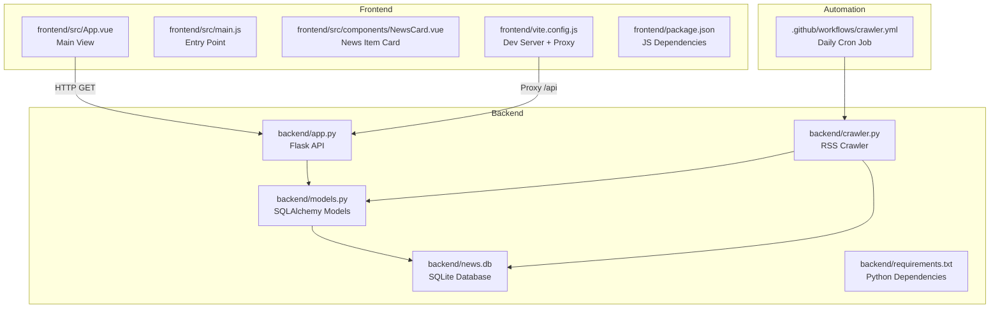
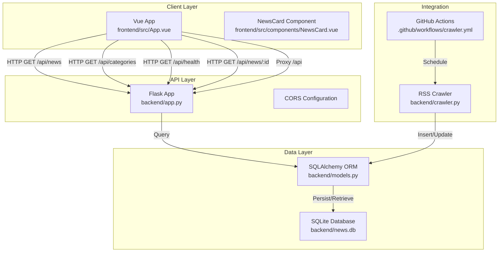
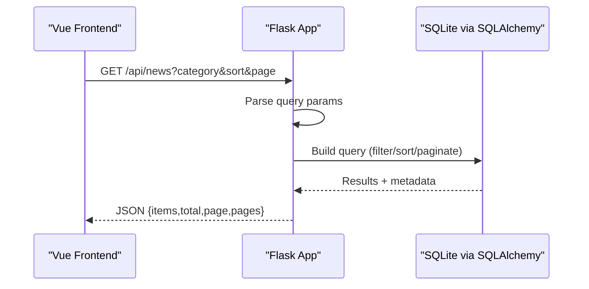
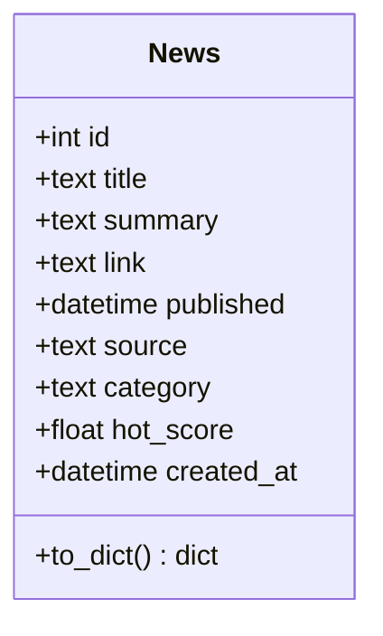
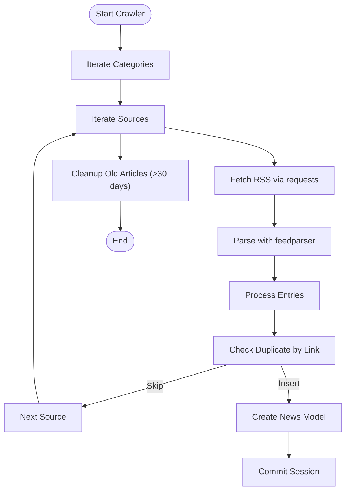
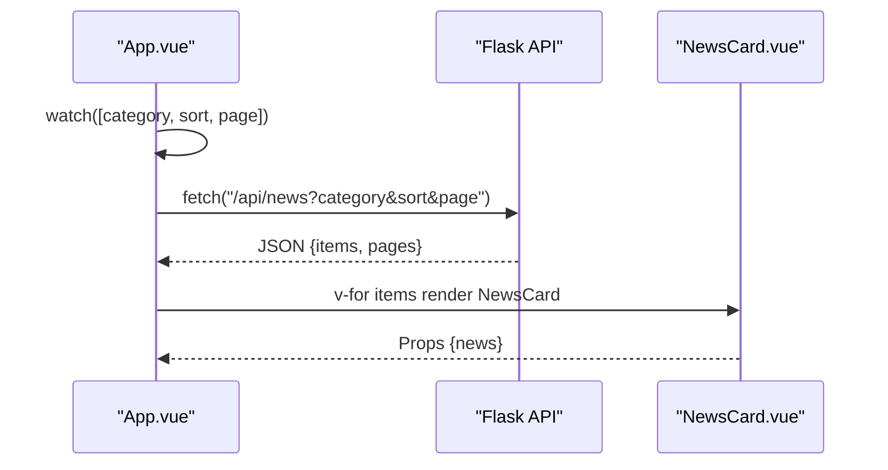
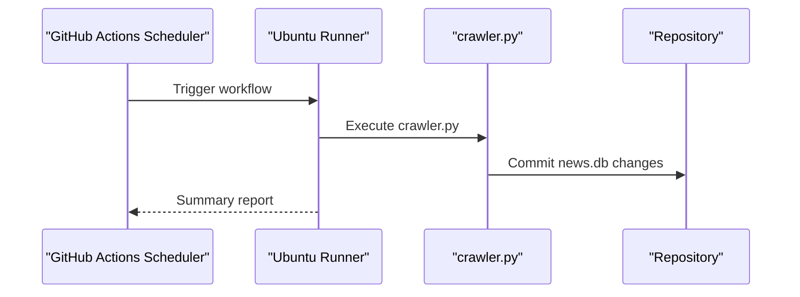
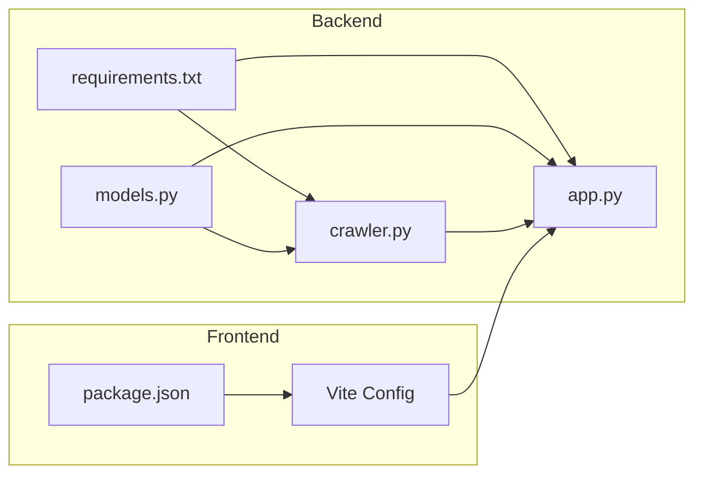

# Architecture Overview

<cite>
**Referenced Files in This Document**
- [README.md](file://README.md)
- [backend/app.py](file://backend/app.py)
- [backend/crawler.py](file://backend/crawler.py)
- [backend/models.py](file://backend/models.py)
- [backend/requirements.txt](file://backend/requirements.txt)
- [frontend/src/main.js](file://frontend/src/main.js)
- [frontend/src/App.vue](file://frontend/src/App.vue)
- [frontend/src/components/NewsCard.vue](file://frontend/src/components/NewsCard.vue)
- [frontend/vite.config.js](file://frontend/vite.config.js)
- [frontend/package.json](file://frontend/package.json)
- [.github/workflows/crawler.yml](file://.github/workflows/crawler.yml)
</cite>

## Table of Contents
1. [Introduction](#introduction)
2. [Project Structure](#project-structure)
3. [Core Components](#core-components)
4. [Architecture Overview](#architecture-overview)
5. [Detailed Component Analysis](#detailed-component-analysis)
6. [Dependency Analysis](#dependency-analysis)
7. [Performance Considerations](#performance-considerations)
8. [Troubleshooting Guide](#troubleshooting-guide)
9. [Conclusion](#conclusion)
10. [Appendices](#appendices)

## Introduction
This document presents the architectural overview of the News Aggregator system, a full-stack application that aggregates news from multiple RSS sources into a categorized, paginated, and sortable interface. The system consists of:
- A Vue 3 frontend that renders news cards and handles user interactions.
- A Flask API backend that serves paginated news, categories, and health checks.
- An automated RSS crawler that periodically fetches and persists news items.
- A SQLite database for persistent storage.

The architecture emphasizes clear separation of concerns, with the frontend consuming the backend API and the crawler independently updating the database.

## Project Structure
The repository is organized into two primary directories:
- backend: Flask application, database models, and crawler script.
- frontend: Vue 3 application with Vite development server and proxy configuration.

**Diagram sources**
- [backend/app.py:1-87](file://backend/app.py#L1-L87)
- [backend/models.py:1-39](file://backend/models.py#L1-L39)
- [backend/crawler.py:1-217](file://backend/crawler.py#L1-L217)
- [frontend/src/App.vue:1-421](file://frontend/src/App.vue#L1-L421)
- [frontend/src/main.js:1-5](file://frontend/src/main.js#L1-L5)
- [frontend/src/components/NewsCard.vue:1-197](file://frontend/src/components/NewsCard.vue#L1-L197)
- [frontend/vite.config.js:1-17](file://frontend/vite.config.js#L1-L17)
- [.github/workflows/crawler.yml:1-46](file://.github/workflows/crawler.yml#L1-L46)

**Section sources**
- [README.md:5-26](file://README.md#L5-L26)
- [backend/app.py:1-87](file://backend/app.py#L1-L87)
- [backend/models.py:1-39](file://backend/models.py#L1-L39)
- [backend/crawler.py:1-217](file://backend/crawler.py#L1-L217)
- [frontend/src/App.vue:1-421](file://frontend/src/App.vue#L1-L421)
- [frontend/src/main.js:1-5](file://frontend/src/main.js#L1-L5)
- [frontend/src/components/NewsCard.vue:1-197](file://frontend/src/components/NewsCard.vue#L1-L197)
- [frontend/vite.config.js:1-17](file://frontend/vite.config.js#L1-L17)
- [.github/workflows/crawler.yml:1-46](file://.github/workflows/crawler.yml#L1-L46)

## Core Components
- Flask API (backend/app.py)
  - Provides endpoints for news listing, single item retrieval, categories, and health checks.
  - Configures CORS and SQLite database connection.
  - Uses SQLAlchemy ORM for data access.
- Database Models (backend/models.py)
  - Defines the News entity with fields for title, summary, link, published date, source, category, and hot score.
  - Exposes a serialization method for JSON responses.
- RSS Crawler (backend/crawler.py)
  - Fetches RSS feeds from configured sources, parses entries, computes hot scores, truncates summaries, and persists to the database.
  - Skips duplicates and cleans up old entries.
- Vue Frontend (frontend/src/)
  - Main application component orchestrates categories, sorting, pagination, and loading/error states.
  - Consumes the backend API via fetch with URLSearchParams for query parameters.
  - Renders individual news items using a dedicated component.
- Automation (crawler.yml)
  - Schedules daily execution of the crawler using GitHub Actions cron.
  - Commits and pushes database updates back to the repository.

**Section sources**
- [backend/app.py:21-75](file://backend/app.py#L21-L75)
- [backend/models.py:10-39](file://backend/models.py#L10-L39)
- [backend/crawler.py:14-217](file://backend/crawler.py#L14-L217)
- [frontend/src/App.vue:103-188](file://frontend/src/App.vue#L103-L188)
- [frontend/src/components/NewsCard.vue:30-85](file://frontend/src/components/NewsCard.vue#L30-L85)
- [.github/workflows/crawler.yml:1-46](file://.github/workflows/crawler.yml#L1-L46)

## Architecture Overview
The system follows a client-server pattern:
- The Vue frontend communicates with the Flask API over HTTP.
- The Flask API interacts with the database through SQLAlchemy.
- The crawler operates independently to populate the database and can be triggered manually or via GitHub Actions.

**Diagram sources**
- [frontend/src/App.vue:120-146](file://frontend/src/App.vue#L120-L146)
- [backend/app.py:21-75](file://backend/app.py#L21-L75)
- [backend/models.py:10-39](file://backend/models.py#L10-L39)
- [backend/crawler.py:180-217](file://backend/crawler.py#L180-L217)
- [.github/workflows/crawler.yml:1-46](file://.github/workflows/crawler.yml#L1-L46)
- [frontend/vite.config.js:7-15](file://frontend/vite.config.js#L7-L15)

## Detailed Component Analysis

### Flask API (backend/app.py)
- Responsibilities
  - Expose REST endpoints for news listing, single item retrieval, categories, and health checks.
  - Configure CORS globally and SQLite database URI.
  - Initialize database tables on startup.
- Data Flow
  - Request enters via route decorators; query parameters are parsed and validated.
  - SQLAlchemy query builder constructs filters and sorts.
  - Pagination is applied and serialized to JSON.
- Cross-Cutting Concerns
  - CORS enabled for browser-side consumption.
  - SQLite path resolution relative to backend directory.

**Diagram sources**
- [backend/app.py:21-55](file://backend/app.py#L21-L55)
- [backend/models.py:10-39](file://backend/models.py#L10-L39)

**Section sources**
- [backend/app.py:9-18](file://backend/app.py#L9-L18)
- [backend/app.py:21-75](file://backend/app.py#L21-L75)
- [backend/app.py:77-87](file://backend/app.py#L77-L87)

### Database Models (backend/models.py)
- Entity: News
  - Fields: id, title, summary, link (unique), published, source, category, hot_score, created_at.
  - Serialization: to_dict() for JSON responses.
- Design Notes
  - Unique constraint on link prevents duplicate entries.
  - Float hot_score enables sorting by recency-adjusted popularity.

**Diagram sources**
- [backend/models.py:10-39](file://backend/models.py#L10-L39)

**Section sources**
- [backend/models.py:10-39](file://backend/models.py#L10-L39)

### RSS Crawler (backend/crawler.py)
- Responsibilities
  - Define RSS sources per category with weights.
  - Fetch and parse feeds using feedparser and requests.
  - Compute hot scores using time decay and source weights.
  - Persist articles to the database, skip duplicates, and clean up old entries.
- Data Flow
  - Iterate categories and sources, fetch RSS content, process entries, and batch insert.
  - Cleanup removes outdated articles older than a threshold.
- Automation
  - Can be run standalone or via GitHub Actions cron job.

**Diagram sources**
- [backend/crawler.py:180-217](file://backend/crawler.py#L180-L217)
- [backend/crawler.py:139-168](file://backend/crawler.py#L139-L168)
- [backend/crawler.py:170-178](file://backend/crawler.py#L170-L178)

**Section sources**
- [backend/crawler.py:14-37](file://backend/crawler.py#L14-L37)
- [backend/crawler.py:88-137](file://backend/crawler.py#L88-L137)
- [backend/crawler.py:139-168](file://backend/crawler.py#L139-L168)
- [backend/crawler.py:170-178](file://backend/crawler.py#L170-L178)
- [backend/crawler.py:180-217](file://backend/crawler.py#L180-L217)

### Vue Frontend (frontend/src/)
- Application Entry (frontend/src/main.js)
  - Initializes the Vue app and mounts it to the DOM.
- Main View (frontend/src/App.vue)
  - State management with reactive refs for categories, sort order, pagination, and loading/error states.
  - Watches for changes in category, sort, and page to trigger refetch.
  - Fetches data via fetch with URLSearchParams and updates UI accordingly.
  - Displays loading, error, empty, and pagination states.
- News Card Component (frontend/src/components/NewsCard.vue)
  - Receives a news item as prop and renders title, summary, category tag, source, published time, and hot score.
  - Implements time formatting and hot score formatting helpers.

**Diagram sources**
- [frontend/src/App.vue:120-146](file://frontend/src/App.vue#L120-L146)
- [frontend/src/App.vue:164-166](file://frontend/src/App.vue#L164-L166)
- [frontend/src/components/NewsCard.vue:30-85](file://frontend/src/components/NewsCard.vue#L30-L85)

**Section sources**
- [frontend/src/main.js:1-5](file://frontend/src/main.js#L1-L5)
- [frontend/src/App.vue:108-188](file://frontend/src/App.vue#L108-L188)
- [frontend/src/components/NewsCard.vue:30-85](file://frontend/src/components/NewsCard.vue#L30-L85)

### Automation Pipeline (crawler.yml)
- Scheduling
  - Daily cron at 00:00 UTC (8:00 AM Beijing Time).
  - Manual trigger support via workflow_dispatch.
- Steps
  - Checkout repository, setup Python, install dependencies, run crawler, commit and push database changes, and publish a summary.

**Diagram sources**
- [.github/workflows/crawler.yml:1-46](file://.github/workflows/crawler.yml#L1-L46)
- [backend/crawler.py:214-217](file://backend/crawler.py#L214-L217)

**Section sources**
- [.github/workflows/crawler.yml:1-46](file://.github/workflows/crawler.yml#L1-L46)

## Dependency Analysis
- Backend Dependencies (backend/requirements.txt)
  - Flask, Flask-SQLAlchemy, Flask-CORS, feedparser, requests, gunicorn, python-dateutil.
- Frontend Dependencies (frontend/package.json)
  - Vue 3 runtime, Vite, @vitejs/plugin-vue.
- Internal Coupling
  - crawler.py imports models and app to operate within Flask’s application context.
  - App initializes SQLAlchemy and exposes routes.
  - Frontend relies on environment-provided API base URL for production deployment.

**Diagram sources**
- [backend/requirements.txt:1-8](file://backend/requirements.txt#L1-L8)
- [backend/models.py:1-39](file://backend/models.py#L1-L39)
- [backend/app.py:1-18](file://backend/app.py#L1-L18)
- [backend/crawler.py:1-12](file://backend/crawler.py#L1-L12)
- [frontend/package.json:1-19](file://frontend/package.json#L1-L19)
- [frontend/vite.config.js:1-17](file://frontend/vite.config.js#L1-L17)

**Section sources**
- [backend/requirements.txt:1-8](file://backend/requirements.txt#L1-L8)
- [frontend/package.json:1-19](file://frontend/package.json#L1-L19)

## Performance Considerations
- Database
  - SQLite is suitable for small-scale deployments; consider migration to a managed database for higher concurrency.
  - Hot score computation is O(n) per batch; batching inserts reduces transaction overhead.
- API
  - Pagination limits items per page; tune per_page for optimal UX and network efficiency.
  - Sorting by hot_score requires indexing if performance becomes a concern.
- Frontend
  - Lazy rendering of news cards improves perceived performance.
  - Debounce or throttle watch-based refetches if needed.
- Crawler
  - Rate limiting via sleep between requests prevents server-side throttling.
  - Cleanup of old entries keeps the dataset manageable.

[No sources needed since this section provides general guidance]

## Troubleshooting Guide
- CORS Issues
  - Flask CORS is enabled globally; ensure frontend requests are made to the proxied backend endpoint during development.
- Database Initialization
  - The API initializes tables on startup; verify database path resolution and permissions.
- API Communication
  - Confirm API base URL is set in the frontend environment; the proxy forwards /api to the backend during development.
- Crawler Failures
  - Some RSS feeds may be malformed; the crawler logs warnings and continues processing.
  - Network timeouts or rate limits can cause partial failures; rerun the crawler or adjust delays.

**Section sources**
- [backend/app.py:9-18](file://backend/app.py#L9-L18)
- [backend/app.py:77-87](file://backend/app.py#L77-L87)
- [frontend/vite.config.js:7-15](file://frontend/vite.config.js#L7-L15)
- [backend/crawler.py:101-103](file://backend/crawler.py#L101-L103)
- [backend/crawler.py:131-135](file://backend/crawler.py#L131-L135)

## Conclusion
The News Aggregator employs a clean separation between the Vue frontend and Flask backend, with an independent crawler automating content ingestion. The architecture leverages SQLite for simplicity, CORS for cross-origin access, and GitHub Actions for scheduled updates. While the stack is straightforward and suitable for small-scale usage, future enhancements could include a managed database, caching layers, and improved error handling and monitoring.

[No sources needed since this section summarizes without analyzing specific files]

## Appendices

### API Endpoints
- GET /api/news
  - Query parameters: category, sort (newest|hottest), page
  - Response: items[], total, page, pages
- GET /api/news/:id
  - Response: single news item
- GET /api/categories
  - Response: list of categories
- GET /api/health
  - Response: health status

**Section sources**
- [backend/app.py:21-75](file://backend/app.py#L21-L75)
- [README.md:55-62](file://README.md#L55-L62)

### Technology Choices Rationale
- Vue 3 + Vite
  - Lightweight, fast, and developer-friendly for rapid iteration.
- Flask + SQLAlchemy
  - Minimal, flexible, and easy to deploy for small to medium workloads.
- SQLite
  - Zero-config embedded database suitable for this use case.
- GitHub Actions
  - Free tier automation for daily crawling with minimal maintenance.

**Section sources**
- [frontend/package.json:11-18](file://frontend/package.json#L11-L18)
- [backend/requirements.txt:1-8](file://backend/requirements.txt#L1-L8)
- [README.md:49-53](file://README.md#L49-L53)