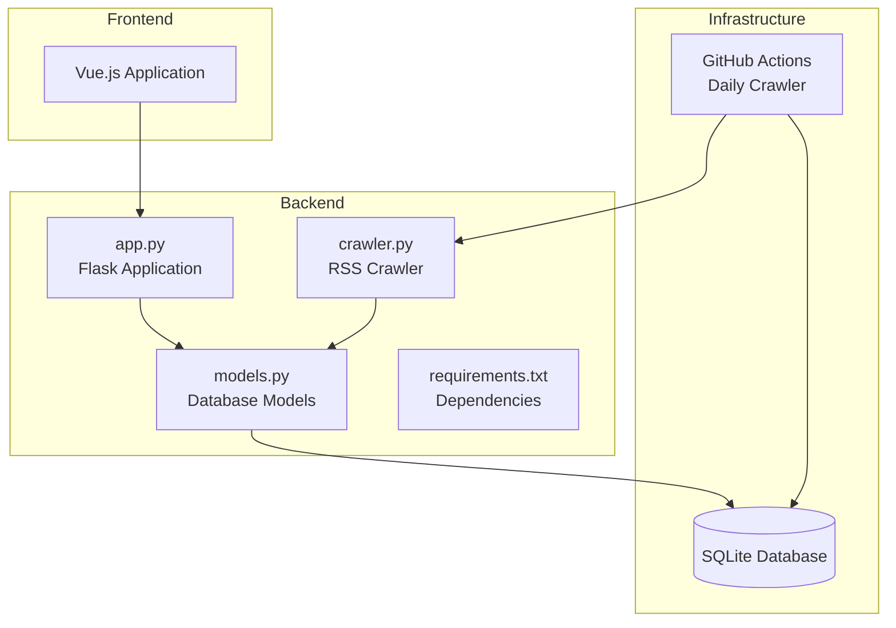
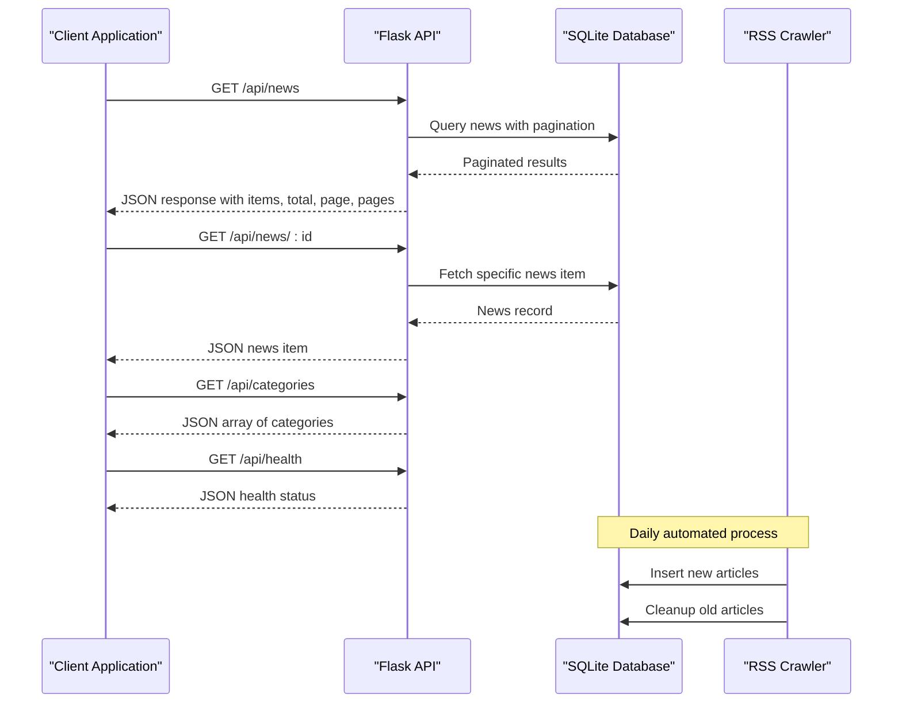
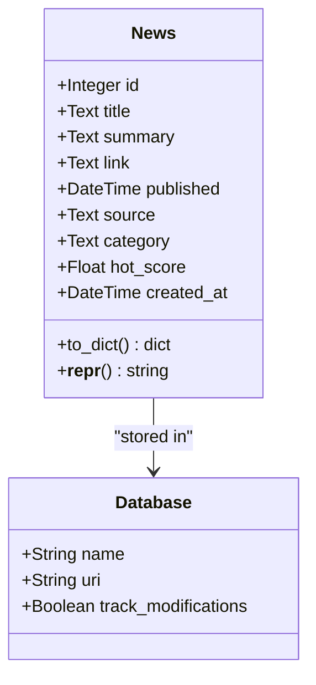
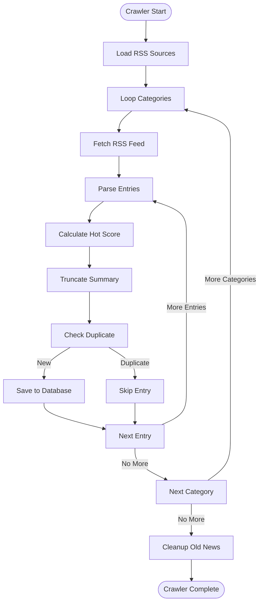
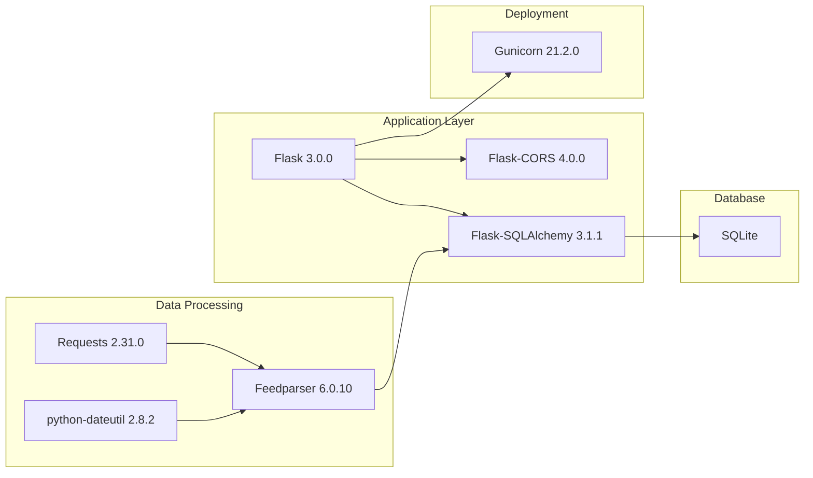
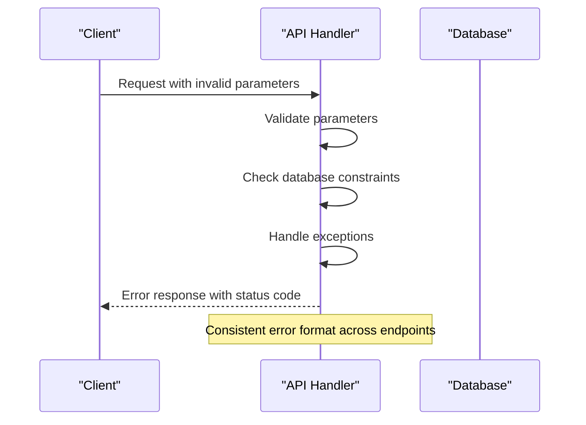

# Backend API Documentation

<cite>
**Referenced Files in This Document**
- [app.py](file://backend/app.py)
- [models.py](file://backend/models.py)
- [crawler.py](file://backend/crawler.py)
- [requirements.txt](file://backend/requirements.txt)
- [README.md](file://README.md)
- [App.vue](file://frontend/src/App.vue)
- [crawler.yml](file://.github/workflows/crawler.yml)
</cite>

## Table of Contents
1. [Introduction](#introduction)
2. [Project Structure](#project-structure)
3. [Core Components](#core-components)
4. [Architecture Overview](#architecture-overview)
5. [Detailed Component Analysis](#detailed-component-analysis)
6. [Dependency Analysis](#dependency-analysis)
7. [Performance Considerations](#performance-considerations)
8. [Troubleshooting Guide](#troubleshooting-guide)
9. [Conclusion](#conclusion)

## Introduction
This document provides comprehensive API documentation for the Flask backend REST API of the News Aggregator application. The API serves news articles aggregated from multiple RSS feeds, organized into two categories: "Programmer Circle" and "AI Circle". The backend is built with Flask, uses SQLite for persistence, and includes automated crawling functionality to keep content fresh.

Key features:
- Paginated news listing with filtering and sorting
- Single news item retrieval by ID
- Category enumeration
- System health check endpoint
- Automated daily crawling via GitHub Actions

## Project Structure
The backend follows a modular structure with clear separation of concerns:
- Application entry point and routing
- Database models and ORM configuration
- RSS crawling and data processing
- Dependencies and deployment configuration



**Diagram sources**
- [app.py:1-87](file://backend/app.py#L1-L87)
- [models.py:1-39](file://backend/models.py#L1-L39)
- [crawler.py:1-217](file://backend/crawler.py#L1-L217)
- [requirements.txt:1-8](file://backend/requirements.txt#L1-L8)

**Section sources**
- [README.md:5-26](file://README.md#L5-L26)
- [app.py:9-18](file://backend/app.py#L9-L18)

## Core Components
The backend consists of four primary API endpoints that form the core of the news aggregation service:

### Database Model
The News model defines the structure of stored news articles with comprehensive metadata including title, summary, link, publication date, source, category, and hot score for trending content.

**Section sources**
- [models.py:10-39](file://backend/models.py#L10-L39)

### Application Configuration
The Flask application is configured with CORS support for cross-origin requests, SQLite database connection, and production-ready server settings.

**Section sources**
- [app.py:9-18](file://backend/app.py#L9-L18)
- [app.py:84-87](file://backend/app.py#L84-L87)

## Architecture Overview
The system follows a client-server architecture with automated data ingestion:



**Diagram sources**
- [app.py:21-74](file://backend/app.py#L21-L74)
- [models.py:10-39](file://backend/models.py#L10-L39)
- [crawler.py:180-212](file://backend/crawler.py#L180-L212)

## Detailed Component Analysis

### API Endpoints

#### GET /api/news
**Purpose**: Retrieve paginated news listings with filtering and sorting capabilities.

**Request Parameters**:
- `category` (string, optional): Filter by category ("程序员圈" or "AI圈")
- `sort` (string, optional): Sorting order ("newest" or "hottest", default: "newest")
- `page` (integer, optional): Page number (default: 1)

**Response Schema**:
```json
{
  "items": [
    {
      "id": 1,
      "title": "string",
      "summary": "string",
      "link": "string",
      "source": "string",
      "published": "2023-01-01T00:00:00Z",
      "category": "string",
      "hot_score": 0.0
    }
  ],
  "total": 100,
  "page": 1,
  "pages": 5
}
```

**Response Codes**:
- 200: Successful retrieval
- 404: News item not found (when accessing individual news)

**Pagination Details**:
- Items per page: 20
- Zero-indexed pagination
- Graceful handling of invalid page numbers

**Sorting Behavior**:
- Newest: Sorts by published date descending
- Hottest: Sorts by calculated hot score descending

**Section sources**
- [app.py:21-55](file://backend/app.py#L21-L55)
- [models.py:24-35](file://backend/models.py#L24-L35)

#### GET /api/news/:id
**Purpose**: Retrieve a specific news article by its unique identifier.

**Path Parameters**:
- `news_id` (integer): Unique identifier of the news article

**Response Schema**:
```json
{
  "id": 1,
  "title": "string",
  "summary": "string",
  "link": "string",
  "source": "string",
  "published": "2023-01-01T00:00:00Z",
  "category": "string",
  "hot_score": 0.0
}
```

**Response Codes**:
- 200: Successful retrieval
- 404: News item not found

**Error Handling**:
- Automatic 404 response for non-existent IDs
- Graceful handling of invalid integer IDs

**Section sources**
- [app.py:58-62](file://backend/app.py#L58-L62)
- [models.py:24-35](file://backend/models.py#L24-L35)

#### GET /api/categories
**Purpose**: Retrieve all available news categories.

**Response Schema**:
```json
["程序员圈", "AI圈"]
```

**Response Codes**:
- 200: Successful retrieval

**Notes**:
- Static endpoint returning predefined categories
- No query parameters required

**Section sources**
- [app.py:65-68](file://backend/app.py#L65-L68)

#### GET /api/health
**Purpose**: System health check endpoint for monitoring and load balancer health probes.

**Response Schema**:
```json
{"status": "ok"}
```

**Response Codes**:
- 200: Service is healthy

**Usage**:
- Ideal for Kubernetes readiness/liveness probes
- Can be used by monitoring systems
- Lightweight operation with minimal resource usage

**Section sources**
- [app.py:71-74](file://backend/app.py#L71-L74)

### Data Models

#### News Model
The News model represents individual news articles with the following structure:



**Diagram sources**
- [models.py:10-39](file://backend/models.py#L10-L39)

**Model Fields**:
- `id`: Auto-incrementing primary key
- `title`: Article title (required)
- `summary`: Article summary/excerpt (nullable)
- `link`: Unique URL to original article (required)
- `published`: Publication timestamp (nullable)
- `source`: Source website name (nullable)
- `category`: News category ("程序员圈" or "AI圈")
- `hot_score`: Trending score for hottest sorting
- `created_at`: Record creation timestamp

**Serialization**:
- `to_dict()` method converts model instances to JSON-serializable dictionaries
- Date fields are serialized as ISO format strings
- Null values are preserved as null in JSON

**Section sources**
- [models.py:10-39](file://backend/models.py#L10-L39)

### RSS Crawler Integration
The crawler system automatically aggregates content from multiple RSS feeds:



**Diagram sources**
- [crawler.py:180-212](file://backend/crawler.py#L180-L212)
- [crawler.py:88-136](file://backend/crawler.py#L88-L136)

**Crawling Process**:
- Daily execution via GitHub Actions at 00:00 UTC
- Processes predefined RSS feeds for each category
- Calculates hot scores based on recency and source weights
- Prevents duplicate entries
- Cleans up articles older than 30 days

**Section sources**
- [crawler.py:14-37](file://backend/crawler.py#L14-L37)
- [crawler.py:62-74](file://backend/crawler.py#L62-L74)
- [crawler.yml:4-6](file://.github/workflows/crawler.yml#L4-L6)

## Dependency Analysis
The backend has minimal external dependencies optimized for simplicity and reliability:



**Diagram sources**
- [requirements.txt:1-8](file://backend/requirements.txt#L1-L8)

**Dependency Management**:
- Flask provides the web framework and routing
- SQLAlchemy handles database operations and ORM
- Feedparser processes RSS feed content
- Requests manages HTTP communication with RSS sources
- Gunicorn serves the application in production
- SQLite provides lightweight local storage

**Section sources**
- [requirements.txt:1-8](file://backend/requirements.txt#L1-L8)

## Performance Considerations
The API is designed for optimal performance and scalability:

### Database Optimization
- **Pagination**: Fixed page size of 20 items prevents memory issues
- **Indexing**: Primary key indexing on news table
- **Query Optimization**: Efficient filtering and ordering operations
- **Connection Pooling**: SQLAlchemy manages database connections

### Caching Strategy
- **Hot Score Calculation**: Real-time computation ensures freshness
- **Memory Efficiency**: Streaming RSS processing prevents memory spikes
- **Graceful Degradation**: Fallback mechanisms for failed RSS sources

### Scalability Factors
- **Horizontal Scaling**: Stateless API design allows multiple instances
- **Database Constraints**: Unique link constraint prevents duplicates
- **Resource Limits**: Configurable timeouts and retry logic

## Troubleshooting Guide

### Common Issues and Solutions

**Database Connection Problems**
- Verify SQLite file permissions
- Check database path configuration
- Ensure database initialization completes successfully

**RSS Crawler Failures**
- Network connectivity issues with RSS sources
- Rate limiting from external RSS providers
- Parsing errors in malformed RSS feeds

**API Response Issues**
- Pagination parameter validation
- Category filtering edge cases
- JSON serialization problems

### Error Response Patterns
The API follows consistent error handling patterns:



**Section sources**
- [app.py:58-62](file://backend/app.py#L58-L62)
- [crawler.py:131-135](file://backend/crawler.py#L131-L135)

### Monitoring and Health Checks
- Use `/api/health` endpoint for system monitoring
- Monitor database file size growth
- Track crawler execution logs
- Monitor API response times

**Section sources**
- [app.py:71-74](file://backend/app.py#L71-L74)
- [crawler.yml:41-46](file://.github/workflows/crawler.yml#L41-L46)

## Conclusion
The Flask backend provides a robust, efficient, and maintainable REST API for the news aggregation service. Its design emphasizes simplicity, performance, and reliability while maintaining flexibility for future enhancements. The combination of automated RSS crawling, structured API endpoints, and minimal dependencies creates a solid foundation for both development and production deployment.

Key strengths include:
- Clean API design with comprehensive documentation
- Automated content refresh system
- Efficient database operations with proper indexing
- Production-ready deployment configuration
- Comprehensive error handling and monitoring support

The API is well-suited for integration with modern web applications and can serve as a foundation for scaling the news aggregation service to meet growing demands.