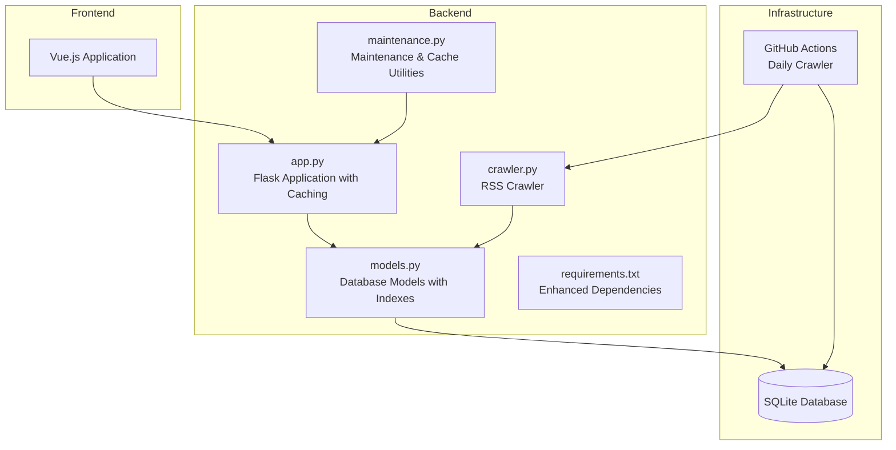
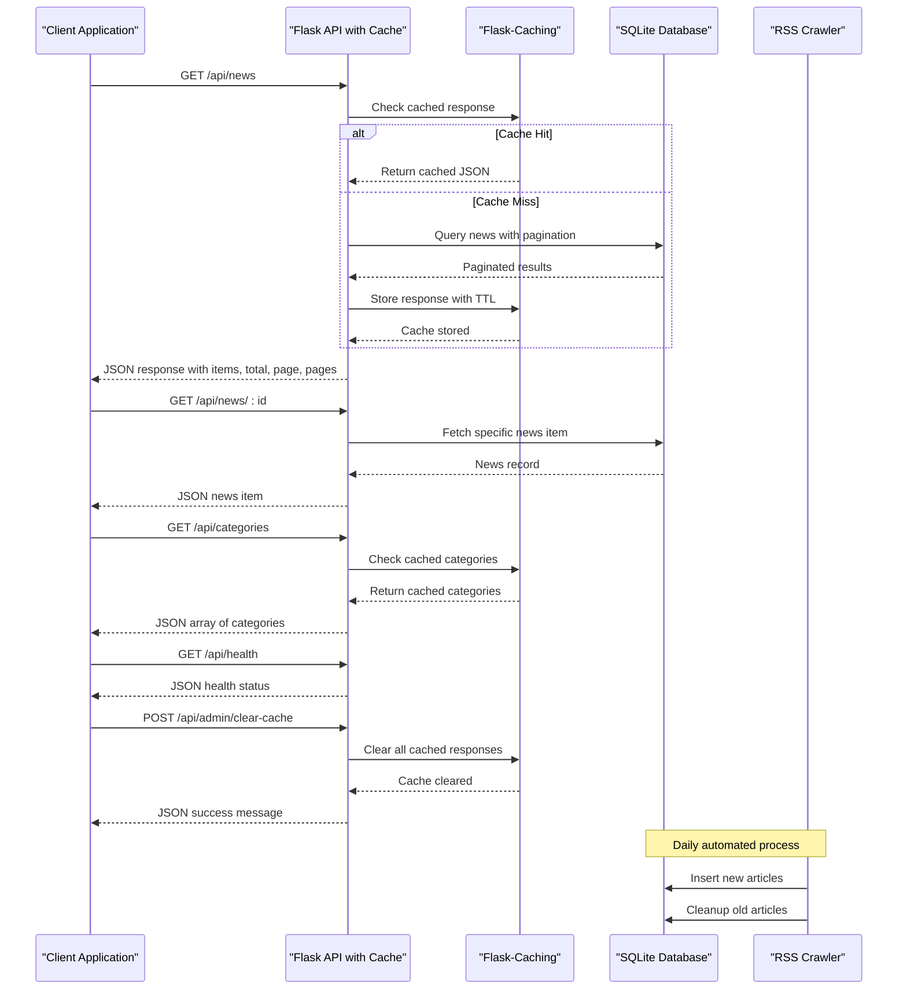
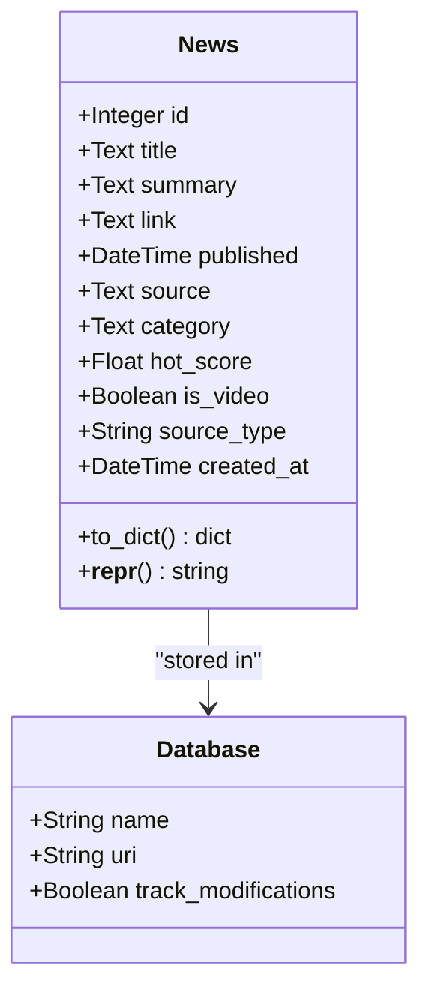
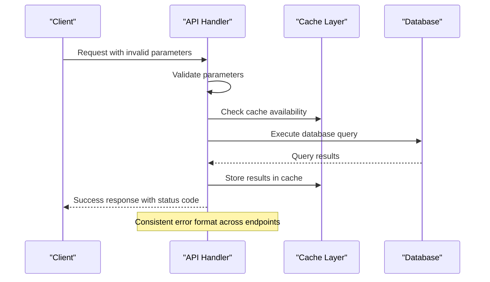

# Backend API Documentation

<cite>
**Referenced Files in This Document**
- [app.py](file://backend/app.py)
- [models.py](file://backend/models.py)
- [requirements.txt](file://backend/requirements.txt)
- [maintenance.py](file://backend/maintenance.py)
- [README.md](file://README.md)
</cite>

## Update Summary
**Changes Made**
- Added Flask-Caching integration with cache decorators on key endpoints
- Implemented request timing and logging capabilities with before/after request hooks
- Enhanced category ordering with predefined category order system
- Added administrative cache clearing endpoint for cache management
- Updated performance considerations to include caching strategy
- Enhanced troubleshooting guide with caching-related diagnostics

## Table of Contents
1. [Introduction](#introduction)
2. [Project Structure](#project-structure)
3. [Core Components](#core-components)
4. [Architecture Overview](#architecture-overview)
5. [Detailed Component Analysis](#detailed-component-analysis)
6. [Performance Considerations](#performance-considerations)
7. [Troubleshooting Guide](#troubleshooting-guide)
8. [Conclusion](#conclusion)

## Introduction
This document provides comprehensive API documentation for the Flask backend REST API of the News Aggregator application. The API serves news articles aggregated from multiple RSS feeds, organized into multiple categories including "AI", "前端", "后端", "云原生", "区块链", and "其他". The backend is built with Flask, uses SQLite for persistence, includes Flask-Caching for performance optimization, and features automated crawling functionality to keep content fresh.

Key features:
- Paginated news listing with filtering and sorting
- Single news item retrieval by ID
- Category enumeration with predefined ordering
- System health check endpoint
- Administrative cache clearing endpoint
- Request timing and logging capabilities
- Automated daily crawling via GitHub Actions

## Project Structure
The backend follows a modular structure with clear separation of concerns and enhanced caching infrastructure:
- Application entry point and routing with caching decorators
- Database models and ORM configuration with composite indexes
- RSS crawling and data processing
- Maintenance utilities for cache warming and database cleanup
- Dependencies and deployment configuration with Flask-Caching



**Diagram sources**
- [app.py:1-182](file://backend/app.py#L1-L182)
- [models.py:1-49](file://backend/models.py#L1-L49)
- [maintenance.py:1-183](file://backend/maintenance.py#L1-L183)
- [requirements.txt:1-9](file://backend/requirements.txt#L1-L9)

**Section sources**
- [README.md:5-26](file://README.md#L5-L26)
- [app.py:16-31](file://backend/app.py#L16-L31)

## Core Components
The backend consists of five primary API endpoints that form the core of the news aggregation service, now enhanced with caching and monitoring capabilities:

### Database Model
The News model defines the structure of stored news articles with comprehensive metadata including title, summary, link, publication date, source, category, hot score, and video indicators for multimedia content.

**Section sources**
- [models.py:10-49](file://backend/models.py#L10-L49)

### Application Configuration
The Flask application is configured with CORS support, Flask-Caching integration, SQLite database connection, and production-ready server settings with request timing and logging capabilities.

**Section sources**
- [app.py:16-31](file://backend/app.py#L16-L31)
- [app.py:52-64](file://backend/app.py#L52-L64)
- [app.py:19-23](file://backend/app.py#L19-L23)

## Architecture Overview
The system follows a client-server architecture with automated data ingestion and intelligent caching:



**Diagram sources**
- [app.py:67-153](file://backend/app.py#L67-L153)
- [models.py:10-49](file://backend/models.py#L10-L49)
- [maintenance.py:20-28](file://backend/maintenance.py#L20-L28)

## Detailed Component Analysis

### API Endpoints

#### GET /api/news
**Purpose**: Retrieve paginated news listings with filtering and sorting capabilities, now cached for improved performance.

**Request Parameters**:
- `category` (string, optional): Filter by category from /api/categories
- `sort` (string, optional): Sorting order ("newest" or "hottest", default: "newest")
- `page` (integer, optional): Page number (default: 1)
- `per_page` (integer, optional): Items per page (default: 20, max: 100)

**Response Schema**:
```json
{
  "items": [
    {
      "id": 1,
      "title": "string",
      "summary": "string",
      "link": "string",
      "source": "string",
      "published": "2023-01-01T00:00:00Z",
      "category": "string",
      "hot_score": 0.0,
      "is_video": false,
      "source_type": "rss"
    }
  ],
  "total": 100,
  "page": 1,
  "pages": 5
}
```

**Response Codes**:
- 200: Successful retrieval
- 404: News item not found (when accessing individual news)

**Caching Behavior**:
- Cached with 300-second (5-minute) timeout
- Cache key includes query string parameters
- Automatic cache invalidation when cache is cleared

**Pagination Details**:
- Items per page: 20 (with max 100)
- Zero-indexed pagination
- Graceful handling of invalid page numbers

**Sorting Behavior**:
- Newest: Sorts by published date descending
- Hottest: Sorts by calculated hot score descending

**Section sources**
- [app.py:67-106](file://backend/app.py#L67-L106)
- [models.py:32-45](file://backend/models.py#L32-L45)

#### GET /api/news/:id
**Purpose**: Retrieve a specific news article by its unique identifier.

**Path Parameters**:
- `news_id` (integer): Unique identifier of the news article

**Response Schema**:
```json
{
  "id": 1,
  "title": "string",
  "summary": "string",
  "link": "string",
  "source": "string",
  "published": "2023-01-01T00:00:00Z",
  "category": "string",
  "hot_score": 0.0,
  "is_video": false,
  "source_type": "rss"
}
```

**Response Codes**:
- 200: Successful retrieval
- 404: News item not found

**Error Handling**:
- Automatic 404 response for non-existent IDs
- Graceful handling of invalid integer IDs

**Section sources**
- [app.py:109-113](file://backend/app.py#L109-L113)
- [models.py:32-45](file://backend/models.py#L32-L45)

#### GET /api/categories
**Purpose**: Retrieve all available news categories in predefined order.

**Response Schema**:
```json
["AI", "前端", "后端", "云原生", "区块链", "其他"]
```

**Response Codes**:
- 200: Successful retrieval

**Caching Behavior**:
- Cached with 600-second (10-minute) timeout
- Categories are cached separately from news listings

**Category Ordering**:
- Predefined order: AI, 前端, 后端, 云原生, 区块链, 其他
- Unknown categories are placed at the end
- Handles empty/null categories gracefully

**Section sources**
- [app.py:121-139](file://backend/app.py#L121-L139)

#### GET /api/health
**Purpose**: System health check endpoint for monitoring and load balancer health probes.

**Response Schema**:
```json
{"status": "ok"}
```

**Response Codes**:
- 200: Service is healthy

**Usage**:
- Ideal for Kubernetes readiness/liveness probes
- Can be used by monitoring systems
- Lightweight operation with minimal resource usage

**Section sources**
- [app.py:142-145](file://backend/app.py#L142-L145)

#### POST /api/admin/clear-cache
**Purpose**: Administrative endpoint to clear all cached responses for cache management during deployments or maintenance.

**Authentication Requirements**:
- Requires administrative access (no built-in authentication)
- Use behind reverse proxy with authentication

**Response Schema**:
```json
{
  "status": "ok",
  "message": "Cache cleared successfully"
}
```

**Response Codes**:
- 200: Cache cleared successfully
- 500: Internal server error (if cache clearing fails)

**Usage**:
- Call after deploying new versions
- Use during maintenance windows
- Monitor cache clearing events in logs

**Section sources**
- [app.py:148-153](file://backend/app.py#L148-L153)

### Data Models

#### News Model
The News model represents individual news articles with the following structure:



**Diagram sources**
- [models.py:10-49](file://backend/models.py#L10-L49)

**Model Fields**:
- `id`: Auto-incrementing primary key
- `title`: Article title (required)
- `summary`: Article summary/excerpt (nullable)
- `link`: Unique URL to original article (required)
- `published`: Publication timestamp (nullable)
- `source`: Source website name (nullable)
- `category`: News category with predefined ordering
- `hot_score`: Trending score for hottest sorting
- `is_video`: Video content indicator
- `source_type`: Source type ('rss', 'youtube', 'arxiv')
- `created_at`: Record creation timestamp

**Serialization**:
- `to_dict()` method converts model instances to JSON-serializable dictionaries
- Date fields are serialized as ISO format strings
- Null values are preserved as null in JSON

**Section sources**
- [models.py:10-49](file://backend/models.py#L10-L49)

### Request Timing and Logging
The application includes comprehensive request timing and logging capabilities:

**Logging Features**:
- Request method, path, status code, and duration logged
- Timeouts measured in seconds with 3 decimal precision
- INFO level logging for all requests
- Automatic timing via before/after request hooks

**Timing Implementation**:
- `start_timer()` hook records request start time
- `log_request()` hook calculates and logs request duration
- Graceful handling of missing timing data

**Section sources**
- [app.py:52-64](file://backend/app.py#L52-L64)

## Performance Considerations
The API is designed for optimal performance and scalability with enhanced caching and monitoring:

### Database Optimization
- **Pagination**: Fixed page size of 20 items prevents memory issues
- **Indexing**: Comprehensive indexing strategy including composite indexes
- **Query Optimization**: Efficient filtering and ordering operations
- **Connection Pooling**: SQLAlchemy manages database connections

### Caching Strategy
- **News Endpoint**: 300-second (5-minute) cache with query string parameter support
- **Categories Endpoint**: 600-second (10-minute) cache for static category data
- **Cache Invalidation**: Administrative endpoint for cache clearing
- **Cache Warmup**: Categories endpoint warms cache with predefined ordering
- **Memory Efficiency**: Simple cache backend suitable for small-scale deployment

### Request Monitoring
- **Performance Tracking**: Automatic request duration logging
- **Error Detection**: Request timing helps identify slow endpoints
- **Resource Usage**: Logging aids in capacity planning

### Scalability Factors
- **Horizontal Scaling**: Stateless API design allows multiple instances
- **Database Constraints**: Unique link constraint prevents duplicates
- **Resource Limits**: Configurable timeouts and retry logic
- **Cache Efficiency**: Reduces database load for frequently accessed endpoints

**Section sources**
- [app.py:19-23](file://backend/app.py#L19-L23)
- [app.py:68](file://backend/app.py#L68)
- [app.py:122](file://backend/app.py#L122)
- [app.py:148-153](file://backend/app.py#L148-L153)

## Troubleshooting Guide

### Common Issues and Solutions

**Database Connection Problems**
- Verify SQLite file permissions
- Check database path configuration
- Ensure database initialization completes successfully

**RSS Crawler Failures**
- Network connectivity issues with RSS sources
- Rate limiting from external RSS providers
- Parsing errors in malformed RSS feeds

**API Response Issues**
- Pagination parameter validation
- Category filtering edge cases
- JSON serialization problems

**Caching Issues**
- Cache not warming properly
- Stale data in cache
- Cache clearing failures
- Cache timeout configuration

**Performance Issues**
- Slow request times
- High database query times
- Cache miss rates
- Memory usage concerns

### Error Response Patterns
The API follows consistent error handling patterns:



**Section sources**
- [app.py:109-113](file://backend/app.py#L109-L113)
- [app.py:148-153](file://backend/app.py#L148-L153)

### Monitoring and Health Checks
- Use `/api/health` endpoint for system monitoring
- Monitor cache hit rates and performance metrics
- Track request timing and duration patterns
- Monitor database file size growth
- Track crawler execution logs
- Monitor API response times and error rates

**Section sources**
- [app.py:142-145](file://backend/app.py#L142-L145)
- [app.py:58-64](file://backend/app.py#L58-L64)

### Cache Management
**Cache Warmup Strategy**:
- Categories endpoint automatically warms cache with predefined ordering
- News endpoint caches paginated results with query string parameters
- Cache warming occurs on first request after cache clear

**Cache Clearing Procedures**:
- Use `/api/admin/clear-cache` for cache management
- Clear cache during deployments or maintenance
- Monitor cache clearing events in logs

**Cache Configuration**:
- Simple cache backend for development
- 300-second timeout for news endpoint
- 600-second timeout for categories endpoint
- Query string parameter support for cache keys

**Section sources**
- [app.py:121-139](file://backend/app.py#L121-L139)
- [app.py:67-106](file://backend/app.py#L67-L106)
- [app.py:148-153](file://backend/app.py#L148-L153)

## Conclusion
The Flask backend provides a robust, efficient, and maintainable REST API for the news aggregation service with enhanced performance through Flask-Caching integration. Its design emphasizes simplicity, performance, reliability, and operational visibility while maintaining flexibility for future enhancements. The combination of automated RSS crawling, structured API endpoints, intelligent caching, comprehensive logging, and administrative cache management creates a solid foundation for both development and production deployment.

Key strengths include:
- Clean API design with comprehensive documentation
- Intelligent caching strategy with configurable timeouts
- Request timing and logging for performance monitoring
- Administrative cache management capabilities
- Automated content refresh system
- Efficient database operations with proper indexing
- Production-ready deployment configuration
- Comprehensive error handling and monitoring support

The API is well-suited for integration with modern web applications and can serve as a foundation for scaling the news aggregation service to meet growing demands while maintaining excellent performance characteristics.