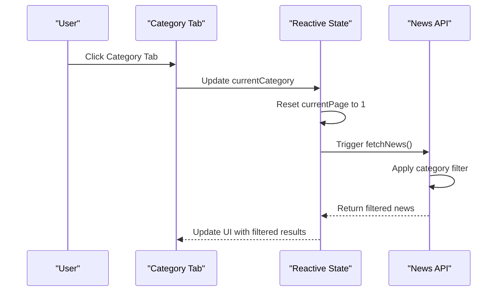

# Categories Endpoint

<cite>
**Referenced Files in This Document**
- [app.py](file://backend/app.py)
- [models.py](file://backend/models.py)
- [App.vue](file://frontend/src/App.vue)
- [NewsCard.vue](file://frontend/src/components/NewsCard.vue)
- [main.js](file://frontend/src/main.js)
- [package.json](file://frontend/package.json)
- [requirements.txt](file://backend/requirements.txt)
- [README.md](file://README.md)
</cite>

## Table of Contents
1. [Introduction](#introduction)
2. [Endpoint Specification](#endpoint-specification)
3. [Response Format](#response-format)
4. [Implementation Details](#implementation-details)
5. [Frontend Integration Patterns](#frontend-integration-patterns)
6. [Caching Considerations](#caching-considerations)
7. [Category-Based Filtering](#category-based-filtering)
8. [Best Practices](#best-practices)
9. [Troubleshooting](#troubleshooting)

## Introduction

The `/api/categories` endpoint provides access to the available news categories in the news aggregator system. This endpoint serves as a foundational component for dynamic category selection and filtering functionality across the application.

The endpoint is part of a comprehensive news aggregation platform focused on two primary categories: "Programmer Circle" and "AI Circle". These categories represent the core content domains that users can filter news by.

## Endpoint Specification

### Base URL
```
GET /api/categories
```

### Response Format
The endpoint returns a JSON array containing the available categories as strings.

**Response Type:** `Array<String>`

**Response Status Codes:**
- `200 OK` - Successful response with category data
- `500 Internal Server Error` - Server-side error

### Request Parameters
This endpoint does not accept any query parameters.

### Example Requests
```bash
# Basic request
curl https://your-domain.com/api/categories

# With curl and verbose output
curl -v https://your-domain.com/api/categories
```

## Response Format

The `/api/categories` endpoint returns a JSON array with a fixed structure containing exactly two category strings:

```json
[
  "程序员圈",
  "AI圈"
]
```

### Response Structure Analysis

| Property | Type | Description |
|----------|------|-------------|
| Array Index 0 | String | First category: "程序员圈" (Programmer Circle) |
| Array Index 1 | String | Second category: "AI圈" (AI Circle) |

### Response Validation
- **Fixed Length:** Always returns exactly 2 items
- **Fixed Values:** Contains only the predefined category strings
- **Data Types:** All items are strings
- **Order:** Guaranteed order: Programmer Circle first, then AI Circle

**Section sources**
- [app.py:65-68](file://backend/app.py#L65-L68)

## Implementation Details

### Backend Implementation

The backend implementation is straightforward and efficient, designed for minimal overhead:

```python
@app.route('/api/categories', methods=['GET'])
def get_categories():
    """Get all available categories."""
    return jsonify(['程序员圈', 'AI圈'])
```

**Implementation Characteristics:**
- **Zero Database Query:** Directly returns hardcoded values
- **Minimal Processing:** Single return statement
- **Fast Response Time:** No external dependencies or computations
- **Consistent Output:** Always returns the same two categories

### Database Model Context

While the categories endpoint doesn't query the database, the underlying data model supports category filtering:

```python
class News(db.Model):
    # ... other fields ...
    category = db.Column(db.Text)
    # ... other fields ...
```

**Section sources**
- [app.py:65-68](file://backend/app.py#L65-L68)
- [models.py:10-39](file://backend/models.py#L10-L39)

## Frontend Integration Patterns

### Static Category Definition Pattern

The frontend maintains a static list of categories for immediate use:

```javascript
const categories = ['程序员圈', 'AI圈']
const currentCategory = ref('程序员圈')
```

**Integration Benefits:**
- **Immediate Availability:** Categories available without API round-trip
- **Consistent UX:** Same categories displayed across all components
- **Reduced Latency:** No network requests for category data
- **Fallback Safety:** Works even if API is temporarily unavailable

### Dynamic Category Loading Pattern

For scenarios requiring real-time category updates:

```javascript
// Fetch categories dynamically
const fetchCategories = async () => {
  try {
    const response = await fetch('/api/categories')
    const categories = await response.json()
    // Update reactive state
    categories.value = categories
  } catch (error) {
    console.error('Failed to load categories:', error)
    // Fallback to static categories
    categories.value = ['程序员圈', 'AI圈']
  }
}
```

### Category Selection Component

The main application demonstrates category selection through tab interface:

```vue
<div class="tabs">
  <button
    v-for="cat in categories"
    :key="cat"
    :class="['tab', { active: currentCategory === cat }]"
    @click="switchCategory(cat)"
  >
    {{ cat }}
  </button>
</div>
```

**Section sources**
- [App.vue:108-188](file://frontend/src/App.vue#L108-L188)

## Caching Considerations

### Built-in Caching Strategy

Given the endpoint's simplicity and fixed nature, several caching approaches are recommended:

#### Browser Cache Headers
```javascript
// Add cache-control headers in production
res.set({
  'Cache-Control': 'public, max-age=3600', // Cache for 1 hour
  'ETag': generateETag(['程序员圈', 'AI圈'])
})
```

#### Frontend Cache Implementation
```javascript
// Local storage caching
const getCachedCategories = () => {
  const cached = localStorage.getItem('categories')
  const timestamp = localStorage.getItem('categories_timestamp')
  
  if (cached && timestamp && (Date.now() - timestamp) < 3600000) {
    return JSON.parse(cached)
  }
  
  return null
}

const saveCategoriesToCache = (categories) => {
  localStorage.setItem('categories', JSON.stringify(categories))
  localStorage.setItem('categories_timestamp', Date.now().toString())
}
```

#### Service Worker Caching
```javascript
// Register service worker for offline support
if ('serviceWorker' in navigator) {
  navigator.serviceWorker.register('/sw.js').then(registration => {
    registration.addEventListener('message', event => {
      if (event.data && event.data.type === 'FETCH') {
        // Serve categories from cache
      }
    })
  })
}
```

### Cache Invalidation Strategy

Since categories are static, cache invalidation is rarely needed. However, implement a refresh mechanism:

```javascript
// Periodic cache refresh
setInterval(async () => {
  try {
    const response = await fetch('/api/categories', {
      cache: 'reload'
    })
    const categories = await response.json()
    updateCategoriesState(categories)
  } catch (error) {
    console.warn('Failed to refresh categories cache')
  }
}, 3600000) // Every hour
```

## Category-Based Filtering

### Backend Filtering Implementation

The news endpoint integrates with categories for filtering:

```python
@app.route('/api/news', methods=['GET'])
def get_news():
    category = request.args.get('category')
    
    if category:
        query = query.filter(News.category == category)
```

### Frontend Filtering Integration

The main application demonstrates category-based filtering:

```javascript
const switchCategory = (cat) => {
  currentCategory.value = cat
  currentPage.value = 1 // Reset to first page
}

// Automatic re-fetch when category changes
watch([currentCategory, currentSort, currentPage], () => {
  fetchNews()
})
```

### Filtering Workflow



**Diagram sources**
- [App.vue:148-166](file://frontend/src/App.vue#L148-L166)

### Category-Based Sorting

The filtering system works seamlessly with sorting options:

```javascript
const currentSort = ref('newest')
const switchSort = (sort) => {
  currentSort.value = sort
  currentPage.value = 1
}
```

**Section sources**
- [App.vue:148-166](file://frontend/src/App.vue#L148-L166)
- [app.py:21-55](file://backend/app.py#L21-L55)

## Best Practices

### API Consumption Guidelines

#### Error Handling
```javascript
const fetchCategories = async () => {
  try {
    const response = await fetch('/api/categories')
    if (!response.ok) {
      throw new Error(`HTTP error! status: ${response.status}`)
    }
    return await response.json()
  } catch (error) {
    console.error('Category fetch failed:', error)
    // Fallback to static categories
    return ['程序员圈', 'AI圈']
  }
}
```

#### Loading States
```javascript
const loading = ref(false)
const categories = ref([])

const loadCategories = async () => {
  loading.value = true
  try {
    const cats = await fetchCategories()
    categories.value = cats
  } finally {
    loading.value = false
  }
}
```

### Performance Optimization

#### Preloading Categories
```javascript
// Load categories on app initialization
onMounted(async () => {
  const cats = await fetchCategories()
  categories.value = cats
})
```

#### Debounced Updates
```javascript
// Debounce category switching to prevent rapid API calls
const debouncedSwitchCategory = debounce((cat) => {
  currentCategory.value = cat
  currentPage.value = 1
}, 300)
```

## Troubleshooting

### Common Issues and Solutions

#### Network Connectivity Problems
**Symptom:** Categories fail to load
**Solution:** Implement fallback to static categories
```javascript
const categories = ref(['程序员圈', 'AI圈'])

// In error handler
error.value = '无法获取分类信息，使用默认分类'
```

#### CORS Issues
**Symptom:** Cross-origin request failures
**Solution:** Verify CORS configuration in backend
```python
# Ensure CORS is enabled for categories endpoint
CORS(app)
```

#### Cache Invalidation
**Symptom:** Outdated categories displayed
**Solution:** Implement cache refresh mechanism
```javascript
// Add cache refresh button
const refreshCategories = () => {
  localStorage.removeItem('categories')
  localStorage.removeItem('categories_timestamp')
  loadCategories()
}
```

### Debugging Steps

1. **Verify Endpoint Accessibility**
   ```bash
   curl -I https://your-domain.com/api/categories
   ```

2. **Check Response Format**
   ```bash
   curl https://your-domain.com/api/categories
   # Should return: ["程序员圈","AI圈"]
   ```

3. **Monitor Network Requests**
   - Open browser DevTools
   - Check Network tab for `/api/categories`
   - Verify response status and timing

4. **Validate Frontend Integration**
   ```javascript
   // Add logging
   console.log('Categories loaded:', categories.value)
   ```

**Section sources**
- [app.py:65-68](file://backend/app.py#L65-L68)
- [App.vue:148-166](file://frontend/src/App.vue#L148-L166)

## Conclusion

The `/api/categories` endpoint provides a simple yet crucial foundation for the news aggregation platform's filtering capabilities. Its design prioritizes performance and reliability while maintaining flexibility for future expansion.

Key benefits include:
- **Zero-latency response** due to static nature
- **Guaranteed availability** with fallback mechanisms
- **Seamless integration** with existing filtering systems
- **Scalable architecture** supporting additional categories

The endpoint exemplifies good API design principles: predictable responses, minimal complexity, and robust error handling. As the platform evolves, this foundation will support advanced features like dynamic category discovery, user-defined categories, and intelligent category suggestions.