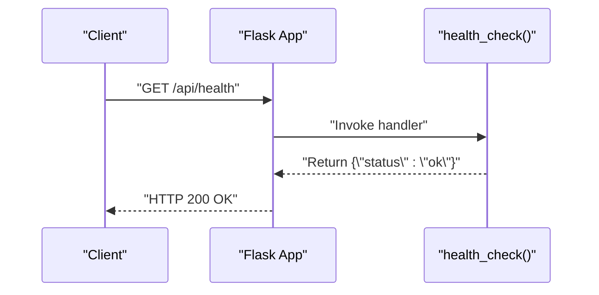
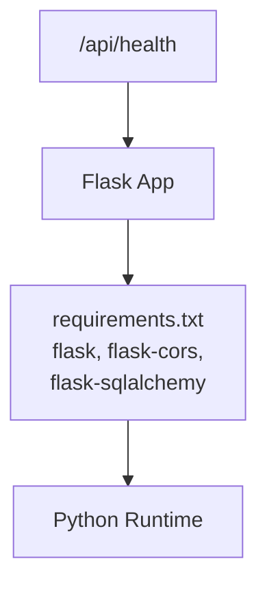

# Health Check Endpoint

<cite>
**Referenced Files in This Document**
- [app.py](file://backend/app.py)
- [models.py](file://backend/models.py)
- [requirements.txt](file://backend/requirements.txt)
- [README.md](file://README.md)
- [crawler.yml](file://.github/workflows/crawler.yml)
</cite>

## Table of Contents
1. [Introduction](#introduction)
2. [Project Structure](#project-structure)
3. [Core Components](#core-components)
4. [Architecture Overview](#architecture-overview)
5. [Detailed Component Analysis](#detailed-component-analysis)
6. [Dependency Analysis](#dependency-analysis)
7. [Performance Considerations](#performance-considerations)
8. [Troubleshooting Guide](#troubleshooting-guide)
9. [Conclusion](#conclusion)

## Introduction
This document provides API documentation for the `/api/health` endpoint, which exposes a system health monitoring interface. It covers the GET method, standardized response format, expected HTTP status codes, and integration patterns for load balancers, monitoring systems, and deployment health checks. It also includes examples of health check implementations across environments and troubleshooting guidance for common failures.

## Project Structure
The health endpoint is implemented in the Flask backend application. The endpoint is defined alongside other API routes and uses a lightweight response format suitable for automated health monitoring.

```mermaid
graph TB
A["Flask App<br/>backend/app.py"] --> B["Route '/api/health'<br/>GET"]
B --> C["Response: {\"status\":\"ok\"}<br/>HTTP 200 OK"]
```

**Diagram sources**
- [app.py:71-74](file://backend/app.py#L71-L74)

**Section sources**
- [app.py:71-74](file://backend/app.py#L71-L74)
- [README.md:55-62](file://README.md#L55-L62)

## Core Components
- Health endpoint route: GET /api/health
- Response body: JSON object containing a single field with a fixed value indicating system readiness
- HTTP status code: 200 OK when the service is healthy

Key characteristics:
- Minimal overhead: No database queries or external service calls
- Predictable response shape: Enables easy parsing and automation
- Consistent status code: Indicates successful readiness

**Section sources**
- [app.py:71-74](file://backend/app.py#L71-L74)

## Architecture Overview
The health endpoint participates in the broader API architecture as a lightweight probe surface. It complements the data endpoints for news retrieval and categorization while remaining independent of their operational state.

```mermaid
graph TB
subgraph "API Layer"
HC["/api/health<br/>GET"] --> RESP["JSON {\"status\":\"ok\"}"]
end
subgraph "Application"
FLASK["Flask App"]
DB["SQLAlchemy DB"]
end
RESP --> FLASK
FLASK --> DB
```

**Diagram sources**
- [app.py:71-74](file://backend/app.py#L71-L74)
- [models.py:7](file://backend/models.py#L7)

## Detailed Component Analysis

### Endpoint Definition and Behavior
- Route: GET /api/health
- Purpose: Indicate that the service is running and responding to requests
- Response format: JSON with a single field set to a fixed value
- Status code: 200 OK when healthy



**Diagram sources**
- [app.py:71-74](file://backend/app.py#L71-L74)

**Section sources**
- [app.py:71-74](file://backend/app.py#L71-L74)

### Response Specification
- Content-Type: application/json
- Body: {"status":"ok"}
- Notes:
  - The response is intentionally minimal to reduce payload size and processing overhead
  - The fixed value allows for straightforward automation and alerting rules

**Section sources**
- [app.py:71-74](file://backend/app.py#L71-L74)

### HTTP Status Codes
- 200 OK: Service is healthy and responding
- Other codes: Not defined by this endpoint; clients should treat any deviation from 200 as unhealthy

**Section sources**
- [app.py:71-74](file://backend/app.py#L71-L74)

## Dependency Analysis
The health endpoint does not depend on database connectivity or external services, making it resilient to transient failures in other parts of the system.



**Diagram sources**
- [requirements.txt:1-8](file://backend/requirements.txt#L1-L8)
- [app.py:9-18](file://backend/app.py#L9-L18)

**Section sources**
- [requirements.txt:1-8](file://backend/requirements.txt#L1-L8)
- [app.py:9-18](file://backend/app.py#L9-L18)

## Performance Considerations
- Response size: Minimal JSON payload
- Processing cost: Negligible; no database or network calls
- Concurrency: Scales linearly with request volume; ideal for frequent polling
- Caching: Not applicable; freshness is implied by the endpoint’s simplicity

[No sources needed since this section provides general guidance]

## Troubleshooting Guide

Common symptoms and resolutions:
- Empty or malformed response
  - Verify the endpoint path and method
  - Confirm the server is running and reachable
- Non-200 status code
  - Check application logs for unhandled exceptions
  - Ensure the Flask application is started without errors
- Network connectivity issues
  - Validate DNS resolution and firewall rules
  - Confirm the service binds to the expected host and port
- Load balancer or reverse proxy failures
  - Ensure the health check path is whitelisted
  - Verify timeouts and keep-alive settings are appropriate
- Monitoring system misconfiguration
  - Align expected response format with documented schema
  - Set polling intervals that avoid overwhelming the service

Operational context:
- The backend is deployed on Render (free tier) and uses Gunicorn for production serving
- The crawler job runs via GitHub Actions and does not interfere with the health endpoint

**Section sources**
- [README.md:49-53](file://README.md#L49-L53)
- [requirements.txt:6](file://backend/requirements.txt#L6)
- [crawler.yml:1-46](file://.github/workflows/crawler.yml#L1-L46)

## Conclusion
The /api/health endpoint provides a simple, reliable mechanism for health monitoring. Its minimal design ensures low overhead and predictable behavior, making it suitable for integration with load balancers, container orchestrators, and monitoring systems. By adhering to the documented response format and status code, operators can build robust health checking and alerting workflows.