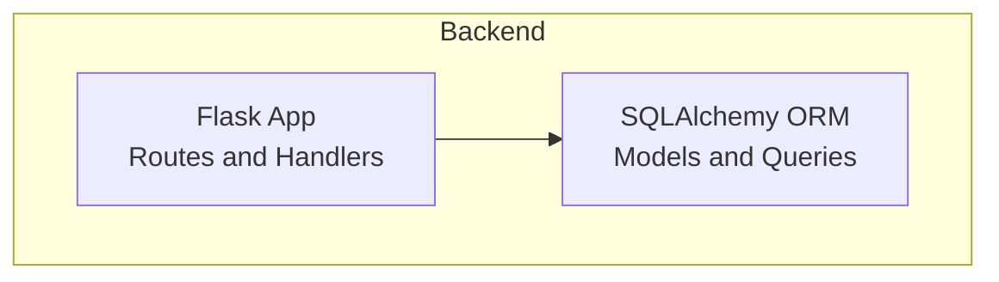
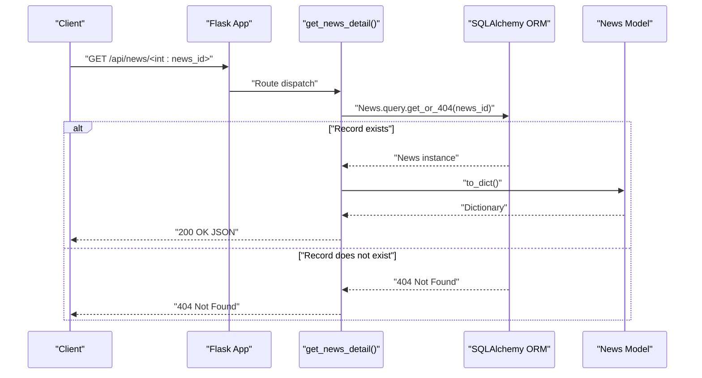
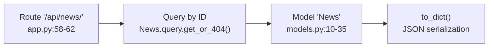

# News Detail Endpoint

<cite>
**Referenced Files in This Document**
- [app.py](file://backend/app.py)
- [models.py](file://backend/models.py)
- [README.md](file://README.md)
- [requirements.txt](file://backend/requirements.txt)
</cite>

## Table of Contents
1. [Introduction](#introduction)
2. [Project Structure](#project-structure)
3. [Core Components](#core-components)
4. [Architecture Overview](#architecture-overview)
5. [Detailed Component Analysis](#detailed-component-analysis)
6. [Dependency Analysis](#dependency-analysis)
7. [Performance Considerations](#performance-considerations)
8. [Troubleshooting Guide](#troubleshooting-guide)
9. [Conclusion](#conclusion)

## Introduction
This document provides comprehensive API documentation for the `/api/news/<int:news_id>` endpoint, which retrieves individual news items by their numeric identifier. It covers the endpoint’s behavior, response format, error handling, validation requirements, and security considerations. It also outlines integration patterns for displaying individual article content in the frontend.

## Project Structure
The API is implemented in a Flask application with SQLAlchemy ORM for persistence. The relevant files for this endpoint are:
- Backend application and routing: [app.py](file://backend/app.py)
- Data model definition: [models.py](file://backend/models.py)
- Project overview and API table: [README.md](file://README.md)
- Dependencies: [requirements.txt](file://backend/requirements.txt)

**Diagram sources**
- [app.py:1-87](file://backend/app.py#L1-L87)
- [models.py:1-39](file://backend/models.py#L1-L39)

**Section sources**
- [README.md:55-62](file://README.md#L55-L62)
- [app.py:58-62](file://backend/app.py#L58-L62)

## Core Components
- Flask route handler for retrieving a single news item by ID.
- SQLAlchemy model representing the news record and its JSON serialization method.
- Database-backed query that returns either the record or triggers a 404 Not Found.

Key implementation references:
- Route definition and handler: [app.py:58-62](file://backend/app.py#L58-L62)
- Model definition and serialization: [models.py:10-35](file://backend/models.py#L10-L35)

**Section sources**
- [app.py:58-62](file://backend/app.py#L58-L62)
- [models.py:10-35](file://backend/models.py#L10-L35)

## Architecture Overview
The endpoint integrates the Flask request lifecycle with SQLAlchemy to serve a single news record.

**Diagram sources**
- [app.py:58-62](file://backend/app.py#L58-L62)
- [models.py:24-35](file://backend/models.py#L24-L35)

## Detailed Component Analysis

### Endpoint Definition
- Path: `/api/news/<int:news_id>`
- Method: GET
- Purpose: Retrieve a single news item identified by an integer ID.

Behavior:
- Uses a Flask route converter to enforce that the path parameter is an integer.
- Retrieves the record from the database; if not found, returns a 404 Not Found response.

References:
- Route definition: [app.py:58-62](file://backend/app.py#L58-L62)

**Section sources**
- [app.py:58-62](file://backend/app.py#L58-L62)

### Successful Response Format
On success, the endpoint returns a JSON object representing the news item. The response mirrors the model’s serialized form.

Response shape:
- id: Integer
- title: String
- summary: String or null
- link: String
- source: String
- published: ISO 8601 formatted datetime string or null
- category: String
- hot_score: Number (float)

Serialization logic:
- The model’s to_dict method constructs the response payload.
- The published timestamp is serialized as an ISO 8601 string when present; otherwise null.

References:
- Serialization method: [models.py:24-35](file://backend/models.py#L24-L35)
- Model fields: [models.py:14-22](file://backend/models.py#L14-L22)

Typical response example (descriptive):
- id: 123
- title: "Example Article Title"
- summary: "Brief summary of the article content..."
- link: "https://example.com/article"
- source: "Example Source"
- published: "2024-01-15T09:30:00Z"
- category: "AI圈"
- hot_score: 4.25

Integration patterns:
- Frontend can render the article by displaying the title, summary, source, and link.
- The published timestamp can be shown as a human-readable relative time.
- The hot_score can be displayed as a trending indicator.

References:
- Model fields and serialization: [models.py:14-35](file://backend/models.py#L14-L35)

**Section sources**
- [models.py:24-35](file://backend/models.py#L24-L35)
- [models.py:14-22](file://backend/models.py#L14-L22)

### Error Handling
- Missing record: When the provided ID does not correspond to an existing news item, the query triggers a 404 Not Found response.
- The Flask framework’s get_or_404 helper ensures that a 404 is returned automatically when the record is absent.

References:
- Handler behavior: [app.py:61](file://backend/app.py#L61)

Common scenarios:
- Non-existent ID: 404 Not Found
- Malformed ID (non-integer): Flask route converter prevents invalid paths from reaching the handler

References:
- Route converter: [app.py:58](file://backend/app.py#L58)

**Section sources**
- [app.py:61](file://backend/app.py#L61)
- [app.py:58](file://backend/app.py#L58)

### Validation Requirements
- Parameter type: The path parameter news_id must be an integer. The Flask route converter enforces this.
- Range: No explicit lower/upper bounds are enforced in code; however, practical constraints depend on the database’s integer range and the application’s data.

References:
- Route definition: [app.py:58](file://backend/app.py#L58)

**Section sources**
- [app.py:58](file://backend/app.py#L58)

### Security Considerations
- Input sanitization: The integer constraint from the route converter reduces risk for injection attacks targeting the ID parameter.
- Access control: There is no authentication or authorization middleware for this endpoint; it is publicly accessible.
- Rate limiting: Not implemented in the current codebase; consider adding rate limiting at the application or reverse proxy level if deployed in production.
- CORS: Cross-origin requests are permitted for this endpoint via Flask-CORS configuration.

References:
- CORS configuration: [app.py:10](file://backend/app.py#L10)
- Dependencies: [requirements.txt:3](file://backend/requirements.txt#L3)

**Section sources**
- [app.py:10](file://backend/app.py#L10)
- [requirements.txt:3](file://backend/requirements.txt#L3)

### Field Descriptions
- id: Unique identifier for the news item.
- title: Headline or title of the article.
- summary: Brief excerpt or description; may be null.
- link: URL to the original article.
- source: Originating source name.
- published: Publication timestamp in ISO 8601 format; may be null.
- category: Category such as “程序员圈” or “AI圈”.
- hot_score: Trending score derived from recency and source weight.

References:
- Model fields: [models.py:14-22](file://backend/models.py#L14-L22)
- Serialization: [models.py:24-35](file://backend/models.py#L24-L35)

**Section sources**
- [models.py:14-22](file://backend/models.py#L14-L22)
- [models.py:24-35](file://backend/models.py#L24-L35)

### Integration Patterns for Displaying Individual Articles
- Fetching the detail: Call GET /api/news/<int:id> and render the returned fields.
- Link handling: Open the link in a new tab to preserve context.
- Timestamp display: Convert the published timestamp to a readable relative time.
- Category and source: Use category and source for tagging and attribution.
- Hot score: Optionally display as a trending metric.

References:
- Model serialization: [models.py:24-35](file://backend/models.py#L24-L35)

**Section sources**
- [models.py:24-35](file://backend/models.py#L24-L35)

## Dependency Analysis
The endpoint depends on the Flask application and the SQLAlchemy model layer.

**Diagram sources**
- [app.py:58-62](file://backend/app.py#L58-L62)
- [models.py:10-35](file://backend/models.py#L10-L35)

**Section sources**
- [app.py:58-62](file://backend/app.py#L58-L62)
- [models.py:10-35](file://backend/models.py#L10-L35)

## Performance Considerations
- Query efficiency: The handler performs a single database lookup by primary key, which is efficient.
- Serialization cost: The to_dict method serializes a small number of fields; overhead is minimal.
- Pagination vs. detail: The detail endpoint avoids pagination concerns, simplifying client-side logic.

[No sources needed since this section provides general guidance]

## Troubleshooting Guide
- 404 Not Found:
  - Cause: The provided ID does not match any existing record.
  - Action: Verify the ID and ensure the record exists in the database.
- Network errors:
  - Cause: Client cannot reach the API server.
  - Action: Confirm service availability and network connectivity.
- CORS issues:
  - Cause: Cross-origin requests blocked by browser policy.
  - Action: Ensure the origin is permitted by the CORS configuration.
- Unexpected response format:
  - Cause: Model changes without corresponding client updates.
  - Action: Align client rendering with the documented fields.

References:
- Handler behavior: [app.py:61](file://backend/app.py#L61)
- CORS configuration: [app.py:10](file://backend/app.py#L10)

**Section sources**
- [app.py:61](file://backend/app.py#L61)
- [app.py:10](file://backend/app.py#L10)

## Conclusion
The /api/news/<int:news_id> endpoint provides a straightforward mechanism to retrieve a single news item by ID. It returns a well-defined JSON structure and gracefully handles missing records with a 404 response. The implementation is simple, efficient, and suitable for integration with the frontend’s article display components. For production deployments, consider adding rate limiting and access controls as needed.