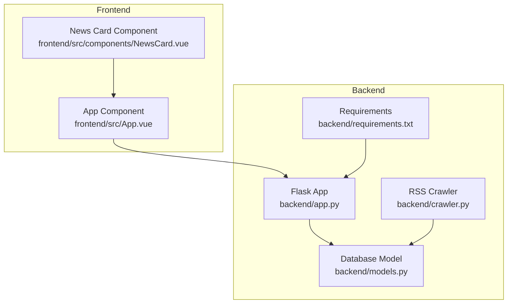
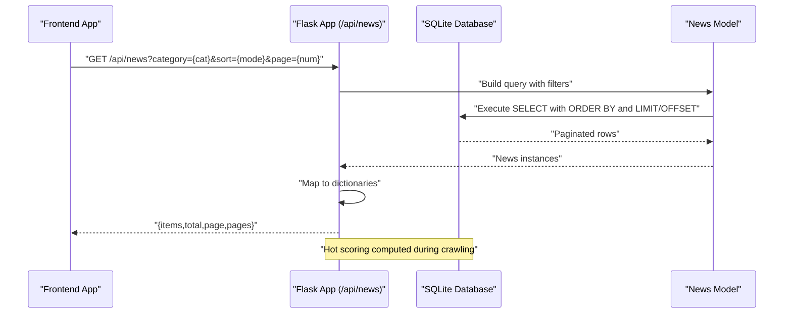
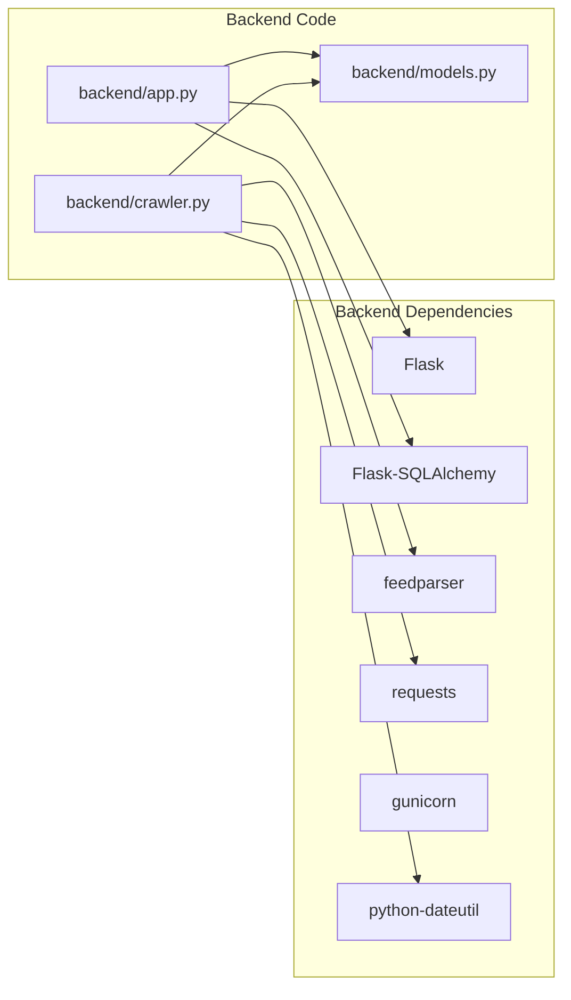

# News Listing Endpoint

<cite>
**Referenced Files in This Document**
- [app.py](file://backend/app.py)
- [models.py](file://backend/models.py)
- [crawler.py](file://backend/crawler.py)
- [README.md](file://README.md)
- [App.vue](file://frontend/src/App.vue)
- [NewsCard.vue](file://frontend/src/components/NewsCard.vue)
- [requirements.txt](file://backend/requirements.txt)
</cite>

## Table of Contents
1. [Introduction](#introduction)
2. [Project Structure](#project-structure)
3. [Core Components](#core-components)
4. [Architecture Overview](#architecture-overview)
5. [Detailed Component Analysis](#detailed-component-analysis)
6. [Dependency Analysis](#dependency-analysis)
7. [Performance Considerations](#performance-considerations)
8. [Troubleshooting Guide](#troubleshooting-guide)
9. [Conclusion](#conclusion)
10. [Appendices](#appendices)

## Introduction
This document provides comprehensive API documentation for the `/api/news` endpoint, which serves paginated news listings for two categories: "Programmer Circle" and "AI Circle". It covers query parameters, response schema, sorting mechanisms, hot score computation, and frontend integration patterns for pagination.

## Project Structure
The project consists of a Flask backend with SQLite persistence and a Vue 3 frontend. The backend exposes REST endpoints, while the frontend consumes the API to render news cards with category filtering, sorting, and pagination.

**Diagram sources**
- [app.py:1-87](file://backend/app.py#L1-L87)
- [models.py:1-39](file://backend/models.py#L1-L39)
- [crawler.py:1-217](file://backend/crawler.py#L1-L217)
- [requirements.txt:1-8](file://backend/requirements.txt#L1-L8)
- [App.vue:1-421](file://frontend/src/App.vue#L1-L421)
- [NewsCard.vue:1-197](file://frontend/src/components/NewsCard.vue#L1-L197)

**Section sources**
- [README.md:1-67](file://README.md#L1-L67)
- [requirements.txt:1-8](file://backend/requirements.txt#L1-L8)

## Core Components
- Flask route handler for `/api/news` builds a filtered and sorted query, paginates results, and returns a structured JSON payload.
- SQLAlchemy model defines the news entity with fields including title, summary, link, published timestamp, source, category, and hot_score.
- RSS crawler populates the database with articles from configured feeds, computing hot scores based on recency and source weights.
- Frontend integrates with the API to support category tabs, sort toggles, and pagination controls.

**Section sources**
- [app.py:21-55](file://backend/app.py#L21-L55)
- [models.py:10-39](file://backend/models.py#L10-L39)
- [crawler.py:62-74](file://backend/crawler.py#L62-L74)
- [App.vue:122-146](file://frontend/src/App.vue#L122-L146)

## Architecture Overview
The API endpoint orchestrates filtering by category, sorting by either newest or hottest, and pagination. The crawler periodically updates the dataset with fresh articles and recalculates hot scores.

**Diagram sources**
- [app.py:21-55](file://backend/app.py#L21-L55)
- [models.py:10-39](file://backend/models.py#L10-L39)
- [crawler.py:62-74](file://backend/crawler.py#L62-L74)

## Detailed Component Analysis

### Endpoint Definition
- Path: `/api/news`
- Method: GET
- Purpose: Retrieve paginated news items with optional category filter, sort mode, and page number.

**Section sources**
- [app.py:21-29](file://backend/app.py#L21-L29)

### Query Parameters
- category: String. Filters articles by category. Allowed values:
  - "Programmer Circle"
  - "AI Circle"
  - If omitted, no category filter is applied.
- sort: String. Sorting mode. Allowed values:
  - "newest" (default)
  - "hottest"
- page: Integer. Page number. Defaults to 1.

Notes:
- The endpoint does not validate parameter values; invalid values are accepted but may yield empty results or unexpected ordering depending on the database behavior.

**Section sources**
- [app.py:30-33](file://backend/app.py#L30-L33)
- [app.py:42-45](file://backend/app.py#L42-L45)

### Sorting Mechanisms
- Newest mode:
  - Orders by published timestamp descending.
- Hottest mode:
  - Orders by hot_score descending.

The backend applies the chosen order directly to the SQL query.

**Section sources**
- [app.py:42-45](file://backend/app.py#L42-L45)

### Hot Score Calculation
The crawler computes hot_score for each article using a time-decay formula weighted by the source’s influence. The formula is:
- hot_score = (1 / (hours_since_published + 2)) × source_weight
- Hours since published are calculated from UTC now minus the article’s published timestamp.
- The score is rounded to four decimal places.

Source weights:
- "Programmer Circle" sources have weights ranging from 1.0 to 1.2.
- "AI Circle" sources have weights ranging from 1.1 to 1.3.

Cleanup:
- Articles older than 30 days are removed periodically to keep the dataset current.

**Section sources**
- [crawler.py:62-74](file://backend/crawler.py#L62-L74)
- [crawler.py:14-37](file://backend/crawler.py#L14-L37)
- [crawler.py:170-178](file://backend/crawler.py#L170-L178)

### Pagination Behavior
- Items per page: 20
- The endpoint returns:
  - items: Array of news objects
  - total: Total count of matching records
  - page: Current page number
  - pages: Total number of pages

Pagination is handled by the ORM’s paginate method with error_out disabled, ensuring safe defaults for out-of-range pages.

**Section sources**
- [app.py:33-33](file://backend/app.py#L33-L33)
- [app.py:48-55](file://backend/app.py#L48-L55)

### Response Schema
- items: Array of news objects
  - id: Integer
  - title: String
  - summary: String
  - link: String
  - source: String
  - published: ISO 8601 timestamp string or null
  - category: String
  - hot_score: Number
- total: Integer
- page: Integer
- pages: Integer

**Section sources**
- [models.py:24-35](file://backend/models.py#L24-L35)
- [app.py:50-55](file://backend/app.py#L50-L55)

### Practical Examples
- Get newest articles from "Programmer Circle", page 1:
  - Request: GET /api/news?category=Programmer Circle&sort=newest&page=1
- Get hottest articles from "AI Circle", page 2:
  - Request: GET /api/news?category=AI Circle&sort=hottest&page=2
- Get latest articles without category filter:
  - Request: GET /api/news?sort=newest&page=1

Frontend integration:
- The frontend constructs query parameters dynamically and fetches data on category/sort/page changes.
- It updates pagination controls and renders news cards.

**Section sources**
- [App.vue:127-131](file://frontend/src/App.vue#L127-L131)
- [App.vue:122-146](file://frontend/src/App.vue#L122-L146)

### Error Handling
- The backend does not explicitly validate parameters. Invalid category or sort values are passed to the query, potentially returning empty results.
- The frontend handles network errors and displays a retry button.

Recommendations:
- Validate category against known values ("Programmer Circle", "AI Circle").
- Validate sort to "newest" or "hottest".
- Clamp page to a reasonable range to prevent excessive load.

**Section sources**
- [app.py:30-33](file://backend/app.py#L30-L33)
- [App.vue:140-145](file://frontend/src/App.vue#L140-L145)

### Frontend Integration Patterns
- State management:
  - Tracks currentCategory, currentSort, currentPage, totalPages, newsItems, loading, error.
- Fetching:
  - Constructs URL with query parameters and fetches JSON.
  - Updates totalPages and lastUpdate timestamp.
- Pagination:
  - Disables navigation buttons when at first/last page.
  - Scrolls to top on page change.
- Rendering:
  - Uses NewsCard component to display each item.

**Section sources**
- [App.vue:108-187](file://frontend/src/App.vue#L108-L187)
- [NewsCard.vue:1-197](file://frontend/src/components/NewsCard.vue#L1-L197)

## Dependency Analysis
The backend depends on Flask, SQLAlchemy, and external libraries for RSS parsing and HTTP requests. The frontend uses Vue 3 and Vite.

**Diagram sources**
- [requirements.txt:1-8](file://backend/requirements.txt#L1-L8)
- [app.py:1-10](file://backend/app.py#L1-L10)
- [models.py:1-7](file://backend/models.py#L1-L7)
- [crawler.py:1-12](file://backend/crawler.py#L1-L12)

**Section sources**
- [requirements.txt:1-8](file://backend/requirements.txt#L1-L8)

## Performance Considerations
- Pagination limit: 20 items per page reduces payload size and client rendering overhead.
- Sorting by hot_score requires an index on hot_score for optimal performance in "hottest" mode.
- Sorting by published timestamp should leverage an index on published for "newest" mode.
- Network latency: The crawler runs periodically to minimize real-time load on external RSS feeds.

[No sources needed since this section provides general guidance]

## Troubleshooting Guide
Common issues and resolutions:
- Empty results:
  - Verify category spelling matches stored values.
  - Confirm the database contains articles for the selected category.
- Unexpected ordering:
  - Ensure sort parameter is either "newest" or "hottest".
- Pagination errors:
  - Clamp page to [1, total pages].
  - Handle error_out=False behavior by checking pages field.
- Hot score anomalies:
  - Check that crawler ran recently and hot_score is populated.
  - Review source weights and recency thresholds.

**Section sources**
- [app.py:30-33](file://backend/app.py#L30-L33)
- [app.py:42-45](file://backend/app.py#L42-L45)
- [crawler.py:62-74](file://backend/crawler.py#L62-L74)

## Conclusion
The `/api/news` endpoint provides a flexible way to browse categorized news with newest or hottest sorting and robust pagination. The hot score mechanism balances recency and source authority, while the frontend offers intuitive controls for category switching, sorting, and pagination.

[No sources needed since this section summarizes without analyzing specific files]

## Appendices

### API Definition Summary
- Endpoint: GET /api/news
- Query parameters:
  - category: "Programmer Circle" | "AI Circle" | (optional)
  - sort: "newest" | "hottest" (default: "newest")
  - page: Integer (default: 1)
- Response fields:
  - items: Array of news objects
  - total: Integer
  - page: Integer
  - pages: Integer

**Section sources**
- [app.py:21-29](file://backend/app.py#L21-L29)
- [app.py:50-55](file://backend/app.py#L50-L55)

### Data Model Reference
- News fields:
  - id: Integer
  - title: Text
  - summary: Text
  - link: Text (unique)
  - published: DateTime
  - source: Text
  - category: Text
  - hot_score: Float

**Section sources**
- [models.py:14-22](file://backend/models.py#L14-L22)

### Frontend Integration Notes
- The frontend sets API base URL via environment variable and composes query parameters for category, sort, and page.
- It updates pagination UI and handles loading/error states.

**Section sources**
- [App.vue:119-119](file://frontend/src/App.vue#L119-L119)
- [App.vue:127-131](file://frontend/src/App.vue#L127-L131)
- [App.vue:164-166](file://frontend/src/App.vue#L164-L166)