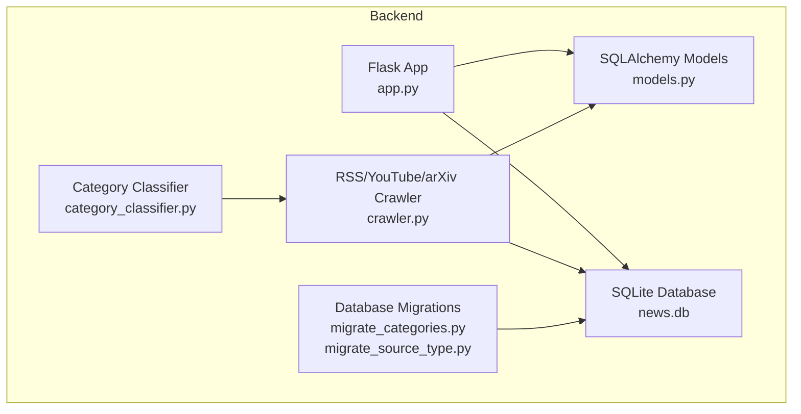
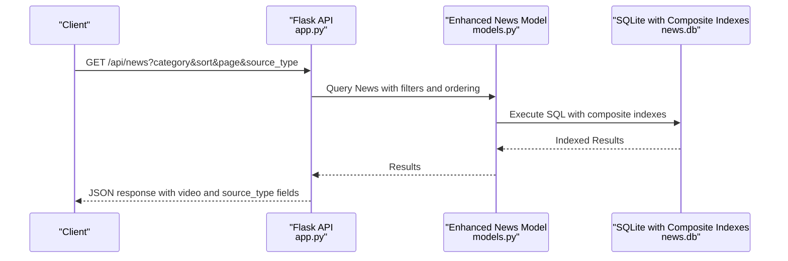
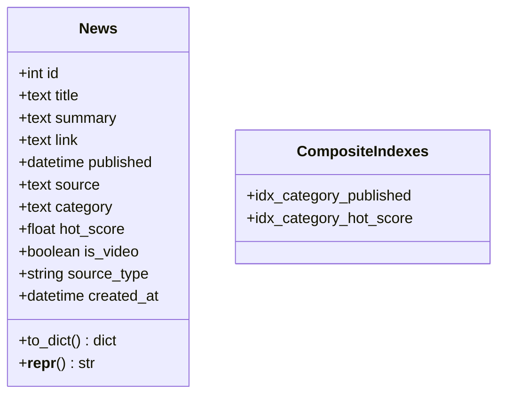
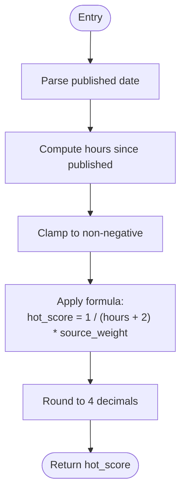
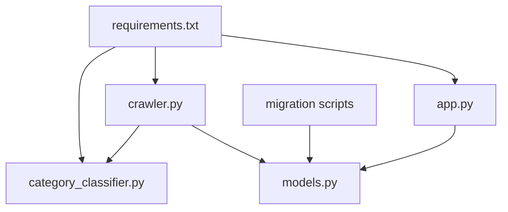

# Database Schema Design

<cite>
**Referenced Files in This Document**
- [models.py](file://backend/models.py)
- [app.py](file://backend/app.py)
- [crawler.py](file://backend/crawler.py)
- [requirements.txt](file://backend/requirements.txt)
- [README.md](file://README.md)
- [crawler.yml](file://.github/workflows/crawler.yml)
- [migrate_categories.py](file://backend/migrate_categories.py)
- [migrate_source_type.py](file://backend/migrate_source_type.py)
- [recategorize_all.py](file://backend/recategorize_all.py)
- [category_classifier.py](file://backend/category_classifier.py)
</cite>

## Update Summary
**Changes Made**
- Updated News model schema to include new fields (is_video, source_type)
- Added composite indexes for performance optimization
- Enhanced category management system with improved classification
- Added support for video content identification and source type categorization
- Updated database migration approaches for schema evolution

## Table of Contents
1. [Introduction](#introduction)
2. [Project Structure](#project-structure)
3. [Core Components](#core-components)
4. [Architecture Overview](#architecture-overview)
5. [Detailed Component Analysis](#detailed-component-analysis)
6. [Dependency Analysis](#dependency-analysis)
7. [Performance Considerations](#performance-considerations)
8. [Troubleshooting Guide](#troubleshooting-guide)
9. [Conclusion](#conclusion)
10. [Appendices](#appendices)

## Introduction
This document provides comprehensive database schema documentation for the SQLAlchemy-based news aggregator. It details the enhanced News model structure with new fields for video content identification and source type categorization, along with composite indexes for performance optimization. The document covers the hot score calculation algorithm, advanced category classification system, and comprehensive database migration approaches.

## Project Structure
The database layer is implemented in the backend module with a SQLite database file stored locally. The Flask application initializes the database and exposes API endpoints for retrieving news items. The crawler module fetches RSS feeds, YouTube channels, and arXiv papers, calculates hot scores, and persists new articles while supporting video content identification and enhanced categorization.



**Diagram sources**
- [app.py:25-31](file://backend/app.py#L25-L31)
- [models.py:10-30](file://backend/models.py#L10-L30)
- [crawler.py:102-121](file://backend/crawler.py#L102-L121)
- [migrate_categories.py:56-236](file://backend/migrate_categories.py#L56-L236)
- [category_classifier.py:8-86](file://backend/category_classifier.py#L8-L86)

**Section sources**
- [README.md:5-26](file://README.md#L5-L26)
- [app.py:25-31](file://backend/app.py#L25-L31)
- [models.py:10-30](file://backend/models.py#L10-L30)
- [crawler.py:102-121](file://backend/crawler.py#L102-L121)

## Core Components
- Database engine and ORM: Flask-SQLAlchemy configured with a local SQLite database URI.
- Enhanced News model: Defines the schema for storing news articles with fields for title, summary, link, publication date, source, category, hot score, creation timestamp, video identification flags, and source type categorization.
- API endpoints: Retrieve paginated news, filter by category, sort by newest or hottest, and fetch a single article by ID.
- Advanced crawler: Fetches RSS feeds, YouTube channels, and arXiv papers, parses dates, computes hot scores, identifies video content, and persists articles with proper categorization.
- Database migrations: Comprehensive migration scripts for adding new fields, creating indexes, and enhancing category management.

Key implementation references:
- Database configuration and initialization: [app.py:25-31](file://backend/app.py#L25-L31), [app.py:156-177](file://backend/app.py#L156-L177)
- Enhanced News model definition: [models.py:10-30](file://backend/models.py#L10-L30)
- API endpoints for news retrieval and categorization: [app.py:67-106](file://backend/app.py#L67-L106), [app.py:121-139](file://backend/app.py#L121-L139)
- Advanced crawler with video support: [crawler.py:172-243](file://backend/crawler.py#L172-L243), [crawler.py:298-352](file://backend/crawler.py#L298-L352)
- Database migration scripts: [migrate_categories.py:56-236](file://backend/migrate_categories.py#L56-L236), [migrate_source_type.py:12-53](file://backend/migrate_source_type.py#L12-L53)

**Section sources**
- [app.py:25-31](file://backend/app.py#L25-L31)
- [app.py:156-177](file://backend/app.py#L156-L177)
- [models.py:10-30](file://backend/models.py#L10-L30)
- [app.py:67-106](file://backend/app.py#L67-L106)
- [app.py:121-139](file://backend/app.py#L121-L139)
- [crawler.py:172-243](file://backend/crawler.py#L172-L243)
- [crawler.py:298-352](file://backend/crawler.py#L298-L352)
- [migrate_categories.py:56-236](file://backend/migrate_categories.py#L56-L236)
- [migrate_source_type.py:12-53](file://backend/migrate_source_type.py#L12-L53)

## Architecture Overview
The system follows a layered architecture with enhanced content ingestion capabilities:
- Presentation layer: Flask routes expose REST endpoints for clients.
- Application layer: Business logic for sorting, filtering, pagination, and cleanup.
- Data access layer: SQLAlchemy ORM mapping to the SQLite database with composite indexes.
- Data ingestion layer: Multi-source crawler supporting RSS feeds, YouTube channels, and arXiv papers.



**Diagram sources**
- [app.py:67-106](file://backend/app.py#L67-L106)
- [models.py:10-30](file://backend/models.py#L10-L30)

## Detailed Component Analysis

### Enhanced News Model Schema
The News model now includes new fields for video content identification and source type categorization, along with composite indexes for optimal query performance.



- Primary key: id (Integer, autoincrement)
- Unique constraint: link (Text, unique)
- Not null constraints: title, link
- Default values: hot_score defaults to 0.0; created_at defaults to current UTC time; is_video defaults to False; source_type defaults to 'rss'
- Ordering fields: published and hot_score are used for sorting

**Updated** Added new fields: is_video (Boolean) for video content identification, source_type (String) for content source categorization ('rss', 'youtube', 'arxiv')

Field definitions and constraints:
- id: Integer, primary key, autoincrement
- title: Text, not null
- summary: Text, nullable
- link: Text, unique, not null
- published: DateTime, indexed
- source: Text, nullable
- category: Text, indexed
- hot_score: Float, default 0.0, indexed
- is_video: Boolean, default False
- source_type: String, default 'rss' (values: 'rss', 'youtube', 'arxiv')
- created_at: DateTime, default current UTC

Relationships:
- No explicit foreign keys are defined in the model; the schema is self-contained.

**Updated** Added composite indexes for performance optimization:
- idx_category_published: Composite index on (category, published)
- idx_category_hot_score: Composite index on (category, hot_score)

**Diagram sources**
- [models.py:10-30](file://backend/models.py#L10-L30)

**Section sources**
- [models.py:10-30](file://backend/models.py#L10-L30)

### Hot Score Calculation Algorithm
The crawler computes a time-decayed hot score for each article using the source's weight, maintaining the original algorithm while supporting enhanced content types.



- Inputs: published_date (UTC), source_weight (numeric)
- Output: hot_score (Float)
- Edge cases: Handles parsing errors by defaulting to current UTC; clamps negative hours to zero; rounds to four decimal places

**Updated** The hot score calculation remains unchanged but now applies to all content types including video content and arXiv papers.

Operational usage:
- The hot score is computed during crawling and persisted with each article.
- Sorting by hottest uses descending order of hot_score across all content types.

**Diagram sources**
- [crawler.py:146-157](file://backend/crawler.py#L146-L157)

**Section sources**
- [crawler.py:146-157](file://backend/crawler.py#L146-L157)

### Enhanced Category Classification System
**Updated** The category classification system has been significantly enhanced with dynamic classification and improved categorization logic.

- Categories are now organized into a six-category system: AI, 前端, 后端, 云原生, 区块链, 其他
- Dynamic classification based on title keywords for mixed-content sources
- Enhanced pattern matching with comprehensive keyword detection
- Backward compatibility with category name mapping

**Updated** New category system with mutual exclusivity:
- AI: Machine learning, deep learning, AI research papers
- 前端: JavaScript frameworks, CSS, web development
- 后端: Server-side languages, databases, microservices
- 云原生: Docker, Kubernetes, DevOps tools
- 区块链: Cryptocurrency, smart contracts, Web3
- 其他: Miscellaneous technology topics

Dynamic classification features:
- Pattern-based classification using regex patterns
- Priority-based pattern matching (more specific patterns first)
- Mixed-content source handling with title-based classification
- Comprehensive keyword coverage for each category

**Updated** Enhanced category management includes:
- Migration script for transforming old categories to new system
- Automatic video content categorization based on source patterns
- Intelligent arXiv paper categorization
- Batch recategorization capabilities

References:
- Category patterns and classification: [category_classifier.py:8-151](file://backend/category_classifier.py#L8-L151)
- Dynamic classification logic: [category_classifier.py:95-151](file://backend/category_classifier.py#L95-L151)
- Category migration script: [migrate_categories.py:56-236](file://backend/migrate_categories.py#L56-L236)
- Recategorization utilities: [recategorize_all.py:11-197](file://backend/recategorize_all.py#L11-L197)

**Section sources**
- [category_classifier.py:8-151](file://backend/category_classifier.py#L8-L151)
- [migrate_categories.py:56-236](file://backend/migrate_categories.py#L56-L236)
- [recategorize_all.py:11-197](file://backend/recategorize_all.py#L11-L197)

### Source Type Categorization System
**New** The system now includes comprehensive source type categorization for different content origins.

- Source types: 'rss' (standard RSS feeds), 'youtube' (YouTube channels), 'arxiv' (academic papers)
- Automatic detection based on source patterns and content characteristics
- Enhanced content identification for video and academic papers
- Flexible categorization supporting multiple content types

**Updated** Source type detection logic:
- YouTube detection: Based on is_video flag and source patterns
- arXiv detection: Based on URL patterns containing 'arxiv'
- RSS detection: Default for standard RSS feeds

References:
- Source type detection: [crawler.py:172-178](file://backend/crawler.py#L172-L178)
- Source type migration: [migrate_source_type.py:12-53](file://backend/migrate_source_type.py#L12-L53)

**Section sources**
- [crawler.py:172-178](file://backend/crawler.py#L172-L178)
- [migrate_source_type.py:12-53](file://backend/migrate_source_type.py#L12-L53)

### Data Access Patterns and Query Optimization
**Updated** Query patterns now leverage composite indexes for optimal performance across all content types.

- Retrieval:
  - Paginated listing with optional category filter, source type filter, and sort by newest or hottest.
  - Single-item retrieval by ID.
  - Video content filtering and source type filtering.
- Ordering:
  - Newest: ordered by published desc.
  - Hottest: ordered by hot_score desc.
- Filtering:
  - Category equality filter.
  - Source type equality filter ('rss', 'youtube', 'arxiv').
  - Combined category and source type filtering.
- Pagination:
  - Fixed page size of 20 items per page.

**Updated** Enhanced indexing strategy:
- Individual indexes: category (Text), published (DateTime), hot_score (Float), link (Text)
- Composite indexes: (category, published), (category, hot_score)
- Optimized for common query patterns across all content types

Performance optimizations:
- Composite indexes eliminate the need for separate single-column indexes
- Category-based queries benefit from both published and hot_score ordering
- Video content queries can leverage source_type filtering
- Source type queries optimize arXiv paper retrieval

References:
- API query building and ordering: [app.py:67-106](file://backend/app.py#L67-L106)
- Index creation: [app.py:34-49](file://backend/app.py#L34-L49), [app.py:161-175](file://backend/app.py#L161-L175)
- Model serialization: [models.py:32-48](file://backend/models.py#L32-L48)

**Section sources**
- [app.py:67-106](file://backend/app.py#L67-L106)
- [app.py:34-49](file://backend/app.py#L34-L49)
- [app.py:161-175](file://backend/app.py#L161-L175)
- [models.py:32-48](file://backend/models.py#L32-L48)

### Data Lifecycle and Retention Policies
**Updated** Data lifecycle now supports multiple content types with enhanced retention management.

- Ingestion:
  - RSS feeds are fetched daily via GitHub Actions workflow.
  - YouTube channels are processed with video content identification.
  - arXiv papers are ingested with automatic categorization.
  - Articles are deduplicated by link before insertion.
- Cleanup:
  - Old articles older than 30 days are removed during each crawl cycle.
  - Video content retention follows the same schedule as other content types.
- Persistence:
  - SQLite database file is committed to the repository and pushed by the workflow.

**Updated** Enhanced cleanup considerations:
- Composite indexes are maintained during cleanup operations
- Video content cleanup follows standard retention policies
- Source type filtering during cleanup operations
- Migration scripts preserve cleanup functionality

References:
- Daily workflow scheduling and execution: [crawler.yml:3-7](file://.github/workflows/crawler.yml#L3-L7), [crawler.yml:28-31](file://.github/workflows/crawler.yml#L28-L31)
- Cleanup routine: [crawler.py:279-286](file://backend/crawler.py#L279-L286)
- Database persistence: [crawler.yml:37-39](file://.github/workflows/crawler.yml#L37-L39)

**Section sources**
- [crawler.yml:3-7](file://.github/workflows/crawler.yml#L3-L7)
- [crawler.yml:28-31](file://.github/workflows/crawler.yml#L28-L31)
- [crawler.py:279-286](file://backend/crawler.py#L279-L286)
- [crawler.yml:37-39](file://.github/workflows/crawler.yml#L37-L39)

### Database Migration Approaches
**Updated** Comprehensive migration strategy for schema evolution and data enhancement.

- Current state: Enhanced News model with new fields and composite indexes.
- Migration strategy:
  - Category migration script transforms old categories to new six-category system.
  - Source type migration adds source_type column with intelligent categorization.
  - Composite index creation ensures optimal query performance.
  - Video content identification through pattern matching.
- Operational approach:
  - Separate migration scripts for different schema changes.
  - Backward compatibility maintained during migrations.
  - Batch processing for large-scale data transformations.

**Updated** Migration capabilities:
- Index creation for existing tables with performance optimization
- Column addition for new fields (is_video, source_type)
- Data transformation for category normalization
- Video content identification based on source patterns
- Source type categorization for different content origins

Recommended migration workflow:
1. Run source_type migration to add new column
2. Run category migration to transform data and create indexes
3. Verify composite indexes are properly created
4. Test video content identification and source type filtering

References:
- Category migration: [migrate_categories.py:56-236](file://backend/migrate_categories.py#L56-L236)
- Source type migration: [migrate_source_type.py:12-53](file://backend/migrate_source_type.py#L12-L53)
- Database initialization: [app.py:156-177](file://backend/app.py#L156-L177)
- Dependencies: [requirements.txt:1-9](file://backend/requirements.txt#L1-L9)

**Section sources**
- [migrate_categories.py:56-236](file://backend/migrate_categories.py#L56-L236)
- [migrate_source_type.py:12-53](file://backend/migrate_source_type.py#L12-L53)
- [app.py:156-177](file://backend/app.py#L156-L177)
- [requirements.txt:1-9](file://backend/requirements.txt#L1-L9)

### Data Security Considerations
**Updated** Security considerations for enhanced content types and database schema.

- Data exposure: The API returns sanitized fields via to_dict, including new video and source_type fields; ensure client-side rendering does not introduce XSS risks.
- Database storage: SQLite file is stored in the repository; restrict access to CI/CD secrets and deployment environments.
- Network security: RSS fetching uses HTTPS; YouTube API access requires proper authentication; arXiv paper ingestion respects rate limits.
- Content validation: Enhanced validation for video content URLs and source type categorization.

**Updated** Enhanced security measures:
- Video content URL validation and sanitization
- Source type validation against allowed values ('rss', 'youtube', 'arxiv')
- Rate limiting for YouTube API access
- Secure handling of arXiv paper metadata

References:
- RSS fetching and headers: [crawler.py:124-126](file://backend/crawler.py#L124-L126), [crawler.py:190-195](file://backend/crawler.py#L190-L195)
- YouTube source configuration: [crawler.py:103-118](file://backend/crawler.py#L103-L118)
- arXiv source configuration: [crawler.py:120-121](file://backend/crawler.py#L120-L121)

**Section sources**
- [crawler.py:124-126](file://backend/crawler.py#L124-L126)
- [crawler.py:190-195](file://backend/crawler.py#L190-L195)
- [crawler.py:103-118](file://backend/crawler.py#L103-L118)
- [crawler.py:120-121](file://backend/crawler.py#L120-L121)

### Indexing Strategies
**Updated** Comprehensive indexing strategy leveraging composite indexes for optimal performance.

- Current state: Enhanced News model with individual and composite indexes.
- Recommended indexes:
  - Individual indexes: category (Text), published (DateTime), hot_score (Float), link (Text) for deduplication
  - Composite indexes: (category, published), (category, hot_score)
- Performance benefits:
  - Composite indexes eliminate redundant single-column indexes
  - Category-based queries benefit from both ordering fields
  - Video content queries leverage source_type filtering
  - Source type queries optimize content origin filtering

**Updated** Index optimization:
- Composite indexes automatically cover single-column queries
- Category ordering optimization for both published and hot_score
- Video content filtering performance improvement
- Source type categorization query optimization

References:
- Query patterns: [app.py:67-106](file://backend/app.py#L67-L106)
- Index creation: [app.py:34-49](file://backend/app.py#L34-L49), [app.py:161-175](file://backend/app.py#L161-L175)
- Deduplication by link: [crawler.py:253-257](file://backend/crawler.py#L253-L257)

**Section sources**
- [app.py:67-106](file://backend/app.py#L67-L106)
- [app.py:34-49](file://backend/app.py#L34-L49)
- [app.py:161-175](file://backend/app.py#L161-L175)
- [crawler.py:253-257](file://backend/crawler.py#L253-L257)

### Backup Considerations
**Updated** Backup strategy for enhanced database schema and content types.

- Current approach: Commits the SQLite file to the repository via GitHub Actions.
- Recommended backup strategies:
  - Maintain multiple copies of the SQLite file in secure storage.
  - Periodically export schema and sample data snapshots including new fields.
  - Monitor database file size growth and set alerts.
  - Backup migration scripts for schema evolution tracking.

**Updated** Enhanced backup considerations:
- Backup includes new fields (is_video, source_type) and composite indexes
- Migration scripts should be versioned alongside database backups
- Video content and source type data preservation
- Category classification data integrity

References:
- Workflow committing database changes: [crawler.yml:37-39](file://.github/workflows/crawler.yml#L37-L39)
- Migration backup strategy: [migrate_categories.py:234-236](file://backend/migrate_categories.py#L234-L236), [migrate_source_type.py:51-53](file://backend/migrate_source_type.py#L51-L53)

**Section sources**
- [crawler.yml:37-39](file://.github/workflows/crawler.yml#L37-L39)
- [migrate_categories.py:234-236](file://backend/migrate_categories.py#L234-L236)
- [migrate_source_type.py:51-53](file://backend/migrate_source_type.py#L51-L53)

## Dependency Analysis
**Updated** Enhanced dependency graph supporting multiple content sources and migration tools.



**Updated** Additional dependencies:
- Category classifier for dynamic content categorization
- Migration scripts for schema evolution
- Enhanced crawler supporting multiple content sources

**Diagram sources**
- [requirements.txt:1-9](file://backend/requirements.txt#L1-L9)
- [app.py:25-31](file://backend/app.py#L25-L31)
- [crawler.py:10-12](file://backend/crawler.py#L10-L12)
- [category_classifier.py:6](file://backend/category_classifier.py#L6)
- [models.py:4](file://backend/models.py#L4)

**Section sources**
- [requirements.txt:1-9](file://backend/requirements.txt#L1-L9)
- [app.py:25-31](file://backend/app.py#L25-L31)
- [crawler.py:10-12](file://backend/crawler.py#L10-L12)
- [category_classifier.py:6](file://backend/category_classifier.py#L6)
- [models.py:4](file://backend/models.py#L4)

## Performance Considerations
**Updated** Performance optimizations leveraging composite indexes and enhanced query patterns.

- Hot score recalculation:
  - The hot score is precomputed during ingestion; avoid recalculating on every request.
  - Enhanced performance with composite indexes for category-based queries.
- Query performance:
  - Composite indexes on (category, published) and (category, hot_score) eliminate redundant single-column indexes.
  - Category-based queries benefit from both ordering fields simultaneously.
  - Video content queries leverage source_type filtering for optimal performance.
  - Source type queries optimize content origin filtering.
  - Use pagination with fixed page sizes.
  - Avoid N+1 queries by eager-loading related data if relationships are introduced later.
- Storage:
  - SQLite is suitable for small to medium workloads; monitor growth and consider migration to a managed database if scale increases.
  - Composite indexes provide space efficiency compared to multiple single-column indexes.
- Crawl cadence:
  - Daily crawls balance freshness and resource usage; adjust based on traffic and content volume.
  - Enhanced content ingestion supports multiple sources with optimized performance.

## Troubleshooting Guide
**Updated** Troubleshooting guide for enhanced database schema and content types.

- Database initialization:
  - Ensure the database is created before serving requests.
  - Verify SQLite file permissions and path resolution.
  - Check that composite indexes are properly created during initialization.
- Duplicate entries:
  - Deduplication is performed by link; confirm unique constraint is respected.
  - Verify migration scripts properly handle existing data.
- Date parsing:
  - Fallback to current UTC if parsing fails; validate feed entries' date fields.
  - Check YouTube video timestamps and arXiv paper publication dates.
- Cleanup:
  - Confirm cleanup removes expected rows older than the cutoff date.
  - Verify composite indexes remain intact after cleanup operations.
- API errors:
  - Check endpoint parameters (category, sort, page, source_type) and handle missing or invalid values gracefully.
  - Validate new fields (is_video, source_type) are properly handled.
- Migration issues:
  - Verify migration scripts run in correct order (source_type first, then categories).
  - Check for conflicts with existing data during migration.
  - Ensure composite indexes are recreated after schema changes.

**Updated** New troubleshooting areas:
- Video content identification failures
- Source type categorization errors
- Category migration completion verification
- Composite index creation verification
- Enhanced content type filtering issues

References:
- Database initialization: [app.py:156-177](file://backend/app.py#L156-L177)
- Deduplication logic: [crawler.py:253-257](file://backend/crawler.py#L253-L257)
- Date parsing fallback: [crawler.py:129-143](file://backend/crawler.py#L129-L143)
- Cleanup logic: [crawler.py:279-286](file://backend/crawler.py#L279-L286)
- Migration verification: [migrate_categories.py:222-225](file://backend/migrate_categories.py#L222-L225), [migrate_source_type.py:37-42](file://backend/migrate_source_type.py#L37-L42)

**Section sources**
- [app.py:156-177](file://backend/app.py#L156-L177)
- [crawler.py:253-257](file://backend/crawler.py#L253-L257)
- [crawler.py:129-143](file://backend/crawler.py#L129-L143)
- [crawler.py:279-286](file://backend/crawler.py#L279-L286)
- [migrate_categories.py:222-225](file://backend/migrate_categories.py#L222-L225)
- [migrate_source_type.py:37-42](file://backend/migrate_source_type.py#L37-L42)

## Conclusion
The enhanced News model provides a robust schema for a multi-source news aggregation service. The addition of video content identification, source type categorization, and composite indexes significantly improves query performance and content management. The dynamic category classification system enables intelligent content organization across multiple content types. With comprehensive migration capabilities and enhanced indexing strategies, the system scales effectively while maintaining optimal performance for diverse content sources including RSS feeds, YouTube channels, and academic papers.

## Appendices

### Enhanced Sample Data Example
**Updated** Sample data including new fields and content types.

- Fields: id, title, summary, link, source, category, published, hot_score, is_video, source_type, created_at
- Typical values:
  - id: integer (autoincrement)
  - title: text (not null)
  - summary: text (nullable)
  - link: text (unique, not null)
  - source: text (nullable)
  - category: text (indexed, nullable)
  - published: datetime (indexed, nullable)
  - hot_score: float (indexed, default 0.0)
  - is_video: boolean (default False)
  - source_type: string (default 'rss', values: 'rss', 'youtube', 'arxiv')
  - created_at: datetime (default current UTC)

**Updated** Content type examples:
- RSS articles: source_type = 'rss', is_video = False
- YouTube videos: source_type = 'youtube', is_video = True
- arXiv papers: source_type = 'arxiv', is_video = False

References:
- Model fields: [models.py:14-30](file://backend/models.py#L14-L30)

**Section sources**
- [models.py:14-30](file://backend/models.py#L14-L30)

### Database Schema Evolution Timeline
**New** Timeline of database schema improvements:

- Initial release: Basic News model with essential fields
- Enhancement 1: Added is_video field for video content identification
- Enhancement 2: Added source_type field for content source categorization
- Enhancement 3: Implemented composite indexes for performance optimization
- Enhancement 4: Enhanced category management system with dynamic classification
- Enhancement 5: Comprehensive migration scripts for schema evolution

### Migration Script Usage Guide
**New** How to use migration scripts:

1. **Source Type Migration**:
   ```bash
   python backend/migrate_source_type.py
   ```

2. **Category Migration**:
   ```bash
   python backend/migrate_categories.py
   ```

3. **Verification**:
   - Check source_type distribution: `SELECT source_type, COUNT(*) FROM news GROUP BY source_type`
   - Verify video content identification: `SELECT COUNT(*) FROM news WHERE is_video = 1`
   - Confirm category distribution: `SELECT category, COUNT(*) FROM news GROUP BY category ORDER BY count DESC`

4. **Rollback Considerations**:
   - Source type migration can be safely rerun (skips existing columns)
   - Category migration requires manual intervention for complex scenarios
   - Always backup database before running migrations