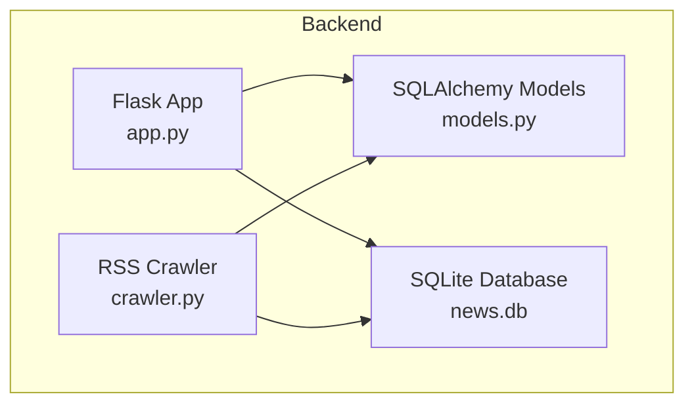
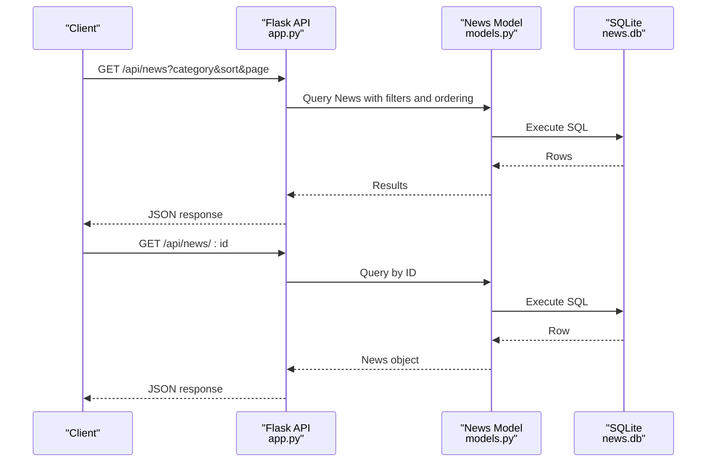
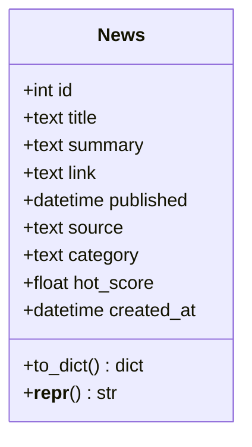
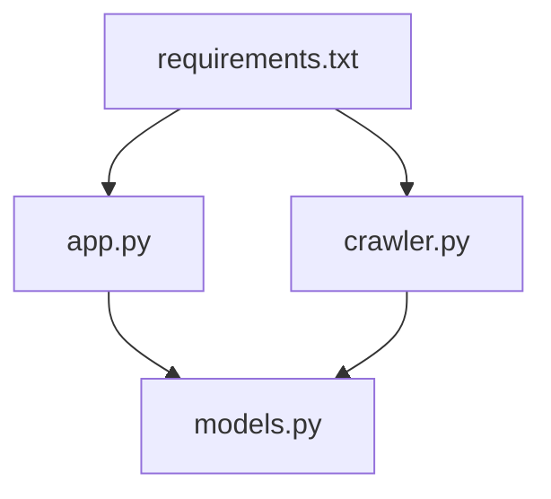

# Database Schema Design

<cite>
**Referenced Files in This Document**
- [models.py](file://backend/models.py)
- [app.py](file://backend/app.py)
- [crawler.py](file://backend/crawler.py)
- [requirements.txt](file://backend/requirements.txt)
- [README.md](file://README.md)
- [crawler.yml](file://.github/workflows/crawler.yml)
</cite>

## Table of Contents
1. [Introduction](#introduction)
2. [Project Structure](#project-structure)
3. [Core Components](#core-components)
4. [Architecture Overview](#architecture-overview)
5. [Detailed Component Analysis](#detailed-component-analysis)
6. [Dependency Analysis](#dependency-analysis)
7. [Performance Considerations](#performance-considerations)
8. [Troubleshooting Guide](#troubleshooting-guide)
9. [Conclusion](#conclusion)
10. [Appendices](#appendices)

## Introduction
This document provides comprehensive database schema documentation for the SQLAlchemy-based news aggregator. It details the News model structure, constraints, relationships, and the hot score calculation algorithm. It also covers data access patterns, query optimization strategies, data lifecycle and retention, migration approaches, and operational considerations such as indexing and backups.

## Project Structure
The database layer is implemented in the backend module with a SQLite database file stored locally. The Flask application initializes the database and exposes API endpoints for retrieving news items. The crawler module fetches RSS feeds, calculates hot scores, and persists new articles while avoiding duplicates.

**Diagram sources**
- [app.py:12-18](file://backend/app.py#L12-L18)
- [models.py:10-22](file://backend/models.py#L10-L22)
- [crawler.py:139-167](file://backend/crawler.py#L139-L167)

**Section sources**
- [README.md:5-26](file://README.md#L5-L26)
- [app.py:12-18](file://backend/app.py#L12-L18)
- [models.py:10-22](file://backend/models.py#L10-L22)
- [crawler.py:139-167](file://backend/crawler.py#L139-L167)

## Core Components
- Database engine and ORM: Flask-SQLAlchemy configured with a local SQLite database URI.
- News model: Defines the schema for storing news articles with fields for title, summary, link, publication date, source, category, hot score, and creation timestamp.
- API endpoints: Retrieve paginated news, filter by category, sort by newest or hottest, and fetch a single article by ID.
- Crawler: Fetches RSS feeds, parses dates, computes hot scores, truncates summaries, deduplicates by link, and cleans up old entries.

Key implementation references:
- Database configuration and initialization: [app.py:12-18](file://backend/app.py#L12-L18), [app.py:77-81](file://backend/app.py#L77-L81)
- News model definition: [models.py:10-22](file://backend/models.py#L10-L22)
- API endpoints for news retrieval and categorization: [app.py:21-55](file://backend/app.py#L21-L55), [app.py:65-68](file://backend/app.py#L65-L68)
- Crawler hot score calculation and persistence: [crawler.py:62-74](file://backend/crawler.py#L62-L74), [crawler.py:139-167](file://backend/crawler.py#L139-L167)

**Section sources**
- [app.py:12-18](file://backend/app.py#L12-L18)
- [app.py:77-81](file://backend/app.py#L77-L81)
- [models.py:10-22](file://backend/models.py#L10-L22)
- [app.py:21-55](file://backend/app.py#L21-L55)
- [app.py:65-68](file://backend/app.py#L65-L68)
- [crawler.py:62-74](file://backend/crawler.py#L62-L74)
- [crawler.py:139-167](file://backend/crawler.py#L139-L167)

## Architecture Overview
The system follows a simple layered architecture:
- Presentation layer: Flask routes expose REST endpoints for clients.
- Application layer: Business logic for sorting, filtering, pagination, and cleanup.
- Data access layer: SQLAlchemy ORM mapping to the SQLite database.
- Data ingestion layer: RSS crawler populates the database.

**Diagram sources**
- [app.py:21-55](file://backend/app.py#L21-L55)
- [app.py:58-62](file://backend/app.py#L58-L62)
- [models.py:10-22](file://backend/models.py#L10-L22)

## Detailed Component Analysis

### News Model Schema
The News model defines the database table structure and relationships.

- Primary key: id (Integer, autoincrement)
- Unique constraint: link (Text, unique)
- Not null constraints: title, link
- Default values: hot_score defaults to 0.0; created_at defaults to current UTC time
- Ordering fields: published and hot_score are used for sorting

Field definitions and constraints:
- id: Integer, primary key, autoincrement
- title: Text, not null
- summary: Text, nullable
- link: Text, unique, not null
- published: DateTime, nullable
- source: Text, nullable
- category: Text, nullable
- hot_score: Float, default 0.0
- created_at: DateTime, default current UTC

Relationships:
- No explicit foreign keys are defined in the model; the schema is self-contained.

Indexes:
- No explicit indexes are defined in the model. The application relies on default indexes for primary keys and unique constraints.

**Diagram sources**
- [models.py:10-22](file://backend/models.py#L10-L22)

**Section sources**
- [models.py:10-22](file://backend/models.py#L10-L22)

### Hot Score Calculation Algorithm
The crawler computes a time-decayed hot score for each article using the source’s weight.

- Inputs: published_date (UTC), source_weight (numeric)
- Output: hot_score (Float)
- Edge cases: Handles parsing errors by defaulting to current UTC; clamps negative hours to zero; rounds to four decimal places

Operational usage:
- The hot score is computed during crawling and persisted with each article.
- Sorting by hottest uses descending order of hot_score.

**Diagram sources**
- [crawler.py:62-74](file://backend/crawler.py#L62-L74)

**Section sources**
- [crawler.py:62-74](file://backend/crawler.py#L62-L74)

### Category Classification System
- Categories are strings used to group articles (e.g., “Programmer Circle”, “AI Circle”).
- The crawler assigns categories based on RSS source configuration.
- The API supports filtering by category and listing available categories.

References:
- Category assignment in crawler: [crawler.py:14-37](file://backend/crawler.py#L14-L37)
- Filtering by category in API: [app.py:38-39](file://backend/app.py#L38-L39)
- Available categories endpoint: [app.py:65-68](file://backend/app.py#L65-L68)

**Section sources**
- [crawler.py:14-37](file://backend/crawler.py#L14-L37)
- [app.py:38-39](file://backend/app.py#L38-L39)
- [app.py:65-68](file://backend/app.py#L65-L68)

### Source Weighting Mechanism
- Each RSS source has an associated numeric weight that influences hot score computation.
- Weights are defined in the RSS_SOURCES configuration and passed to the crawler.

References:
- Source weights: [crawler.py:14-37](file://backend/crawler.py#L14-L37)
- Passing weight to hot score calculation: [crawler.py:114](file://backend/crawler.py#L114)

**Section sources**
- [crawler.py:14-37](file://backend/crawler.py#L14-L37)
- [crawler.py:114](file://backend/crawler.py#L114)

### Data Access Patterns and Query Optimization
- Retrieval:
  - Paginated listing with optional category filter and sort by newest or hottest.
  - Single-item retrieval by ID.
- Ordering:
  - Newest: ordered by published desc.
  - Hottest: ordered by hot_score desc.
- Filtering:
  - Category equality filter.
- Pagination:
  - Fixed page size of 20 items per page.

Optimization considerations:
- Add indexes on frequently queried columns:
  - category (Text)
  - published (DateTime)
  - hot_score (Float)
  - link (Text) for deduplication
- Consider composite indexes for frequent query patterns (e.g., category + published or category + hot_score).
- Use LIMIT/OFFSET for pagination; consider cursor-based pagination for very large datasets.
- Avoid SELECT *; return only required fields via to_dict.

References:
- API query building and ordering: [app.py:35-45](file://backend/app.py#L35-L45)
- Pagination: [app.py:47-48](file://backend/app.py#L47-L48)
- Model serialization: [models.py:24-35](file://backend/models.py#L24-L35)

**Section sources**
- [app.py:35-45](file://backend/app.py#L35-L45)
- [app.py:47-48](file://backend/app.py#L47-L48)
- [models.py:24-35](file://backend/models.py#L24-L35)

### Data Lifecycle and Retention Policies
- Ingestion:
  - RSS feeds are fetched daily via GitHub Actions workflow.
  - Articles are deduplicated by link before insertion.
- Cleanup:
  - Old articles older than 30 days are removed during each crawl cycle.
- Persistence:
  - SQLite database file is committed to the repository and pushed by the workflow.

References:
- Daily workflow scheduling and execution: [crawler.yml:3-7](file://.github/workflows/crawler.yml#L3-L7), [crawler.yml:28-31](file://.github/workflows/crawler.yml#L28-L31)
- Cleanup routine: [crawler.py:170-177](file://backend/crawler.py#L170-L177)
- Database persistence: [crawler.yml:37-39](file://.github/workflows/crawler.yml#L37-L39)

**Section sources**
- [crawler.yml:3-7](file://.github/workflows/crawler.yml#L3-L7)
- [crawler.yml:28-31](file://.github/workflows/crawler.yml#L28-L31)
- [crawler.py:170-177](file://backend/crawler.py#L170-L177)
- [crawler.yml:37-39](file://.github/workflows/crawler.yml#L37-L39)

### Database Migration Approaches
- Current state: Uses SQLAlchemy’s declarative base with SQLite; no explicit Alembic migrations are present in the repository.
- Recommended migration strategy:
  - Initialize migrations with Alembic.
  - Create initial migration reflecting the current News model.
  - Add indexes and constraints as separate migration steps.
  - Version control migration scripts alongside code.
- Operational note: The current setup commits the SQLite file directly; migrations would be useful for evolving schema changes.

References:
- Database initialization: [app.py:77-81](file://backend/app.py#L77-L81)
- Dependencies: [requirements.txt:1-8](file://backend/requirements.txt#L1-L8)

**Section sources**
- [app.py:77-81](file://backend/app.py#L77-L81)
- [requirements.txt:1-8](file://backend/requirements.txt#L1-L8)

### Data Security Considerations
- Data exposure: The API returns sanitized fields via to_dict; ensure client-side rendering does not introduce XSS risks.
- Database storage: SQLite file is stored in the repository; restrict access to CI/CD secrets and deployment environments.
- Network security: RSS fetching uses HTTPS; consider rate limiting and respecting robots.txt.

References:
- RSS fetching and headers: [crawler.py:94-96](file://backend/crawler.py#L94-L96), [crawler.py:40-42](file://backend/crawler.py#L40-L42)

**Section sources**
- [crawler.py:94-96](file://backend/crawler.py#L94-L96)
- [crawler.py:40-42](file://backend/crawler.py#L40-L42)

### Indexing Strategies
- Current state: No explicit indexes defined in the model.
- Recommended indexes:
  - category (Text)
  - published (DateTime)
  - hot_score (Float)
  - link (Text) for deduplication
- Composite indexes for common query patterns:
  - (category, published)
  - (category, hot_score)
- Consider partial indexes for hot articles (e.g., where hot_score > threshold) to improve performance for trending views.

References:
- Query patterns: [app.py:38-45](file://backend/app.py#L38-L45)
- Deduplication by link: [crawler.py:146-150](file://backend/crawler.py#L146-L150)

**Section sources**
- [app.py:38-45](file://backend/app.py#L38-L45)
- [crawler.py:146-150](file://backend/crawler.py#L146-L150)

### Backup Considerations
- Current approach: Commits the SQLite file to the repository via GitHub Actions.
- Recommended backup strategies:
  - Maintain multiple copies of the SQLite file in secure storage.
  - Periodically export schema and sample data snapshots.
  - Monitor database file size growth and set alerts.

References:
- Workflow committing database changes: [crawler.yml:37-39](file://.github/workflows/crawler.yml#L37-L39)

**Section sources**
- [crawler.yml:37-39](file://.github/workflows/crawler.yml#L37-L39)

## Dependency Analysis
The backend components depend on Flask-SQLAlchemy and external libraries for RSS parsing and HTTP requests.

**Diagram sources**
- [requirements.txt:1-8](file://backend/requirements.txt#L1-L8)
- [app.py:4-6](file://backend/app.py#L4-L6)
- [crawler.py:5-10](file://backend/crawler.py#L5-L10)
- [models.py:4](file://backend/models.py#L4)

**Section sources**
- [requirements.txt:1-8](file://backend/requirements.txt#L1-L8)
- [app.py:4-6](file://backend/app.py#L4-L6)
- [crawler.py:5-10](file://backend/crawler.py#L5-L10)
- [models.py:4](file://backend/models.py#L4)

## Performance Considerations
- Hot score recalculation:
  - The hot score is precomputed during ingestion; avoid recalculating on every request.
- Query performance:
  - Add indexes on category, published, and hot_score.
  - Use pagination with fixed page sizes.
  - Avoid N+1 queries by eager-loading related data if relationships are introduced later.
- Storage:
  - SQLite is suitable for small to medium workloads; monitor growth and consider migration to a managed database if scale increases.
- Crawl cadence:
  - Daily crawls balance freshness and resource usage; adjust based on traffic and content volume.

[No sources needed since this section provides general guidance]

## Troubleshooting Guide
- Database initialization:
  - Ensure the database is created before serving requests.
  - Verify SQLite file permissions and path resolution.
- Duplicate entries:
  - Deduplication is performed by link; confirm unique constraint is respected.
- Date parsing:
  - Fallback to current UTC if parsing fails; validate feed entries’ date fields.
- Cleanup:
  - Confirm cleanup removes expected rows older than the cutoff date.
- API errors:
  - Check endpoint parameters (category, sort, page) and handle missing or invalid values gracefully.

References:
- Database initialization: [app.py:77-81](file://backend/app.py#L77-L81)
- Deduplication logic: [crawler.py:146-150](file://backend/crawler.py#L146-L150)
- Date parsing fallback: [crawler.py:57-59](file://backend/crawler.py#L57-L59)
- Cleanup logic: [crawler.py:170-177](file://backend/crawler.py#L170-L177)

**Section sources**
- [app.py:77-81](file://backend/app.py#L77-L81)
- [crawler.py:146-150](file://backend/crawler.py#L146-L150)
- [crawler.py:57-59](file://backend/crawler.py#L57-L59)
- [crawler.py:170-177](file://backend/crawler.py#L170-L177)

## Conclusion
The News model provides a compact yet functional schema for a news aggregation service. The hot score algorithm, category classification, and source weighting enable dynamic ranking and grouping. While the current setup uses SQLite with straightforward ingestion and cleanup, adding indexes and adopting formal migrations will improve performance and maintainability as the dataset grows.

[No sources needed since this section summarizes without analyzing specific files]

## Appendices

### Sample Data Example
- Fields: id, title, summary, link, source, category, published, hot_score, created_at
- Typical values:
  - id: integer (autoincrement)
  - title: text (not null)
  - summary: text (nullable)
  - link: text (unique, not null)
  - source: text (nullable)
  - category: text (nullable)
  - published: datetime (nullable)
  - hot_score: float (default 0.0)
  - created_at: datetime (default current UTC)

References:
- Model fields: [models.py:14-22](file://backend/models.py#L14-L22)

**Section sources**
- [models.py:14-22](file://backend/models.py#L14-L22)