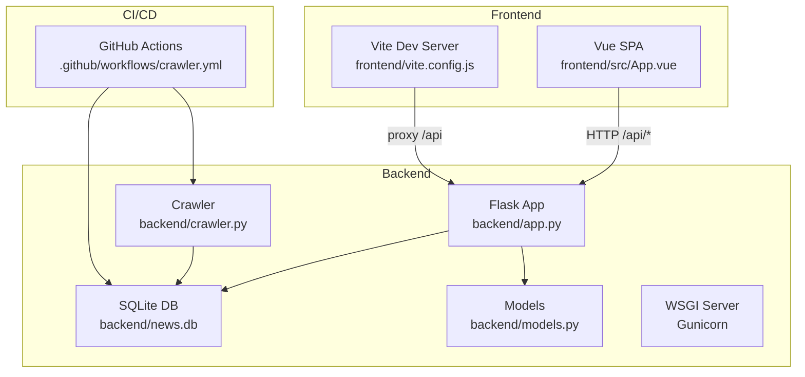
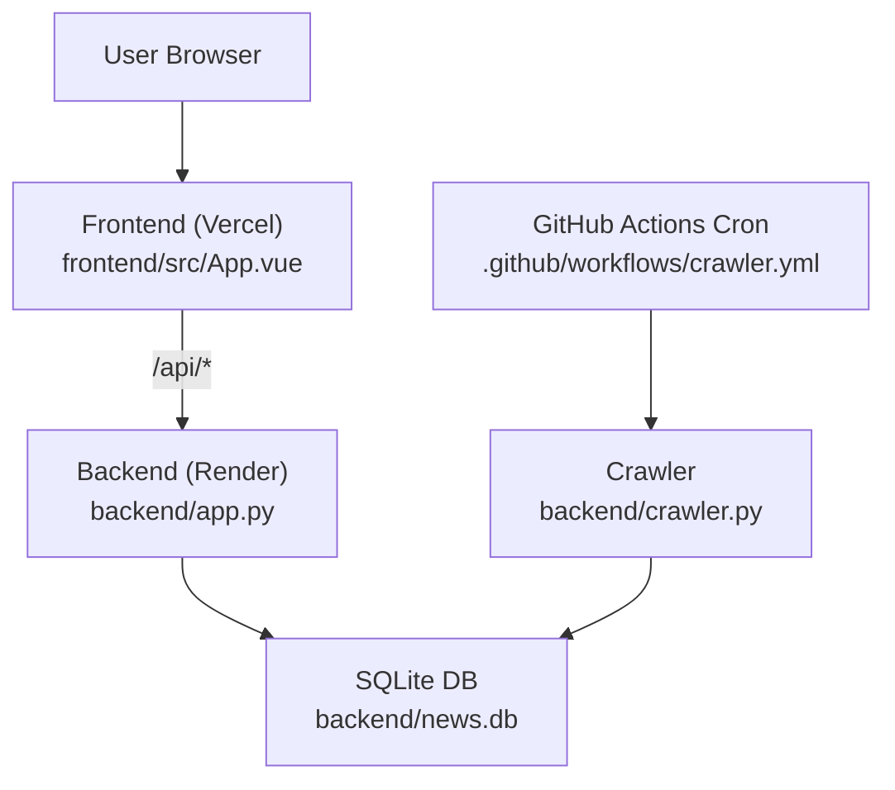
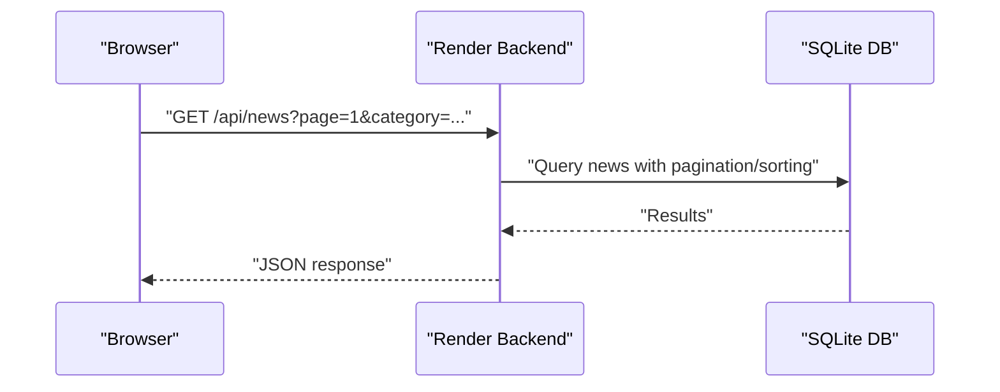
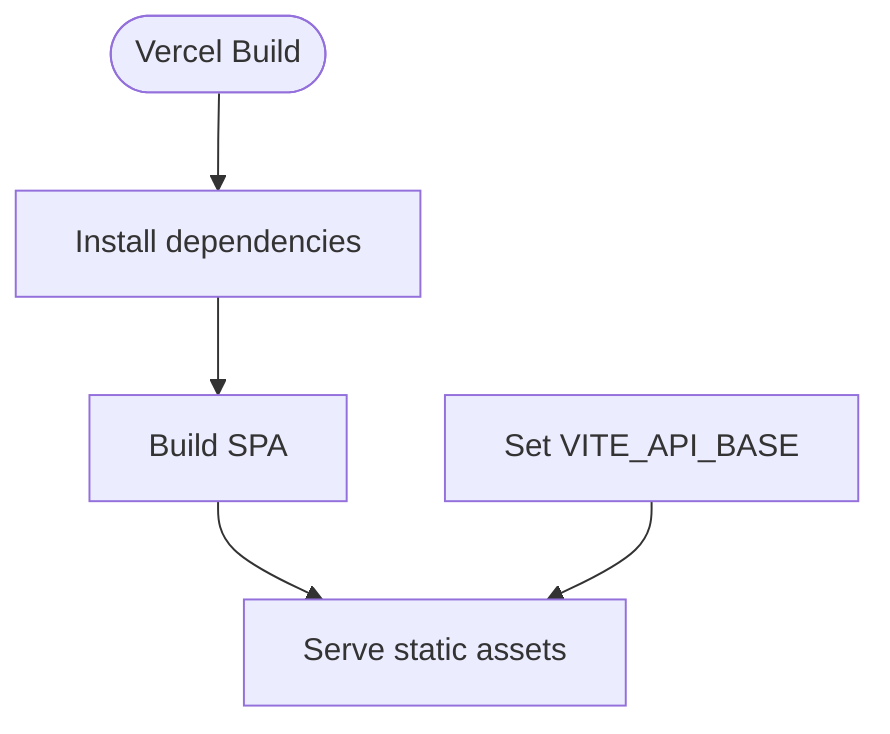
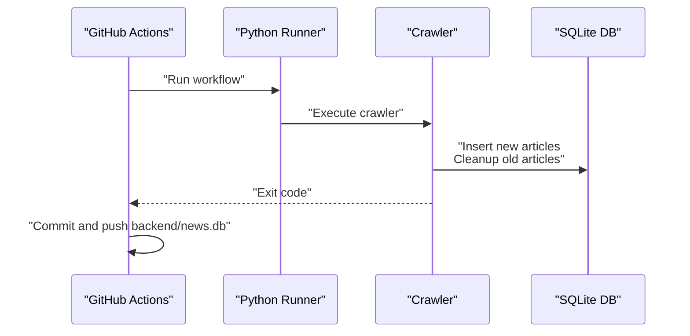
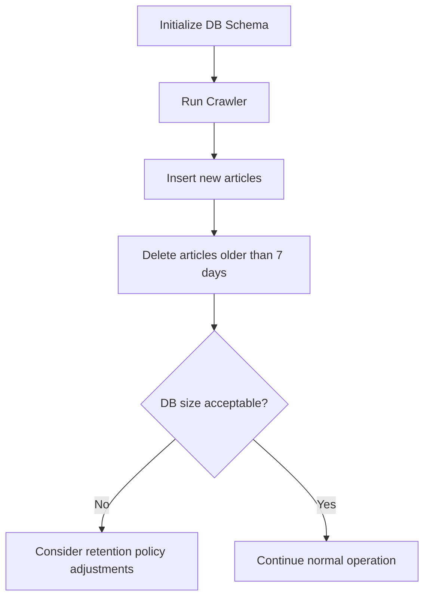
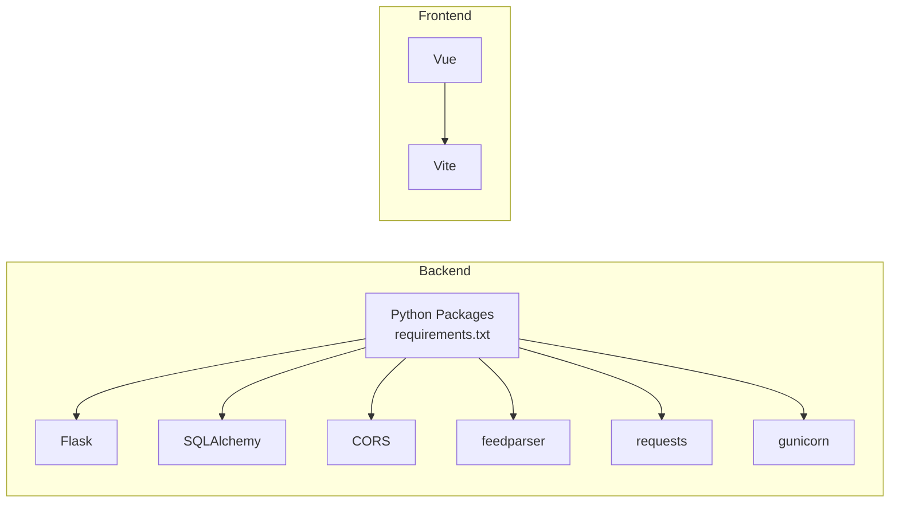

# Deployment and Operations

<cite>
**Referenced Files in This Document**
- [README.md](file://README.md)
- [.github/workflows/crawler.yml](file://.github/workflows/crawler.yml)
- [backend/app.py](file://backend/app.py)
- [backend/crawler.py](file://backend/crawler.py)
- [backend/models.py](file://backend/models.py)
- [backend/requirements.txt](file://backend/requirements.txt)
- [frontend/package.json](file://frontend/package.json)
- [frontend/vite.config.js](file://frontend/vite.config.js)
- [frontend/src/App.vue](file://frontend/src/App.vue)
- [frontend/index.html](file://frontend/index.html)
- [render.yaml](file://render.yaml)
- [vercel.json](file://vercel.json)
</cite>

## Update Summary
**Changes Made**
- Updated CI/CD pipeline from daily to hourly crawler scheduling
- Added Render platform deployment configuration with proper Python setup
- Added Vercel frontend deployment configuration
- Updated database cleanup period from 30 days to 7 days
- Enhanced deployment architecture documentation with platform-specific configurations

## Table of Contents
1. [Introduction](#introduction)
2. [Project Structure](#project-structure)
3. [Core Components](#core-components)
4. [Architecture Overview](#architecture-overview)
5. [Detailed Component Analysis](#detailed-component-analysis)
6. [Dependency Analysis](#dependency-analysis)
7. [Performance Considerations](#performance-considerations)
8. [Troubleshooting Guide](#troubleshooting-guide)
9. [Conclusion](#conclusion)
10. [Appendices](#appendices)

## Introduction
This document provides comprehensive deployment and operations guidance for the News Aggregator application. It covers production deployment strategies for backend and frontend, CI/CD automation via GitHub Actions with hourly scheduling, scheduled crawling, environment configuration, database setup, scaling considerations, monitoring and logging, performance optimization, maintenance, rollback and disaster recovery, security, SSL and CDN integration, and operational runbooks.

## Project Structure
The repository is organized into two primary parts:
- Backend: Flask API with SQLite persistence, RSS crawler, and Gunicorn WSGI server support
- Frontend: Vue 3 single-page application built with Vite, configured with a development proxy to the backend

Key characteristics:
- Backend uses a local SQLite database file stored under the backend directory
- Frontend is a static SPA that communicates with the backend via a configurable API base URL
- CI/CD automates hourly crawling and commits database updates to the repository

**Diagram sources**
- [backend/app.py:1-95](file://backend/app.py#L1-L95)
- [backend/crawler.py:1-321](file://backend/crawler.py#L1-L321)
- [backend/models.py:1-39](file://backend/models.py#L1-L39)
- [backend/requirements.txt:1-8](file://backend/requirements.txt#L1-L8)
- [frontend/vite.config.js:1-21](file://frontend/vite.config.js#L1-L21)
- [.github/workflows/crawler.yml:1-50](file://.github/workflows/crawler.yml#L1-L50)

**Section sources**
- [README.md:1-67](file://README.md#L1-L67)
- [backend/app.py:1-95](file://backend/app.py#L1-L95)
- [backend/crawler.py:1-321](file://backend/crawler.py#L1-L321)
- [backend/models.py:1-39](file://backend/models.py#L1-L39)
- [backend/requirements.txt:1-8](file://backend/requirements.txt#L1-L8)
- [frontend/vite.config.js:1-21](file://frontend/vite.config.js#L1-L21)
- [.github/workflows/crawler.yml:1-50](file://.github/workflows/crawler.yml#L1-L50)

## Core Components
- Backend API
  - Flask application exposing REST endpoints for news retrieval, categories, and health checks
  - SQLite-backed SQLAlchemy models for persisted news items
  - Gunicorn configured for production WSGI serving
- Crawler
  - RSS feed ingestion from curated sources, deduplication, hot scoring, and cleanup of old entries
  - Scheduled execution via GitHub Actions with hourly frequency
- Frontend
  - Vue 3 SPA with category filtering, sorting, pagination, and responsive UI
  - Development proxy to backend during local development
- CI/CD
  - Hourly cron job to run the crawler and commit database updates

Operational highlights:
- API endpoints include pagination, category filtering, and sorting
- Database is a local SQLite file managed by the backend process
- Frontend reads API base URL from environment variables for production deployments

**Section sources**
- [backend/app.py:21-75](file://backend/app.py#L21-L75)
- [backend/models.py:10-39](file://backend/models.py#L10-L39)
- [backend/requirements.txt:6-6](file://backend/requirements.txt#L6-L6)
- [frontend/src/App.vue:119-146](file://frontend/src/App.vue#L119-L146)
- [.github/workflows/crawler.yml:3-7](file://.github/workflows/crawler.yml#L3-L7)

## Architecture Overview
The system follows a classic client-server pattern:
- Frontend (Vue SPA) serves static assets and makes HTTP requests to the backend API
- Backend exposes REST endpoints backed by a local SQLite database
- GitHub Actions periodically triggers the crawler to populate/update the database
- Production deployments target Render (backend) and Vercel (frontend)

**Diagram sources**
- [frontend/src/App.vue:119-146](file://frontend/src/App.vue#L119-L146)
- [backend/app.py:21-75](file://backend/app.py#L21-L75)
- [backend/crawler.py:180-212](file://backend/crawler.py#L180-L212)
- [.github/workflows/crawler.yml:3-7](file://.github/workflows/crawler.yml#L3-L7)

## Detailed Component Analysis

### Backend API Deployment (Render)
- Platform: Render (free tier)
- Runtime: Python with Gunicorn as WSGI server
- Database: SQLite file under backend directory
- Environment
  - No explicit environment variables are used in the backend; the database path is derived from the backend directory
  - Ensure the deployed environment persists the backend directory across redeployments
- Port and entrypoint
  - The backend listens on port 5001 and binds to 0.0.0.0
  - Configure Render to use Gunicorn to serve the Flask app
- Static assets
  - The backend does not serve frontend static assets; Render should host the frontend on a separate service
- Health checks
  - Use the /api/health endpoint for liveness/readiness probes

**Diagram sources**
- [backend/app.py:21-55](file://backend/app.py#L21-L55)
- [backend/models.py:10-39](file://backend/models.py#L10-L39)

**Section sources**
- [backend/app.py:12-18](file://backend/app.py#L12-L18)
- [backend/app.py:84-87](file://backend/app.py#L84-L87)
- [backend/requirements.txt:6-6](file://backend/requirements.txt#L6-L6)
- [README.md:49-53](file://README.md#L49-L53)

### Frontend Deployment (Vercel)
- Platform: Vercel (free tier)
- Build command: Use the frontend package scripts to build the SPA
- Output directory: Build artifacts from the frontend
- Environment variables
  - Configure VITE_API_BASE to point to the backend API base URL in production
- Proxy behavior
  - During development, Vite proxies /api to http://localhost:5001; in production, Vercel serves static assets and the API base URL must be set appropriately

**Diagram sources**
- [frontend/package.json:6-10](file://frontend/package.json#L6-L10)
- [frontend/vite.config.js:7-15](file://frontend/vite.config.js#L7-L15)
- [frontend/src/App.vue:119-120](file://frontend/src/App.vue#L119-L120)

**Section sources**
- [frontend/package.json:6-10](file://frontend/package.json#L6-L10)
- [frontend/vite.config.js:7-15](file://frontend/vite.config.js#L7-L15)
- [frontend/src/App.vue:119-120](file://frontend/src/App.vue#L119-L120)
- [README.md:49-53](file://README.md#L49-L53)

### CI/CD Pipeline (GitHub Actions)
- Schedule: Hourly at minute 0 (0 * * * *)
- Steps:
  - Checkout repository
  - Setup Python 3.11
  - Install backend dependencies
  - Run crawler
  - Commit and push the updated SQLite database file
- Notes:
  - The workflow commits backend/news.db; ensure repository permissions and secrets are configured for pushing
  - The crawler cleans up old entries and calculates hot scores

**Diagram sources**
- [.github/workflows/crawler.yml:13-39](file://.github/workflows/crawler.yml#L13-L39)
- [backend/crawler.py:180-212](file://backend/crawler.py#L180-L212)

**Section sources**
- [.github/workflows/crawler.yml:1-50](file://.github/workflows/crawler.yml#L1-L50)
- [backend/crawler.py:180-212](file://backend/crawler.py#L180-L212)

### Database Setup and Management
- Storage: SQLite database file located at backend/news.db
- Initialization
  - The backend initializes the schema when run locally
  - In production, ensure the database file persists across deploys
- Maintenance
  - The crawler periodically removes articles older than 7 days
  - Monitor database size growth and adjust cleanup policies if needed

**Diagram sources**
- [backend/app.py:77-82](file://backend/app.py#L77-L82)
- [backend/crawler.py:170-178](file://backend/crawler.py#L170-L178)

**Section sources**
- [backend/app.py:12-18](file://backend/app.py#L12-L18)
- [backend/app.py:77-82](file://backend/app.py#L77-L82)
- [backend/crawler.py:170-178](file://backend/crawler.py#L170-L178)

### Scaling Considerations
- Current state: Single-instance backend with a local SQLite database
- Limitations:
  - SQLite is not ideal for concurrent writes at scale
  - Vertical scaling of the Render instance may help with CPU/memory
- Recommended near-term improvements:
  - Migrate to a managed database (e.g., PostgreSQL-compatible service) for horizontal scaling and improved concurrency
  - Introduce read replicas and caching (e.g., Redis) for hot queries
  - Split frontend and backend into separate services with independent scaling policies

### Monitoring and Logging
- Health endpoint
  - Use /api/health for basic service health checks
- Logging
  - Backend prints crawler logs to stdout/stderr; capture via platform logs
  - Frontend errors are surfaced to the UI; consider integrating client-side error reporting
- Metrics
  - Track API latency, error rates, and database row counts
  - Monitor crawler runtime and article ingestion volume

**Section sources**
- [backend/app.py:71-75](file://backend/app.py#L71-L75)
- [backend/crawler.py:180-212](file://backend/crawler.py#L180-L212)
- [frontend/src/App.vue:140-146](file://frontend/src/App.vue#L140-L146)

### Performance Optimization Techniques
- API
  - Add pagination and limit per_page to reduce payload sizes
  - Consider adding database indexes on frequently queried columns (e.g., published, category)
- Frontend
  - Lazy-load components and images
  - Enable compression and caching headers via CDN
- Crawler
  - Respect robots.txt and rate limits; stagger requests
  - Use connection pooling and timeouts to improve reliability

**Section sources**
- [backend/app.py:21-55](file://backend/app.py#L21-L55)
- [backend/crawler.py:88-136](file://backend/crawler.py#L88-L136)

### Maintenance Procedures
- Routine tasks
  - Review crawler logs for failures and adjust RSS sources as needed
  - Monitor database growth and tune cleanup intervals
- Dependency updates
  - Periodically update backend dependencies and test compatibility
  - Update frontend dependencies and rebuild before deploying

**Section sources**
- [.github/workflows/crawler.yml:23-27](file://.github/workflows/crawler.yml#L23-L27)
- [backend/requirements.txt:1-8](file://backend/requirements.txt#L1-L8)

### Rollback and Disaster Recovery
- Rollback
  - Re-deploy previous backend and frontend releases
  - If using Git-based deployments, roll back to the last known good commit
- Backup strategy
  - Back up backend/news.db regularly and store offsite
  - Store backups encrypted and versioned
- Disaster recovery
  - Recreate database from backup and re-run crawler to repopulate recent articles
  - Validate API health and frontend rendering after restoration

**Section sources**
- [.github/workflows/crawler.yml:33-39](file://.github/workflows/crawler.yml#L33-L39)
- [backend/crawler.py:170-178](file://backend/crawler.py#L170-L178)

### Security Considerations
- CORS
  - The backend enables CORS globally; restrict origins in production if needed
- Secrets
  - Do not commit sensitive data; use platform-managed secrets for any future integrations
- Transport
  - Ensure HTTPS termination at the platform level (Render/Vercel)
- Input validation
  - Sanitize RSS content and enforce safe defaults for summaries and titles

**Section sources**
- [backend/app.py:10-10](file://backend/app.py#L10-L10)
- [backend/crawler.py:76-86](file://backend/crawler.py#L76-L86)

### SSL Certificate Management and CDN Integration
- SSL/TLS
  - Rely on platform-provided certificates for Render and Vercel
- CDN
  - Use Vercel's global CDN for frontend assets
  - For backend, consider a CDN in front of the API if traffic increases
- Mixed content
  - Ensure API_BASE points to HTTPS in production

**Section sources**
- [frontend/src/App.vue:119-120](file://frontend/src/App.vue#L119-L120)
- [README.md:49-53](file://README.md#L49-L53)

## Dependency Analysis
The backend depends on Flask, SQLAlchemy, CORS, feedparser, requests, and gunicorn. The frontend depends on Vue and Vite. The CI/CD workflow depends on GitHub-hosted runners and Python.

**Diagram sources**
- [backend/requirements.txt:1-8](file://backend/requirements.txt#L1-L8)
- [frontend/package.json:11-18](file://frontend/package.json#L11-L18)

**Section sources**
- [backend/requirements.txt:1-8](file://backend/requirements.txt#L1-L8)
- [frontend/package.json:11-18](file://frontend/package.json#L11-L18)

## Performance Considerations
- Database
  - Consider indexing on category and published for faster queries
  - Evaluate migration to a managed database for concurrency
- API
  - Add caching for popular endpoints and implement pagination limits
- Frontend
  - Enable compression and leverage CDN caching
- Crawler
  - Monitor network timeouts and retry logic; avoid overloading external feeds

## Troubleshooting Guide
- Backend not responding
  - Verify /api/health endpoint
  - Check Render logs for startup errors
- Frontend cannot load data
  - Confirm VITE_API_BASE is set to the backend base URL
  - Inspect browser network tab for failed API calls
- Crawler failures
  - Review GitHub Actions logs for network or parsing errors
  - Validate RSS feed URLs and headers
- Database issues
  - Ensure backend/news.db is writable and not corrupted
  - Restart backend to reinitialize schema if needed

**Section sources**
- [backend/app.py:71-75](file://backend/app.py#L71-L75)
- [frontend/src/App.vue:119-120](file://frontend/src/App.vue#L119-L120)
- [.github/workflows/crawler.yml:23-31](file://.github/workflows/crawler.yml#L23-L31)
- [backend/app.py:77-82](file://backend/app.py#L77-L82)

## Conclusion
The News Aggregator is designed for simplicity and cost-effectiveness using free-tier platforms. Its deployment relies on Render for the backend, Vercel for the frontend, and GitHub Actions for hourly crawling. Operational excellence requires careful attention to database persistence, environment configuration, monitoring, and incremental improvements such as managed databases and CDN caching.

## Appendices

### API Reference
- GET /api/news
  - Query parameters: category, sort, page
  - Returns paginated news list
- GET /api/news/:id
  - Returns a single news item
- GET /api/categories
  - Returns available categories
- GET /api/health
  - Returns service health status

**Section sources**
- [backend/app.py:21-69](file://backend/app.py#L21-L69)

### Environment Variables
- VITE_API_BASE
  - Purpose: Base URL for API calls in production
  - Example: https://your-backend.onrender.com
- Optional backend environment variables
  - None currently used; consider adding for database URL or feature flags if extended

**Section sources**
- [frontend/src/App.vue:119-120](file://frontend/src/App.vue#L119-L120)

### CI/CD Configuration Highlights
- Schedule: 0 * * * * (hourly at minute 0)
- Job steps:
  - Python setup
  - Install backend dependencies
  - Run crawler
  - Commit and push backend/news.db

**Section sources**
- [.github/workflows/crawler.yml:3-7](file://.github/workflows/crawler.yml#L3-L7)
- [.github/workflows/crawler.yml:23-39](file://.github/workflows/crawler.yml#L23-L39)

### Platform Configuration Files
- Render Configuration (render.yaml)
  - Service type: web
  - Environment: Python
  - Region: Singapore
  - Plan: Free
  - Build command: cd backend && pip install -r requirements.txt
  - Start command: cd backend && gunicorn app:app --host 0.0.0.0 --port $PORT
  - Health check: /api/health
  - Environment variables: PYTHON_VERSION=3.11.0

**Section sources**
- [render.yaml:1-13](file://render.yaml#L1-L13)

- Vercel Configuration (vercel.json)
  - Build command: npm install && npm run build
  - Output directory: dist
  - Framework: null
  - Rewrites: Single-page application routing to index.html

**Section sources**
- [vercel.json:1-9](file://vercel.json#L1-L9)