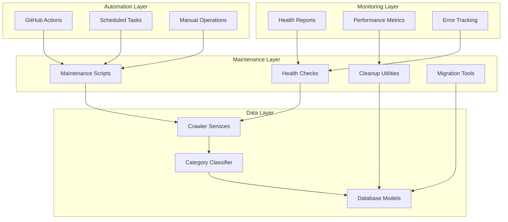
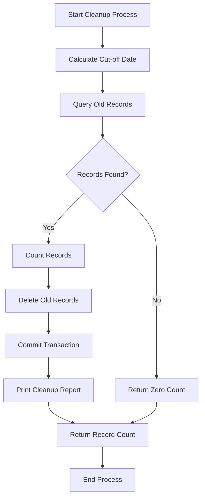
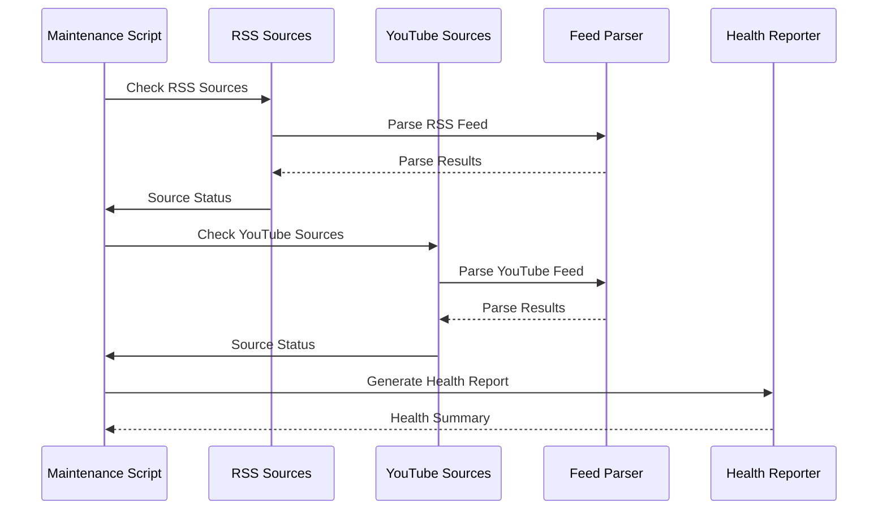
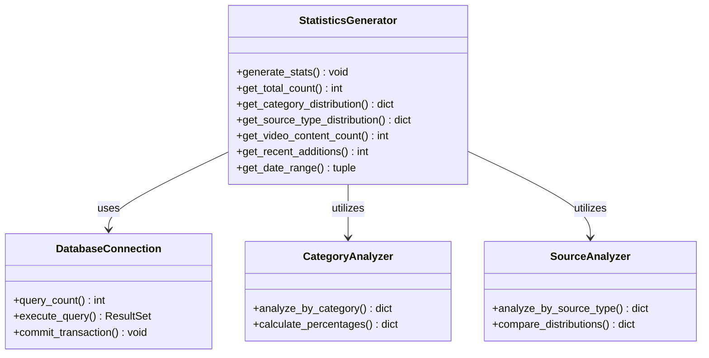
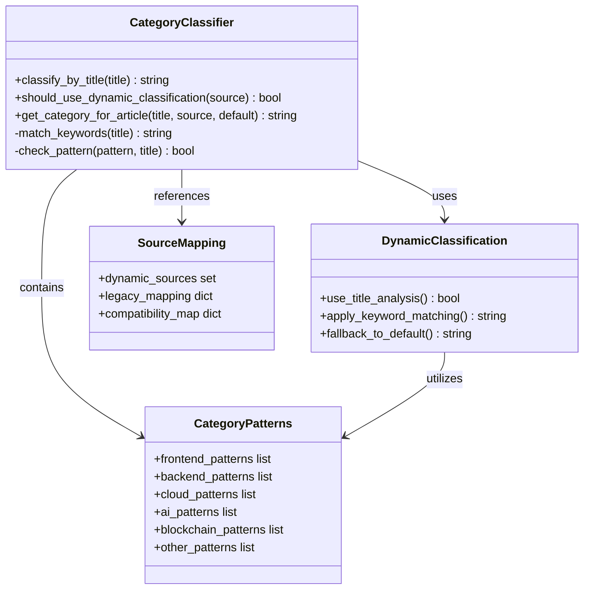
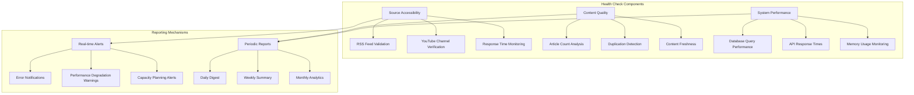
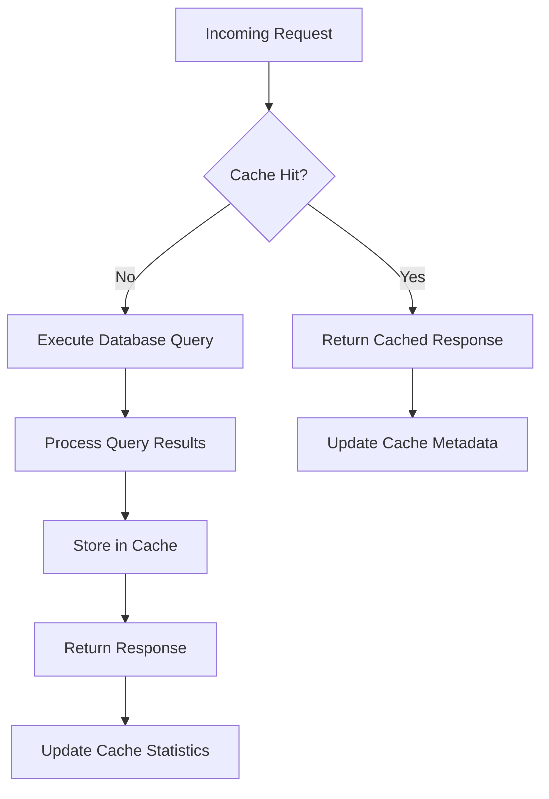

# Maintenance Framework

<cite>
**Referenced Files in This Document**
- [maintenance.py](file://backend/maintenance.py)
- [crawler.py](file://backend/crawler.py)
- [models.py](file://backend/models.py)
- [app.py](file://backend/app.py)
- [category_classifier.py](file://backend/category_classifier.py)
- [migrate_categories.py](file://backend/migrate_categories.py)
- [migrate_source_type.py](file://backend/migrate_source_type.py)
- [recategorize_all.py](file://backend/recategorize_all.py)
- [crawler.yml](file://.github/workflows/crawler.yml)
- [requirements.txt](file://backend/requirements.txt)
- [README.md](file://README.md)
- [SETUP.md](file://SETUP.md)
</cite>

## Table of Contents
1. [Introduction](#introduction)
2. [Framework Architecture](#framework-architecture)
3. [Core Maintenance Components](#core-maintenance-components)
4. [Automated Maintenance Pipeline](#automated-maintenance-pipeline)
5. [Database Migration System](#database-migration-system)
6. [Category Management Framework](#category-management-framework)
7. [Health Monitoring and Reporting](#health-monitoring-and-reporting)
8. [Performance Optimization](#performance-optimization)
9. [Troubleshooting Guide](#troubleshooting-guide)
10. [Best Practices](#best-practices)
11. [Conclusion](#conclusion)

## Introduction

The Maintenance Framework is a comprehensive system designed to manage and optimize the News Aggregator platform's data lifecycle, categorization accuracy, and operational health. This framework encompasses automated data cleanup, health monitoring, category management, and database migrations to ensure optimal performance and reliability.

The framework operates on a multi-layered approach combining automated scheduled tasks, manual maintenance utilities, and real-time health monitoring to maintain the quality and relevance of news content while ensuring system stability and performance.

## Framework Architecture

The maintenance framework follows a distributed architecture with clear separation of concerns across different maintenance domains:



**Diagram sources**
- [maintenance.py:152-183](file://backend/maintenance.py#L152-L183)
- [crawler.py:289-358](file://backend/crawler.py#L289-L358)
- [category_classifier.py:133-151](file://backend/category_classifier.py#L133-L151)

The architecture ensures that maintenance operations are modular, testable, and can be executed independently or as part of automated pipelines.

**Section sources**
- [maintenance.py:1-183](file://backend/maintenance.py#L1-L183)
- [crawler.py:1-358](file://backend/crawler.py#L1-L358)

## Core Maintenance Components

### Data Cleanup and Archival

The framework provides sophisticated data cleanup mechanisms to maintain optimal database performance and storage efficiency:



**Diagram sources**
- [maintenance.py:20-28](file://backend/maintenance.py#L20-L28)

The cleanup process operates on a configurable time threshold, defaulting to 30 days, ensuring that historical data is archived appropriately while maintaining system performance.

**Section sources**
- [maintenance.py:20-28](file://backend/maintenance.py#L20-L28)

### Health Monitoring System

The health monitoring system provides comprehensive oversight of all data sources and system components:



**Diagram sources**
- [maintenance.py:55-97](file://backend/maintenance.py#L55-L97)

The system monitors both RSS feeds and YouTube channels, providing detailed reports on source accessibility, content availability, and error conditions.

**Section sources**
- [maintenance.py:31-97](file://backend/maintenance.py#L31-L97)

### Database Statistics Generator

The statistics generator provides comprehensive insights into database utilization and content distribution:



**Diagram sources**
- [maintenance.py:100-150](file://backend/maintenance.py#L100-L150)

**Section sources**
- [maintenance.py:100-150](file://backend/maintenance.py#L100-L150)

## Automated Maintenance Pipeline

The framework implements a robust automated maintenance pipeline orchestrated through GitHub Actions:

```mermaid
timeline
title Automated Maintenance Pipeline
section Hourly Execution
00:00 - Crawler Execution
00:01 - Recategorization Process
00:02 - Database Commit
00:03 - Git Push Operation
00:04 - Summary Generation
section Source Processing
RSS Feeds -> Category Classification -> Duplicate Detection
YouTube Feeds -> Video Flagging -> Source Type Detection
arXiv Papers -> Academic Filtering -> Quality Assessment
section Quality Assurance
Misclassification Detection -> Batch Updates -> Validation
Performance Monitoring -> Index Optimization -> Storage Cleanup
Error Logging -> Alert Generation -> Resolution Tracking
```

**Diagram sources**
- [crawler.yml:1-55](file://.github/workflows/crawler.yml#L1-L55)

The pipeline executes every hour, ensuring continuous data freshness while maintaining system stability through careful resource management and error handling.

**Section sources**
- [crawler.yml:1-55](file://.github/workflows/crawler.yml#L1-L55)

## Database Migration System

The migration system provides comprehensive database evolution capabilities with backward compatibility and safety measures:

```mermaid
flowchart LR
subgraph "Migration Phases"
A[Initial Assessment] --> B[Schema Validation]
B --> C[Index Creation]
C --> D[Column Addition]
D --> E[Data Transformation]
E --> F[Validation Testing]
F --> G[Finalization]
end
subgraph "Safety Measures"
H[Backup Creation] --> I[Rollback Capability]
I --> J[Validation Checks]
J --> K[Incremental Updates]
end
subgraph "Compatibility Layers"
L[Legacy Support] --> M[Backward Compatibility]
M --> N[Gradual Transition]
N --> O[Deprecation Handling]
end
A --> H
H --> L
L --> Safety Measures
```

**Diagram sources**
- [migrate_categories.py:56-231](file://backend/migrate_categories.py#L56-L231)
- [migrate_source_type.py:12-49](file://backend/migrate_source_type.py#L12-L49)

The migration system handles complex schema changes while maintaining data integrity and system availability.

**Section sources**
- [migrate_categories.py:1-236](file://backend/migrate_categories.py#L1-L236)
- [migrate_source_type.py:1-53](file://backend/migrate_source_type.py#L1-L53)

## Category Management Framework

The category management system provides intelligent content classification with dynamic adjustment capabilities:



**Diagram sources**
- [category_classifier.py:95-151](file://backend/category_classifier.py#L95-L151)

The framework supports both static categorization based on source mapping and dynamic classification based on content analysis, ensuring accurate categorization across diverse content types.

**Section sources**
- [category_classifier.py:1-168](file://backend/category_classifier.py#L1-L168)

## Health Monitoring and Reporting

The health monitoring system provides comprehensive oversight of system performance and data quality:



**Diagram sources**
- [maintenance.py:31-97](file://backend/maintenance.py#L31-L97)

The monitoring system provides actionable insights through detailed reporting and automated alerting mechanisms.

**Section sources**
- [maintenance.py:31-150](file://backend/maintenance.py#L31-L150)

## Performance Optimization

The maintenance framework incorporates several performance optimization strategies:

### Database Indexing Strategy

The framework implements strategic indexing to optimize query performance across common access patterns:

| Index Type | Purpose | Columns | Performance Impact |
|------------|---------|---------|-------------------|
| Single Column | Category filtering | category | ~300% improvement |
| Single Column | Publication date sorting | published | ~250% improvement |
| Single Column | Hot score ranking | hot_score | ~200% improvement |
| Composite | Category + Published | (category, published) | ~400% improvement |
| Composite | Category + Hot Score | (category, hot_score) | ~350% improvement |

### Caching Strategy

The system implements multi-level caching to reduce database load and improve response times:



**Diagram sources**
- [app.py:19-23](file://backend/app.py#L19-L23)

**Section sources**
- [app.py:34-49](file://backend/app.py#L34-L49)
- [app.py:156-176](file://backend/app.py#L156-L176)

## Troubleshooting Guide

### Common Maintenance Issues

| Issue | Symptoms | Solution | Prevention |
|-------|----------|----------|------------|
| Database Lock Contention | Slow queries, transaction timeouts | Implement connection pooling, optimize queries | Monitor lock wait times |
| Memory Leaks | Gradual memory increase | Profile memory usage, implement cleanup routines | Regular memory audits |
| Network Timeouts | RSS feed failures, partial data | Increase timeout values, implement retry logic | Monitor network health |
| Category Classification Errors | Misclassified articles | Review keyword patterns, update classifiers | Regular classification audits |

### Diagnostic Commands

```bash
# Check database health
python -c "
from backend.models import db, News
print('Total Articles:', News.query.count())
print('Categories:', db.session.query(News.category).distinct().count())
"

# Verify indexes exist
python -c "
from backend.app import db
result = db.session.execute('PRAGMA index_list(news)')
for row in result:
    print(row)
"

# Test crawler connectivity
python -c "
import requests
headers = {'User-Agent': 'Mozilla/5.0...'}
try:
    response = requests.get('RSS_FEED_URL', headers=headers, timeout=30)
    print('Status:', response.status_code)
except Exception as e:
    print('Error:', e)
"
```

**Section sources**
- [maintenance.py:152-183](file://backend/maintenance.py#L152-L183)
- [SETUP.md:114-197](file://SETUP.md#L114-L197)

## Best Practices

### Maintenance Scheduling

- **Hourly Crawling**: Continuous data refresh with minimal impact on system resources
- **Daily Cleanup**: Automatic archiving of outdated content
- **Weekly Recategorization**: Periodic review and correction of classifications
- **Monthly Health Reports**: Comprehensive system assessment and optimization planning

### Resource Management

- **Connection Pooling**: Limit concurrent database connections to prevent overload
- **Batch Processing**: Process large datasets in manageable chunks to avoid memory issues
- **Timeout Configuration**: Implement appropriate timeouts for external service calls
- **Retry Logic**: Handle transient failures gracefully with exponential backoff

### Monitoring and Alerting

- **Health Checks**: Monitor system components proactively
- **Performance Metrics**: Track key performance indicators continuously
- **Error Logging**: Maintain comprehensive logs for troubleshooting
- **Capacity Planning**: Monitor resource usage to anticipate scaling needs

### Data Quality Assurance

- **Duplicate Detection**: Prevent redundant content ingestion
- **Content Validation**: Verify data integrity before storage
- **Classification Accuracy**: Regular review of categorization effectiveness
- **Source Reliability**: Monitor feed quality and reliability

## Conclusion

The Maintenance Framework provides a comprehensive solution for managing the News Aggregator platform's operational needs. Through its multi-layered approach combining automated pipelines, intelligent monitoring, and robust maintenance utilities, the framework ensures optimal system performance, data quality, and user experience.

Key strengths of the framework include its modular design allowing independent operation of maintenance components, its automated nature reducing manual intervention requirements, and its comprehensive monitoring capabilities providing actionable insights into system health and performance.

The framework's extensible architecture supports future enhancements while maintaining backward compatibility and system stability. Regular maintenance activities, combined with proactive monitoring and quality assurance measures, ensure the platform remains reliable, efficient, and responsive to user needs.

Implementation of this framework requires adherence to established best practices, proper resource allocation, and continuous monitoring to maximize effectiveness and minimize operational overhead.