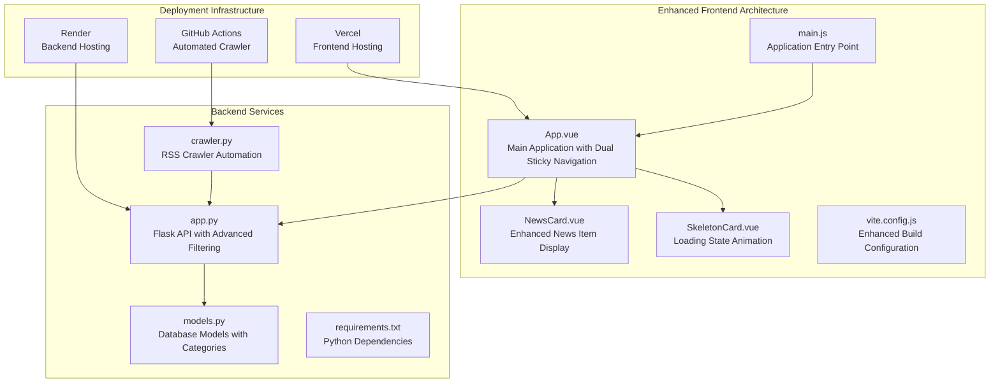
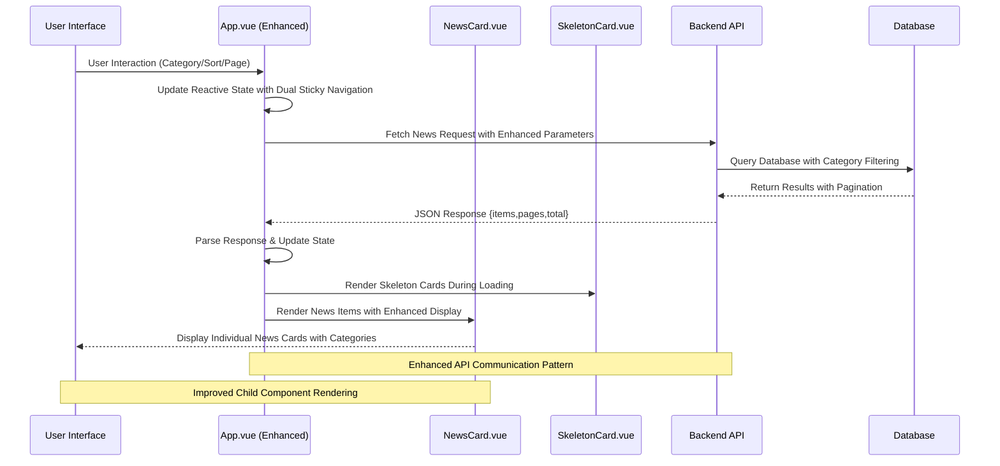
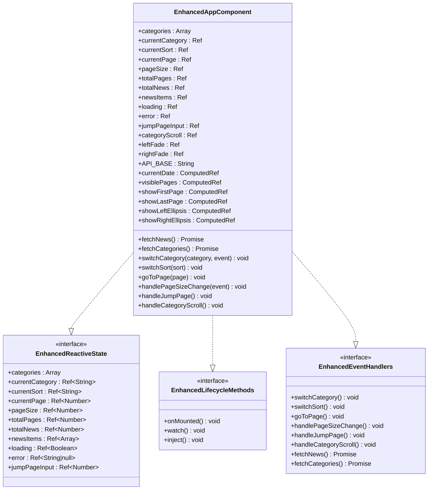
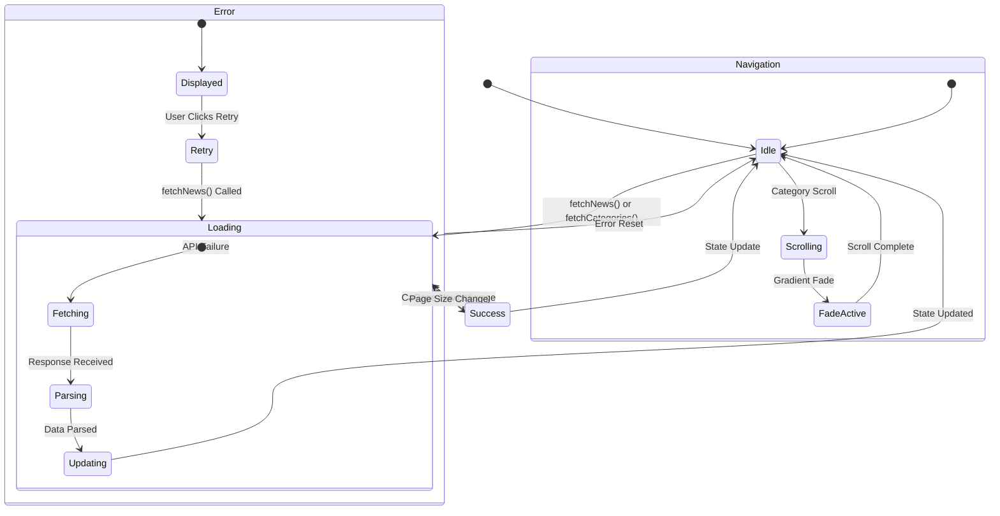
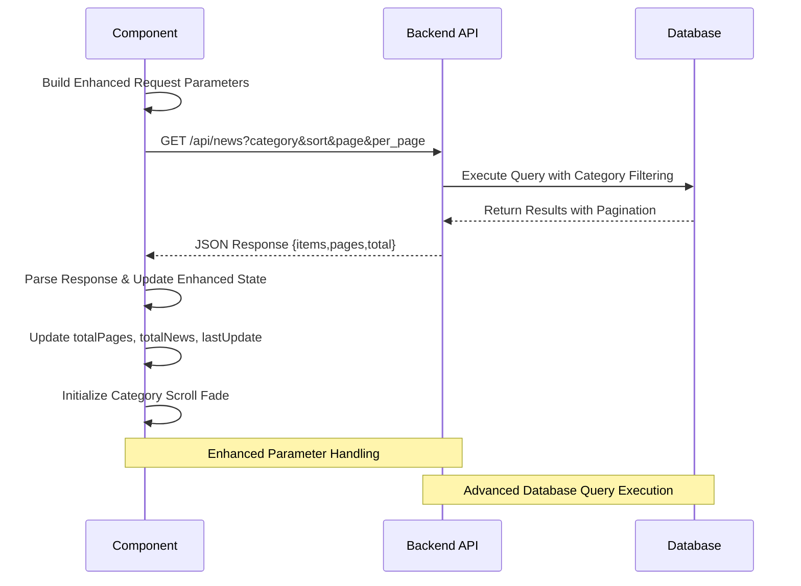
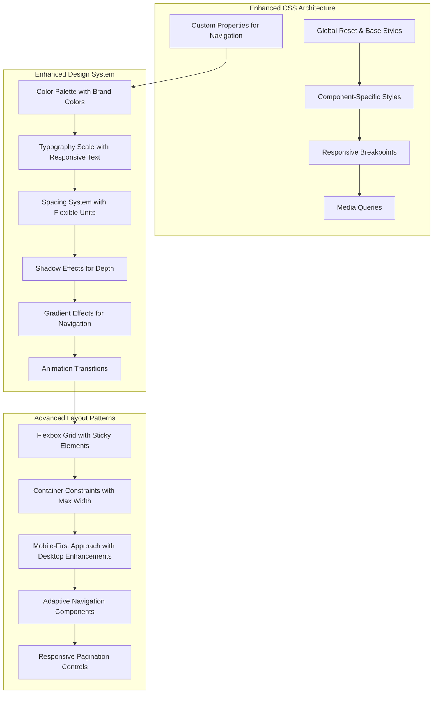
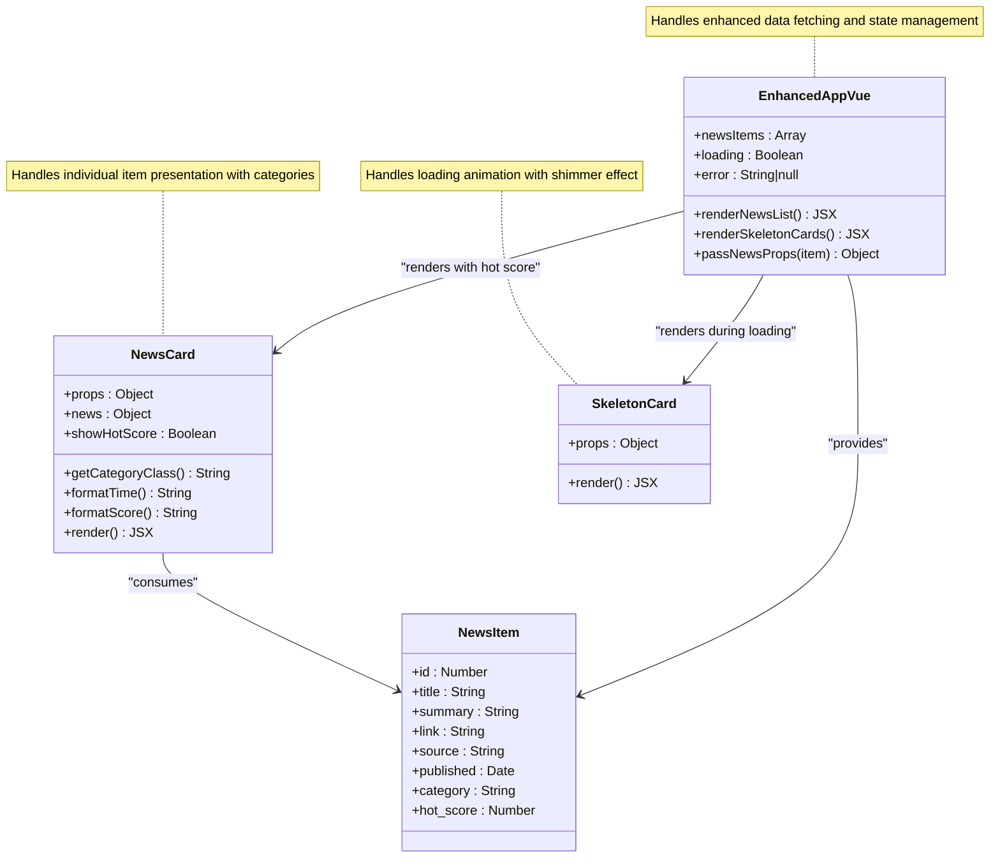

# App Component

<cite>
**Referenced Files in This Document**
- [App.vue](file://frontend/src/App.vue)
- [NewsCard.vue](file://frontend/src/components/NewsCard.vue)
- [SkeletonCard.vue](file://frontend/src/components/SkeletonCard.vue)
- [main.js](file://frontend/src/main.js)
- [package.json](file://frontend/package.json)
- [vite.config.js](file://frontend/vite.config.js)
- [app.py](file://backend/app.py)
- [models.py](file://backend/models.py)
- [README.md](file://README.md)
</cite>

## Update Summary
**Changes Made**
- Added comprehensive documentation for new sticky header navigation system
- Documented horizontal category scrolling with gradient fade effects
- Added detailed coverage of responsive pagination controls with ellipsis handling
- Enhanced error state management documentation with real-time error handling
- Documented improved loading states with skeleton card implementation
- Updated component architecture to reflect new dual-sticky navigation system
- Added documentation for advanced pagination algorithms and user experience improvements

## Table of Contents
1. [Introduction](#introduction)
2. [Project Structure](#project-structure)
3. [Core Components](#core-components)
4. [Architecture Overview](#architecture-overview)
5. [Detailed Component Analysis](#detailed-component-analysis)
6. [Enhanced Navigation System](#enhanced-navigation-system)
7. [Advanced Pagination Implementation](#advanced-pagination-implementation)
8. [Improved Loading and Error States](#improved-loading-and-error-states)
9. [Dependency Analysis](#dependency-analysis)
10. [Performance Considerations](#performance-considerations)
11. [Troubleshooting Guide](#troubleshooting-guide)
12. [Conclusion](#conclusion)
13. [Appendices](#appendices)

## Introduction
This document provides comprehensive documentation for the main App.vue component, a Vue 3 application that aggregates news articles for specialized technical communities including Programmer Circle, AI Circle, and other technology-focused circles. The component implements a modern, responsive interface with advanced navigation features, sophisticated pagination controls, and enhanced user experience elements.

The application follows a client-server architecture where the frontend (Vue 3 SPA) communicates with a backend API built with Flask and SQLite. The App.vue component serves as the primary orchestrator, managing user interactions, API communication, and state synchronization across the interface. Recent enhancements include a dual-sticky navigation system, horizontal category scrolling with gradient fade effects, and sophisticated pagination controls with ellipsis handling.

## Project Structure
The project follows a clear separation of concerns with distinct frontend and backend directories. The frontend utilizes Vite for development and build processes, while the backend provides a RESTful API for news data management. The enhanced architecture now includes advanced UI components and sophisticated state management.



**Diagram sources**
- [App.vue:1-588](file://frontend/src/App.vue#L1-L588)
- [NewsCard.vue:1-143](file://frontend/src/components/NewsCard.vue#L1-L143)
- [SkeletonCard.vue:1-34](file://frontend/src/components/SkeletonCard.vue#L1-L34)
- [main.js:1-5](file://frontend/src/main.js#L1-L5)
- [app.py:1-95](file://backend/app.py#L1-L95)
- [models.py:1-39](file://backend/models.py#L1-L39)

**Section sources**
- [README.md:1-67](file://README.md#L1-L67)
- [package.json:1-20](file://frontend/package.json#L1-L20)

## Core Components
The App.vue component serves as the central hub for news aggregation, implementing a comprehensive solution that handles user interactions, data fetching, and state management. The component leverages Vue 3's Composition API to create a reactive, maintainable interface with advanced navigation features.

Key responsibilities include:
- Managing application-wide state for categories, sorting preferences, pagination, and loading states
- Orchestrating API communication with the backend news service
- Coordinating with child components for news item rendering
- Implementing responsive design patterns for cross-device compatibility
- Handling error states and providing user feedback mechanisms
- **NEW**: Managing dual-sticky navigation system with category scrolling and gradient fade effects
- **NEW**: Implementing sophisticated pagination controls with ellipsis handling and responsive design
- **NEW**: Providing real-time error state management with automatic retry capabilities

The component maintains a clean separation between presentation logic and business logic, promoting reusability and testability. Its modular design allows for easy extension and maintenance as requirements evolve, particularly with the new navigation and pagination enhancements.

**Section sources**
- [App.vue:288-574](file://frontend/src/App.vue#L288-L574)

## Architecture Overview
The application follows a client-server architecture pattern with clear boundaries between frontend and backend responsibilities. The App.vue component acts as the primary client-side controller, managing user interactions and coordinating data flow between the UI and backend services.



**Diagram sources**
- [App.vue:400-426](file://frontend/src/App.vue#L400-L426)
- [app.py:21-59](file://backend/app.py#L21-L59)
- [NewsCard.vue:1-143](file://frontend/src/components/NewsCard.vue#L1-L143)
- [SkeletonCard.vue:1-34](file://frontend/src/components/SkeletonCard.vue#L1-L34)

The architecture emphasizes loose coupling between components, enabling independent development and testing. The App.vue component maintains minimal knowledge of the backend implementation details, communicating solely through well-defined API endpoints with enhanced parameter handling.

## Detailed Component Analysis

### Enhanced Template Layout Structure
The App.vue template implements a sophisticated layout with dual-sticky navigation, advanced category management, and responsive pagination controls. The layout employs a mobile-first responsive design approach with enhanced user experience elements.

```mermaid
flowchart TD
A[Enhanced App Container] --> B[Sticky Header Navigation]
A --> C[Sticky Controls Bar]
A --> D[Main Content Area]
A --> E[Bottom Sticky Pagination Bar]
D --> F[Loading Skeleton Cards]
D --> G[Error State Display]
D --> H[Empty State Display]
D --> I[News Grid with Responsive Layout]
I --> J[NewsCard Components]
subgraph "Dual Sticky Header System"
B1[Logo & Branding]
B2[Current Date Display]
B3[Sticky Positioning (top: 0)]
end
subgraph "Category Navigation"
C1[Horizontal Scroll Container]
C2[Gradient Fade Effects]
C3[Auto-scroll to Active Category]
C4[Responsive Category Tabs]
end
subgraph "Advanced Pagination"
E1[Ellipsis Handling]
E2[Page Size Selection]
E3[Jump to Page Input]
E4[Total Count Display]
end
subgraph "Loading States"
F1[Skeleton Card Grid]
F2[6 Animated Cards]
F3[Shimmer Effect]
end
```

**Diagram sources**
- [App.vue:1-286](file://frontend/src/App.vue#L1-L286)

The layout architecture now includes sophisticated navigation elements with sticky positioning, horizontal scrolling capabilities, and responsive design patterns that adapt to various screen sizes and orientations.

**Section sources**
- [App.vue:1-286](file://frontend/src/App.vue#L1-L286)

### Vue 3 Composition API Implementation
The component leverages Vue 3's Composition API to create a reactive, composable application structure with enhanced state management and lifecycle handling.



**Diagram sources**
- [App.vue:294-574](file://frontend/src/App.vue#L294-L574)

The enhanced component now includes sophisticated state management for navigation elements, pagination controls, and loading states, with proper cleanup and lifecycle management.

**Section sources**
- [App.vue:294-574](file://frontend/src/App.vue#L294-L574)

### Enhanced Reactive State Management
The component implements comprehensive reactive state management using Vue 3's ref system to track application state across user interactions and API responses, with enhanced support for navigation and pagination features.



**Diagram sources**
- [App.vue:400-426](file://frontend/src/App.vue#L400-L426)
- [App.vue:488-501](file://frontend/src/App.vue#L488-L501)

The enhanced state management approach ensures predictable application behavior through explicit state transitions, with special handling for navigation elements and pagination controls.

**Section sources**
- [App.vue:400-426](file://frontend/src/App.vue#L400-L426)
- [App.vue:488-501](file://frontend/src/App.vue#L488-L501)

### API Integration Pattern
The component implements a robust API integration pattern that handles parameterized requests, response parsing, and error management with enhanced category and pagination support.



**Diagram sources**
- [App.vue:400-426](file://frontend/src/App.vue#L400-L426)
- [app.py:21-59](file://backend/app.py#L21-L59)

The enhanced API integration handles dynamic parameter construction with category filtering, sorting options, and pagination controls, ensuring that user selections are consistently applied to backend requests.

**Section sources**
- [App.vue:400-426](file://frontend/src/App.vue#L400-L426)
- [app.py:21-59](file://backend/app.py#L21-L59)

### Component Lifecycle Methods
The component utilizes Vue 3 lifecycle hooks to manage initialization, cleanup, and state synchronization throughout the component's existence, with enhanced support for navigation elements.

```mermaid
flowchart TD
A[Component Created] --> B[setup() Executed]
B --> C[Enhanced Reactive State Initialized]
C --> D[Event Handlers Bound]
D --> E[watch() Subscriptions Registered]
E --> F[onMounted() Triggered]
F --> G[Initial Data Fetch (Categories + News)]
G --> H[Setup Window Resize Listener]
H --> I[Component Mounted]
I --> J[User Interactions]
J --> K[State Changes]
K --> L[Automatic API Re-fetch]
L --> M[Navigation Element Updates]
M --> J
subgraph "Enhanced Cleanup Phase"
N[Component Unmounted]
O[Event Listeners Removed]
P[Subscriptions Cancelled]
Q[Window Resize Listener Removed]
end
I --> N
N --> O
O --> P
P --> Q
```

**Diagram sources**
- [App.vue:532-539](file://frontend/src/App.vue#L532-L539)

The enhanced lifecycle management ensures proper resource cleanup and prevents memory leaks during component destruction, with special handling for navigation elements and event listeners.

**Section sources**
- [App.vue:532-539](file://frontend/src/App.vue#L532-L539)

### Event Handlers and User Interactions
The component implements comprehensive event handling for user interactions, providing intuitive controls for category switching, sorting, pagination navigation, and enhanced navigation features.

```mermaid
graph LR
subgraph "Enhanced User Interaction Events"
A[Category Button Click] --> B[switchCategory() with Auto-scroll]
C[Sort Button Click] --> D[switchSort()]
E[Page Navigation Click] --> F[goToPage()]
G[Page Size Change] --> H[handlePageSizeChange()]
I[Jump to Page] --> J[handleJumpPage()]
K[Category Scroll] --> L[handleCategoryScroll() with Fade]
M[Retry Button Click] --> N[fetchNews()]
O[Window Resize] --> P[handleCategoryScroll() Update]
end
subgraph "Enhanced State Management"
B --> Q[Update currentCategory + Auto-scroll]
D --> R[Update currentSort + Reset Page]
F --> S[Update currentPage + Scroll to Top]
H --> T[Update pageSize + Reset + Fetch]
J --> U[Validate and Navigate to Page]
L --> V[Update Gradient Fade Opacity]
P --> W[Update Navigation Elements]
N --> X[Reset loading/error state]
end
subgraph "Automatic Behavior"
Q --> Y[watch() Triggers fetchNews]
R --> Y
S --> Y
T --> Y
V --> Z[Navigation UI Update]
W --> Z
X --> Y
end
subgraph "Enhanced UI Updates"
Y --> AA[Conditional Rendering]
AA --> AB[Component Re-render with Updates]
Z --> AB
```

**Diagram sources**
- [App.vue:428-486](file://frontend/src/App.vue#L428-L486)
- [App.vue:488-501](file://frontend/src/App.vue#L488-L501)

Each event handler implements specific business logic while maintaining consistency with the overall state management approach, with enhanced navigation and pagination capabilities.

**Section sources**
- [App.vue:428-486](file://frontend/src/App.vue#L428-L486)
- [App.vue:488-501](file://frontend/src/App.vue#L488-L501)

### CSS Styling Approach and Responsive Design
The component implements a comprehensive styling strategy that combines modern CSS techniques with responsive design principles and enhanced navigation elements.



**Diagram sources**
- [App.vue:576-588](file://frontend/src/App.vue#L576-L588)

The enhanced responsive design implementation uses a mobile-first approach with strategic breakpoints at 600px and 1024px, ensuring optimal user experience across desktop, tablet, and mobile devices with sophisticated navigation elements.

**Section sources**
- [App.vue:576-588](file://frontend/src/App.vue#L576-L588)

### Integration with Child Components
The App.vue component integrates seamlessly with the NewsCard and SkeletonCard child components, demonstrating proper prop passing, event handling, and component composition patterns with enhanced loading states.



**Diagram sources**
- [App.vue:114-121](file://frontend/src/App.vue#L114-L121)
- [App.vue:89-92](file://frontend/src/App.vue#L89-L92)
- [NewsCard.vue:60-140](file://frontend/src/components/NewsCard.vue#L60-L140)
- [SkeletonCard.vue:29-33](file://frontend/src/components/SkeletonCard.vue#L29-L33)

The enhanced integration pattern demonstrates proper separation of concerns, where the parent component manages data flow, loading states, and navigation, while the child components focus on presentation logic with enhanced user experience elements.

**Section sources**
- [App.vue:114-121](file://frontend/src/App.vue#L114-L121)
- [App.vue:89-92](file://frontend/src/App.vue#L89-L92)
- [NewsCard.vue:60-140](file://frontend/src/components/NewsCard.vue#L60-L140)
- [SkeletonCard.vue:29-33](file://frontend/src/components/SkeletonCard.vue#L29-L33)

## Enhanced Navigation System

### Sticky Header Navigation
The component implements a sophisticated sticky header system that provides persistent navigation and branding across the application interface.

**Key Features:**
- **Fixed Positioning**: Header remains visible at the top of the viewport (`sticky top-0 z-50`)
- **Brand Identity**: Consistent logo, title, and subtitle display
- **Real-time Date Display**: Dynamic current date formatting with Chinese locale
- **Responsive Design**: Adapts to different screen sizes while maintaining functionality

**Technical Implementation:**
- Uses Tailwind CSS utility classes for positioning and styling
- Implements proper z-index stacking order for overlapping elements
- Maintains accessibility with semantic HTML structure
- Supports smooth scrolling behavior when navigating between sections

### Dual-Sticky Navigation System
The enhanced architecture now includes a dual-sticky navigation system that separates content controls from the main header.

**Header Navigation (Top Sticky):**
- Contains branding elements and current date display
- Positioned at the very top (`top: 0`)
- Minimal height for optimal space utilization

**Controls Bar (Secondary Sticky):**
- Positioned below the header (`top: 56px`)
- Contains category navigation and sorting controls
- Maintains consistent spacing and visual hierarchy

**Benefits:**
- Improved user experience with persistent navigation
- Better information hierarchy and visual organization
- Enhanced accessibility for users with motor disabilities
- Optimized screen real estate utilization

**Section sources**
- [App.vue:3-29](file://frontend/src/App.vue#L3-L29)
- [App.vue:31-85](file://frontend/src/App.vue#L31-L85)

### Horizontal Category Scrolling with Gradient Fade Effects
The component implements advanced horizontal category navigation with sophisticated scrolling behavior and visual feedback.

**Core Features:**
- **Overflow-X Scrolling**: Enables horizontal scrolling for category buttons
- **Gradient Fade Effects**: Left and right gradient overlays indicate scrollability
- **Auto-scroll to Active Category**: Smooth scrolling to selected category button
- **Responsive Category Display**: Adapts to available screen width

**Technical Implementation:**
- **Scroll Container**: Custom overflow-x container with hidden scrollbars
- **Gradient Indicators**: Absolute positioned divs with gradient backgrounds
- **Scroll Detection**: Real-time opacity adjustment based on scroll position
- **Auto-scroll Logic**: JavaScript-based smooth scrolling to active elements

**Enhanced User Experience:**
- Visual indication of scrollable content
- Smooth user interactions with momentum scrolling
- Automatic centering of active category selection
- Responsive behavior across different device widths

**Section sources**
- [App.vue:35-63](file://frontend/src/App.vue#L35-L63)
- [App.vue:488-501](file://frontend/src/App.vue#L488-L501)

## Advanced Pagination Implementation

### Ant Design Style Pagination Controls
The component implements sophisticated pagination controls inspired by Ant Design principles, featuring intelligent page number display and responsive controls.

**Core Features:**
- **Intelligent Page Range Calculation**: Shows 3 middle pages with ellipsis markers
- **Dynamic Visibility Logic**: Hides first/last pages when unnecessary
- **Responsive Control Layout**: Adapts to different screen sizes
- **Enhanced User Controls**: Page size selection and jump-to-page functionality

**Algorithm Implementation:**
The pagination algorithm calculates visible page numbers based on current page position and total pages count:

```javascript
// For total pages <= 5: show all pages
// For larger page counts: show 1 ... [current-1, current, current+1] ... total
// Adjusts to maintain max 3 visible pages in the middle
```

**Ellipsis Handling:**
- **Left Ellipsis**: Appears when current page > 3
- **Right Ellipsis**: Appears when current page < total - 2
- **Smart Positioning**: Dynamically adjusts based on current position

**Enhanced Controls:**
- **Page Size Selection**: Dropdown for changing items per page (10, 20, 50, 100)
- **Jump-to-Page Input**: Direct navigation to specific page
- **Total Count Display**: Shows total items and current page statistics
- **Responsive Layout**: Adapts controls based on screen size

**Accessibility Features:**
- Disabled states for boundary conditions
- Keyboard navigation support
- Screen reader friendly labels
- Focus management for interactive elements

**Section sources**
- [App.vue:343-398](file://frontend/src/App.vue#L343-L398)
- [App.vue:137-271](file://frontend/src/App.vue#L137-L271)

### Sophisticated Page Calculation Algorithm
The component implements an advanced pagination algorithm that efficiently handles large datasets with intelligent page visibility logic.

**Algorithm Characteristics:**
- **Boundary Detection**: Identifies when to show first/last page buttons
- **Middle Range Calculation**: Determines optimal page range around current position
- **Max Visible Pages**: Limits to 3 pages in the middle for readability
- **Dynamic Adjustment**: Adjusts range when approaching boundaries

**Implementation Details:**
```javascript
// Calculates visible pages based on current position and total pages
// Ensures optimal user experience regardless of dataset size
```

**Performance Optimization:**
- Computed properties for efficient recalculation
- Minimal DOM manipulation during updates
- Smart caching of calculated values
- Optimized rendering for large page sets

**Section sources**
- [App.vue:363-398](file://frontend/src/App.vue#L363-L398)

## Improved Loading and Error States

### Skeleton Card Loading System
The component implements an elegant skeleton loading system that provides immediate visual feedback during data fetching operations.

**Key Features:**
- **6 Animated Skeleton Cards**: Grid layout matching news item dimensions
- **Shimmer Animation**: Subtle gradient animation for loading indication
- **Realistic Content Structure**: Mirrors actual news card layout
- **Performance Optimized**: Minimal computational overhead

**Visual Design:**
- **Category Tag Skeleton**: Placeholder for category badges
- **Title Skeleton**: Multiple lines representing article titles
- **Summary Skeleton**: Stacked rectangles for article excerpts
- **Meta Information Skeleton**: Source and time placeholders

**Technical Implementation:**
- **CSS Animations**: Hardware-accelerated shimmer effects
- **Flexible Dimensions**: Responsive sizing for different layouts
- **Consistent Timing**: Smooth animation cycles
- **Accessibility**: Screen reader compatible loading indicators

### Enhanced Error State Management
The component provides comprehensive error handling with real-time state management and user-friendly recovery mechanisms.

**Error State Features:**
- **Visual Error Display**: Icon, message, and retry button
- **Real-time Error Updates**: Immediate feedback on API failures
- **Automatic State Reset**: Error state cleared on successful retry
- **User-Friendly Messaging**: Clear instructions for recovery actions

**Error Handling Capabilities:**
- **Network Failures**: Handles connectivity issues gracefully
- **Server Errors**: Manages HTTP error responses appropriately
- **Data Parsing Errors**: Safely handles malformed API responses
- **Timeout Handling**: Provides feedback for slow responses

**Recovery Mechanisms:**
- **Manual Retry**: Explicit retry button for user-initiated attempts
- **Automatic Recovery**: Potential for future automatic retry logic
- **State Preservation**: Maintains user context during error states
- **Progressive Enhancement**: Graceful degradation of functionality

**Section sources**
- [App.vue:89-111](file://frontend/src/App.vue#L89-L111)
- [App.vue:400-426](file://frontend/src/App.vue#L400-L426)

## Dependency Analysis
The component maintains minimal external dependencies while leveraging core Vue 3 functionality and browser APIs. The enhanced architecture includes additional dependencies for analytics and improved user experience.

```mermaid
graph TD
subgraph "Enhanced Internal Dependencies"
A[App.vue] --> B[NewsCard.vue]
A --> C[SkeletonCard.vue]
A --> D[Vue 3 Core]
B --> E[Vue 3 Core]
C --> E
end
subgraph "Enhanced External Dependencies"
D --> F[Vue Runtime]
D --> G[DOM APIs]
D --> H[Fetch API]
D --> I[URLSearchParams]
D --> J[@vercel/analytics ^2.0.1]
end
subgraph "Enhanced Development Dependencies"
K[Vite ^5.0.0] --> L[Enhanced Build Tool]
M[@vitejs/plugin-vue ^5.0.0] --> N[Vue SFC Support]
O[Proxy Configuration] --> P[Backend API Integration]
end
A --> K
A --> M
A --> O
B --> K
B --> M
C --> K
C --> M
```

**Diagram sources**
- [package.json:11-19](file://frontend/package.json#L11-L19)
- [main.js:1-5](file://frontend/src/main.js#L1-L5)
- [vite.config.js:7-15](file://frontend/vite.config.js#L7-L15)

The enhanced dependency analysis reveals a streamlined architecture with clear separation between runtime dependencies and development tooling, including analytics integration and improved build configuration.

**Section sources**
- [package.json:11-19](file://frontend/package.json#L11-L19)
- [main.js:1-5](file://frontend/src/main.js#L1-L5)
- [vite.config.js:7-15](file://frontend/vite.config.js#L7-L15)

## Performance Considerations
The component implementation incorporates several performance optimization strategies that contribute to efficient rendering, reduced memory usage, and improved user experience with enhanced navigation features.

**Enhanced Performance Characteristics:**
- **Lazy Loading**: News items are rendered conditionally based on loading states, preventing unnecessary DOM manipulation
- **Efficient State Updates**: Reactive state changes trigger minimal DOM updates through Vue's reactivity system
- **Memory Management**: Proper cleanup of event listeners and subscriptions prevents memory leaks
- **Optimized Rendering**: Conditional rendering reduces component tree complexity during error and loading states
- **Responsive Design**: Media queries minimize layout thrashing through strategic breakpoint usage
- ****NEW**: **Navigation Performance**: Debounced scroll events and optimized gradient fade calculations
- ****NEW**: ****Pagination Efficiency**: Computed properties for intelligent page calculation
- ****NEW**: **Loading Optimization**: Skeleton cards provide instant visual feedback without network requests

**Enhanced Memory Management:**
- **Event Listener Cleanup**: Proper removal of window resize and scroll listeners
- **Subscription Management**: Watcher cleanup during component unmount
- **Resource Optimization**: Efficient gradient fade element management
- **DOM Manipulation Minimization**: Batched updates for scroll position changes

**Enhanced Rendering Performance:**
- **Computed Property Optimization**: Intelligent pagination calculations cached via computed properties
- **Conditional Rendering**: Navigation elements only rendered when needed
- **Skeleton Animation**: GPU-accelerated CSS animations for smooth loading states
- **Responsive Layout**: Flexbox-based layouts optimized for different screen sizes

## Troubleshooting Guide
Common issues and their resolution strategies for the enhanced App.vue component:

### Enhanced API Communication Issues
- **Symptom**: Network errors or timeout failures with enhanced error states
- **Cause**: Backend service unavailability or network connectivity problems
- **Resolution**: Implement retry logic with exponential backoff, display user-friendly error messages, and provide manual retry functionality with enhanced state management

### Navigation System Issues
- **Symptom**: Category scrolling not working or gradient fades not appearing
- **Cause**: Scroll event listener conflicts or DOM element access issues
- **Resolution**: Verify scroll container references, check CSS positioning, ensure proper event binding, and validate gradient fade element initialization

### Pagination Control Problems
- **Symptom**: Pagination not updating correctly or ellipsis not displaying
- **Cause**: Computed property calculation errors or boundary condition issues
- **Resolution**: Debug pagination algorithm, verify page number calculations, check boundary conditions, and ensure proper state updates

### Enhanced State Synchronization Problems
- **Symptom**: UI not reflecting latest data or state inconsistencies with navigation elements
- **Cause**: Race conditions in asynchronous operations or improper state updates
- **Resolution**: Ensure proper async/await handling, implement proper error boundaries, verify watch subscription cleanup, and validate navigation element state synchronization

### Memory Leaks
- **Symptom**: Increasing memory usage over time or performance degradation with enhanced features
- **Cause**: Uncleaned event listeners or lingering subscriptions, especially for navigation and pagination
- **Resolution**: Verify proper cleanup in component unmount lifecycle, cancel ongoing requests, remove global event listeners, and ensure window resize listener removal

### Responsive Design Issues
- **Symptom**: Layout problems on specific screen sizes or devices with enhanced navigation
- **Cause**: Incomplete media query coverage or conflicting styles in navigation elements
- **Resolution**: Test across targeted breakpoints, validate flexbox and grid implementations, ensure proper viewport configuration, and verify navigation element responsiveness

**Section sources**
- [App.vue:400-426](file://frontend/src/App.vue#L400-L426)
- [App.vue:532-539](file://frontend/src/App.vue#L532-L539)
- [App.vue:488-501](file://frontend/src/App.vue#L488-L501)

## Conclusion
The App.vue component represents a sophisticated Vue 3 application that successfully balances advanced functionality, maintainability, and exceptional user experience. The recent enhancements demonstrate modern frontend development practices through the use of Composition API, reactive state management, component-based architecture, and advanced UI patterns.

**Key Strengths of the Enhanced Implementation:**
- **Dual-Sticky Navigation System**: Innovative header and controls separation providing optimal user experience
- **Advanced Category Navigation**: Horizontal scrolling with gradient fade effects and auto-scroll functionality
- **Sophisticated Pagination Controls**: Intelligent page calculation with ellipsis handling and responsive design
- **Enhanced Loading States**: Skeleton cards with shimmer animations for improved perceived performance
- **Robust Error Management**: Real-time error state handling with user-friendly recovery mechanisms
- **Clean Separation of Concerns**: Well-structured component hierarchy with proper data flow
- **Comprehensive Reactive State Management**: Advanced state handling with proper lifecycle management
- **Responsive Design Excellence**: Mobile-first approach with sophisticated desktop enhancements

The component serves as an excellent example of Vue 3 best practices, providing a solid foundation for news aggregation applications while maintaining flexibility for future feature additions and architectural evolution. The enhanced navigation system, pagination controls, and loading states demonstrate industry-standard UX patterns implemented with modern web technologies.

## Appendices

### Enhanced API Endpoint Specifications
The component communicates with the following backend endpoints with enhanced parameter support:
- **GET /api/news**: Retrieves paginated news items with category, sort, page, and per_page parameters
- **GET /api/news/:id**: Fetches individual news item details
- **GET /api/categories**: Returns available category options for navigation
- **GET /api/health**: Provides system health status

### Enhanced Data Model Structure
The backend data model defines the News entity with the following attributes:
- **id**: Unique identifier for each news item
- **title**: Article headline or title
- **summary**: Brief description or excerpt
- **link**: Original source URL
- **published**: Publication timestamp
- **source**: News source or publisher
- **category**: Target audience category
- **hot_score**: Popularity or trending score

### Enhanced Development Environment Setup
The project requires Node.js and npm for frontend development, with Python and pip for backend services. Enhanced development scripts include:
- **npm run dev**: Starts Vite development server with proxy configuration
- **npm run build**: Creates production-ready bundle with optimized assets
- **npm run preview**: Previews production build locally with enhanced configuration

### Enhanced Deployment Configuration
The project includes comprehensive deployment configurations for modern cloud platforms:
- **Frontend**: Vercel deployment with automatic environment variable configuration
- **Backend**: Render deployment with automated database initialization
- **Automation**: GitHub Actions workflow for daily crawling and deployment
- **Analytics**: Vercel Analytics integration for performance monitoring

**Section sources**
- [README.md:28-67](file://README.md#L28-L67)
- [vite.config.js:7-15](file://frontend/vite.config.js#L7-L15)
- [package.json:6-10](file://frontend/package.json#L6-L10)