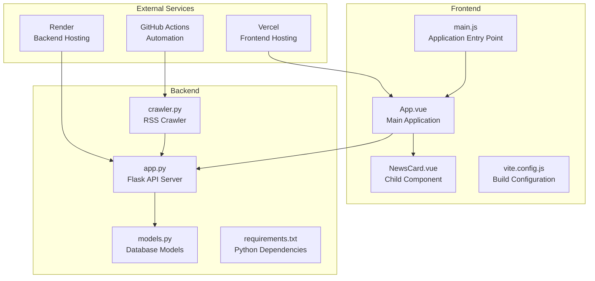
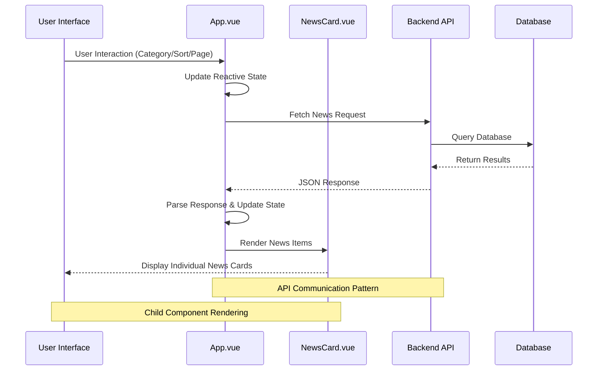
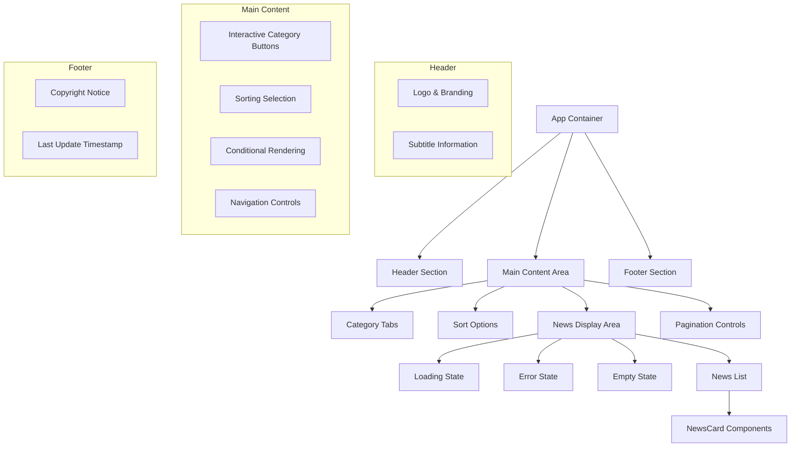
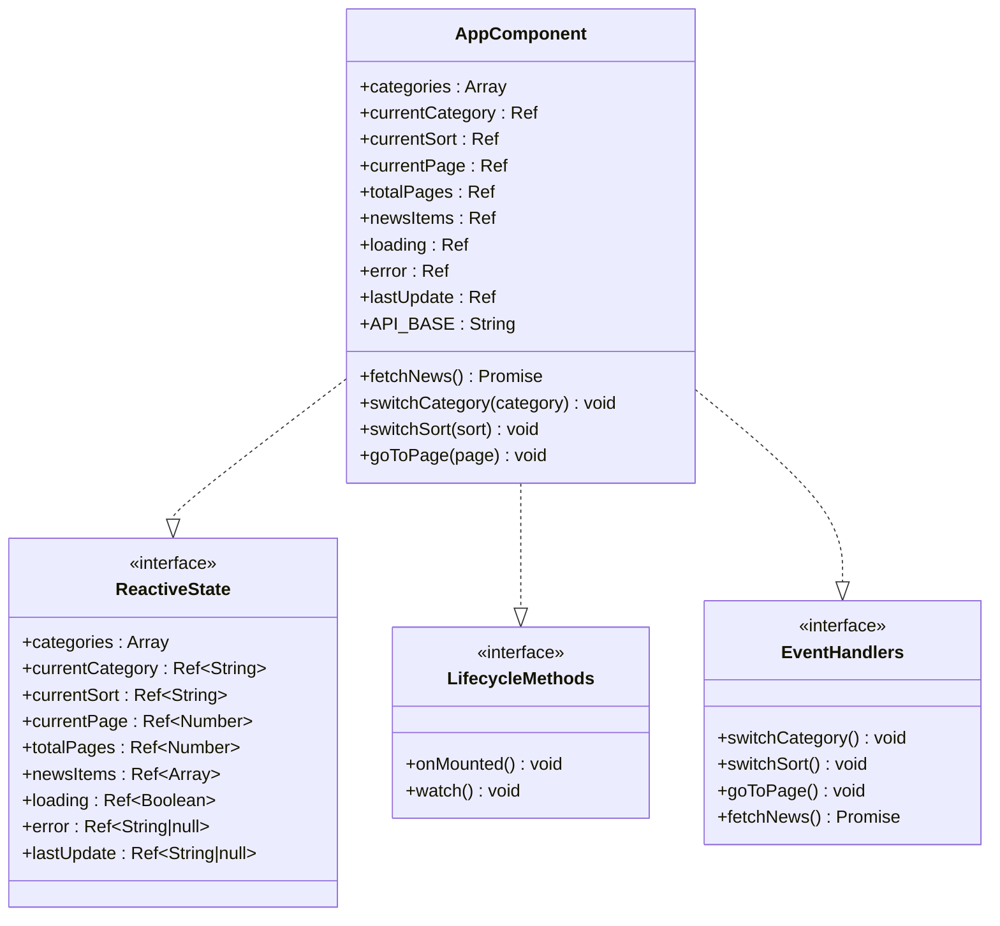
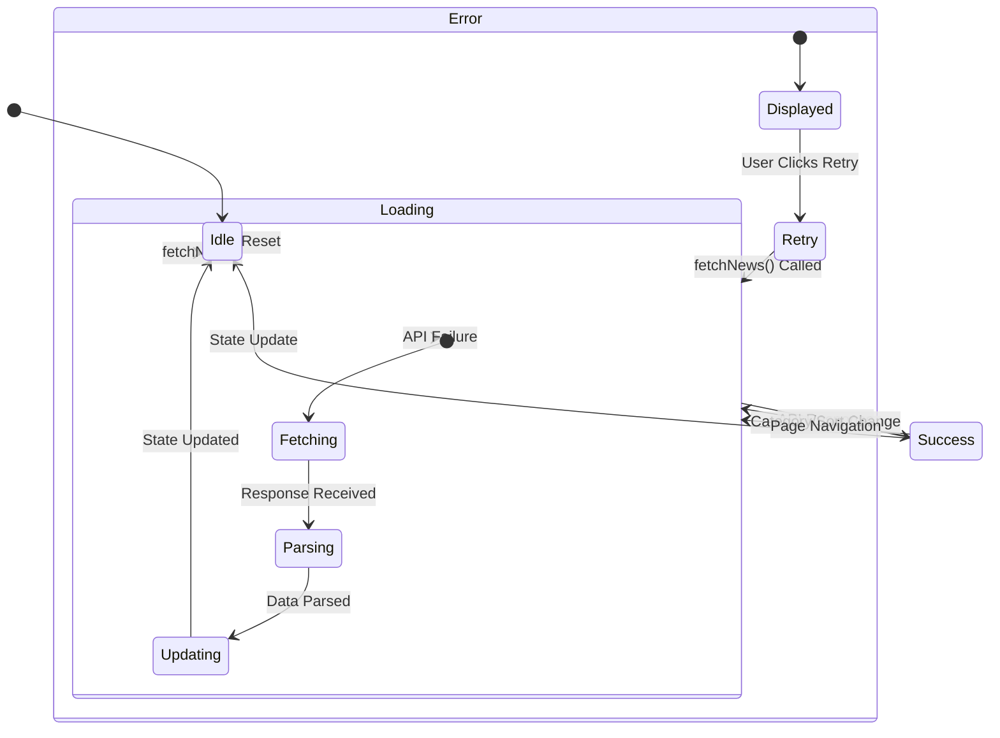
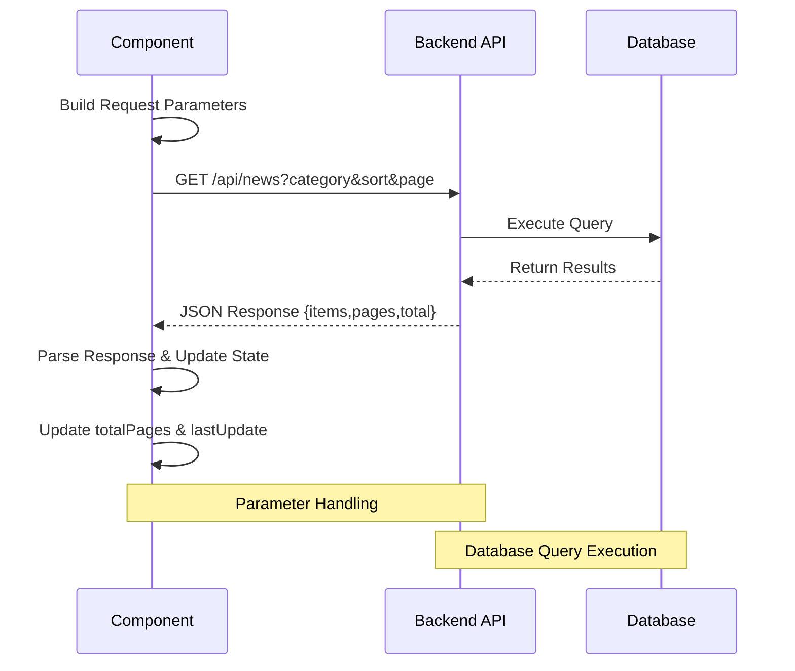
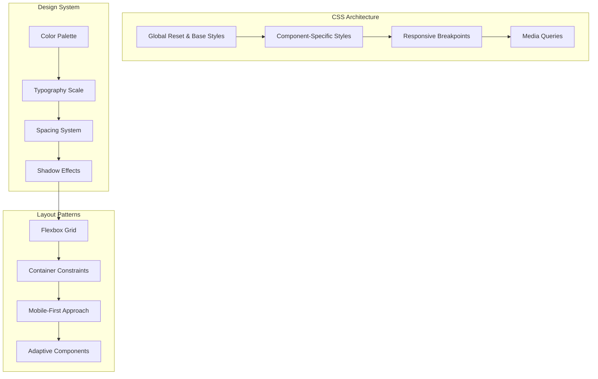
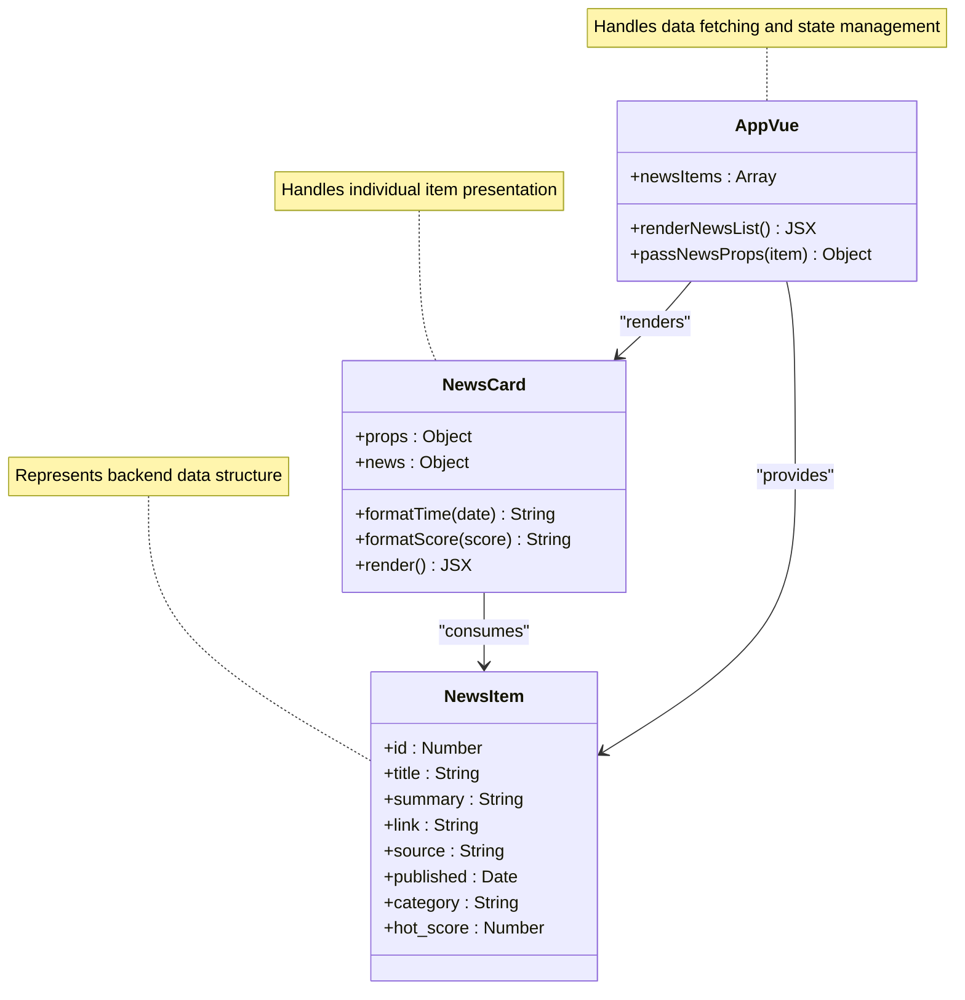

# App Component

<cite>
**Referenced Files in This Document**
- [App.vue](file://frontend/src/App.vue)
- [NewsCard.vue](file://frontend/src/components/NewsCard.vue)
- [main.js](file://frontend/src/main.js)
- [package.json](file://frontend/package.json)
- [app.py](file://backend/app.py)
- [models.py](file://backend/models.py)
- [README.md](file://README.md)
</cite>

## Table of Contents
1. [Introduction](#introduction)
2. [Project Structure](#project-structure)
3. [Core Components](#core-components)
4. [Architecture Overview](#architecture-overview)
5. [Detailed Component Analysis](#detailed-component-analysis)
6. [Dependency Analysis](#dependency-analysis)
7. [Performance Considerations](#performance-considerations)
8. [Troubleshooting Guide](#troubleshooting-guide)
9. [Conclusion](#conclusion)
10. [Appendices](#appendices)

## Introduction
This document provides comprehensive documentation for the main App.vue component, a Vue 3 application that aggregates news articles for two specialized circles: Programmer Circle and AI Circle. The component implements a modern, responsive interface with category filtering, sorting options, pagination, and integrated child components for displaying individual news items. It demonstrates Vue 3 Composition API patterns, reactive state management, and clean separation of concerns through modular component design.

The application follows a client-server architecture where the frontend (Vue 3 SPA) communicates with a backend API built with Flask and SQLite. The App.vue component serves as the primary orchestrator, managing user interactions, API communication, and state synchronization across the interface.

## Project Structure
The project follows a clear separation of concerns with distinct frontend and backend directories. The frontend utilizes Vite for development and build processes, while the backend provides a RESTful API for news data management.



**Diagram sources**
- [App.vue:1-421](file://frontend/src/App.vue#L1-L421)
- [NewsCard.vue:1-197](file://frontend/src/components/NewsCard.vue#L1-L197)
- [main.js:1-5](file://frontend/src/main.js#L1-L5)
- [app.py:1-87](file://backend/app.py#L1-L87)
- [models.py:1-39](file://backend/models.py#L1-L39)

**Section sources**
- [README.md:1-67](file://README.md#L1-L67)
- [package.json:1-19](file://frontend/package.json#L1-L19)

## Core Components
The App.vue component serves as the central hub for news aggregation, implementing a comprehensive solution that handles user interactions, data fetching, and state management. The component leverages Vue 3's Composition API to create a reactive, maintainable interface.

Key responsibilities include:
- Managing application-wide state for categories, sorting preferences, pagination, and loading states
- Orchestrating API communication with the backend news service
- Coordinating with child components for news item rendering
- Implementing responsive design patterns for cross-device compatibility
- Handling error states and providing user feedback mechanisms

The component maintains a clean separation between presentation logic and business logic, promoting reusability and testability. Its modular design allows for easy extension and maintenance as requirements evolve.

**Section sources**
- [App.vue:99-189](file://frontend/src/App.vue#L99-L189)

## Architecture Overview
The application follows a client-server architecture pattern with clear boundaries between frontend and backend responsibilities. The App.vue component acts as the primary client-side controller, managing user interactions and coordinating data flow between the UI and backend services.



**Diagram sources**
- [App.vue:122-146](file://frontend/src/App.vue#L122-L146)
- [app.py:21-55](file://backend/app.py#L21-L55)
- [NewsCard.vue:1-85](file://frontend/src/components/NewsCard.vue#L1-L85)

The architecture emphasizes loose coupling between components, enabling independent development and testing. The App.vue component maintains minimal knowledge of the backend implementation details, communicating solely through well-defined API endpoints.

## Detailed Component Analysis

### Template Layout Structure
The App.vue template implements a structured layout with clearly defined sections for optimal user experience and maintainable code organization.



**Diagram sources**
- [App.vue:1-97](file://frontend/src/App.vue#L1-L97)

The layout employs a mobile-first responsive design approach, utilizing CSS Flexbox for flexible component arrangement and media queries for adaptive behavior across device sizes.

**Section sources**
- [App.vue:1-97](file://frontend/src/App.vue#L1-L97)

### Vue 3 Composition API Implementation
The component leverages Vue 3's Composition API to create a reactive, composable application structure. The implementation demonstrates best practices for state management, lifecycle handling, and event coordination.



**Diagram sources**
- [App.vue:108-187](file://frontend/src/App.vue#L108-L187)

The component initializes with predefined categories and default selection, establishing a baseline state for user interaction. The reactive state system ensures automatic UI updates when underlying data changes, eliminating manual DOM manipulation requirements.

**Section sources**
- [App.vue:108-187](file://frontend/src/App.vue#L108-L187)

### Reactive State Management
The component implements comprehensive reactive state management using Vue 3's ref system to track application state across user interactions and API responses.



**Diagram sources**
- [App.vue:115-146](file://frontend/src/App.vue#L115-L146)

The state management approach ensures predictable application behavior through explicit state transitions. Each state change triggers appropriate UI updates and maintains consistency across the component hierarchy.

**Section sources**
- [App.vue:115-146](file://frontend/src/App.vue#L115-L146)

### API Integration Pattern
The component implements a robust API integration pattern that handles parameterized requests, response parsing, and error management. The integration follows RESTful conventions and maintains compatibility with the backend's expected request format.



**Diagram sources**
- [App.vue:122-146](file://frontend/src/App.vue#L122-L146)
- [app.py:21-55](file://backend/app.py#L21-L55)

The API integration handles dynamic parameter construction based on current state, ensuring that user selections for category, sorting, and pagination are consistently applied to backend requests.

**Section sources**
- [App.vue:122-146](file://frontend/src/App.vue#L122-L146)
- [app.py:21-55](file://backend/app.py#L21-L55)

### Component Lifecycle Methods
The component utilizes Vue 3 lifecycle hooks to manage initialization, cleanup, and state synchronization throughout the component's existence.

```mermaid
flowchart TD
A[Component Created] --> B[setup() Executed]
B --> C[Reactive State Initialized]
C --> D[Event Handlers Bound]
D --> E[watch() Subscriptions Registered]
E --> F[onMounted() Triggered]
F --> G[Initial Data Fetch]
G --> H[Component Mounted]
H --> I[User Interactions]
I --> J[State Changes]
J --> K[Automatic API Re-fetch]
K --> I
subgraph "Cleanup Phase"
L[Component Unmounted]
M[Event Listeners Removed]
N[Subscriptions Cancelled]
end
H --> L
L --> M
M --> N
```

**Diagram sources**
- [App.vue:163-170](file://frontend/src/App.vue#L163-L170)

The lifecycle management ensures proper resource cleanup and prevents memory leaks during component destruction. The automatic re-fetch mechanism triggered by watch subscriptions maintains data consistency without manual intervention.

**Section sources**
- [App.vue:163-170](file://frontend/src/App.vue#L163-L170)

### Event Handlers and User Interactions
The component implements comprehensive event handling for user interactions, providing intuitive controls for category switching, sorting, and pagination navigation.

```mermaid
graph LR
subgraph "User Interaction Events"
A[Category Button Click] --> B[switchCategory()]
C[Sort Button Click] --> D[switchSort()]
E[Page Navigation Click] --> F[goToPage()]
G[Retry Button Click] --> H[fetchNews()]
end
subgraph "State Management"
B --> I[Update currentCategory]
D --> J[Update currentSort]
F --> K[Update currentPage]
H --> L[Reset loading/error state]
end
subgraph "Automatic Behavior"
I --> M[watch() Triggers fetchNews]
J --> M
K --> M
L --> M
end
subgraph "UI Updates"
M --> N[Conditional Rendering]
N --> O[Component Re-render]
end
```

**Diagram sources**
- [App.vue:148-161](file://frontend/src/App.vue#L148-L161)

Each event handler implements specific business logic while maintaining consistency with the overall state management approach. The handlers coordinate with the reactive state system to ensure immediate UI updates and subsequent API synchronization.

**Section sources**
- [App.vue:148-161](file://frontend/src/App.vue#L148-L161)

### CSS Styling Approach and Responsive Design
The component implements a comprehensive styling strategy that combines modern CSS techniques with responsive design principles. The styling approach emphasizes maintainability, performance, and cross-browser compatibility.



**Diagram sources**
- [App.vue:191-421](file://frontend/src/App.vue#L191-L421)

The responsive design implementation uses a mobile-first approach with strategic breakpoints at 600px, ensuring optimal user experience across desktop, tablet, and mobile devices. The styling system employs CSS custom properties and modern layout techniques for maintainable, scalable design.

**Section sources**
- [App.vue:191-421](file://frontend/src/App.vue#L191-L421)

### Integration with Child Components
The App.vue component integrates seamlessly with the NewsCard child component, demonstrating proper prop passing, event handling, and component composition patterns.



**Diagram sources**
- [App.vue:54-60](file://frontend/src/App.vue#L54-L60)
- [NewsCard.vue:31-84](file://frontend/src/components/NewsCard.vue#L31-L84)

The integration pattern demonstrates proper separation of concerns, where the parent component manages data flow and state, while the child component focuses on presentation logic. This approach promotes reusability and maintainability across the component hierarchy.

**Section sources**
- [App.vue:54-60](file://frontend/src/App.vue#L54-L60)
- [NewsCard.vue:31-84](file://frontend/src/components/NewsCard.vue#L31-L84)

## Dependency Analysis
The component maintains minimal external dependencies while leveraging core Vue 3 functionality and browser APIs. The dependency graph reflects a clean, focused architecture that prioritizes performance and maintainability.

```mermaid
graph TD
subgraph "Internal Dependencies"
A[App.vue] --> B[NewsCard.vue]
A --> C[Vue 3 Core]
B --> D[Vue 3 Core]
end
subgraph "External Dependencies"
C --> E[Vue Runtime]
C --> F[DOM APIs]
C --> G[Fetch API]
C --> H[URLSearchParams]
end
subgraph "Development Dependencies"
I[Vite] --> J[Build Tool]
K[@vitejs/plugin-vue] --> L[Vue SFC Support]
end
A --> I
A --> K
B --> I
B --> K
```

**Diagram sources**
- [package.json:11-18](file://frontend/package.json#L11-L18)
- [main.js:1-5](file://frontend/src/main.js#L1-L5)

The dependency analysis reveals a streamlined architecture with clear separation between runtime dependencies and development tooling. The component relies primarily on Vue 3's built-in reactivity system and native browser APIs, minimizing bundle size and potential compatibility issues.

**Section sources**
- [package.json:11-18](file://frontend/package.json#L11-L18)
- [main.js:1-5](file://frontend/src/main.js#L1-L5)

## Performance Considerations
The component implementation incorporates several performance optimization strategies that contribute to efficient rendering, reduced memory usage, and improved user experience.

Key performance characteristics include:
- **Lazy Loading**: News items are rendered conditionally based on loading states, preventing unnecessary DOM manipulation
- **Efficient State Updates**: Reactive state changes trigger minimal DOM updates through Vue's reactivity system
- **Memory Management**: Proper cleanup of event listeners and subscriptions prevents memory leaks
- **Optimized Rendering**: Conditional rendering reduces component tree complexity during error and loading states
- **Responsive Design**: Media queries minimize layout thrashing through strategic breakpoint usage

The component's performance profile benefits from Vue 3's improved reactivity system and the absence of heavy third-party dependencies. The design favors simplicity and efficiency, ensuring smooth operation across various device capabilities.

## Troubleshooting Guide
Common issues and their resolution strategies for the App.vue component:

### API Communication Issues
- **Symptom**: Network errors or timeout failures
- **Cause**: Backend service unavailability or network connectivity problems
- **Resolution**: Implement retry logic with exponential backoff, display user-friendly error messages, and provide manual retry functionality

### State Synchronization Problems
- **Symptom**: UI not reflecting latest data or state inconsistencies
- **Cause**: Race conditions in asynchronous operations or improper state updates
- **Resolution**: Ensure proper async/await handling, implement proper error boundaries, and verify watch subscription cleanup

### Memory Leaks
- **Symptom**: Increasing memory usage over time or performance degradation
- **Cause**: Uncleaned event listeners or lingering subscriptions
- **Resolution**: Verify proper cleanup in component unmount lifecycle, cancel ongoing requests, and remove global event listeners

### Responsive Design Issues
- **Symptom**: Layout problems on specific screen sizes or devices
- **Cause**: Incomplete media query coverage or conflicting styles
- **Resolution**: Test across targeted breakpoints, validate flexbox and grid implementations, and ensure proper viewport configuration

**Section sources**
- [App.vue:140-146](file://frontend/src/App.vue#L140-L146)
- [App.vue:163-170](file://frontend/src/App.vue#L163-L170)

## Conclusion
The App.vue component represents a well-architected Vue 3 application that successfully balances functionality, maintainability, and user experience. The implementation demonstrates modern frontend development practices through its use of Composition API, reactive state management, and component-based architecture.

Key strengths of the implementation include:
- Clean separation of concerns between parent and child components
- Comprehensive reactive state management with proper lifecycle handling
- Robust API integration with error handling and user feedback
- Responsive design that adapts to various device contexts
- Maintainable code structure that facilitates future enhancements

The component serves as an excellent example of Vue 3 best practices, providing a solid foundation for news aggregation applications while maintaining flexibility for future feature additions and architectural evolution.

## Appendices

### API Endpoint Specifications
The component communicates with the following backend endpoints:
- **GET /api/news**: Retrieves paginated news items with category, sort, and page parameters
- **GET /api/news/:id**: Fetches individual news item details
- **GET /api/categories**: Returns available category options
- **GET /api/health**: Provides system health status

### Data Model Structure
The backend data model defines the News entity with the following attributes:
- **id**: Unique identifier for each news item
- **title**: Article headline or title
- **summary**: Brief description or excerpt
- **link**: Original source URL
- **published**: Publication timestamp
- **source**: News source or publisher
- **category**: Target audience category
- **hot_score**: Popularity or trending score

### Development Environment Setup
The project requires Node.js and npm for frontend development, with Python and pip for backend services. Development scripts include:
- **npm run dev**: Starts Vite development server
- **npm run build**: Creates production-ready bundle
- **npm run preview**: Previews production build locally