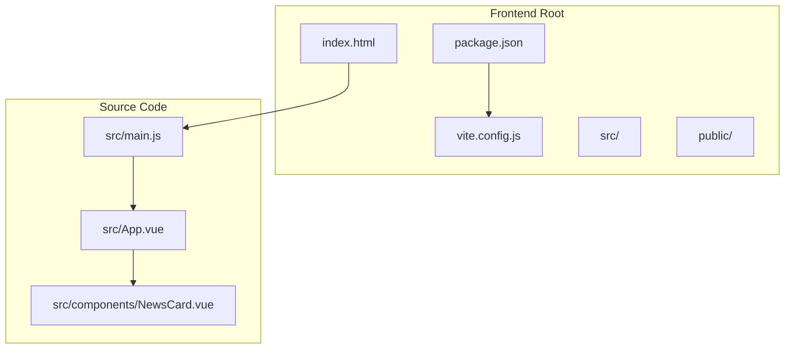
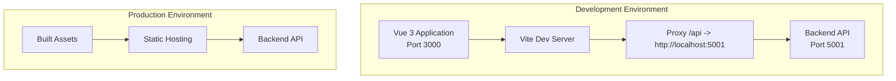
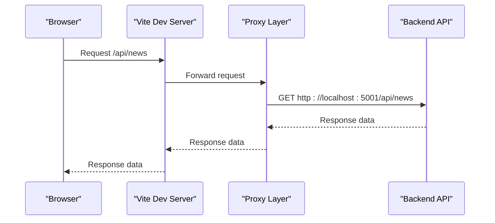
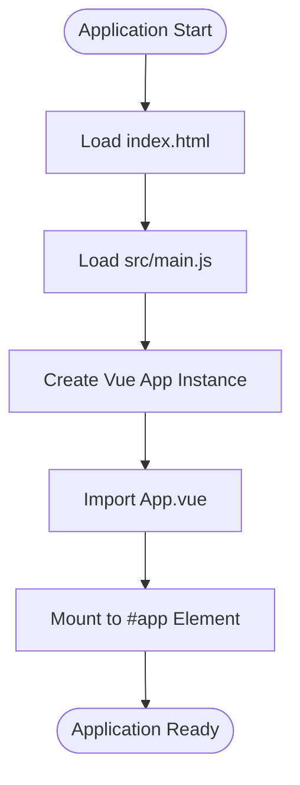
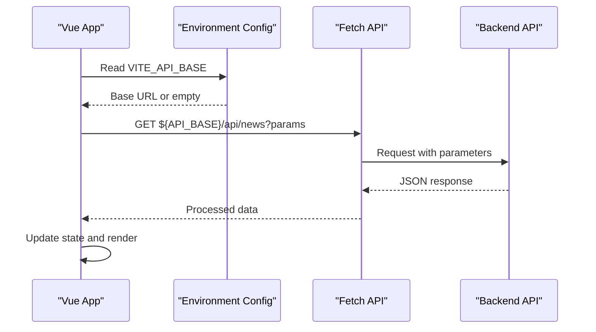
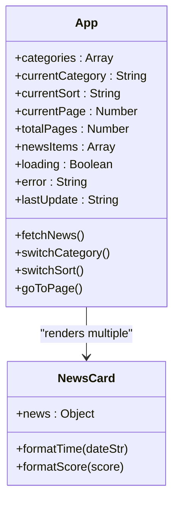
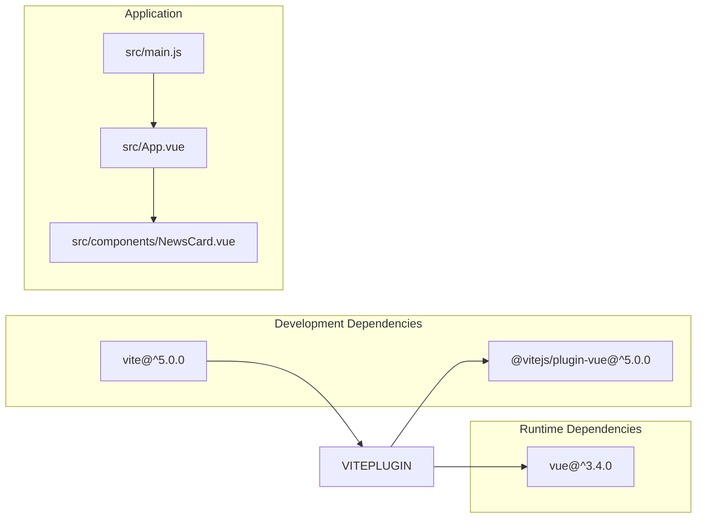

# Build Configuration

<cite>
**Referenced Files in This Document**
- [package.json](file://frontend/package.json)
- [vite.config.js](file://frontend/vite.config.js)
- [index.html](file://frontend/index.html)
- [main.js](file://frontend/src/main.js)
- [App.vue](file://frontend/src/App.vue)
- [NewsCard.vue](file://frontend/src/components/NewsCard.vue)
- [README.md](file://README.md)
</cite>

## Table of Contents
1. [Introduction](#introduction)
2. [Project Structure](#project-structure)
3. [Core Components](#core-components)
4. [Architecture Overview](#architecture-overview)
5. [Detailed Component Analysis](#detailed-component-analysis)
6. [Dependency Analysis](#dependency-analysis)
7. [Performance Considerations](#performance-considerations)
8. [Troubleshooting Guide](#troubleshooting-guide)
9. [Conclusion](#conclusion)

## Introduction
This document provides comprehensive build configuration and development setup documentation for the frontend of the news aggregator project. It covers the Vite build tool configuration, development server settings, proxy configuration for API requests, and build optimization options. It also details the package.json dependencies including Vue 3, Vite, and development tools, explains the development workflow with npm scripts, documents environment variable configuration using VITE_API_BASE for API endpoint configuration, and outlines the production build process, asset optimization, and deployment preparation. Finally, it includes troubleshooting guides for common build issues and development server problems.

## Project Structure
The frontend is a Vue 3 application built with Vite. The project structure follows a conventional layout with source files under src/, static assets under public/, and configuration files at the root level. The main HTML entry point loads the Vue application bundle and mounts it to the DOM.

**Diagram sources**
- [package.json:1-19](file://frontend/package.json#L1-L19)
- [vite.config.js:1-17](file://frontend/vite.config.js#L1-L17)
- [index.html:1-15](file://frontend/index.html#L1-L15)
- [main.js:1-5](file://frontend/src/main.js#L1-L5)
- [App.vue:1-421](file://frontend/src/App.vue#L1-L421)
- [NewsCard.vue:1-197](file://frontend/src/components/NewsCard.vue#L1-L197)

**Section sources**
- [package.json:1-19](file://frontend/package.json#L1-L19)
- [vite.config.js:1-17](file://frontend/vite.config.js#L1-L17)
- [index.html:1-15](file://frontend/index.html#L1-L15)

## Core Components
This section documents the key build configuration components and their roles in the development and production environments.

### Vite Configuration
The Vite configuration defines the development server, plugin integration, and proxy settings for API requests during development. The configuration enables hot module replacement, integrates the Vue plugin, and sets up a proxy to forward API requests to the backend server.

Key configuration elements:
- Plugin integration: Vue plugin for SFC support and template compilation
- Development server: Port 3000 with proxy configuration
- Proxy settings: Routes requests prefixed with /api to the backend server

### Package Dependencies
The package.json defines the application's runtime and development dependencies:
- Runtime dependencies: Vue 3 for the frontend framework
- Development dependencies: Vite for the build toolchain and @vitejs/plugin-vue for Vue Single File Component support
- Scripts: Development, build, and preview commands

### Environment Variables
The application uses VITE_API_BASE to configure the API base URL at runtime. This allows the frontend to work with different backend environments without rebuilding.

**Section sources**
- [vite.config.js:1-17](file://frontend/vite.config.js#L1-L17)
- [package.json:1-19](file://frontend/package.json#L1-L19)
- [App.vue:119-120](file://frontend/src/App.vue#L119-L120)

## Architecture Overview
The frontend architecture consists of a Vue 3 application that communicates with a backend API. During development, Vite serves the application and proxies API requests to the backend server. In production, the application is built and deployed as static assets.

**Diagram sources**
- [vite.config.js:7-15](file://frontend/vite.config.js#L7-L15)
- [App.vue:119-133](file://frontend/src/App.vue#L119-L133)

## Detailed Component Analysis

### Vite Development Server Configuration
The Vite development server configuration establishes the local development environment with specific port settings and proxy behavior for API communication.

**Diagram sources**
- [vite.config.js:7-15](file://frontend/vite.config.js#L7-L15)
- [App.vue:122-146](file://frontend/src/App.vue#L122-L146)

### Vue Application Initialization
The Vue application initializes by mounting the root component to the DOM element defined in the HTML template. The main.js file creates the Vue app instance and mounts it to the #app element.

**Diagram sources**
- [index.html:10-14](file://frontend/index.html#L10-L14)
- [main.js:1-5](file://frontend/src/main.js#L1-L5)
- [App.vue:1-97](file://frontend/src/App.vue#L1-L97)

### API Communication Flow
The application communicates with the backend API using the configured base URL. The API base URL is determined by the VITE_API_BASE environment variable, allowing flexible deployment configurations.

**Diagram sources**
- [App.vue:119-146](file://frontend/src/App.vue#L119-L146)

**Section sources**
- [vite.config.js:1-17](file://frontend/vite.config.js#L1-L17)
- [main.js:1-5](file://frontend/src/main.js#L1-L5)
- [App.vue:119-146](file://frontend/src/App.vue#L119-L146)

### Component Architecture
The frontend follows a component-based architecture with a main App component that manages state and renders NewsCard components for individual news items.

**Diagram sources**
- [App.vue:103-187](file://frontend/src/App.vue#L103-L187)
- [NewsCard.vue:31-84](file://frontend/src/components/NewsCard.vue#L31-L84)

**Section sources**
- [App.vue:1-421](file://frontend/src/App.vue#L1-L421)
- [NewsCard.vue:1-197](file://frontend/src/components/NewsCard.vue#L1-L197)

## Dependency Analysis
The frontend has a minimal dependency footprint focused on Vue 3 and Vite tooling. The dependency graph shows the relationships between core packages and their roles in the build process.

**Diagram sources**
- [package.json:11-17](file://frontend/package.json#L11-L17)
- [main.js:1-5](file://frontend/src/main.js#L1-L5)
- [App.vue:101-106](file://frontend/src/App.vue#L101-L106)
- [NewsCard.vue:31-38](file://frontend/src/components/NewsCard.vue#L31-L38)

**Section sources**
- [package.json:1-19](file://frontend/package.json#L1-L19)

## Performance Considerations
The current configuration provides a solid foundation for development and production builds. For production deployments, consider the following optimization strategies:

- Asset optimization: Enable Vite's built-in asset optimization and minification during production builds
- Code splitting: Leverage Vue's lazy loading capabilities for route-based code splitting
- Tree shaking: Ensure unused code is removed through proper ES module imports
- Caching: Configure appropriate cache headers for static assets in production deployments
- Bundle analysis: Use Vite's built-in bundle analyzer to identify optimization opportunities

## Troubleshooting Guide

### Development Server Issues
Common development server problems and solutions:

**Port conflicts (port 3000 already in use):**
- Solution: Modify the port setting in vite.config.js or kill the conflicting process
- Impact: Prevents development server from starting

**Proxy configuration errors:**
- Symptoms: API requests fail with CORS or connection refused errors
- Solution: Verify backend server is running at http://localhost:5001
- Impact: API calls cannot reach the backend during development

**Module resolution failures:**
- Symptoms: Import errors for Vue components or plugins
- Solution: Ensure all dependencies are installed and Vite configuration includes the Vue plugin
- Impact: Application fails to compile during development

### Build Process Issues
Common build problems and resolutions:

**Missing environment variables:**
- Symptoms: API calls fail in production builds
- Solution: Set VITE_API_BASE environment variable during build or deployment
- Impact: Frontend cannot communicate with backend APIs

**Asset loading failures:**
- Symptoms: Images or static assets not displaying in production
- Solution: Verify asset paths and ensure proper asset handling in Vite configuration
- Impact: Visual elements missing from deployed application

**Dependency conflicts:**
- Symptoms: Build errors or runtime warnings about incompatible versions
- Solution: Align Vue and plugin versions according to compatibility requirements
- Impact: Build failures or unstable application behavior

**Section sources**
- [vite.config.js:7-15](file://frontend/vite.config.js#L7-L15)
- [App.vue:119-120](file://frontend/src/App.vue#L119-L120)

## Conclusion
The frontend build configuration provides a streamlined development and production setup for the news aggregator application. The Vite configuration offers efficient development workflows with hot module replacement and API proxying, while the Vue 3 application delivers modern component-based architecture. The environment variable configuration using VITE_API_BASE enables flexible deployment scenarios. Following the troubleshooting guidelines and considering the suggested optimizations will ensure smooth development and reliable production deployments.