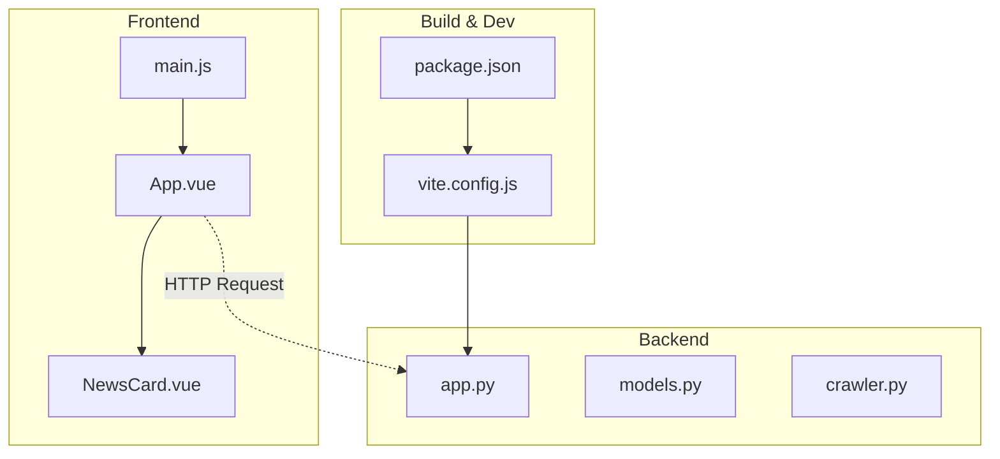
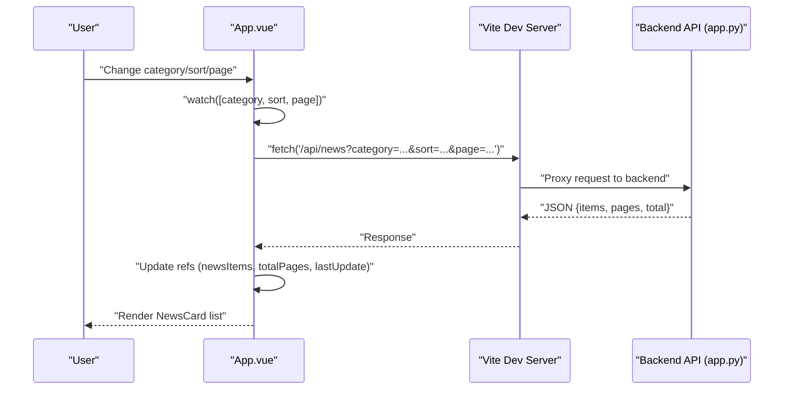
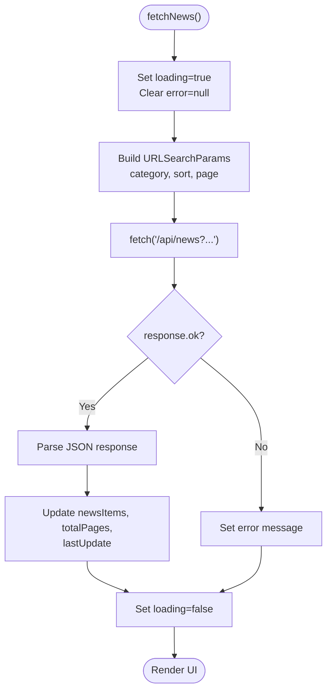
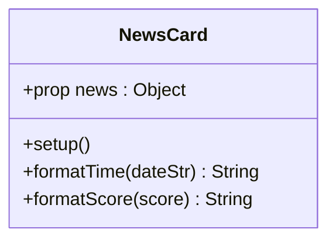
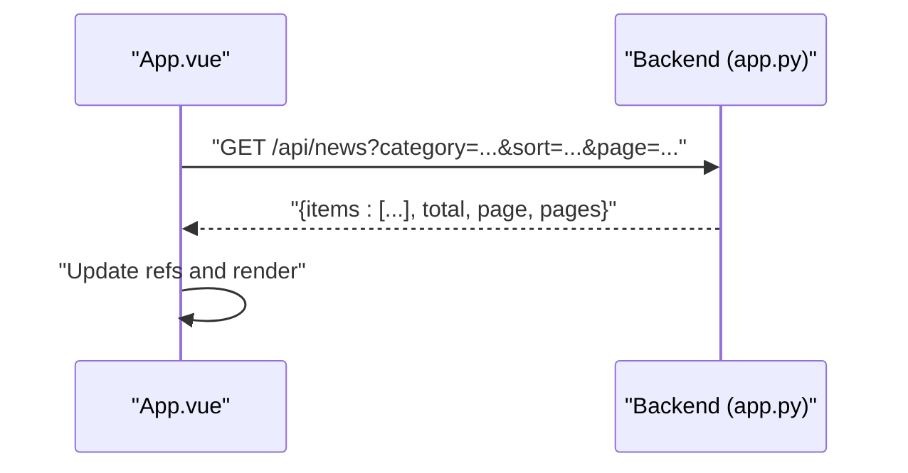
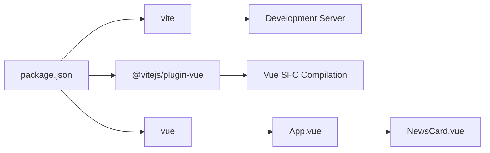

# Frontend Application

<cite>
**Referenced Files in This Document**
- [App.vue](file://frontend/src/App.vue)
- [NewsCard.vue](file://frontend/src/components/NewsCard.vue)
- [main.js](file://frontend/src/main.js)
- [vite.config.js](file://frontend/vite.config.js)
- [package.json](file://frontend/package.json)
- [app.py](file://backend/app.py)
- [models.py](file://backend/models.py)
- [crawler.py](file://backend/crawler.py)
- [README.md](file://README.md)
</cite>

## Table of Contents
1. [Introduction](#introduction)
2. [Project Structure](#project-structure)
3. [Core Components](#core-components)
4. [Architecture Overview](#architecture-overview)
5. [Detailed Component Analysis](#detailed-component-analysis)
6. [Dependency Analysis](#dependency-analysis)
7. [Performance Considerations](#performance-considerations)
8. [Troubleshooting Guide](#troubleshooting-guide)
9. [Conclusion](#conclusion)
10. [Appendices](#appendices)

## Introduction
This document provides comprehensive documentation for the Vue.js frontend application of a news aggregator focused on the Programmer Circle and AI Circle. The application is built with Vue 3 Composition API, integrates with a Flask backend API, and uses Vite for development and build tooling. It features a main container component (App.vue) and a primary content display component (NewsCard.vue), along with responsive design and pagination.

## Project Structure
The frontend is organized around a minimal yet functional structure:
- Entry point initializes the Vue application and mounts it to the DOM.
- App.vue serves as the main container, orchestrating state, UI controls, and rendering of NewsCard items.
- NewsCard.vue renders individual news items with category tagging, source attribution, timestamps, and hot scores.
- Vite configuration sets up the development server with proxying to the backend API and enables the Vue plugin.
- Package scripts define local development, building, and preview commands.

**Diagram sources**
- [main.js:1-5](file://frontend/src/main.js#L1-L5)
- [App.vue:100-188](file://frontend/src/App.vue#L100-L188)
- [NewsCard.vue:31-84](file://frontend/src/components/NewsCard.vue#L31-L84)
- [vite.config.js:1-17](file://frontend/vite.config.js#L1-L17)
- [package.json:1-19](file://frontend/package.json#L1-L19)
- [app.py:21-55](file://backend/app.py#L21-L55)

**Section sources**
- [README.md:5-26](file://README.md#L5-L26)
- [main.js:1-5](file://frontend/src/main.js#L1-L5)
- [vite.config.js:1-17](file://frontend/vite.config.js#L1-L17)
- [package.json:1-19](file://frontend/package.json#L1-L19)

## Core Components
- App.vue
  - Purpose: Main container managing categories, sorting, pagination, loading, error states, and rendering the list of news cards.
  - Reactive state: Categories, current category, current sort mode, current page, total pages, news items, loading flag, error message, last update timestamp.
  - API integration: Fetches paginated news from the backend API endpoint with query parameters for category, sort, and page.
  - UI controls: Category tabs, sort buttons, pagination controls, retry button, and empty/loading/error states.
  - Lifecycle: Uses mounted hook to trigger initial fetch and watch to refetch when filters or page change.
- NewsCard.vue
  - Purpose: Renders a single news item with category tag, source, title, summary, publication time, and optional hot score.
  - Props: Expects a news object with fields such as id, title, summary, link, source, published, category, and hot_score.
  - Formatting helpers: Computes relative time and formats hot score for display.
  - Styling: Scoped styles for card layout, hover effects, typography, and responsive adjustments.

Key implementation patterns:
- Composition API usage: Reactive refs and watchers are declared inside setup().
- Component communication: App.vue passes news items to NewsCard.vue via props; NewsCard.vue is a presentational component that does not emit events.
- HTTP integration: Fetch API is used to call the backend endpoint with URLSearchParams for query parameters.
- Error handling: Centralized try/catch around fetch; error state is displayed with a retry button.
- Loading states: Spinner UI during fetch; conditional rendering for loading, error, empty, and list states.

**Section sources**
- [App.vue:100-188](file://frontend/src/App.vue#L100-L188)
- [NewsCard.vue:31-84](file://frontend/src/components/NewsCard.vue#L31-L84)

## Architecture Overview
The frontend follows a unidirectional data flow:
- App.vue holds reactive state and orchestrates data fetching.
- App.vue passes data down to NewsCard.vue as props.
- Backend API responds with paginated news items and metadata.
- Vite development server proxies API requests to the backend during local development.

**Diagram sources**
- [App.vue:122-146](file://frontend/src/App.vue#L122-L146)
- [vite.config.js:9-14](file://frontend/vite.config.js#L9-L14)
- [app.py:21-55](file://backend/app.py#L21-L55)

## Detailed Component Analysis

### App.vue Analysis
- State management
  - Reactive refs encapsulate UI state and data: categories, currentCategory, currentSort, currentPage, totalPages, newsItems, loading, error, lastUpdate.
  - Environment-driven API base URL via import.meta.env.VITE_API_BASE.
- Lifecycle and watchers
  - onMounted triggers initial fetch.
  - watch([category, sort, page], handler) ensures automatic refetch when any of these change.
- API integration
  - fetchNews constructs URLSearchParams and calls the backend endpoint.
  - Handles response.ok, parses JSON, updates state, and sets lastUpdate.
  - Centralized error handling sets error message and leaves loading flag off.
- UI rendering
  - Conditional rendering for loading, error, empty, and list states.
  - Pagination controls update currentPage and scroll to top smoothly.
  - Footer displays last update time.

**Diagram sources**
- [App.vue:122-146](file://frontend/src/App.vue#L122-L146)

**Section sources**
- [App.vue:108-188](file://frontend/src/App.vue#L108-L188)

### NewsCard.vue Analysis
- Props contract
  - Requires a news object with id, title, summary, link, source, published, category, hot_score.
- Formatting logic
  - Relative time calculation with multiple thresholds (minutes, hours, days).
  - Hot score formatting with precision based on value magnitude.
- Rendering
  - Anchor element wraps the card and opens links in a new tab with security attributes.
  - Category tag and source are displayed in the header.
  - Title and summary use line clamping for responsive truncation.
  - Footer shows time and optional hot score with icons.

**Diagram sources**
- [NewsCard.vue:31-84](file://frontend/src/components/NewsCard.vue#L31-L84)

**Section sources**
- [NewsCard.vue:31-84](file://frontend/src/components/NewsCard.vue#L31-L84)

### Component Communication Patterns
- Parent-to-child props: App.vue passes each news item to NewsCard.vue via the news prop.
- Child-to-parent: No events are emitted; NewsCard.vue is a pure presentational component.
- Sibling communication: Not applicable in this component set.

**Section sources**
- [App.vue:55-60](file://frontend/src/App.vue#L55-L60)
- [NewsCard.vue:33-38](file://frontend/src/components/NewsCard.vue#L33-L38)

### Backend API Integration
- Endpoint: GET /api/news with query parameters:
  - category: '程序员圈' or 'AI圈' (optional)
  - sort: 'newest' or 'hottest' (default: newest)
  - page: integer (default: 1)
- Response shape:
  - items: array of news objects
  - total: total count
  - page: current page
  - pages: total pages
- Sorting:
  - newest: order by published desc
  - hottest: order by hot_score desc
- Pagination:
  - per_page is fixed at 20 items

**Diagram sources**
- [app.py:21-55](file://backend/app.py#L21-L55)
- [App.vue:122-146](file://frontend/src/App.vue#L122-L146)

**Section sources**
- [app.py:21-55](file://backend/app.py#L21-L55)
- [models.py:10-39](file://backend/models.py#L10-L39)

## Dependency Analysis
- Runtime dependencies
  - Vue 3 runtime is the primary dependency.
- Build dependencies
  - Vite and @vitejs/plugin-vue enable fast development and Vue SFC compilation.
- Scripts
  - dev: starts Vite dev server
  - build: produces optimized production bundle
  - preview: serves the production build locally

**Diagram sources**
- [package.json:1-19](file://frontend/package.json#L1-L19)
- [vite.config.js:1-17](file://frontend/vite.config.js#L1-L17)

**Section sources**
- [package.json:1-19](file://frontend/package.json#L1-L19)

## Performance Considerations
- Virtualization: Not implemented; for large datasets, consider virtualizing the news list.
- Debouncing: No debounced input; filters are immediate.
- Image optimization: Not handled here; if images are added later, lazy-loading and modern formats should be considered.
- Network efficiency: Single request per page; pagination reduces payload size.
- Rendering: NewsCard uses line clamping to limit DOM nodes for long summaries.

## Troubleshooting Guide
- API connectivity
  - Verify Vite proxy configuration targets the correct backend port.
  - Confirm backend is running and reachable at the configured target.
- Environment variables
  - Ensure VITE_API_BASE is set appropriately for production builds.
- Error states
  - When error occurs, the UI shows an error message and a retry button; check browser console for underlying errors.
- Pagination
  - If pagination seems incorrect, verify backend pagination parameters and response shape.

**Section sources**
- [vite.config.js:7-16](file://frontend/vite.config.js#L7-L16)
- [App.vue:122-146](file://frontend/src/App.vue#L122-L146)

## Conclusion
The frontend application demonstrates a clean separation of concerns with App.vue managing state and orchestration, and NewsCard.vue focusing on presentation. It integrates seamlessly with the backend API, handles loading and error states gracefully, and provides a responsive user interface. The Vite configuration supports efficient development with proxying to the backend.

## Appendices

### Development and Build Setup
- Local development
  - Install dependencies in the frontend directory.
  - Start the Vite dev server; it proxies API requests to the backend.
- Production build
  - Build the application for deployment; serve the static assets behind a reverse proxy or CDN.
- Deployment
  - The project is designed for deployment to Vercel for the frontend and Render for the backend, with automated crawling via GitHub Actions.

**Section sources**
- [README.md:28-53](file://README.md#L28-L53)
- [vite.config.js:7-16](file://frontend/vite.config.js#L7-L16)
- [package.json:6-10](file://frontend/package.json#L6-L10)

### Example Usage Scenarios
- Viewing news by category
  - Click category tabs to filter by '程序员圈' or 'AI圈'; pagination resets to page 1.
- Sorting news
  - Toggle between '最新' (newest) and '最热' (hottest) to reorder results.
- Navigating pages
  - Use pagination controls to move between pages; the page indicator shows current and total pages.
- Handling failures
  - When network errors occur, the UI displays an error message with a retry button.

**Section sources**
- [App.vue:148-161](file://frontend/src/App.vue#L148-L161)
- [App.vue:49-52](file://frontend/src/App.vue#L49-L52)