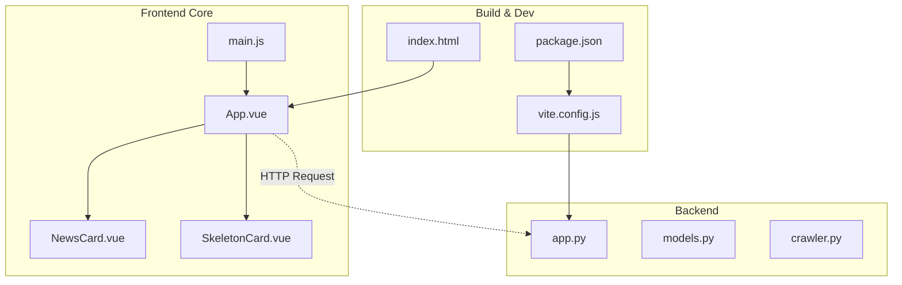
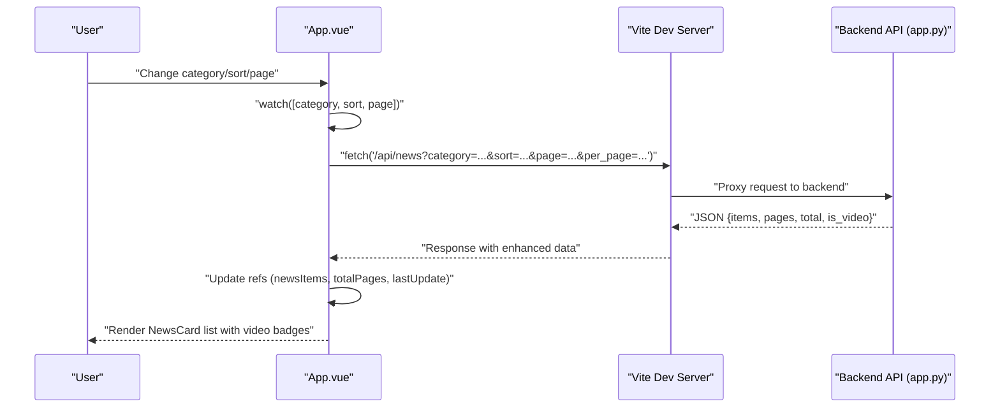
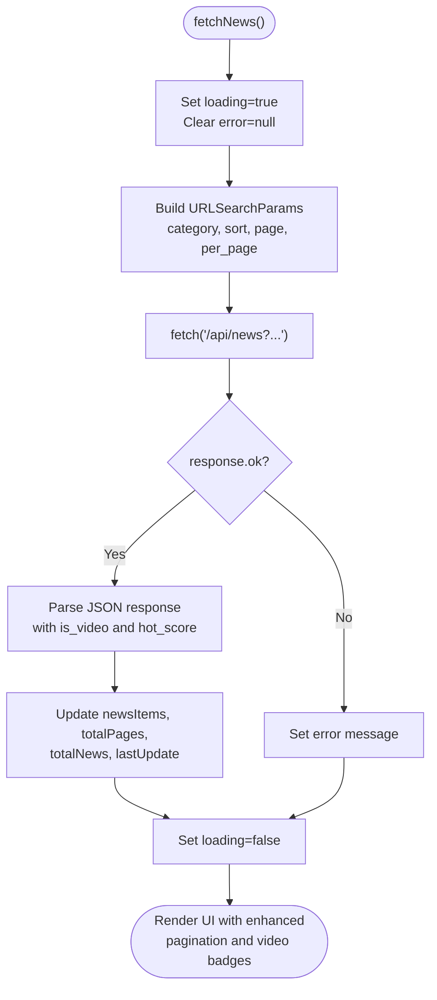
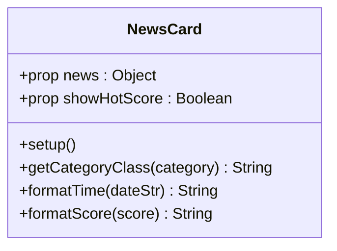
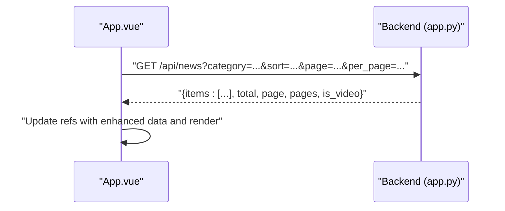
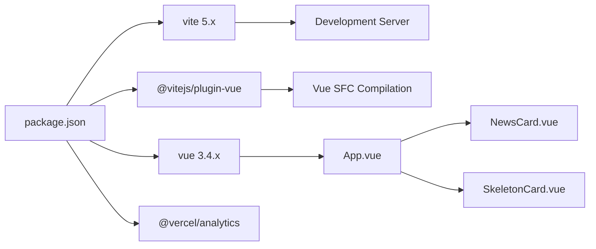

# Frontend Application

<cite>
**Referenced Files in This Document**
- [App.vue](file://frontend/src/App.vue)
- [NewsCard.vue](file://frontend/src/components/NewsCard.vue)
- [SkeletonCard.vue](file://frontend/src/components/SkeletonCard.vue)
- [main.js](file://frontend/src/main.js)
- [vite.config.js](file://frontend/vite.config.js)
- [package.json](file://frontend/package.json)
- [index.html](file://frontend/index.html)
- [app.py](file://backend/app.py)
- [models.py](file://backend/models.py)
- [crawler.py](file://backend/crawler.py)
- [README.md](file://README.md)
</cite>

## Update Summary
**Changes Made**
- Updated pagination system to include advanced Ant Design-style page navigation with ellipsis indicators
- Enhanced category scrolling with fade indicators and improved responsive design
- Added video badges for YouTube content detection
- Refined category styling with distinct color schemes for better visual differentiation
- Improved time formatting with relative timestamps and enhanced date display
- Added skeleton loading animations for better user experience
- Implemented page size selection and jump-to-page functionality

## Table of Contents
1. [Introduction](#introduction)
2. [Project Structure](#project-structure)
3. [Core Components](#core-components)
4. [Architecture Overview](#architecture-overview)
5. [Detailed Component Analysis](#detailed-component-analysis)
6. [Advanced Features](#advanced-features)
7. [Dependency Analysis](#dependency-analysis)
8. [Performance Considerations](#performance-considerations)
9. [Troubleshooting Guide](#troubleshooting-guide)
10. [Conclusion](#conclusion)
11. [Appendices](#appendices)

## Introduction
This document provides comprehensive documentation for the Vue.js frontend application of a news aggregator focused on the Programmer Circle and AI Circle. The application is built with Vue 3 Composition API, integrates with a Flask backend API, and uses Vite for development and build tooling. It features a main container component (App.vue) with advanced pagination, enhanced category navigation, and a primary content display component (NewsCard.vue) with video badges and refined category styling.

**Updated** Enhanced with advanced pagination, improved category scrolling, video content detection, and refined visual design system.

## Project Structure
The frontend is organized around a modern, feature-rich structure with advanced UI components:
- Entry point initializes the Vue application with Vercel Analytics integration and mounts it to the DOM.
- App.vue serves as the main container with advanced pagination, category scrolling with fade indicators, and comprehensive state management.
- NewsCard.vue renders individual news items with category tagging, source attribution, timestamps, hot scores, and video badges.
- SkeletonCard.vue provides loading skeletons with animated shimmer effects.
- Vite configuration sets up the development server with proxying to the backend API and enables the Vue plugin.
- Tailwind CSS with custom configuration provides responsive design and brand color theming.

**Diagram sources**
- [main.js:1-5](file://frontend/src/main.js#L1-L5)
- [App.vue:1-614](file://frontend/src/App.vue#L1-L614)
- [NewsCard.vue:1-163](file://frontend/src/components/NewsCard.vue#L1-L163)
- [SkeletonCard.vue:1-34](file://frontend/src/components/SkeletonCard.vue#L1-L34)
- [vite.config.js:1-21](file://frontend/vite.config.js#L1-L21)
- [package.json:1-20](file://frontend/package.json#L1-L20)
- [index.html:1-97](file://frontend/index.html#L1-L97)
- [app.py:21-55](file://backend/app.py#L21-L55)

**Section sources**
- [README.md:5-26](file://README.md#L5-L26)
- [main.js:1-5](file://frontend/src/main.js#L1-L5)
- [vite.config.js:1-21](file://frontend/vite.config.js#L1-L21)
- [package.json:1-20](file://frontend/package.json#L1-L20)
- [index.html:1-97](file://frontend/index.html#L1-L97)

## Core Components
- **App.vue**
  - Purpose: Main container managing categories, sorting, advanced pagination, loading states, and rendering the list of news cards with enhanced UI controls.
  - Reactive state: Categories, current category, current sort mode, current page, total pages, news items, loading flag, error message, last update timestamp, page size, and jump page input.
  - Advanced pagination: Ant Design-style page navigation with ellipsis indicators, first/last page buttons, and page size selection.
  - Enhanced category scrolling: Fade indicators for scrollable category tabs with smooth scrolling behavior.
  - API integration: Fetches paginated news from the backend API endpoint with query parameters for category, sort, page, and per_page.
  - UI controls: Category tabs with fade indicators, sort buttons, advanced pagination controls, retry button, and skeleton loading states.
  - Lifecycle: Uses mounted hook to trigger initial fetch and watch to refetch when filters or page change.
- **NewsCard.vue**
  - Purpose: Renders a single news item with category tag, source, title, summary, publication time, and optional hot score with video badges.
  - Props: Expects a news object with fields such as id, title, summary, link, source, published, category, hot_score, and is_video.
  - Enhanced formatting: Improved relative time calculation with multiple thresholds and refined date formatting.
  - Video detection: Automatic video badge display for YouTube content with dedicated styling.
  - Refined category styling: Distinct color schemes for different categories with backward compatibility support.
  - Styling: Scoped styles for card layout, hover effects, typography, responsive adjustments, and video badge styling.

**Updated** Enhanced with advanced pagination system, category scrolling with fade indicators, video badge detection, and refined category styling.

**Section sources**
- [App.vue:1-614](file://frontend/src/App.vue#L1-L614)
- [NewsCard.vue:1-163](file://frontend/src/components/NewsCard.vue#L1-L163)

## Architecture Overview
The frontend follows a sophisticated unidirectional data flow with advanced UI features:
- App.vue holds reactive state and orchestrates data fetching with enhanced pagination controls.
- App.vue passes data down to NewsCard.vue as props with video badge and category styling support.
- Backend API responds with paginated news items and metadata including video content detection.
- Vite development server proxies API requests to the backend during local development.
- Advanced UI components provide enhanced user experience with smooth animations and responsive design.

**Diagram sources**
- [App.vue:400-426](file://frontend/src/App.vue#L400-L426)
- [vite.config.js:7-15](file://frontend/vite.config.js#L7-L15)
- [app.py:21-55](file://backend/app.py#L21-L55)

## Detailed Component Analysis

### App.vue Analysis
- **Enhanced State Management**
  - Reactive refs encapsulate UI state and data: categories, currentCategory, currentSort, currentPage, pageSize, totalPages, totalNews, newsItems, loading, error, jumpPageInput.
  - Advanced pagination state with showFirstPage, showLastPage, showLeftEllipsis, and showRightEllipsis computed properties.
  - Environment-driven API base URL via import.meta.env.VITE_API_BASE.
- **Advanced Pagination System**
  - Ant Design-style pagination with ellipsis indicators for large page ranges.
  - Dynamic page visibility calculation showing optimal page numbers around current page.
  - Page size selector with options for 10, 20, 50, and 100 items per page.
  - Jump-to-page functionality with input validation and keyboard support.
- **Enhanced Category Navigation**
  - Scrollable category tabs with fade indicators on both sides.
  - Smooth scrolling behavior that centers clicked category buttons.
  - Responsive design with gradient overlays for better visibility.
- **Lifecycle and Watchers**
  - onMounted triggers initial fetch with analytics injection and category loading.
  - watch([category, sort, page], handler) ensures automatic refetch when any of these change.
  - Window resize listener updates category scroll fade indicators.
- **API Integration**
  - fetchNews constructs URLSearchParams with category, sort, page, and per_page parameters.
  - Handles response.ok, parses JSON, updates state, and sets lastUpdate.
  - Centralized error handling sets error message and leaves loading flag off.
- **Advanced UI Rendering**
  - Conditional rendering for loading (skeleton cards), error, empty, and list states.
  - Sophisticated pagination controls with previous/next buttons, first/last page, ellipsis, and page number buttons.
  - Footer displays last update time and total news count with enhanced styling.

**Diagram sources**
- [App.vue:400-426](file://frontend/src/App.vue#L400-L426)

**Section sources**
- [App.vue:1-614](file://frontend/src/App.vue#L1-L614)

### NewsCard.vue Analysis
- **Enhanced Props Contract**
  - Requires a news object with id, title, summary, link, source, published, category, hot_score, and is_video.
  - Optional showHotScore prop for conditional hot score display.
- **Advanced Formatting Logic**
  - Enhanced relative time calculation with multiple thresholds: seconds to minutes, hours, days, and date formatting.
  - Improved hot score formatting with precision based on value magnitude (1 decimal for >=1, 2 decimals for <1).
  - Video content detection with automatic badge display for YouTube URLs.
- **Refined Category Styling**
  - Comprehensive color mapping for 6+ categories with distinct color schemes:
    - 前端: orange-50/700 (warm)
    - 后端: blue-50/700 (cool)
    - 云原生: sky-50/600 (lighter blue)
    - AI: amber-50/700 (amber gold)
    - 区块链: violet-50/700 (purple)
    - 其他: gray-50/600 (neutral)
  - Backward compatibility with legacy category names during migration period.
- **Video Badge Implementation**
  - Automatic detection of video content with dedicated red badge styling.
  - Custom SVG icon for video playback indication.
  - Responsive design with proper spacing and typography.
- **Enhanced Rendering**
  - Anchor element wraps the card with security attributes and hover effects.
  - Category tag and video badge displayed in header with proper spacing.
  - Title and summary use line clamping for responsive truncation.
  - Footer shows source, time, and optional hot score with icons.

**Diagram sources**
- [NewsCard.vue:1-163](file://frontend/src/components/NewsCard.vue#L1-L163)

**Section sources**
- [NewsCard.vue:1-163](file://frontend/src/components/NewsCard.vue#L1-L163)

### Component Communication Patterns
- **Parent-to-child props**: App.vue passes each news item to NewsCard.vue via the news prop, plus showHotScore for conditional hot score display.
- **Child-to-parent**: No events are emitted; NewsCard.vue is a pure presentational component.
- **Sibling communication**: Not applicable in this component set.
- **Enhanced parent-to-child**: App.vue manages complex state and passes formatted data to child components.

**Section sources**
- [App.vue:114-121](file://frontend/src/App.vue#L114-L121)
- [NewsCard.vue:74-83](file://frontend/src/components/NewsCard.vue#L74-L83)

### Backend API Integration
- **Enhanced Endpoint**: GET /api/news with expanded query parameters:
  - category: '程序员圈' or 'AI圈' (optional)
  - sort: 'newest' or 'hottest' (default: newest)
  - page: integer (default: 1)
  - per_page: integer (default: 20, options: 10, 20, 50, 100)
- **Enhanced Response Shape**:
  - items: array of news objects with additional is_video field
  - total: total count
  - page: current page
  - pages: total pages
- **Sorting Enhancements**:
  - newest: order by published desc
  - hottest: order by hot_score desc
- **Pagination Improvements**:
  - Flexible per_page options with dynamic page size selection
  - Enhanced pagination controls with ellipsis indicators for large page ranges

**Diagram sources**
- [app.py:21-55](file://backend/app.py#L21-L55)
- [App.vue:400-426](file://frontend/src/App.vue#L400-L426)

**Section sources**
- [app.py:21-55](file://backend/app.py#L21-L55)
- [models.py:10-39](file://backend/models.py#L10-L39)

## Advanced Features

### Advanced Pagination System
The application implements a sophisticated pagination system inspired by Ant Design:
- **Dynamic Page Calculation**: Shows optimal page numbers around the current page with ellipsis indicators for large page ranges.
- **Ellipsis Indicators**: Intelligent hiding/showing of ellipsis based on current page position.
- **Page Size Selection**: Dropdown allowing users to choose between 10, 20, 50, and 100 items per page.
- **Jump-to-Page**: Direct page navigation input with validation and keyboard support.
- **Responsive Design**: Adapts pagination controls for mobile and desktop layouts.

### Enhanced Category Scrolling
- **Fade Indicators**: Gradient overlays on both sides of scrollable category tabs indicate scrollability.
- **Smooth Scrolling**: Automatic centering of clicked category buttons in viewport.
- **Real-time Updates**: Fade indicators update on scroll and window resize events.
- **Accessibility**: Proper ARIA labels and keyboard navigation support.

### Video Content Detection
- **Automatic Detection**: Video badges automatically appear for YouTube content.
- **Distinct Styling**: Red badge with video icon for clear visual distinction.
- **Backward Compatibility**: Works with existing news items without is_video field.

### Refined Category Styling
- **Distinct Color Schemes**: Each category has carefully chosen color palette for maximum visual differentiation.
- **Brand Consistency**: Colors complement the brand's blue color scheme.
- **Legacy Support**: Maintains compatibility with older category naming conventions.

**Section sources**
- [App.vue:137-271](file://frontend/src/App.vue#L137-L271)
- [App.vue:343-398](file://frontend/src/App.vue#L343-L398)
- [App.vue:488-501](file://frontend/src/App.vue#L488-L501)
- [NewsCard.vue:85-112](file://frontend/src/components/NewsCard.vue#L85-L112)
- [NewsCard.vue:16-26](file://frontend/src/components/NewsCard.vue#L16-L26)

## Dependency Analysis
- **Runtime Dependencies**
  - Vue 3.4.0 runtime with Composition API support
  - @vercel/analytics for performance monitoring
- **Build Dependencies**
  - Vite 5.0.0 and @vitejs/plugin-vue for fast development and Vue SFC compilation
  - Tailwind CSS 3.x for utility-first styling
- **Scripts**
  - dev: starts Vite dev server with API proxy
  - build: produces optimized production bundle
  - preview: serves the production build locally

**Diagram sources**
- [package.json:1-20](file://frontend/package.json#L1-L20)
- [vite.config.js:1-21](file://frontend/vite.config.js#L1-L21)

**Section sources**
- [package.json:1-20](file://frontend/package.json#L1-L20)

## Performance Considerations
- **Virtualization**: Not implemented; for large datasets, consider virtualizing the news list.
- **Debouncing**: No debounced input; filters are immediate.
- **Image Optimization**: Not handled here; if images are added later, lazy-loading and modern formats should be considered.
- **Network Efficiency**: Single request per page with flexible page sizes; pagination reduces payload size.
- **Rendering Optimizations**: 
  - NewsCard uses line clamping to limit DOM nodes for long summaries.
  - Skeleton cards provide instant feedback during loading.
  - Efficient category scrolling with fade indicators.
- **Animation Performance**: Smooth animations for pagination and category transitions.
- **Memory Management**: Proper cleanup of event listeners and observers.

## Troubleshooting Guide
- **API Connectivity**
  - Verify Vite proxy configuration targets the correct backend port (5001).
  - Confirm backend is running and reachable at the configured target.
- **Environment Variables**
  - Ensure VITE_API_BASE is set appropriately for production builds.
- **Error States**
  - When error occurs, the UI shows an error message with a retry button; check browser console for underlying errors.
- **Pagination Issues**
  - If pagination seems incorrect, verify backend pagination parameters and response shape.
  - Check that per_page values are valid (10, 20, 50, 100).
- **Category Scrolling**
  - If fade indicators don't appear, check that category container has sufficient width.
  - Verify that handleCategoryScroll function is properly bound to scroll events.
- **Video Badges**
  - If video badges don't appear, ensure news items have is_video field or proper YouTube URLs.
- **Responsive Design**
  - Test on various screen sizes to ensure proper adaptation of pagination controls.

**Section sources**
- [vite.config.js:7-15](file://frontend/vite.config.js#L7-L15)
- [App.vue:400-426](file://frontend/src/App.vue#L400-L426)
- [App.vue:488-501](file://frontend/src/App.vue#L488-L501)

## Conclusion
The frontend application demonstrates a sophisticated approach to news aggregation with advanced UI features and enhanced user experience. The implementation showcases modern Vue 3 Composition API patterns, comprehensive state management, and thoughtful UI enhancements including advanced pagination, category scrolling with fade indicators, video content detection, and refined category styling. The application integrates seamlessly with the backend API, handles loading states gracefully with skeleton animations, and provides a responsive, accessible user interface.

**Updated** The application now features significantly enhanced user experience with advanced pagination, improved navigation, video content recognition, and refined visual design system.

## Appendices

### Development and Build Setup
- **Local Development**
  - Install dependencies in the frontend directory.
  - Start the Vite dev server; it proxies API requests to the backend (port 5001).
  - Access the application at http://localhost:3000
- **Production Build**
  - Build the application for deployment; serves the static assets behind a reverse proxy or CDN.
  - Output directory: dist/
- **Deployment**
  - The project is designed for deployment to Vercel for the frontend and Render for the backend, with automated crawling via GitHub Actions.
  - Environment variables: VITE_API_BASE for production API endpoint.

**Section sources**
- [README.md:28-53](file://README.md#L28-L53)
- [vite.config.js:7-15](file://frontend/vite.config.js#L7-L15)
- [package.json:6-10](file://frontend/package.json#L6-L10)

### Example Usage Scenarios
- **Advanced Pagination Navigation**
  - Use ellipsis buttons to quickly navigate to distant pages (forward/backward 5 pages).
  - Select different page sizes (10/20/50/100 items) based on preference.
  - Jump directly to any page using the jump-to-page input.
- **Category Exploration**
  - Scroll through horizontally scrollable category tabs with fade indicators.
  - Click any category to filter news; the selected category is centered automatically.
  - Categories are color-coded for quick visual identification.
- **Video Content Discovery**
  - Videos are automatically detected and marked with distinctive red badges.
  - Video content is easily distinguishable from articles in the news feed.
- **Sorting and Filtering**
  - Toggle between '最新' (newest) and '最热' (hottest) to reorder results.
  - Combine category filtering with pagination for efficient content discovery.
- **Error Handling**
  - When network errors occur, the UI displays an error message with a retry button.
  - Loading states are indicated by skeleton animations for better perceived performance.

**Section sources**
- [App.vue:137-271](file://frontend/src/App.vue#L137-L271)
- [App.vue:428-457](file://frontend/src/App.vue#L428-L457)
- [NewsCard.vue:16-26](file://frontend/src/components/NewsCard.vue#L16-L26)

### Advanced UI Features Reference
- **Pagination Controls**
  - Previous/Next buttons with directional icons
  - First/Last page buttons for quick navigation
  - Ellipsis indicators for large page ranges
  - Page number buttons with active state highlighting
  - Page size selector dropdown
  - Jump-to-page input with validation
  - Total count badge with icon
- **Category Navigation**
  - Scrollable horizontal tabs with fade overlays
  - Smooth scrolling behavior with centering
  - Active category highlighting
  - Responsive design for all screen sizes
- **Video Badge System**
  - Automatic detection of YouTube content
  - Red badge with video icon
  - Consistent styling across all news items
- **Category Color System**
  - Six distinct color schemes for different categories
  - Brand-consistent color palette
  - Backward compatibility with legacy categories

**Section sources**
- [App.vue:137-271](file://frontend/src/App.vue#L137-L271)
- [App.vue:322-325](file://frontend/src/App.vue#L322-L325)
- [NewsCard.vue:85-112](file://frontend/src/components/NewsCard.vue#L85-L112)
- [NewsCard.vue:16-26](file://frontend/src/components/NewsCard.vue#L16-L26)