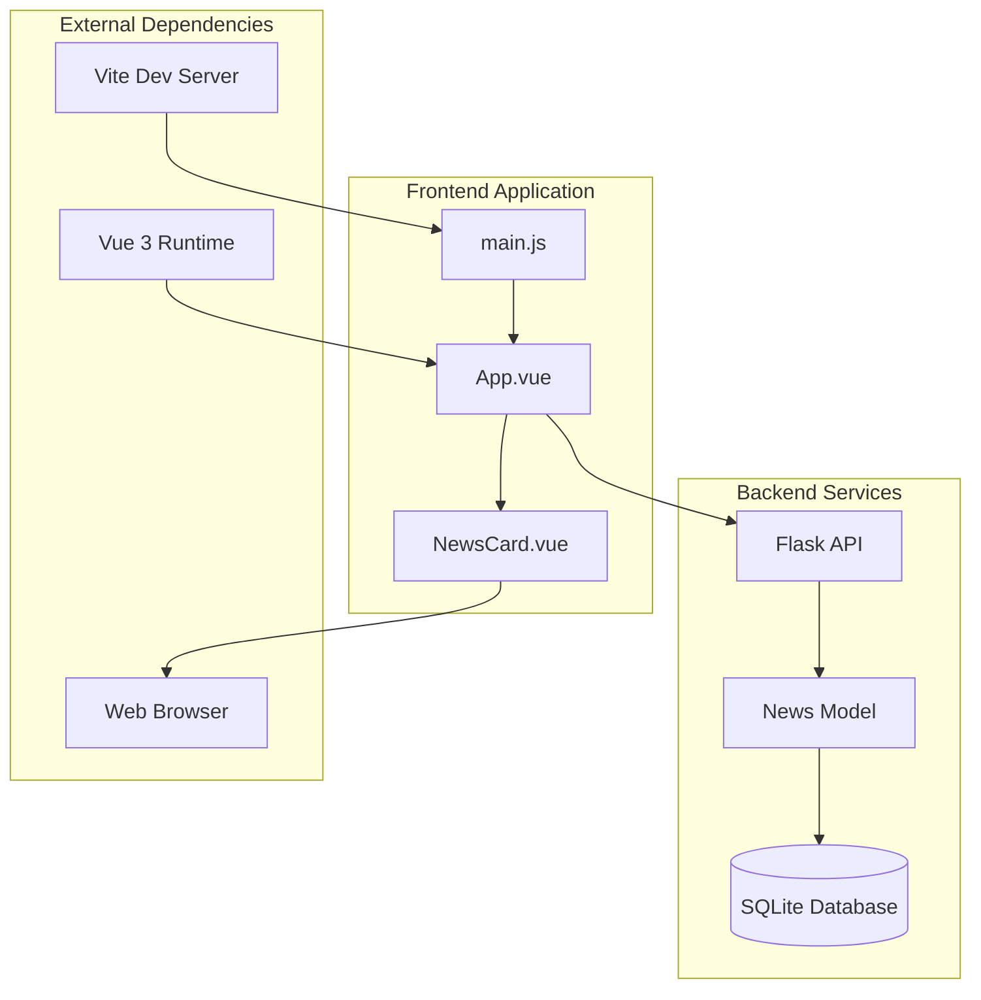
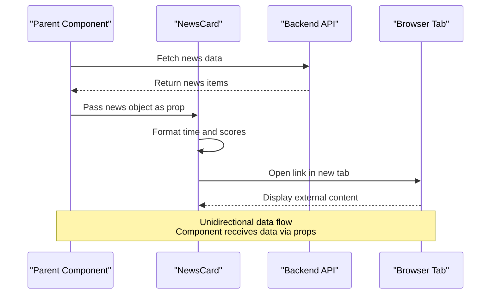
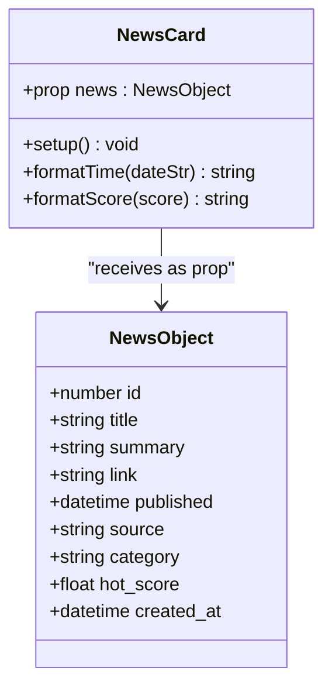
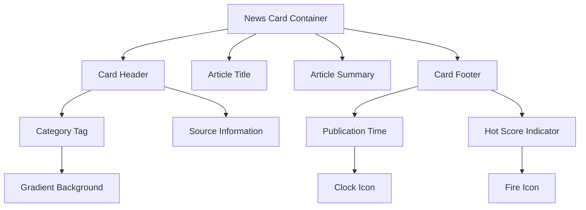
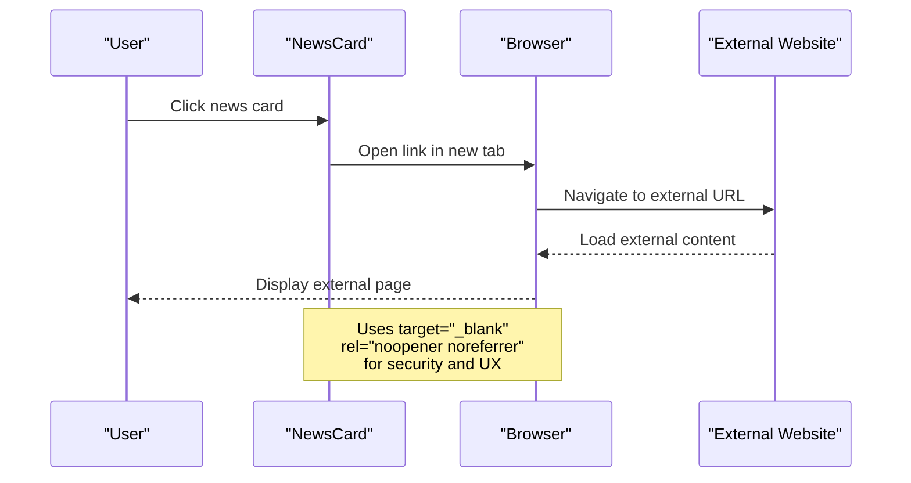
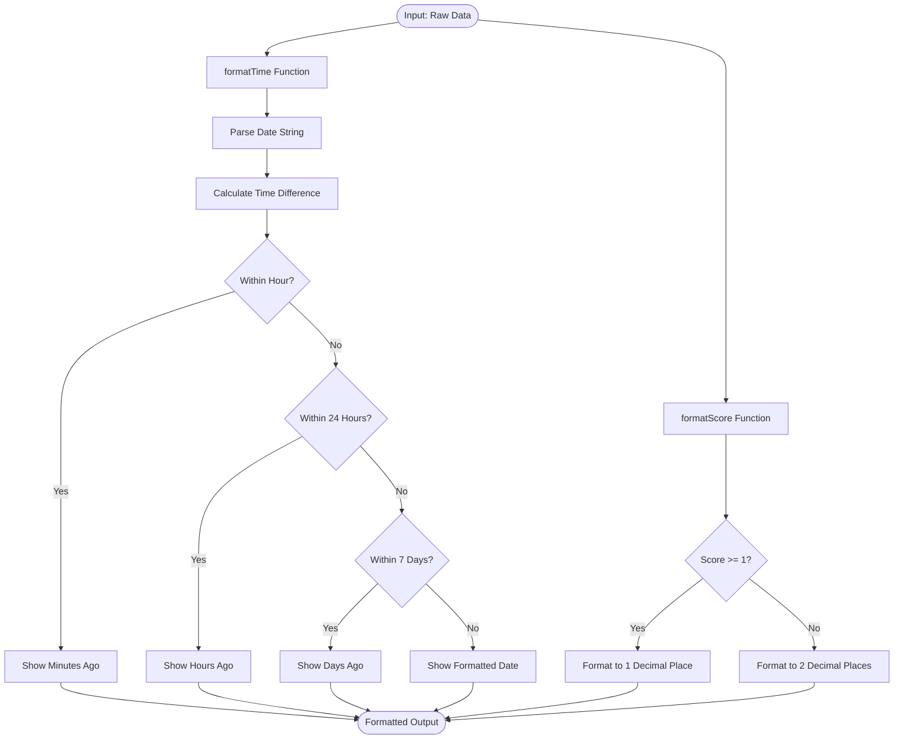
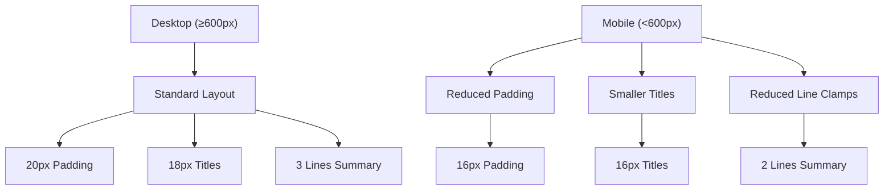
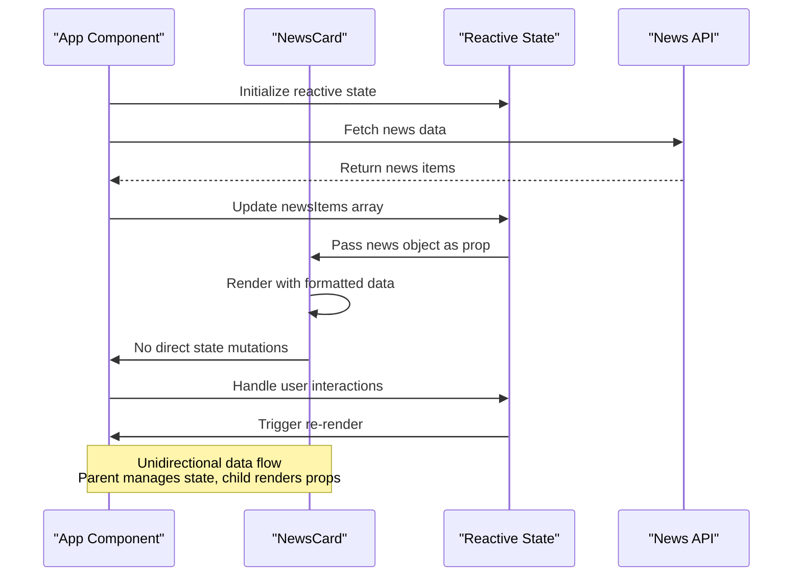
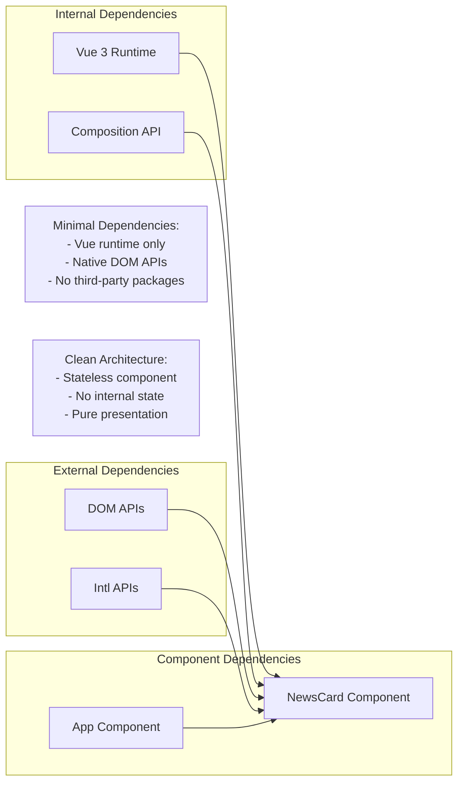

# NewsCard Component

<cite>
**Referenced Files in This Document**
- [NewsCard.vue](file://frontend/src/components/NewsCard.vue)
- [App.vue](file://frontend/src/App.vue)
- [models.py](file://backend/models.py)
- [app.py](file://backend/app.py)
- [main.js](file://frontend/src/main.js)
- [README.md](file://README.md)
</cite>

## Table of Contents
1. [Introduction](#introduction)
2. [Project Structure](#project-structure)
3. [Core Components](#core-components)
4. [Architecture Overview](#architecture-overview)
5. [Detailed Component Analysis](#detailed-component-analysis)
6. [Dependency Analysis](#dependency-analysis)
7. [Performance Considerations](#performance-considerations)
8. [Troubleshooting Guide](#troubleshooting-guide)
9. [Conclusion](#conclusion)

## Introduction
The NewsCard component serves as the primary content display unit for individual news items in the news aggregator application. It renders a single news article with essential metadata including title, summary, source, category, publication time, and optional hot score indicator. The component acts as a clickable card that opens the original news article in a new browser tab while maintaining clean separation between presentation and data management.

## Project Structure
The NewsCard component is part of a Vue 3 single-page application with a clear separation between frontend and backend services. The component integrates seamlessly with the parent App component through props-based communication and reactive state management.

**Diagram sources**
- [main.js:1-5](file://frontend/src/main.js#L1-L5)
- [App.vue:100-187](file://frontend/src/App.vue#L100-L187)
- [NewsCard.vue:30-84](file://frontend/src/components/NewsCard.vue#L30-L84)
- [app.py:21-55](file://backend/app.py#L21-L55)

**Section sources**
- [README.md:1-67](file://README.md#L1-L67)
- [main.js:1-5](file://frontend/src/main.js#L1-L5)

## Core Components
The NewsCard component is a self-contained Vue 3 component designed specifically for rendering individual news items. It implements a functional composition API approach with a single exported default configuration object containing template, script, and style sections.

Key characteristics:
- **Single Responsibility**: Focuses exclusively on displaying news item information
- **Props-based Interface**: Receives complete news object as prop for flexibility
- **Template-driven Rendering**: Uses Vue's template syntax for declarative UI construction
- **Scoped Styling**: Implements component-scoped CSS for encapsulation
- **Responsive Design**: Adapts layout for mobile and desktop screens

**Section sources**
- [NewsCard.vue:30-84](file://frontend/src/components/NewsCard.vue#L30-L84)

## Architecture Overview
The NewsCard component participates in a unidirectional data flow architecture where parent components manage state and pass data down as props. The component remains stateless, focusing solely on presentation logic.

**Diagram sources**
- [App.vue:122-146](file://frontend/src/App.vue#L122-L146)
- [NewsCard.vue:30-84](file://frontend/src/components/NewsCard.vue#L30-L84)

## Detailed Component Analysis

### Props Interface and Data Structure
The NewsCard component expects a single `news` prop containing a complete news object with the following structure:

**Diagram sources**
- [models.py:24-35](file://backend/models.py#L24-L35)
- [NewsCard.vue:33-38](file://frontend/src/components/NewsCard.vue#L33-L38)

The component's props interface defines:
- **Required**: `news` object with complete news data
- **Type**: JavaScript Object
- **Validation**: Required prop ensures data integrity

**Section sources**
- [NewsCard.vue:33-38](file://frontend/src/components/NewsCard.vue#L33-L38)
- [models.py:14-22](file://backend/models.py#L14-L22)

### Template Structure and Layout
The component's template implements a card-based layout with four distinct sections:

**Diagram sources**
- [NewsCard.vue:1-28](file://frontend/src/components/NewsCard.vue#L1-L28)

Layout structure breakdown:
1. **Container Element**: Anchor tag with `news-card` class and external link attributes
2. **Header Section**: Flex container showing category tag and source
3. **Title Area**: Two-line text with ellipsis truncation
4. **Summary Area**: Three-line text with ellipsis truncation
5. **Footer Section**: Flex container with time and optional hot score indicators

**Section sources**
- [NewsCard.vue:1-28](file://frontend/src/components/NewsCard.vue#L1-L28)

### Interaction Patterns and Event Handling
The component implements a single primary interaction pattern through click events on the anchor element:

**Diagram sources**
- [NewsCard.vue:2-7](file://frontend/src/components/NewsCard.vue#L2-L7)

Interaction characteristics:
- **Click Target**: Entire card area (anchor element)
- **Navigation Behavior**: Opens external links in new browser tabs
- **Security Measures**: Implements `rel="noopener noreferrer"` to prevent security vulnerabilities
- **Accessibility**: Maintains semantic anchor element for screen readers

**Section sources**
- [NewsCard.vue:2-7](file://frontend/src/components/NewsCard.vue#L2-L7)

### Formatting Functions and Data Processing
The component includes two specialized formatting functions for transforming raw data into user-friendly display formats:

**Diagram sources**
- [NewsCard.vue:40-82](file://frontend/src/components/NewsCard.vue#L40-L82)

Formatting logic:
- **Time Display**: Dynamic relative time calculation with multiple granularity levels
- **Hot Score Display**: Conditional decimal precision based on score magnitude
- **Date Parsing**: Robust handling of various date string formats
- **Edge Cases**: Graceful handling of missing or invalid data

**Section sources**
- [NewsCard.vue:40-82](file://frontend/src/components/NewsCard.vue#L40-L82)

### Visual Design Elements and Typography
The component implements a comprehensive design system with carefully chosen typography and spacing:

Typography hierarchy:
- **Title**: 18px font size (16px on mobile), 600 font weight, 1.4 line height
- **Summary**: 14px font size (13px on mobile), 1.6 line height
- **Category Tag**: 12px font size, 500 font weight
- **Source Information**: 13px font size, muted color
- **Footer Text**: 13px font size, subtle color

Color scheme:
- **Primary**: White background with light gray borders
- **Category Tags**: Gradient background from blue to purple
- **Hot Score**: Orange/yellow accent color (#f6ad55)
- **Text Colors**: Dark gray for primary text, medium gray for secondary

Spacing and layout:
- **Padding**: 20px on desktop, 16px on mobile
- **Line clamps**: 2 lines for titles, 3 lines for summaries
- **Flex layouts**: Responsive flex containers for header and footer

**Section sources**
- [NewsCard.vue:87-197](file://frontend/src/components/NewsCard.vue#L87-L197)

### Responsive Behavior
The component implements mobile-first responsive design with specific breakpoints and adaptations:

**Diagram sources**
- [NewsCard.vue:181-195](file://frontend/src/components/NewsCard.vue#L181-L195)

Responsive adaptations:
- **Breakpoint**: 600px viewport width
- **Padding**: Reduced from 20px to 16px
- **Typography**: Title font size reduced from 18px to 16px
- **Text Truncation**: Summary line clamp reduced from 3 to 2 lines
- **Layout**: Maintains flexbox responsiveness across devices

**Section sources**
- [NewsCard.vue:181-195](file://frontend/src/components/NewsCard.vue#L181-L195)

### Integration with Parent Component State Management
The NewsCard component integrates with the parent App component through props-based communication and reactive state management:

**Diagram sources**
- [App.vue:108-187](file://frontend/src/App.vue#L108-L187)
- [NewsCard.vue:33-38](file://frontend/src/components/NewsCard.vue#L33-L38)

Integration patterns:
- **Props Passing**: Parent passes complete news objects to children
- **Event Propagation**: Child components do not emit events upward
- **State Management**: Parent maintains all reactive state and business logic
- **Data Flow**: Unidirectional data flow from parent to child
- **Reactivity**: Automatic updates when parent state changes

**Section sources**
- [App.vue:54-60](file://frontend/src/App.vue#L54-L60)
- [App.vue:114-117](file://frontend/src/App.vue#L114-L117)

## Dependency Analysis
The NewsCard component has minimal external dependencies and maintains clean architectural boundaries:

**Diagram sources**
- [NewsCard.vue:30-84](file://frontend/src/components/NewsCard.vue#L30-L84)
- [main.js:1-5](file://frontend/src/main.js#L1-L5)

Dependency characteristics:
- **Runtime Dependencies**: Vue 3 core runtime and Composition API
- **Browser APIs**: DOM manipulation, Date parsing, Intl formatting
- **No External Packages**: Zero third-party dependencies
- **Lightweight**: Minimal bundle size impact
- **Self-contained**: All functionality in single file

**Section sources**
- [NewsCard.vue:30-84](file://frontend/src/components/NewsCard.vue#L30-L84)
- [main.js:1-5](file://frontend/src/main.js#L1-L5)

## Performance Considerations
The NewsCard component is optimized for performance through several design decisions:

- **Minimal Reactivity**: Stateless component with no internal reactive state
- **Efficient Rendering**: Single anchor element with minimal DOM nodes
- **CSS-in-JS**: Scoped styles prevent global CSS conflicts
- **Lazy Evaluation**: Formatting functions only execute when needed
- **Memory Efficient**: No event listeners or timers
- **Bundle Size**: Minimal footprint due to simplicity

Optimization opportunities:
- **Image Lazy Loading**: Could support image previews if needed
- **Intersection Observer**: Could implement lazy loading for off-screen cards
- **Virtual Scrolling**: Could optimize rendering for large lists
- **CSS Custom Properties**: Could enable theme customization

## Troubleshooting Guide

Common issues and solutions:

**Missing Data Display**
- **Symptom**: Empty fields or undefined values
- **Cause**: Missing or malformed news object
- **Solution**: Ensure parent component validates data before passing props

**Time Formatting Issues**
- **Symptom**: Incorrect time display or empty time field
- **Cause**: Invalid date format or missing publish date
- **Solution**: Component handles null/undefined gracefully with fallback empty string

**Link Navigation Problems**
- **Symptom**: Links don't open or open in same tab
- **Cause**: Missing or invalid link property
- **Solution**: Component uses target="_blank" with security attributes

**Styling Conflicts**
- **Symptom**: Component appears styled incorrectly
- **Cause**: Global CSS conflicts or missing scoped styles
- **Solution**: Component uses scoped CSS preventing conflicts

**Section sources**
- [NewsCard.vue:40-82](file://frontend/src/components/NewsCard.vue#L40-L82)
- [NewsCard.vue:87-197](file://frontend/src/components/NewsCard.vue#L87-L197)

## Conclusion
The NewsCard component exemplifies modern Vue 3 development practices through its functional composition API approach, clean separation of concerns, and focus on single responsibility. The component successfully balances simplicity with functionality, providing an elegant solution for displaying individual news items while maintaining excellent performance characteristics.

Key strengths:
- **Architectural Soundness**: Stateless design with clear data flow
- **User Experience**: Responsive design with thoughtful interactions
- **Maintainability**: Clean, readable code with comprehensive comments
- **Performance**: Lightweight implementation with minimal overhead
- **Accessibility**: Semantic HTML structure with proper ARIA considerations

The component serves as an excellent foundation for the news aggregator application, demonstrating best practices for component design, state management integration, and responsive web development.