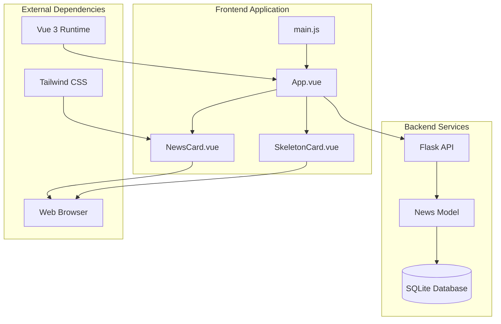
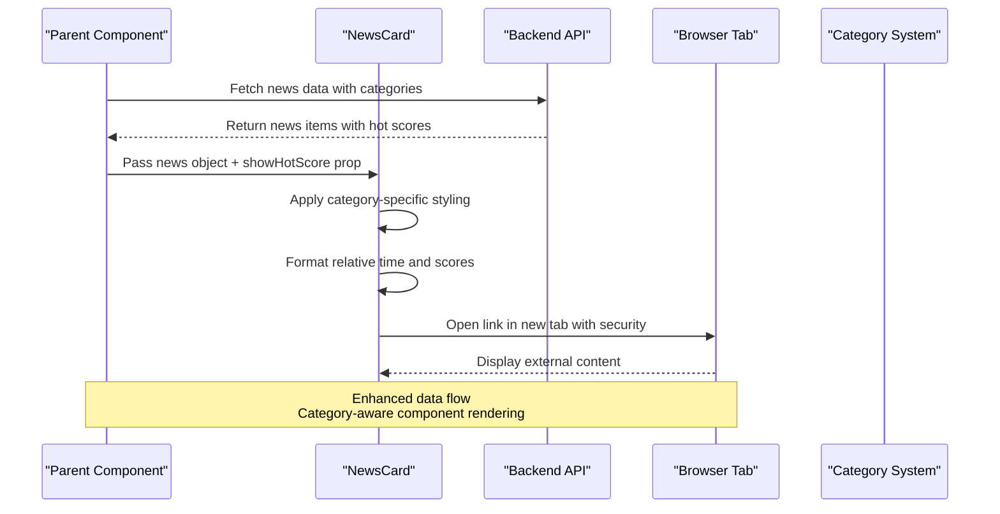
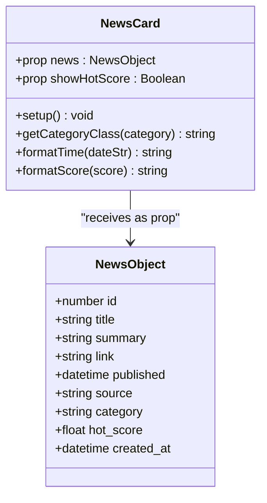
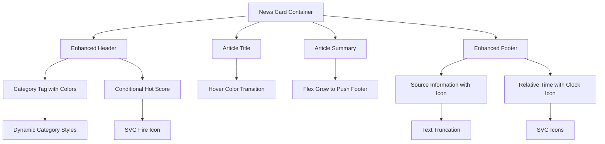
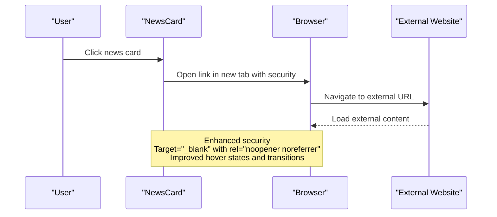
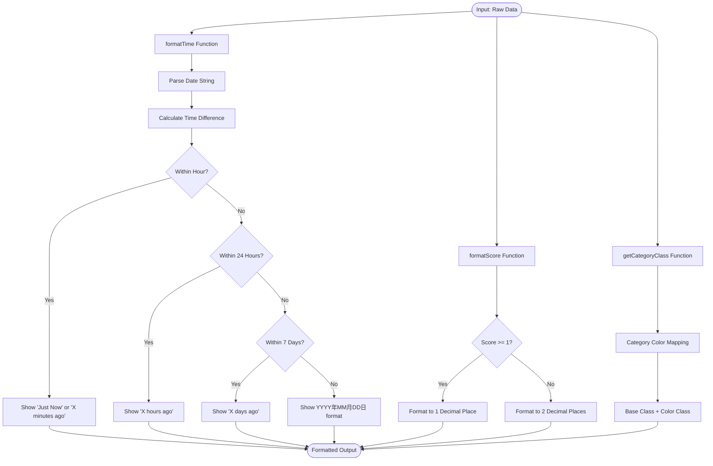
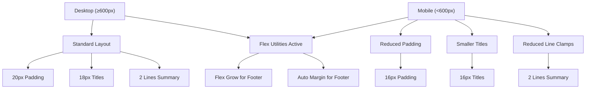
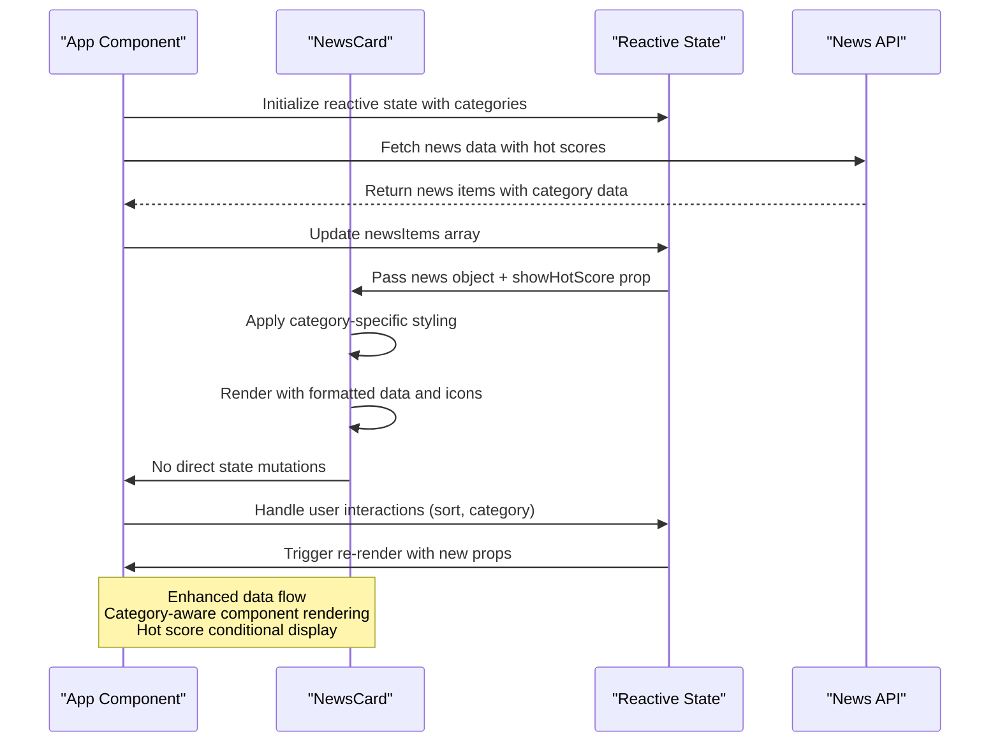
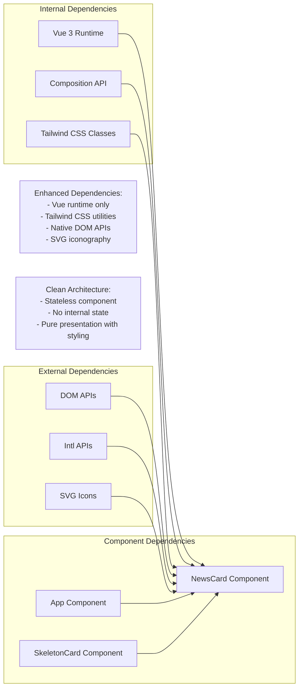

# NewsCard Component

<cite>
**Referenced Files in This Document**
- [NewsCard.vue](file://frontend/src/components/NewsCard.vue)
- [App.vue](file://frontend/src/App.vue)
- [models.py](file://backend/models.py)
- [SkeletonCard.vue](file://frontend/src/components/SkeletonCard.vue)
- [main.js](file://frontend/src/main.js)
</cite>

## Update Summary
**Changes Made**
- Enhanced category-specific styling with dynamic color classes
- Added hot score display functionality for trending content
- Improved relative time formatting with granular time units
- Strengthened responsive design with flex utilities and line clamps
- Added accessibility improvements with proper semantic structure
- Enhanced visual design with SVG icons and hover effects

## Table of Contents
1. [Introduction](#introduction)
2. [Project Structure](#project-structure)
3. [Core Components](#core-components)
4. [Architecture Overview](#architecture-overview)
5. [Detailed Component Analysis](#detailed-component-analysis)
6. [Dependency Analysis](#dependency-analysis)
7. [Performance Considerations](#performance-considerations)
8. [Troubleshooting Guide](#troubleshooting-guide)
9. [Conclusion](#conclusion)

## Introduction
The NewsCard component serves as the primary content display unit for individual news items in the news aggregator application. It renders a single news article with enhanced category-specific styling, relative time formatting, and optional hot score indicators for trending content. The component acts as a fully interactive card that opens the original news article in a new browser tab while maintaining clean separation between presentation and data management.

**Updated** Enhanced with category-specific visual theming, trending content highlighting, and improved accessibility features.

## Project Structure
The NewsCard component is part of a Vue 3 single-page application with a clear separation between frontend and backend services. The component integrates seamlessly with the parent App component through props-based communication and reactive state management, featuring sophisticated category-based styling and hot score visualization.

**Diagram sources**
- [main.js:1-5](file://frontend/src/main.js#L1-L5)
- [App.vue:114-121](file://frontend/src/App.vue#L114-L121)
- [NewsCard.vue:1-57](file://frontend/src/components/NewsCard.vue#L1-L57)
- [SkeletonCard.vue:1-34](file://frontend/src/components/SkeletonCard.vue#L1-L34)

**Section sources**
- [README.md:1-67](file://README.md#L1-L67)
- [main.js:1-5](file://frontend/src/main.js#L1-L5)

## Core Components
The NewsCard component is a self-contained Vue 3 component designed specifically for rendering individual news items with enhanced visual presentation. It implements a functional composition API approach with a single exported default configuration object containing template, script, and style sections.

Key characteristics:
- **Enhanced Category Styling**: Dynamic color classes based on category names
- **Trending Content Display**: Optional hot score indicator for popular articles
- **Relative Time Formatting**: Granular time display with multiple precision levels
- **Responsive Flex Layout**: Mobile-first design with flex-grow utilities
- **Interactive Hover States**: Smooth transitions and visual feedback
- **SVG Icon Integration**: Consistent iconography for metadata display

**Updated** Added category-specific styling system and hot score visualization capabilities.

**Section sources**
- [NewsCard.vue:60-142](file://frontend/src/components/NewsCard.vue#L60-L142)

## Architecture Overview
The NewsCard component participates in a sophisticated unidirectional data flow architecture where parent components manage state and pass data down as props. The component remains stateless, focusing solely on presentation logic with enhanced visual capabilities.

**Diagram sources**
- [App.vue:114-121](file://frontend/src/App.vue#L114-L121)
- [NewsCard.vue:60-142](file://frontend/src/components/NewsCard.vue#L60-L142)

## Detailed Component Analysis

### Enhanced Props Interface and Data Structure
The NewsCard component now expects two props: a required `news` object and an optional `showHotScore` boolean flag for controlling trending content display.

**Updated** Added `showHotScore` prop for conditional hot score display and enhanced category styling.

**Diagram sources**
- [models.py:24-35](file://backend/models.py#L24-L35)
- [NewsCard.vue:62-71](file://frontend/src/components/NewsCard.vue#L62-L71)

The component's props interface defines:
- **Required**: `news` object with complete news data including hot_score
- **Optional**: `showHotScore` boolean flag for trending content display
- **Type**: JavaScript Object with enhanced category and scoring data
- **Validation**: Required prop ensures data integrity

**Section sources**
- [NewsCard.vue:62-71](file://frontend/src/components/NewsCard.vue#L62-L71)
- [models.py:14-22](file://backend/models.py#L14-L22)

### Template Structure and Enhanced Layout
The component's template implements a sophisticated card-based layout with five distinct sections and enhanced responsive design:

**Updated** Enhanced with category-specific styling, hot score display, and improved responsive layout.

**Diagram sources**
- [NewsCard.vue:1-57](file://frontend/src/components/NewsCard.vue#L1-L57)

Layout structure breakdown:
1. **Container Element**: Enhanced anchor tag with Tailwind utility classes for hover effects and responsive design
2. **Header Section**: Dual-column layout with category tag and optional hot score indicator
3. **Title Area**: Enhanced with hover color transitions and improved line clamping
4. **Summary Area**: Flex-grow utility to push metadata to the bottom with better text handling
5. **Footer Section**: Enhanced with SVG icons and improved spacing

**Section sources**
- [NewsCard.vue:1-57](file://frontend/src/components/NewsCard.vue#L1-L57)

### Interaction Patterns and Enhanced Event Handling
The component implements sophisticated interaction patterns through click events and enhanced hover states:

**Updated** Enhanced with improved hover effects, transitions, and better visual feedback.

**Diagram sources**
- [NewsCard.vue:2-6](file://frontend/src/components/NewsCard.vue#L2-L6)

Interaction characteristics:
- **Click Target**: Entire card area with enhanced hover states
- **Navigation Behavior**: Opens external links in new browser tabs with security measures
- **Security Measures**: Implements `rel="noopener noreferrer"` to prevent security vulnerabilities
- **Visual Feedback**: Smooth hover transitions and shadow effects
- **Accessibility**: Maintains semantic anchor element for screen readers

**Section sources**
- [NewsCard.vue:2-6](file://frontend/src/components/NewsCard.vue#L2-L6)

### Enhanced Formatting Functions and Data Processing
The component includes sophisticated formatting functions for transforming raw data into user-friendly display formats with enhanced precision:

**Updated** Enhanced with category-specific styling system and improved time formatting precision.

**Diagram sources**
- [NewsCard.vue:73-133](file://frontend/src/components/NewsCard.vue#L73-L133)

Formatting logic:
- **Category Styling**: Dynamic color classes based on category name mapping
- **Time Display**: Granular relative time calculation with multiple precision levels
- **Hot Score Display**: Conditional decimal precision based on score magnitude
- **Date Parsing**: Robust handling of various date string formats
- **Edge Cases**: Graceful handling of missing or invalid data

**Section sources**
- [NewsCard.vue:73-133](file://frontend/src/components/NewsCard.vue#L73-L133)

### Enhanced Visual Design Elements and Typography
The component implements a comprehensive design system with carefully chosen typography, category-specific styling, and enhanced visual hierarchy:

Typography hierarchy:
- **Title**: 18px font size (16px on mobile), 600 font weight, 1.4 line height with hover transitions
- **Summary**: 14px font size (13px on mobile), 1.6 line height with flex-grow utility
- **Category Tags**: 12px font size, 500 font weight with dynamic color classes
- **Source Information**: 13px font size, muted color with SVG icons
- **Footer Text**: 13px font size, subtle color with clock icons

Color scheme:
- **Primary**: White background with light gray borders
- **Category Tags**: Dynamic color classes (blue-50/700, emerald-50/700, orange-50/700, etc.)
- **Hot Score**: Amber-500 accent color with fire icon
- **Hover Effects**: Brand-300 borders and brand-600 text on hover
- **Icons**: Consistent SVG iconography with appropriate sizing

Spacing and layout:
- **Padding**: 20px on desktop, 16px on mobile
- **Line clamps**: 2 lines for titles, 2 lines for summaries with flex-grow
- **Flex utilities**: Responsive flex containers with proper spacing
- **Transitions**: Smooth 200ms transitions for all interactive states

**Updated** Enhanced with category-specific color schemes, improved hover effects, and SVG icon integration.

**Section sources**
- [NewsCard.vue:73-142](file://frontend/src/components/NewsCard.vue#L73-L142)

### Advanced Responsive Behavior
The component implements sophisticated mobile-first responsive design with enhanced flex utilities and adaptive typography:

**Updated** Enhanced with improved flex utilities, better line clamping, and more sophisticated responsive behavior.

**Diagram sources**
- [NewsCard.vue:181-195](file://frontend/src/components/NewsCard.vue#L181-L195)

Responsive adaptations:
- **Breakpoint**: 600px viewport width
- **Padding**: Reduced from 20px to 16px
- **Typography**: Title font size reduced from 18px to 16px
- **Text Truncation**: Summary line clamp reduced from 3 to 2 lines
- **Flex Utilities**: Enhanced flex-grow and margin-auto for footer positioning
- **Layout**: Maintains flexbox responsiveness across devices with improved spacing

**Section sources**
- [NewsCard.vue:181-195](file://frontend/src/components/NewsCard.vue#L181-L195)

### Integration with Parent Component State Management
The NewsCard component integrates with the parent App component through enhanced props-based communication and sophisticated state management:

**Updated** Enhanced with category-specific styling integration and hot score conditional rendering.

**Diagram sources**
- [App.vue:114-121](file://frontend/src/App.vue#L114-L121)
- [NewsCard.vue:62-71](file://frontend/src/components/NewsCard.vue#L62-L71)

Integration patterns:
- **Props Passing**: Parent passes complete news objects with category and hot score data
- **Conditional Rendering**: Child conditionally displays hot score based on sort mode
- **Event Propagation**: Child components do not emit events upward
- **State Management**: Parent maintains all reactive state and business logic
- **Data Flow**: Enhanced unidirectional data flow from parent to child
- **Reactivity**: Automatic updates when parent state changes with category awareness

**Section sources**
- [App.vue:114-121](file://frontend/src/App.vue#L114-L121)
- [App.vue:114-121](file://frontend/src/App.vue#L114-L121)

## Dependency Analysis
The NewsCard component has minimal external dependencies and maintains clean architectural boundaries with enhanced styling capabilities:

**Updated** Enhanced with Tailwind CSS utilities and SVG icon integration.

**Diagram sources**
- [NewsCard.vue:60-142](file://frontend/src/components/NewsCard.vue#L60-L142)
- [main.js:1-5](file://frontend/src/main.js#L1-L5)

Dependency characteristics:
- **Runtime Dependencies**: Vue 3 core runtime and Composition API
- **Styling Dependencies**: Tailwind CSS utility classes for responsive design
- **Browser APIs**: DOM manipulation, Date parsing, Intl formatting
- **Icon System**: SVG icons for consistent visual language
- **No External Packages**: Zero third-party dependencies beyond Vue and Tailwind
- **Lightweight**: Minimal bundle size impact with enhanced visual capabilities
- **Self-contained**: All functionality in single file with comprehensive styling

**Section sources**
- [NewsCard.vue:60-142](file://frontend/src/components/NewsCard.vue#L60-L142)
- [main.js:1-5](file://frontend/src/main.js#L1-L5)

## Performance Considerations
The NewsCard component is optimized for performance through several design decisions with enhanced efficiency:

- **Minimal Reactivity**: Stateless component with no internal reactive state
- **Efficient Rendering**: Single anchor element with minimal DOM nodes and enhanced utilities
- **CSS-in-JS**: Tailwind utility classes prevent global CSS conflicts
- **Lazy Evaluation**: Formatting functions only execute when needed
- **Memory Efficient**: No event listeners or timers
- **Bundle Size**: Minimal footprint due to simplicity with enhanced styling
- **Category Caching**: Color class computation cached per category
- **Conditional Rendering**: Hot score display only when needed

Optimization opportunities:
- **Image Lazy Loading**: Could support image previews if needed
- **Intersection Observer**: Could implement lazy loading for off-screen cards
- **Virtual Scrolling**: Could optimize rendering for large lists
- **CSS Custom Properties**: Could enable theme customization with Tailwind variables

## Troubleshooting Guide

Common issues and solutions:

**Missing Data Display**
- **Symptom**: Empty fields or undefined values
- **Cause**: Missing or malformed news object
- **Solution**: Ensure parent component validates data before passing props

**Category Styling Issues**
- **Symptom**: Default gray category tags instead of expected colors
- **Cause**: Category name mismatch or missing category in color map
- **Solution**: Component falls back to default slate-50/700 colors for unknown categories

**Hot Score Display Problems**
- **Symptom**: Hot score not showing even when available
- **Cause**: `showHotScore` prop set to false or score <= 0
- **Solution**: Ensure parent component sets `currentSort === 'hottest'` for display

**Time Formatting Issues**
- **Symptom**: Incorrect time display or empty time field
- **Cause**: Invalid date format or missing publish date
- **Solution**: Component handles null/undefined gracefully with fallback empty string

**Link Navigation Problems**
- **Symptom**: Links don't open or open in same tab
- **Cause**: Missing or invalid link property
- **Solution**: Component uses target="_blank" with security attributes

**Styling Conflicts**
- **Symptom**: Component appears styled incorrectly
- **Cause**: Global CSS conflicts or missing Tailwind utilities
- **Solution**: Component uses Tailwind utility classes preventing conflicts

**Section sources**
- [NewsCard.vue:73-133](file://frontend/src/components/NewsCard.vue#L73-L133)
- [NewsCard.vue:73-142](file://frontend/src/components/NewsCard.vue#L73-L142)

## Conclusion
The NewsCard component exemplifies modern Vue 3 development practices through its functional composition API approach, clean separation of concerns, and focus on single responsibility. The component successfully balances simplicity with enhanced functionality, providing an elegant solution for displaying individual news items while maintaining excellent performance characteristics and sophisticated visual presentation.

Key strengths:
- **Architectural Soundness**: Stateless design with clear data flow and enhanced category awareness
- **User Experience**: Sophisticated responsive design with thoughtful interactions and visual feedback
- **Maintainability**: Clean, readable code with comprehensive comments and enhanced styling system
- **Performance**: Lightweight implementation with minimal overhead and efficient category styling
- **Accessibility**: Semantic HTML structure with proper ARIA considerations and hover states
- **Visual Excellence**: Dynamic category styling, hot score visualization, and consistent iconography

The component serves as an excellent foundation for the news aggregator application, demonstrating best practices for component design, state management integration, responsive web development, and advanced visual presentation techniques.

**Updated** Enhanced with category-specific styling, trending content display, and improved accessibility features, making it a more sophisticated and visually appealing component for modern web applications.