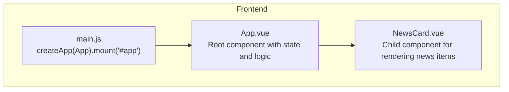
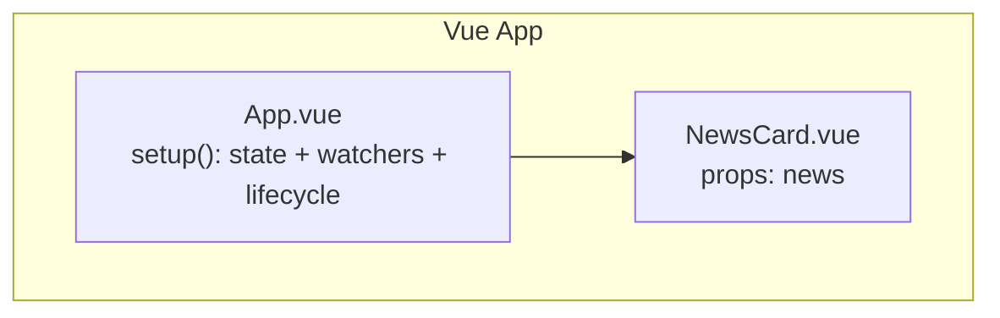
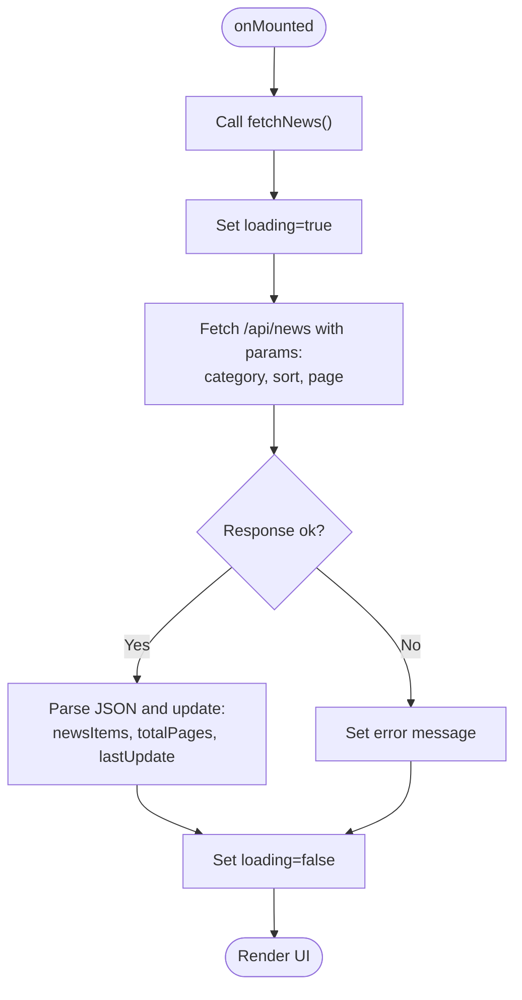
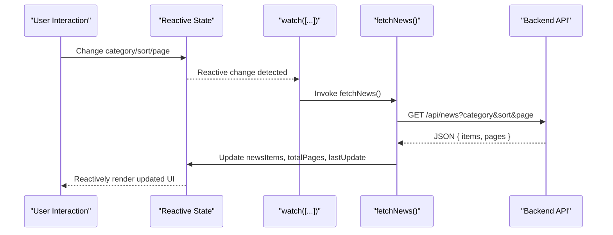
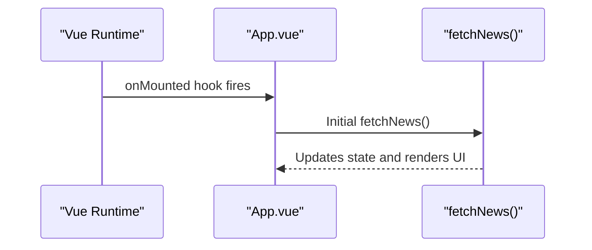
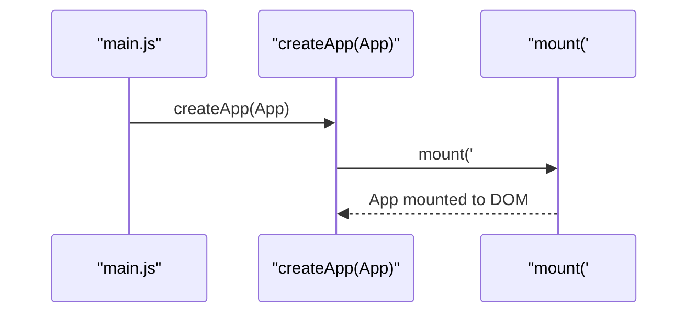
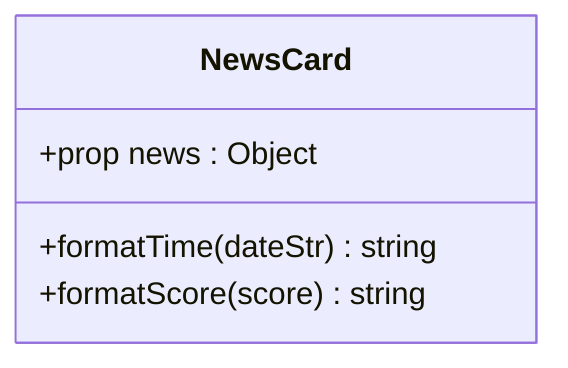
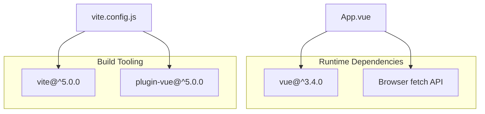

# State Management

<cite>
**Referenced Files in This Document**
- [main.js](file://frontend/src/main.js)
- [App.vue](file://frontend/src/App.vue)
- [NewsCard.vue](file://frontend/src/components/NewsCard.vue)
- [package.json](file://frontend/package.json)
- [vite.config.js](file://frontend/vite.config.js)
- [README.md](file://README.md)
</cite>

## Table of Contents
1. [Introduction](#introduction)
2. [Project Structure](#project-structure)
3. [Core Components](#core-components)
4. [Architecture Overview](#architecture-overview)
5. [Detailed Component Analysis](#detailed-component-analysis)
6. [Dependency Analysis](#dependency-analysis)
7. [Performance Considerations](#performance-considerations)
8. [Troubleshooting Guide](#troubleshooting-guide)
9. [Conclusion](#conclusion)

## Introduction
This document explains the frontend state management implementation built with Vue 3 Composition API. It focuses on how reactive references (ref) are used to manage component state, the watch mechanism for automatic re-fetching, lifecycle management with onMounted, and integration with the main.js entry point. It also documents the state structure, including categories, currentCategory, currentSort, pagination state, newsItems collection, and loading/error states.

## Project Structure
The frontend is a minimal Vue 3 application with a single root component and one child component:
- Entry point initializes the Vue app and mounts it to the DOM.
- Root component manages all state, UI controls, and data fetching.
- Child component renders individual news items and performs local formatting.

**Diagram sources**
- [main.js:1-5](file://frontend/src/main.js#L1-L5)
- [App.vue:103-187](file://frontend/src/App.vue#L103-L187)
- [NewsCard.vue:31-84](file://frontend/src/components/NewsCard.vue#L31-L84)

**Section sources**
- [main.js:1-5](file://frontend/src/main.js#L1-L5)
- [App.vue:103-187](file://frontend/src/App.vue#L103-L187)
- [NewsCard.vue:31-84](file://frontend/src/components/NewsCard.vue#L31-L84)

## Core Components
This section documents the state structure and reactive patterns used in the root component.

- Reactive state primitives
  - categories: Array of category strings used for filtering.
  - currentCategory: Reactive reference to the selected category.
  - currentSort: Reactive reference to the sorting preference.
  - currentPage: Reactive reference to the current page index.
  - totalPages: Reactive reference to total pages computed from API response.
  - newsItems: Reactive reference to the list of news items.
  - loading: Reactive reference indicating ongoing network activity.
  - error: Reactive reference storing error messages.
  - lastUpdate: Reactive reference storing the last successful update timestamp.

- Composition API usage
  - The root component uses setup() to declare and export reactive state and methods.
  - Methods mutate reactive state directly (e.g., setting loading, error, newsItems).
  - Template bindings reference reactive state and event handlers.

- Fetching and pagination
  - fetchNews constructs query parameters from reactive state and calls the backend API.
  - The API response updates newsItems, totalPages, and lastUpdate.
  - Pagination controls update currentPage and scroll to top.

- Watch and lifecycle
  - A watcher observes changes to currentCategory, currentSort, and currentPage and triggers fetchNews.
  - onMounted triggers initial data load when the component is mounted.

**Section sources**
- [App.vue:108-187](file://frontend/src/App.vue#L108-L187)

## Architecture Overview
The state management architecture centers around a single root component that encapsulates all UI state and data fetching logic. The child component is presentational and receives data via props.

**Diagram sources**
- [App.vue:103-187](file://frontend/src/App.vue#L103-L187)
- [NewsCard.vue:31-84](file://frontend/src/components/NewsCard.vue#L31-L84)

## Detailed Component Analysis

### Root Component State and Lifecycle
The root component defines and manages all state using Vue 3 Composition API. It sets up watchers and lifecycle hooks to orchestrate data fetching and UI updates.

**Diagram sources**
- [App.vue:122-146](file://frontend/src/App.vue#L122-L146)
- [App.vue:168-170](file://frontend/src/App.vue#L168-L170)

Key implementation patterns:
- Reactive references for all state fields.
- Computed parameters from reactive state passed to fetch.
- Error handling with centralized error state.
- Watcher on reactive arrays to trigger refetch on any state change.
- Lifecycle hook to bootstrap initial load.

**Section sources**
- [App.vue:108-187](file://frontend/src/App.vue#L108-L187)

### Watch Mechanism for Automatic Re-fetching
The watcher monitors changes to the reactive state array [currentCategory, currentSort, currentPage] and triggers fetchNews automatically when any of these values change.

**Diagram sources**
- [App.vue:164-166](file://frontend/src/App.vue#L164-L166)
- [App.vue:122-146](file://frontend/src/App.vue#L122-L146)

Behavioral notes:
- Changing category resets page to 1.
- Switching sort resets page to 1.
- Navigating pages updates page index and scrolls to top.

**Section sources**
- [App.vue:148-161](file://frontend/src/App.vue#L148-L161)
- [App.vue:164-166](file://frontend/src/App.vue#L164-L166)

### Lifecycle Management with onMounted
The component uses onMounted to perform the initial data load when the component is attached to the DOM.

**Diagram sources**
- [App.vue:168-170](file://frontend/src/App.vue#L168-L170)

**Section sources**
- [App.vue:168-170](file://frontend/src/App.vue#L168-L170)

### Integration with main.js and Vue Application Setup
The application bootstraps by creating a Vue app instance and mounting it to the DOM element with id app.

**Diagram sources**
- [main.js:1-5](file://frontend/src/main.js#L1-L5)

**Section sources**
- [main.js:1-5](file://frontend/src/main.js#L1-L5)

### Child Component: NewsCard
The NewsCard component is a presentational component that receives a single news item via props and formats display fields locally.

**Diagram sources**
- [NewsCard.vue:31-84](file://frontend/src/components/NewsCard.vue#L31-L84)

Best practices demonstrated:
- Props-driven interface for predictable data flow.
- Local formatting helpers encapsulated within setup().
- No external state mutation; purely presentational.

**Section sources**
- [NewsCard.vue:31-84](file://frontend/src/components/NewsCard.vue#L31-L84)

## Dependency Analysis
The frontend depends on Vue 3 and Vite for development and build. The root component imports Vue’s Composition API primitives and integrates with the browser fetch API.

**Diagram sources**
- [package.json:11-17](file://frontend/package.json#L11-L17)
- [vite.config.js:1-17](file://frontend/vite.config.js#L1-17)

**Section sources**
- [package.json:11-17](file://frontend/package.json#L11-L17)
- [vite.config.js:1-17](file://frontend/vite.config.js#L1-17)

## Performance Considerations
- Debouncing or throttling watchers: If frequent rapid state changes occur, consider debouncing the watcher to reduce redundant requests.
- Efficient reactivity: Group related state changes to minimize render cycles.
- Virtualization: For large lists, consider virtualizing the news list to improve scrolling performance.
- Caching: Implement client-side caching for recent pages to avoid repeated network calls.
- Lazy loading: Defer heavy computations until after initial render.

## Troubleshooting Guide
Common issues and resolutions:
- Network errors
  - Symptom: Error state displays with retry button.
  - Action: Verify backend availability and CORS/proxy configuration.
  - Reference: [App.vue:140-145](file://frontend/src/App.vue#L140-L145)

- Pagination disabled states
  - Symptom: Previous/next buttons disabled at boundaries.
  - Action: Confirm totalPages reflects actual page count from API.
  - Reference: [App.vue:63-81](file://frontend/src/App.vue#L63-L81)

- Initial load not triggering
  - Symptom: Blank screen on first visit.
  - Action: Ensure onMounted hook executes and fetchNews is invoked.
  - Reference: [App.vue:168-170](file://frontend/src/App.vue#L168-L170)

- Proxy configuration
  - Symptom: API calls fail during development.
  - Action: Confirm Vite proxy targets the correct backend port.
  - Reference: [vite.config.js:9-14](file://frontend/vite.config.js#L9-L14)

- Environment variable for API base
  - Symptom: API calls missing base URL.
  - Action: Set VITE_API_BASE in environment or adjust API_BASE logic.
  - Reference: [App.vue:120](file://frontend/src/App.vue#L120)

**Section sources**
- [App.vue:140-145](file://frontend/src/App.vue#L140-L145)
- [App.vue:63-81](file://frontend/src/App.vue#L63-L81)
- [App.vue:168-170](file://frontend/src/App.vue#L168-L170)
- [vite.config.js:9-14](file://frontend/vite.config.js#L9-L14)
- [App.vue:120](file://frontend/src/App.vue#L120)

## Conclusion
The frontend implements a clean, reactive state management pattern using Vue 3 Composition API. The root component centralizes state, watchers, and lifecycle logic, while a small presentational child component handles rendering and formatting. The design follows best practices for separation of concerns, predictable data flow, and responsive UI updates driven by reactive state changes.