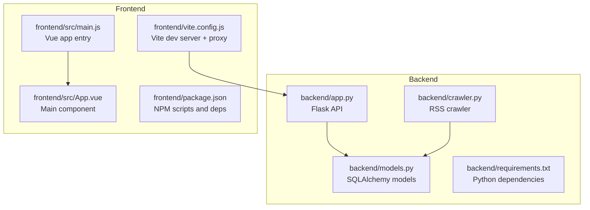
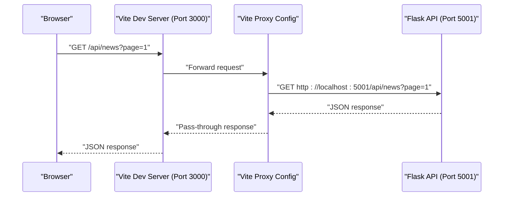

# Getting Started

<cite>
**Referenced Files in This Document**
- [README.md](file://README.md)
- [SETUP.md](file://SETUP.md)
- [backend/requirements.txt](file://backend/requirements.txt)
- [backend/app.py](file://backend/app.py)
- [backend/models.py](file://backend/models.py)
- [backend/crawler.py](file://backend/crawler.py)
- [frontend/package.json](file://frontend/package.json)
- [frontend/vite.config.js](file://frontend/vite.config.js)
- [frontend/src/App.vue](file://frontend/src/App.vue)
- [.github/workflows/crawler.yml](file://.github/workflows/crawler.yml)
</cite>

## Update Summary
**Changes Made**
- Updated prerequisites to specify Python 3.12+ and Node.js 18+ requirements
- Added comprehensive environment configuration for Windows, Linux, and macOS platforms
- Enhanced troubleshooting guide with detailed solutions for common setup issues
- Expanded development workflow with platform-specific instructions
- Added detailed virtual environment setup and dependency management guidance

## Table of Contents
1. [Introduction](#introduction)
2. [Prerequisites](#prerequisites)
3. [Project Structure](#project-structure)
4. [Local Development Setup](#local-development-setup)
5. [Environment Configuration](#environment-configuration)
6. [Development Workflow](#development-workflow)
7. [Verification Steps](#verification-steps)
8. [Troubleshooting Guide](#troubleshooting-guide)
9. [Conclusion](#conclusion)

## Introduction
This guide helps you set up and run the News Aggregator application locally. It covers backend (Flask API) and frontend (Vue 3) components, environment setup, dependency installation, and initial startup procedures. You will learn how to run both servers simultaneously, configure the development proxy, and verify that everything works as expected.

**Updated** Enhanced with comprehensive setup instructions for multiple platforms and detailed troubleshooting guidance.

## Prerequisites
Before starting, ensure you have the following installed on your development machine:

- **Python 3.12+** (required for backend development)
- **Node.js 18+** (required for frontend development)
- **npm 9+** (Node.js package manager)
- Git (recommended for cloning the repository)

These requirements are essential for running both the backend Flask API and the Vue.js frontend in development mode across all supported platforms.

**Section sources**
- [SETUP.md:5-12](file://SETUP.md#L5-L12)
- [README.md:28-47](file://README.md#L28-L47)
- [.github/workflows/crawler.yml:21-25](file://.github/workflows/crawler.yml#L21-L25)

## Project Structure
The repository is organized into two main parts:

- **backend**: Flask API server, database models, and RSS crawler
- **frontend**: Vue 3 SPA with Vite development server and proxy configuration



**Diagram sources**
- [backend/app.py:1-182](file://backend/app.py#L1-L182)
- [backend/models.py:1-49](file://backend/models.py#L1-L49)
- [backend/crawler.py:1-358](file://backend/crawler.py#L1-L358)
- [frontend/src/main.js](file://frontend/src/main.js)
- [frontend/src/App.vue:1-614](file://frontend/src/App.vue#L1-L614)
- [frontend/package.json:1-20](file://frontend/package.json#L1-L20)
- [frontend/vite.config.js:1-21](file://frontend/vite.config.js#L1-L21)

**Section sources**
- [README.md:5-26](file://README.md#L5-L26)

## Local Development Setup
Follow these step-by-step instructions to prepare your local environment.

### Backend Setup
1. **Navigate to the backend directory**
2. **Create a Python virtual environment**
3. **Activate the virtual environment**
4. **Install Python dependencies from requirements.txt**
5. **Initialize the database and start the Flask API server**

**Platform-specific commands:**

**Windows PowerShell:**
```powershell
cd backend
python -m venv venv
.\venv\Scripts\Activate.ps1
pip install -r requirements.txt
python app.py
```

**Linux/macOS:**
```bash
cd backend
python3 -m venv venv
source venv/bin/activate
pip install -r requirements.txt
python app.py
```

**Section sources**
- [SETUP.md:54-88](file://SETUP.md#L54-L88)
- [README.md:30-40](file://README.md#L30-L40)

### Frontend Setup
1. **Navigate to the frontend directory**
2. **Install Node.js dependencies using npm**
3. **Start the Vite development server**

**Platform-specific commands:**

**Windows PowerShell:**
```powershell
cd frontend
npm install
npm run dev
```

**Linux/macOS:**
```bash
cd frontend
npm install
npm run dev
```

**Section sources**
- [SETUP.md:90-111](file://SETUP.md#L90-L111)
- [README.md:52-66](file://README.md#L52-L66)

## Environment Configuration
Configure your development environment to support both backend and frontend servers.

### Backend Database Configuration
- The Flask app uses SQLite and stores the database file under the backend directory
- The database URI is constructed dynamically based on the backend directory path

**Important paths and configuration:**
- Database file location: `backend/news.db`
- Application configuration for SQLite
- Automatic database initialization on first run

**Section sources**
- [backend/app.py:25-29](file://backend/app.py#L25-L29)
- [backend/app.py:156-177](file://backend/app.py#L156-L177)

### Frontend Proxy Configuration
- Vite proxies API requests from the frontend to the backend Flask server
- The proxy target is configured to forward requests from `/api` to `http://localhost:5001`

**Proxy behavior:**
- Requests to `/api/*` are proxied to the backend
- Frontend development server runs on port 3000
- Backend Flask server runs on port 5001

**Section sources**
- [frontend/vite.config.js:7-15](file://frontend/vite.config.js#L7-L15)
- [backend/app.py:179-182](file://backend/app.py#L179-L182)

### Frontend API Base URL
- The frontend reads an environment variable to determine the API base URL
- In development, the proxy handles API routing; in production, you can set `VITE_API_BASE` to override the base URL

**Environment variable usage:**
- `VITE_API_BASE` for overriding API base URL
- Defaults to empty string for local development

**Section sources**
- [frontend/src/App.vue:327-329](file://frontend/src/App.vue#L327-L329)

## Development Workflow
Run the backend and frontend servers concurrently during development.

### Step-by-step Workflow
1. **Start the Flask API server** in the backend directory
2. **Start the Vite development server** in the frontend directory
3. **Access the frontend** at `http://localhost:3000`
4. **The frontend will proxy API requests** to `http://localhost:5001`

### How the Proxy Works


**Diagram sources**
- [frontend/vite.config.js:9-14](file://frontend/vite.config.js#L9-L14)
- [backend/app.py:67-106](file://backend/app.py#L67-L106)

**Section sources**
- [README.md:28-47](file://README.md#L28-L47)
- [frontend/vite.config.js:7-15](file://frontend/vite.config.js#L7-L15)
- [backend/app.py:179-182](file://backend/app.py#L179-L182)

## Verification Steps
After starting both servers, verify that the application is functioning correctly.

### Backend Health Check
- Access the health endpoint to confirm the backend is running
- Expected response indicates the service is healthy

**Endpoint:**
- `GET /api/health`

**Section sources**
- [backend/app.py:142-145](file://backend/app.py#L142-L145)

### Fetch News Data
- Load the frontend at `http://localhost:3000`
- The frontend will automatically fetch news items from the backend
- Verify that news cards appear and pagination controls are functional

**Frontend behavior:**
- Automatic fetch on mount
- Category and sort options
- Pagination navigation

**Section sources**
- [frontend/src/App.vue:400-426](file://frontend/src/App.vue#L400-L426)
- [frontend/src/App.vue:553-565](file://frontend/src/App.vue#L553-L565)

### Database Initialization
- On first run, the backend initializes the SQLite database and creates tables
- Confirm that the database file is created in the backend directory

**Initialization:**
- Creates all tables defined in models
- Prints initialization message
- Sets up database indexes for performance

**Section sources**
- [backend/app.py:156-177](file://backend/app.py#L156-L177)
- [backend/models.py:10-49](file://backend/models.py#L10-L49)

## Troubleshooting Guide
Common issues and their solutions during local development.

### Backend Issues
- **Port conflicts**: Flask defaults to port 5001. If this port is in use, adjust the port in the Flask server configuration
- **Database permissions**: Ensure write permissions to the backend directory so the SQLite file can be created
- **Missing virtual environment**: Always activate the Python virtual environment before installing dependencies

**Platform-specific solutions:**

**Windows PowerShell Execution Policy:**
```powershell
# Check current policy
Get-ExecutionPolicy

# Set execution policy for current user
Set-ExecutionPolicy -ExecutionPolicy RemoteSigned -Scope CurrentUser
```

**Section sources**
- [backend/app.py:179-182](file://backend/app.py#L179-L182)
- [SETUP.md:130-144](file://SETUP.md#L130-L144)

### Frontend Issues
- **Proxy not forwarding requests**: Verify the proxy target in Vite config points to the correct backend address and port
- **Node/npm not found**: Ensure Node.js and npm are installed and available in your PATH
- **Missing dependencies**: Reinstall frontend dependencies if the build fails

**Rollup module not found (npm optional dependency bug):**
```powershell
cd frontend
Remove-Item -Recurse -Force node_modules
Remove-Item package-lock.json
npm install
```

**Section sources**
- [frontend/vite.config.js:9-14](file://frontend/vite.config.js#L9-L14)
- [frontend/package.json:6-10](file://frontend/package.json#L6-L10)
- [SETUP.md:146-163](file://SETUP.md#L146-L163)

### Network and CORS
- **Cross-origin errors**: The backend enables CORS globally. If you encounter CORS issues, verify that the frontend and backend ports match the proxy configuration
- **API base URL**: In development, the proxy handles routing; in production, set `VITE_API_BASE` if you need to override the base URL

**Port conflicts solution:**
```powershell
# Find process using port 5001
netstat -ano | findstr :5001

# Kill the process (replace PID with actual process ID)
taskkill /PID <PID> /F
```

**Section sources**
- [backend/app.py:16-18](file://backend/app.py#L16-L18)
- [frontend/src/App.vue:327-329](file://frontend/src/App.vue#L327-L329)
- [SETUP.md:165-181](file://SETUP.md#L165-L181)

### Environment Setup Issues
- **Python not found after installation**: Restart your terminal/PowerShell or manually refresh the PATH environment variable
- **Virtual environment activation fails**: Make sure you're in the correct directory and use the full path

**Section sources**
- [SETUP.md:116-129](file://SETUP.md#L116-L129)
- [SETUP.md:183-197](file://SETUP.md#L183-L197)

## Conclusion
You now have the necessary steps to set up and run the News Aggregator application locally. By following the backend and frontend setup instructions, configuring the proxy, and verifying the health and data endpoints, you can develop and test features efficiently. For ongoing updates, the RSS crawler runs automatically via GitHub Actions hourly, keeping the database fresh.

**Updated** Enhanced with comprehensive platform support and detailed troubleshooting guidance for a smooth development experience across Windows, Linux, and macOS environments.