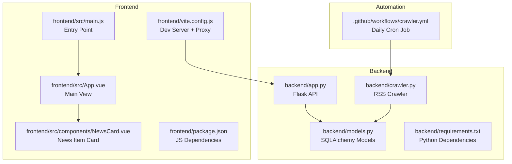
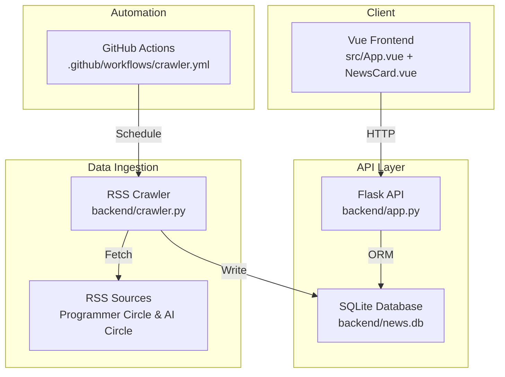
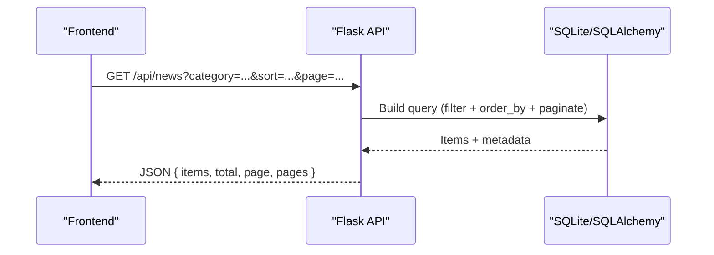
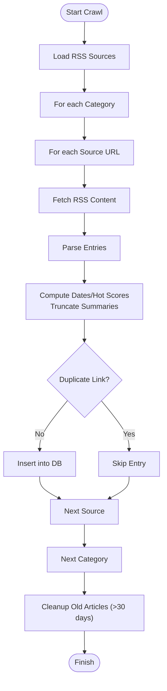
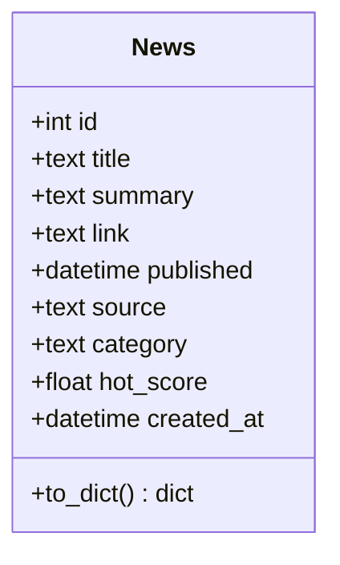
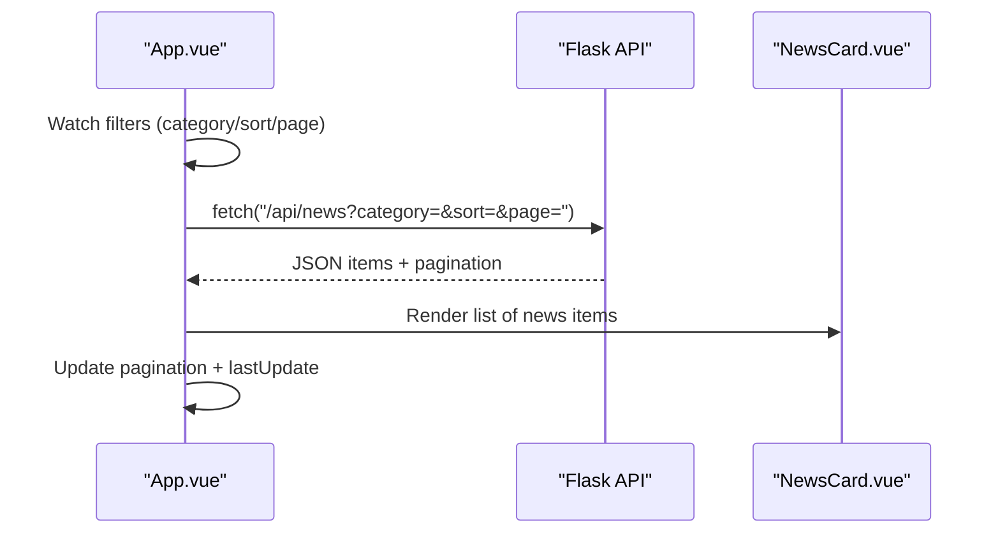
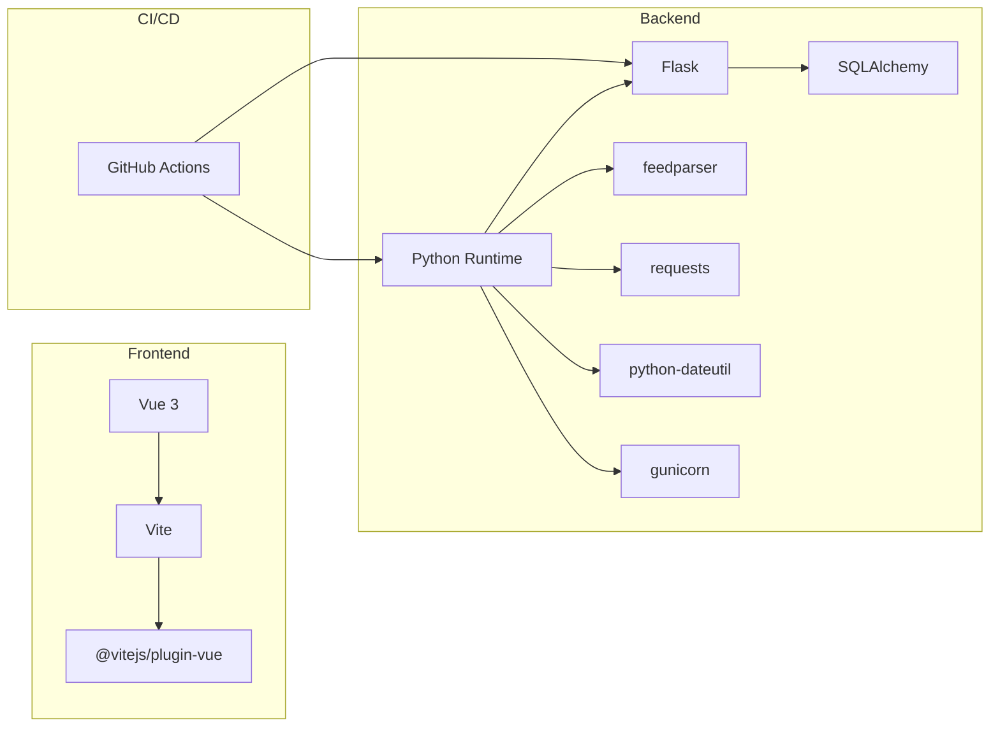

# Project Overview

<cite>
**Referenced Files in This Document**
- [README.md](file://README.md)
- [backend/app.py](file://backend/app.py)
- [backend/crawler.py](file://backend/crawler.py)
- [backend/models.py](file://backend/models.py)
- [backend/requirements.txt](file://backend/requirements.txt)
- [.github/workflows/crawler.yml](file://.github/workflows/crawler.yml)
- [frontend/src/main.js](file://frontend/src/main.js)
- [frontend/src/App.vue](file://frontend/src/App.vue)
- [frontend/src/components/NewsCard.vue](file://frontend/src/components/NewsCard.vue)
- [frontend/package.json](file://frontend/package.json)
- [frontend/vite.config.js](file://frontend/vite.config.js)
</cite>

## Table of Contents
1. [Introduction](#introduction)
2. [Project Structure](#project-structure)
3. [Core Components](#core-components)
4. [Architecture Overview](#architecture-overview)
5. [Detailed Component Analysis](#detailed-component-analysis)
6. [Dependency Analysis](#dependency-analysis)
7. [Performance Considerations](#performance-considerations)
8. [Troubleshooting Guide](#troubleshooting-guide)
9. [Conclusion](#conclusion)

## Introduction
This project is a daily-updated news aggregation website focused on two specialized domains: Programmer Circle and AI Circle. It provides a curated, paginated, and sortable collection of technical news from trusted sources, with a modern web interface and an automated RSS crawling pipeline. The platform serves developers, researchers, and tech enthusiasts who want timely, organized access to industry updates.

Key goals:
- Deliver a seamless browsing experience for technical news
- Automate content ingestion to keep the database fresh
- Offer dual-category organization and hot scoring for relevance
- Demonstrate a practical full-stack solution using Flask and Vue.js

## Project Structure
The repository is organized into a backend and a frontend, plus CI/CD automation for the crawler.

**Diagram sources**
- [backend/app.py:1-87](file://backend/app.py#L1-L87)
- [backend/crawler.py:1-217](file://backend/crawler.py#L1-L217)
- [backend/models.py:1-39](file://backend/models.py#L1-L39)
- [frontend/src/App.vue:1-421](file://frontend/src/App.vue#L1-L421)
- [frontend/src/main.js:1-5](file://frontend/src/main.js#L1-L5)
- [frontend/src/components/NewsCard.vue:1-197](file://frontend/src/components/NewsCard.vue#L1-L197)
- [frontend/vite.config.js:1-17](file://frontend/vite.config.js#L1-L17)
- [.github/workflows/crawler.yml:1-46](file://.github/workflows/crawler.yml#L1-L46)

**Section sources**
- [README.md:5-26](file://README.md#L5-L26)

## Core Components
- Flask API server exposing endpoints for news listing, detail retrieval, categories, and health checks.
- RSS crawler that fetches feeds from curated sources, computes hot scores, deduplicates entries, and prunes old items.
- SQLite-backed SQLAlchemy model for storing news items with metadata and scoring.
- Vue.js frontend that renders news cards, supports category tabs, sorting modes, pagination, and responsive design.
- GitHub Actions workflow to run the crawler daily and commit database updates.

Practical examples:
- Browse latest or hottest news for a selected category with pagination.
- Click a news card to open the original article in a new tab.
- Switch between categories and sorting modes to tailor the feed.

**Section sources**
- [backend/app.py:21-74](file://backend/app.py#L21-L74)
- [backend/crawler.py:14-37](file://backend/crawler.py#L14-L37)
- [backend/models.py:10-39](file://backend/models.py#L10-L39)
- [frontend/src/App.vue:108-188](file://frontend/src/App.vue#L108-L188)
- [frontend/src/components/NewsCard.vue:1-197](file://frontend/src/components/NewsCard.vue#L1-L197)
- [.github/workflows/crawler.yml:1-46](file://.github/workflows/crawler.yml#L1-L46)

## Architecture Overview
The system follows a classic full-stack pattern:
- Frontend (Vue 3) communicates with the backend API via HTTP.
- Backend (Flask) serves REST endpoints and manages a local SQLite database.
- Crawler runs independently (manually or via GitHub Actions) to populate the database.
- GitHub Actions automates the daily crawl and commits the updated database.

**Diagram sources**
- [frontend/src/App.vue:108-188](file://frontend/src/App.vue#L108-L188)
- [frontend/src/components/NewsCard.vue:1-197](file://frontend/src/components/NewsCard.vue#L1-L197)
- [backend/app.py:12-18](file://backend/app.py#L12-L18)
- [backend/crawler.py:180-217](file://backend/crawler.py#L180-L217)
- [.github/workflows/crawler.yml:1-46](file://.github/workflows/crawler.yml#L1-L46)

## Detailed Component Analysis

### Backend API (Flask)
Responsibilities:
- Expose endpoints for news listing, detail retrieval, categories, and health checks.
- Support filtering by category, sorting by newest or hottest, and pagination.
- Initialize and manage the SQLite database.

Key behaviors:
- Query building with optional category filter and dynamic ordering.
- Pagination with fixed page size and total counts.
- JSON serialization via model methods.

**Diagram sources**
- [backend/app.py:21-55](file://backend/app.py#L21-L55)
- [backend/models.py:24-35](file://backend/models.py#L24-L35)

**Section sources**
- [backend/app.py:21-74](file://backend/app.py#L21-L74)
- [backend/app.py:77-87](file://backend/app.py#L77-L87)

### RSS Crawler
Responsibilities:
- Fetch RSS feeds from predefined sources for each category.
- Parse dates, compute hot scores, truncate summaries, and deduplicate by link.
- Persist to the database and prune old entries.

Core logic:
- RSS sources grouped by category with weighted importance.
- Hot score computed using time decay and source weight.
- Duplicate detection prevents redundant entries.
- Cleanup removes outdated articles after ingestion.

**Diagram sources**
- [backend/crawler.py:14-37](file://backend/crawler.py#L14-L37)
- [backend/crawler.py:88-136](file://backend/crawler.py#L88-L136)
- [backend/crawler.py:139-167](file://backend/crawler.py#L139-L167)
- [backend/crawler.py:170-177](file://backend/crawler.py#L170-L177)

**Section sources**
- [backend/crawler.py:45-74](file://backend/crawler.py#L45-L74)
- [backend/crawler.py:170-177](file://backend/crawler.py#L170-L177)

### Database Model (SQLAlchemy)
Responsibilities:
- Define the schema for news items.
- Provide serialization to dictionaries for API responses.

Schema highlights:
- Unique link constraint to prevent duplicates.
- Float hot_score field for ranking.
- Created timestamp for audit/tracking.

**Diagram sources**
- [backend/models.py:10-39](file://backend/models.py#L10-L39)

**Section sources**
- [backend/models.py:10-39](file://backend/models.py#L10-L39)

### Frontend (Vue 3)
Responsibilities:
- Render category tabs, sort controls, news cards, pagination, and error/loading states.
- Fetch data from the backend API and update UI reactively.
- Provide responsive design and accessibility-friendly interactions.

Key features:
- Reactive state for category, sort mode, page, and totals.
- Watchers trigger refetch when filters change.
- Environment-driven API base URL for development/prod separation.

**Diagram sources**
- [frontend/src/App.vue:122-146](file://frontend/src/App.vue#L122-L146)
- [frontend/src/components/NewsCard.vue:1-84](file://frontend/src/components/NewsCard.vue#L1-L84)

**Section sources**
- [frontend/src/App.vue:108-188](file://frontend/src/App.vue#L108-L188)
- [frontend/src/components/NewsCard.vue:1-197](file://frontend/src/components/NewsCard.vue#L1-L197)

### Automation (GitHub Actions)
Responsibilities:
- Schedule daily crawls at midnight UTC.
- Install Python dependencies and run the crawler.
- Commit and push the updated SQLite database snapshot.

Operational details:
- Uses Python 3.11 runner.
- Commits database changes with a descriptive message.
- Provides a summary step for workflow logs.

**Section sources**
- [.github/workflows/crawler.yml:1-46](file://.github/workflows/crawler.yml#L1-L46)

## Dependency Analysis
Technology stack summary:
- Backend: Flask, Flask-CORS, Flask-SQLAlchemy, feedparser, requests, python-dateutil, gunicorn
- Frontend: Vue 3, Vite, @vitejs/plugin-vue
- DevOps: GitHub Actions for scheduling and committing database snapshots

External integrations:
- RSS feeds from curated sources for Programmer Circle and AI Circle.
- SQLite for local persistence (no external database service).

**Diagram sources**
- [backend/requirements.txt:1-8](file://backend/requirements.txt#L1-L8)
- [frontend/package.json:11-18](file://frontend/package.json#L11-L18)
- [.github/workflows/crawler.yml:17-31](file://.github/workflows/crawler.yml#L17-L31)

**Section sources**
- [backend/requirements.txt:1-8](file://backend/requirements.txt#L1-L8)
- [frontend/package.json:11-18](file://frontend/package.json#L11-L18)

## Performance Considerations
- Database writes are batched per source and committed once per article batch; consider batching database operations further for very large feeds.
- Hot score computation is lightweight and performed during ingestion; it scales with the number of articles processed.
- Frontend pagination reduces payload sizes; ensure client-side memory usage remains bounded by limiting per-page items.
- Network requests to RSS feeds include timeouts and rate-limiting via short sleeps; adjust delays if encountering rate limits.
- SQLite is suitable for small to medium loads; consider scaling to a managed database if traffic grows.

## Troubleshooting Guide
Common issues and resolutions:
- API not reachable in development:
  - Verify the frontend proxy targets the backend port and that the backend is running.
  - Check the proxy configuration and CORS settings.
- Empty news list:
  - Confirm the crawler ran and updated the database.
  - Verify category and sort parameters passed by the frontend.
- Hot scoring anomalies:
  - Review the hot score calculation logic and source weights.
- RSS parsing errors:
  - Some feeds may have malformed dates; the crawler attempts multiple parsing strategies and falls back to UTC.
- GitHub Actions failures:
  - Inspect workflow logs for dependency installation and crawler runtime errors.
  - Ensure the database file is committed after successful runs.

**Section sources**
- [frontend/vite.config.js:7-15](file://frontend/vite.config.js#L7-L15)
- [backend/app.py:12-18](file://backend/app.py#L12-L18)
- [backend/crawler.py:45-59](file://backend/crawler.py#L45-L59)
- [.github/workflows/crawler.yml:23-39](file://.github/workflows/crawler.yml#L23-L39)

## Conclusion
This project demonstrates a practical, end-to-end news aggregation solution tailored for technical communities. Its modular architecture—Flask backend, Vue frontend, and automated RSS ingestion—provides a solid foundation for learning and real-world deployment. The dual-category organization and hot scoring enhance discoverability, while the CI/CD pipeline ensures consistent freshness. The codebase is approachable for learners and extensible for production use.