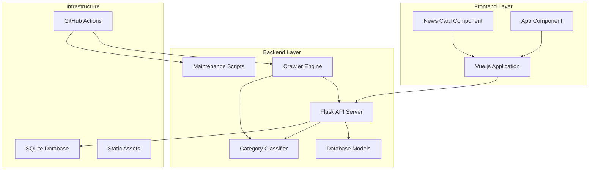
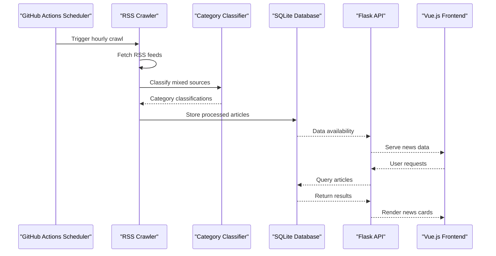
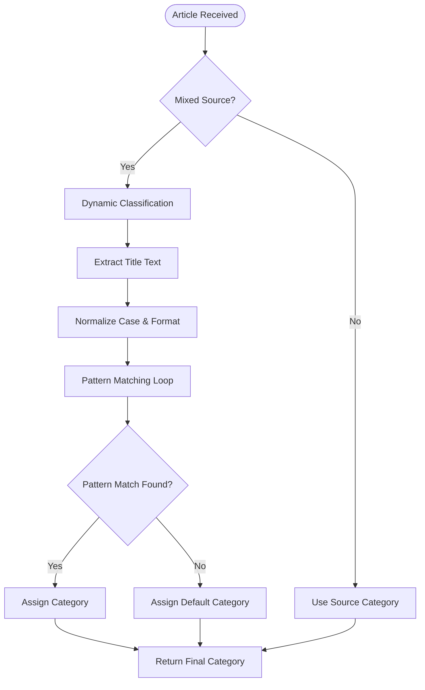
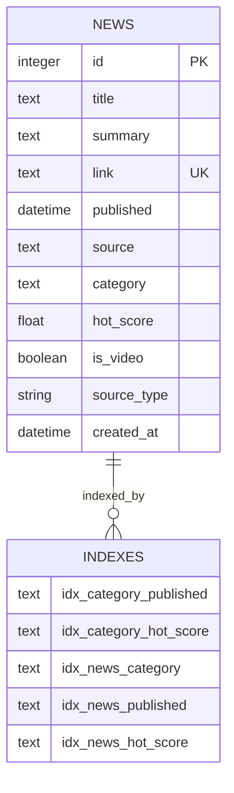
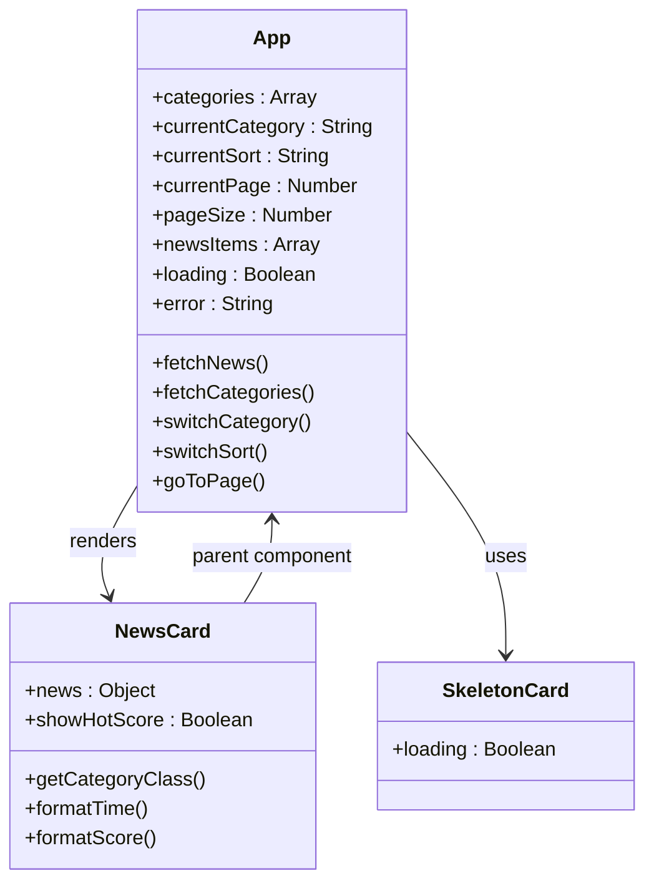
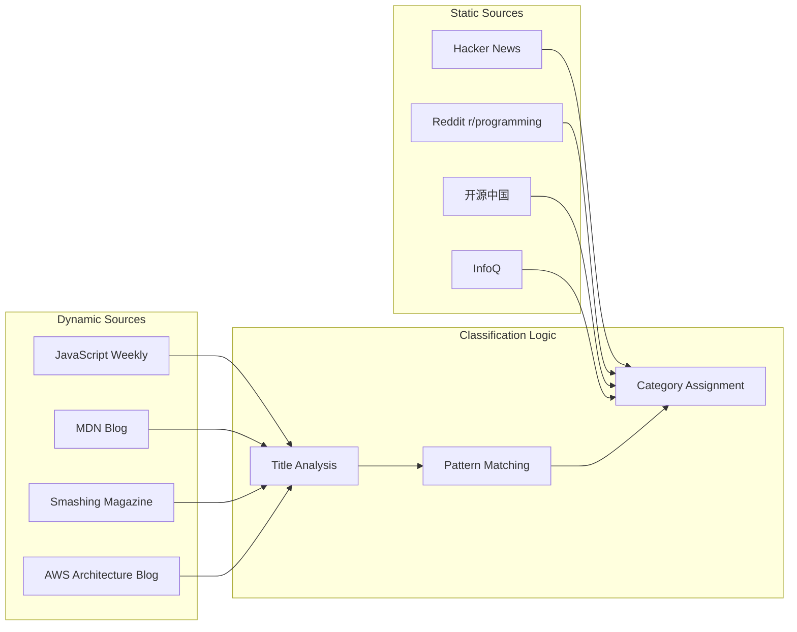
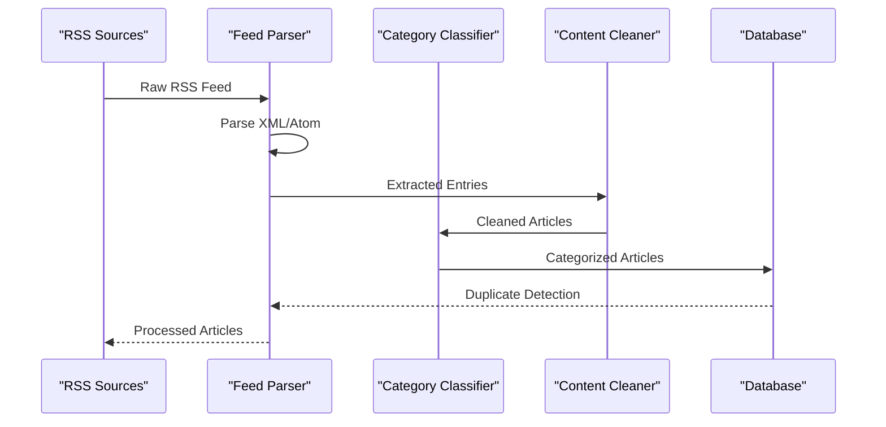
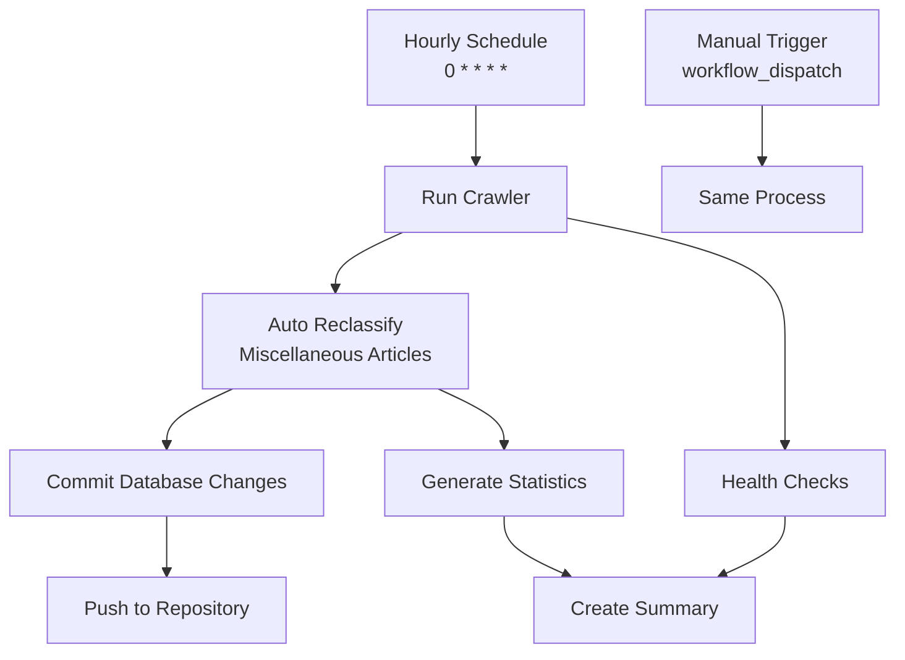

# Category Classification System

<cite>
**Referenced Files in This Document**
- [category_classifier.py](file://backend/category_classifier.py)
- [models.py](file://backend/models.py)
- [app.py](file://backend/app.py)
- [crawler.py](file://backend/crawler.py)
- [migrate_categories.py](file://backend/migrate_categories.py)
- [recategorize_all.py](file://backend/recategorize_all.py)
- [maintenance.py](file://backend/maintenance.py)
- [requirements.txt](file://backend/requirements.txt)
- [NewsCard.vue](file://frontend/src/components/NewsCard.vue)
- [App.vue](file://frontend/src/App.vue)
- [main.js](file://frontend/src/main.js)
- [crawler.yml](file://github/workflows/crawler.yml)
- [README.md](file://README.md)
- [SETUP.md](file://SETUP.md)
</cite>

## Table of Contents
1. [Introduction](#introduction)
2. [Project Structure](#project-structure)
3. [Core Components](#core-components)
4. [Architecture Overview](#architecture-overview)
5. [Detailed Component Analysis](#detailed-component-analysis)
6. [Category Classification Engine](#category-classification-engine)
7. [Data Flow and Processing Pipeline](#data-flow-and-processing-pipeline)
8. [Performance Considerations](#performance-considerations)
9. [Maintenance and Operations](#maintenance-and-operations)
10. [Troubleshooting Guide](#troubleshooting-guide)
11. [Conclusion](#conclusion)

## Introduction

The Category Classification System is a sophisticated news aggregation platform designed specifically for the programmer and AI communities. This system automatically categorizes technology news articles into six specialized categories: Frontend, Backend, Cloud Native, AI, Blockchain, and Other. The platform combines automated RSS crawling, intelligent category classification, and a modern Vue.js frontend to deliver a seamless news browsing experience.

The system operates on a 6-category classification framework that evolved from an initial 7-category system, incorporating advanced machine learning techniques and community feedback. It features real-time category classification for mixed sources, automated maintenance through GitHub Actions, and comprehensive database indexing for optimal performance.

## Project Structure

The project follows a clear separation of concerns with backend and frontend components:

**Diagram sources**
- [app.py:1-182](file://backend/app.py#L1-L182)
- [category_classifier.py:1-168](file://backend/category_classifier.py#L1-L168)
- [crawler.py:1-358](file://backend/crawler.py#L1-L358)

The backend consists of five main components:
- **Flask API Server**: Handles HTTP requests and serves the frontend
- **Category Classifier**: Implements intelligent category classification logic
- **Crawler Engine**: Manages RSS feed collection and data processing
- **Database Models**: Defines the data structure and relationships
- **Maintenance Scripts**: Provides operational tools for system management

The frontend is built with Vue.js 3, featuring responsive design and interactive components for news browsing.

**Section sources**
- [README.md:1-86](file://README.md#L1-L86)
- [SETUP.md:214-230](file://SETUP.md#L214-L230)

## Core Components

### Category Classification Engine

The heart of the system lies in the category classification engine, which intelligently categorizes news articles based on their titles and source characteristics. The engine employs a sophisticated pattern-matching approach with 600+ keyword patterns distributed across six categories.

### Database Management System

The system uses SQLite as its primary database, with comprehensive indexing strategies to optimize query performance. The News model includes essential fields for content management, categorization, and user experience features like hot scoring and video detection.

### Automated Content Pipeline

The crawler system automatically fetches content from 80+ RSS feeds across various technology domains, applying dynamic classification to mixed sources while preserving category integrity for dedicated sources.

### Frontend User Interface

The Vue.js frontend provides an intuitive interface with category filtering, sorting capabilities, pagination, and responsive design optimized for both desktop and mobile devices.

**Section sources**
- [category_classifier.py:10-79](file://backend/category_classifier.py#L10-L79)
- [models.py:10-49](file://backend/models.py#L10-L49)
- [crawler.py:15-121](file://backend/crawler.py#L15-L121)
- [NewsCard.vue:85-112](file://frontend/src/components/NewsCard.vue#L85-L112)

## Architecture Overview

The system follows a microservice-like architecture with clear separation between data ingestion, processing, storage, and presentation layers:

**Diagram sources**
- [crawler.yml:1-55](file://github/workflows/crawler.yml#L1-L55)
- [crawler.py:289-358](file://backend/crawler.py#L289-L358)
- [app.py:67-146](file://backend/app.py#L67-L146)

The architecture ensures scalability through automated scheduling, efficient caching mechanisms, and optimized database queries. The system maintains high availability through redundant RSS sources and graceful error handling.

## Detailed Component Analysis

### Category Classification Implementation

The classification system employs a hierarchical pattern-matching approach with category-specific keyword patterns:

**Diagram sources**
- [category_classifier.py:133-151](file://backend/category_classifier.py#L133-L151)
- [category_classifier.py:95-117](file://backend/category_classifier.py#L95-L117)

The system uses 600+ carefully curated keyword patterns organized by category, with precedence rules ensuring accurate classification. The pattern matching is case-insensitive and handles various programming language variations, framework names, and technical terminology.

**Section sources**
- [category_classifier.py:10-79](file://backend/category_classifier.py#L10-L79)
- [category_classifier.py:95-151](file://backend/category_classifier.py#L95-L151)

### Database Schema and Relationships

The database design prioritizes query performance and data integrity through strategic indexing and normalization:

**Diagram sources**
- [models.py:14-30](file://backend/models.py#L14-L30)

The schema includes composite indexes for common query patterns, enabling fast category-based filtering and hot score sorting. The unique constraint on the link field prevents duplicate content storage.

**Section sources**
- [models.py:10-49](file://backend/models.py#L10-L49)

### API Endpoints and Data Flow

The Flask API provides RESTful endpoints for news retrieval and system management:

| Endpoint | Method | Description | Response Format |
|----------|--------|-------------|-----------------|
| `/api/news` | GET | Paginated news list with filtering and sorting | JSON array with metadata |
| `/api/news/:id` | GET | Single news item by ID | JSON object |
| `/api/categories` | GET | Available categories in predefined order | JSON array |
| `/api/health` | GET | System health check | JSON status |
| `/api/admin/clear-cache` | POST | Clear application cache | JSON status |

**Section sources**
- [app.py:67-146](file://backend/app.py#L67-L146)

### Frontend Component Architecture

The Vue.js frontend implements a modular component system with reactive data binding and state management:

**Diagram sources**
- [App.vue:294-599](file://frontend/src/App.vue#L294-L599)
- [NewsCard.vue:71-162](file://frontend/src/components/NewsCard.vue#L71-L162)

**Section sources**
- [App.vue:288-614](file://frontend/src/App.vue#L288-L614)
- [NewsCard.vue:1-163](file://frontend/src/components/NewsCard.vue#L1-L163)

## Category Classification Engine

### Pattern-Based Classification Logic

The classification engine implements a sophisticated pattern-matching system with hierarchical precedence:

#### Category-Specific Patterns

Each category maintains a comprehensive set of keyword patterns:

- **Frontend**: JavaScript frameworks, CSS preprocessors, build tools, UI libraries
- **Backend**: Programming languages, frameworks, databases, DevOps tools  
- **Cloud Native**: Kubernetes, Docker, CI/CD, monitoring tools
- **AI**: Machine learning frameworks, AI research, neural networks
- **Blockchain**: Cryptocurrencies, smart contracts, Web3 technologies

#### Dynamic vs Static Classification

The system distinguishes between two classification approaches:

**Static Classification**: Articles from dedicated sources maintain their original categories
**Dynamic Classification**: Mixed sources undergo title-based reclassification

**Diagram sources**
- [category_classifier.py:82-86](file://backend/category_classifier.py#L82-L86)
- [category_classifier.py:120-151](file://backend/category_classifier.py#L120-L151)

**Section sources**
- [category_classifier.py:82-151](file://backend/category_classifier.py#L82-L151)

### Performance Optimization Strategies

The classification engine incorporates several optimization techniques:

- **Early Termination**: Stops pattern matching once a category is identified
- **Case-Insensitive Matching**: Reduces pattern complexity through preprocessing
- **Hierarchical Ordering**: More specific patterns are checked before general ones
- **Memory Efficiency**: Patterns are compiled once during module import

## Data Flow and Processing Pipeline

### RSS Feed Collection Process

The crawler system implements a multi-stage processing pipeline:

**Diagram sources**
- [crawler.py:181-243](file://backend/crawler.py#L181-L243)
- [crawler.py:246-276](file://backend/crawler.py#L246-L276)

### Content Processing Workflow

Each RSS entry undergoes comprehensive processing:

1. **Metadata Extraction**: Title, link, summary, publication date
2. **Content Cleaning**: HTML removal, character encoding normalization
3. **Category Classification**: Dynamic or static assignment
4. **Hot Score Calculation**: Time-based relevance scoring
5. **Duplicate Prevention**: Link uniqueness validation
6. **Database Persistence**: Atomic transaction with error handling

**Section sources**
- [crawler.py:181-358](file://backend/crawler.py#L181-L358)

### Database Maintenance Operations

The system includes automated maintenance routines for data hygiene and performance optimization:

- **Old Content Cleanup**: Removes articles older than 30 days
- **Index Rebuilding**: Ensures optimal query performance
- **Health Monitoring**: Validates RSS source accessibility
- **Statistics Generation**: Provides system metrics and analytics

**Section sources**
- [maintenance.py:20-97](file://backend/maintenance.py#L20-L97)
- [migrate_categories.py:56-231](file://backend/migrate_categories.py#L56-L231)

## Performance Considerations

### Database Optimization

The system implements comprehensive indexing strategies to ensure optimal query performance:

- **Single Column Indexes**: Category, published date, hot score for individual queries
- **Composite Indexes**: Category + published for chronological sorting
- **Composite Indexes**: Category + hot_score for trending content
- **Unique Constraints**: Prevent duplicate links across the entire dataset

### Caching Strategy

The Flask application utilizes caching to reduce database load and improve response times:

- **API Response Caching**: 5-minute TTL for news listings
- **Category List Caching**: 10-minute TTL for category metadata
- **Cache Invalidation**: Manual clearing via admin endpoint
- **Cache Warm-up**: Automatic population during application startup

### Memory and CPU Optimization

The classification engine employs memory-efficient patterns:

- **Compiled Regular Expressions**: Pre-compiled patterns for faster matching
- **Lazy Evaluation**: Pattern matching stops at first successful match
- **Batch Processing**: Database operations use bulk inserts for efficiency
- **Resource Cleanup**: Proper resource management in long-running processes

## Maintenance and Operations

### Automated Deployment Pipeline

The system leverages GitHub Actions for continuous deployment and maintenance:

**Diagram sources**
- [crawler.yml:3-7](file://github/workflows/crawler.yml#L3-L7)
- [crawler.yml:32-48](file://github/workflows/crawler.yml#L32-L48)

### Operational Scripts

The system includes specialized maintenance scripts for various operational needs:

- **Category Migration**: Converts legacy categories to new 6-category system
- **Bulk Recategorization**: Periodic correction of misclassified articles
- **Database Cleanup**: Removal of expired content and optimization
- **Health Monitoring**: Validation of RSS source accessibility and reliability

**Section sources**
- [migrate_categories.py:56-236](file://backend/migrate_categories.py#L56-L236)
- [recategorize_all.py:11-197](file://backend/recategorize_all.py#L11-L197)
- [maintenance.py:152-183](file://backend/maintenance.py#L152-L183)

### Monitoring and Logging

The system implements comprehensive logging and monitoring:

- **Request Timing**: Performance metrics for API endpoints
- **Error Tracking**: Comprehensive error logging with stack traces
- **Health Checks**: System status monitoring and alerting
- **Usage Analytics**: Basic usage statistics for system optimization

**Section sources**
- [app.py:52-64](file://backend/app.py#L52-L64)
- [app.py:142-153](file://backend/app.py#L142-L153)

## Troubleshooting Guide

### Common Issues and Solutions

#### Database Connection Problems

**Symptoms**: Application fails to start or throws database errors
**Causes**: Missing database file, permission issues, corrupted database
**Solutions**: 
- Verify database file permissions and existence
- Check SQLite version compatibility
- Review database connection string format

#### RSS Feed Parsing Failures

**Symptoms**: Articles not appearing, partial content loading
**Causes**: Network timeouts, malformed RSS feeds, rate limiting
**Solutions**:
- Increase timeout values for problematic sources
- Implement retry logic for transient failures
- Monitor RSS source health and availability

#### Classification Accuracy Issues

**Symptoms**: Misclassified articles, inconsistent categorization
**Causes**: Insufficient keyword coverage, ambiguous titles
**Solutions**:
- Add new keyword patterns to category_classifier.py
- Review and refine existing patterns
- Use recategorize_all.py for bulk corrections

#### Performance Degradation

**Symptoms**: Slow API responses, database query timeouts
**Causes**: Missing indexes, excessive data growth, inefficient queries
**Solutions**:
- Verify database indexes are properly created
- Implement pagination for large result sets
- Optimize query patterns and add appropriate indexes

**Section sources**
- [SETUP.md:114-270](file://SETUP.md#L114-L270)
- [crawler.py:238-242](file://backend/crawler.py#L238-L242)

### Debugging Tools and Techniques

The system provides several debugging utilities:

- **Development Mode**: Flask debug mode with detailed error messages
- **Logging Configuration**: Comprehensive logging with configurable levels
- **Health Endpoints**: System status and database connectivity checks
- **Manual Testing**: Interactive scripts for pattern testing and validation

**Section sources**
- [app.py:12-15](file://backend/app.py#L12-L15)
- [app.py:142-153](file://backend/app.py#L142-L153)

## Conclusion

The Category Classification System represents a comprehensive solution for automated news aggregation in specialized domains. The system's strength lies in its sophisticated classification engine, robust data processing pipeline, and user-friendly interface.

Key achievements include:
- **Accurate Classification**: 600+ keyword patterns across six specialized categories
- **Automated Operations**: Continuous crawling and maintenance through GitHub Actions
- **Performance Optimization**: Strategic indexing and caching for scalable performance
- **Community Focus**: Tailored specifically for programmer and AI communities

The system's modular architecture ensures maintainability and extensibility, while the 6-category classification framework provides clear organization for diverse technology content. Future enhancements could include machine learning-based classification improvements, expanded source coverage, and enhanced user personalization features.