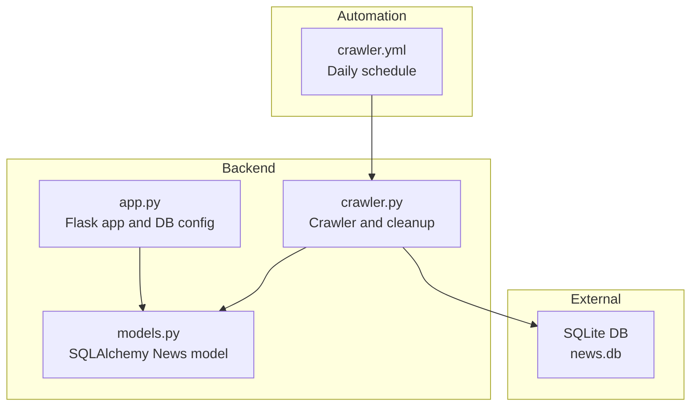
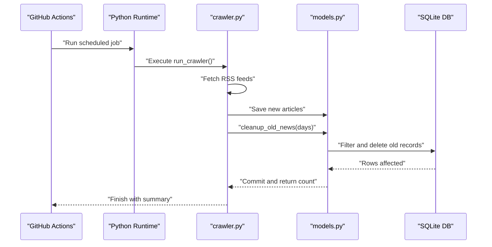
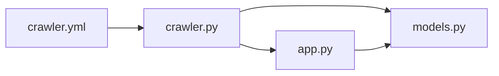

# Cleanup and Maintenance

<cite>
**Referenced Files in This Document**
- [crawler.py](file://backend/crawler.py)
- [models.py](file://backend/models.py)
- [app.py](file://backend/app.py)
- [crawler.yml](file://.github/workflows/crawler.yml)
- [README.md](file://README.md)
- [requirements.txt](file://backend/requirements.txt)
</cite>

## Table of Contents
1. [Introduction](#introduction)
2. [Project Structure](#project-structure)
3. [Core Components](#core-components)
4. [Architecture Overview](#architecture-overview)
5. [Detailed Component Analysis](#detailed-component-analysis)
6. [Dependency Analysis](#dependency-analysis)
7. [Performance Considerations](#performance-considerations)
8. [Troubleshooting Guide](#troubleshooting-guide)
9. [Conclusion](#conclusion)
10. [Appendices](#appendices)

## Introduction
This document explains the cleanup and maintenance functions within the crawler system, focusing on the cleanup_old_news function and its role in database maintenance. It covers the 30-day retention policy, the automatic cleanup process, database optimization benefits, storage management, performance impact, maintenance schedule, cleanup triggers, monitoring requirements, configuration options, and best practices for database maintenance and performance monitoring.

## Project Structure
The cleanup and maintenance functionality is implemented in the backend crawler module and orchestrated by a GitHub Actions workflow. The database model defines the schema used by the cleanup operation.

**Diagram sources**
- [app.py:12-18](file://backend/app.py#L12-L18)
- [models.py:10-23](file://backend/models.py#L10-L23)
- [crawler.py:170-178](file://backend/crawler.py#L170-L178)
- [crawler.yml:1-46](file://.github/workflows/crawler.yml#L1-L46)

**Section sources**
- [README.md:5-26](file://README.md#L5-L26)
- [app.py:12-18](file://backend/app.py#L12-L18)
- [models.py:10-23](file://backend/models.py#L10-L23)
- [crawler.py:170-178](file://backend/crawler.py#L170-L178)
- [crawler.yml:1-46](file://.github/workflows/crawler.yml#L1-L46)

## Core Components
- cleanup_old_news: Removes news older than a specified number of days from the database.
- run_crawler: Orchestrates crawling and invokes cleanup after fetching new articles.
- GitHub Actions workflow: Schedules daily execution of the crawler, which includes cleanup.

Key responsibilities:
- Enforce retention policy (default 30 days).
- Maintain database size and performance.
- Provide visibility into cleanup counts.

**Section sources**
- [crawler.py:170-178](file://backend/crawler.py#L170-L178)
- [crawler.py:203-205](file://backend/crawler.py#L203-L205)
- [crawler.yml:3-7](file://.github/workflows/crawler.yml#L3-L7)

## Architecture Overview
The cleanup process is part of the daily crawler job. The workflow triggers the crawler, which fetches feeds, saves new articles, and removes outdated entries based on the retention policy.

**Diagram sources**
- [crawler.yml:28-31](file://.github/workflows/crawler.yml#L28-L31)
- [crawler.py:180-212](file://backend/crawler.py#L180-L212)
- [models.py:10-23](file://backend/models.py#L10-L23)

## Detailed Component Analysis

### cleanup_old_news Function
Purpose:
- Remove news older than a given threshold to enforce retention policy and manage storage.

Behavior:
- Computes a cutoff date based on the current UTC time minus the specified number of days.
- Queries the News table for records older than the cutoff.
- Deletes matching records and commits the transaction.
- Prints a log message indicating how many records were removed.

Retention policy:
- Default is 30 days when invoked during the daily crawl.
- The function accepts a configurable days parameter for flexibility.

Storage and performance impact:
- Reduces database size by removing stale entries.
- Improves query performance for recent content by reducing table volume.
- Frequent deletions can cause fragmentation; periodic vacuuming or reindexing may help long-term.

Cleanup triggers:
- Invoked automatically by run_crawler after fetching and saving new articles.
- Triggered by the daily GitHub Actions schedule.

Monitoring:
- The function prints the number of cleaned items, which appears in workflow logs.
- The workflow commits and pushes database changes, enabling change tracking.

Configuration options:
- days parameter controls retention period.
- Default invocation uses 30 days.

Operational notes:
- Uses UTC timestamps for comparisons.
- Deletions are committed immediately.

**Section sources**
- [crawler.py:170-178](file://backend/crawler.py#L170-L178)
- [crawler.py:203-205](file://backend/crawler.py#L203-L205)

### run_crawler Orchestration
Role:
- Coordinates the entire crawling lifecycle, including cleanup.

Flow:
- Iterates through RSS sources by category.
- Fetches and parses feeds, calculates hot scores, and saves unique articles.
- After saving, invokes cleanup_old_news with the retention period.
- Logs totals for added and skipped articles.

Cleanup integration:
- Ensures cleanup runs after new articles are persisted, maintaining a consistent dataset.

**Section sources**
- [crawler.py:180-212](file://backend/crawler.py#L180-L212)

### Database Model and Schema
Model:
- News table includes fields for title, summary, link, published timestamp, source, category, hot_score, and created_at.
- Unique constraint on link prevents duplicates.

Impact on cleanup:
- Published timestamp is used to determine age.
- Unique link ensures deduplication before cleanup.

**Section sources**
- [models.py:10-23](file://backend/models.py#L10-L23)

### Automation and Scheduling
Schedule:
- Daily at 00:00 UTC via cron.
- Manual trigger via workflow dispatch.

Execution:
- Installs dependencies, runs crawler, and commits database changes.

Visibility:
- Workflow summary includes a timestamp and success message.

**Section sources**
- [crawler.yml:3-7](file://.github/workflows/crawler.yml#L3-L7)
- [crawler.yml:28-39](file://.github/workflows/crawler.yml#L28-L39)
- [README.md:53](file://README.md#L53)

## Dependency Analysis
- crawler.py depends on models.py for database operations and SQLAlchemy session management.
- app.py configures the database URI and initializes the Flask app context used by crawler.py.
- GitHub Actions workflow depends on crawler.py and the backend environment.

**Diagram sources**
- [crawler.yml:28-31](file://.github/workflows/crawler.yml#L28-L31)
- [crawler.py:170-178](file://backend/crawler.py#L170-L178)
- [models.py:10-23](file://backend/models.py#L10-L23)
- [app.py:12-18](file://backend/app.py#L12-L18)

**Section sources**
- [crawler.py:170-178](file://backend/crawler.py#L170-L178)
- [app.py:12-18](file://backend/app.py#L12-L18)
- [crawler.yml:28-31](file://.github/workflows/crawler.yml#L28-L31)

## Performance Considerations
- Retention window: 30 days balances freshness with storage efficiency.
- Query pattern: Filtering by published timestamp is straightforward; consider indexing published for large datasets.
- Transaction cost: Bulk deletes are efficient but can increase write amplification; monitor database file growth.
- Vacuuming/reindexing: SQLite benefits from periodic maintenance; consider adding a periodic vacuum step if the dataset grows substantially.
- Concurrency: The cleanup runs within the crawler’s single-threaded execution; ensure no concurrent writers interfere.
- Monitoring: Track the number of deleted rows and database file size over time to detect anomalies.

[No sources needed since this section provides general guidance]

## Troubleshooting Guide
Common issues and resolutions:
- No cleanup executed:
  - Verify the workflow schedule and that run_crawler calls cleanup_old_news.
  - Confirm the app context is active when running crawler.py standalone.
- Unexpectedly large database:
  - Check retention days parameter and confirm cleanup runs daily.
  - Review logs for deletion counts.
- Duplicate entries persist:
  - Ensure the unique link constraint is enforced and deduplication logic runs before cleanup.
- Performance degradation:
  - Monitor database file size and consider indexing the published column.
  - Evaluate whether the 30-day retention is appropriate for your workload.

**Section sources**
- [crawler.py:170-178](file://backend/crawler.py#L170-L178)
- [crawler.py:203-205](file://backend/crawler.py#L203-L205)
- [models.py:10-23](file://backend/models.py#L10-L23)

## Conclusion
The cleanup_old_news function enforces a 30-day retention policy by removing stale news entries after each crawl. The GitHub Actions workflow automates daily execution, ensuring consistent maintenance. While the current implementation focuses on simplicity and reliability, future enhancements could include configurable retention windows, explicit vacuuming, and metrics collection for better observability.

[No sources needed since this section summarizes without analyzing specific files]

## Appendices

### Configuration Options
- Retention period:
  - Default: 30 days during daily crawl.
  - Configurable via the days parameter passed to cleanup_old_news.
- Cleanup frequency:
  - Daily via GitHub Actions cron schedule.
  - Manual trigger available via workflow dispatch.
- Storage optimization strategies:
  - Index the published timestamp column for faster filtering.
  - Periodic vacuuming for SQLite to reclaim space.
  - Monitor database file size and adjust retention as needed.

**Section sources**
- [crawler.py:170-178](file://backend/crawler.py#L170-L178)
- [crawler.py:203-205](file://backend/crawler.py#L203-L205)
- [crawler.yml:3-7](file://.github/workflows/crawler.yml#L3-L7)

### Monitoring Requirements
- Logs:
  - Inspect workflow logs for cleanup counts printed by cleanup_old_news.
  - Use workflow summary outputs for quick verification.
- Database state:
  - Track database file size over time.
  - Optionally export counts of recent vs total articles to detect trends.
- Health checks:
  - Use the /api/health endpoint to verify service availability.

**Section sources**
- [crawler.py:170-178](file://backend/crawler.py#L170-L178)
- [crawler.yml:41-46](file://.github/workflows/crawler.yml#L41-L46)
- [app.py:71-75](file://backend/app.py#L71-L75)

### Best Practices for Database Maintenance
- Keep retention aligned with user expectations and storage constraints.
- Add indexes on frequently filtered columns (e.g., published).
- Periodically vacuum or optimize the database to reduce fragmentation.
- Monitor query performance and adjust retention or indexing strategy accordingly.
- Back up the database regularly before major maintenance changes.

[No sources needed since this section provides general guidance]