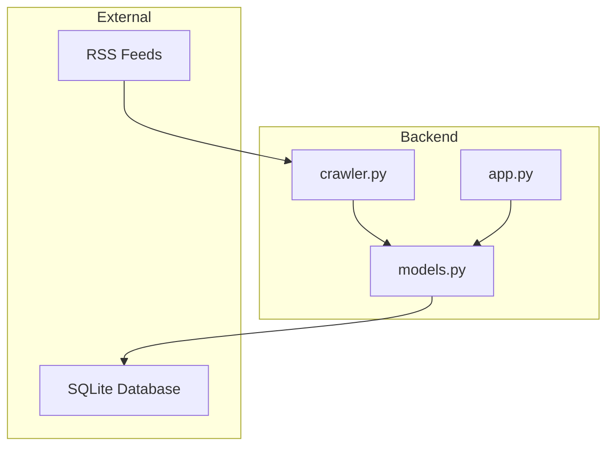
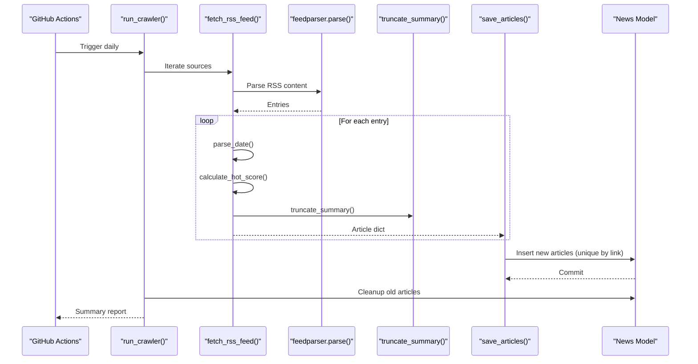
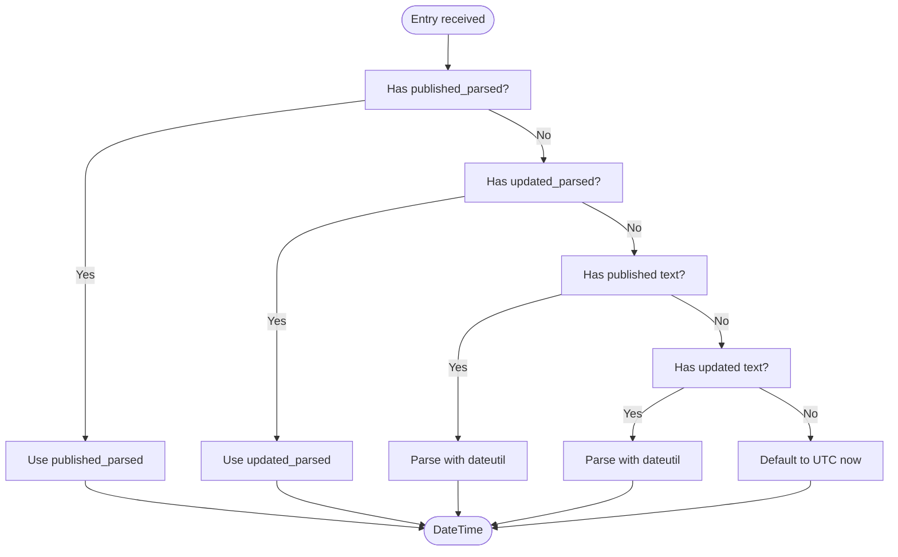
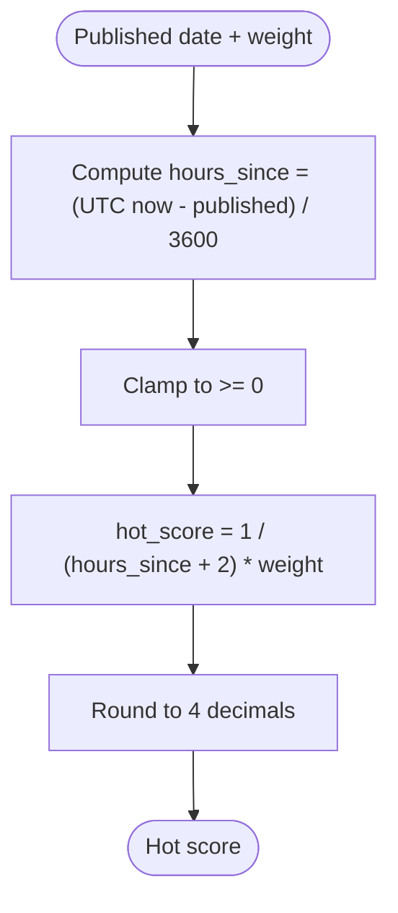
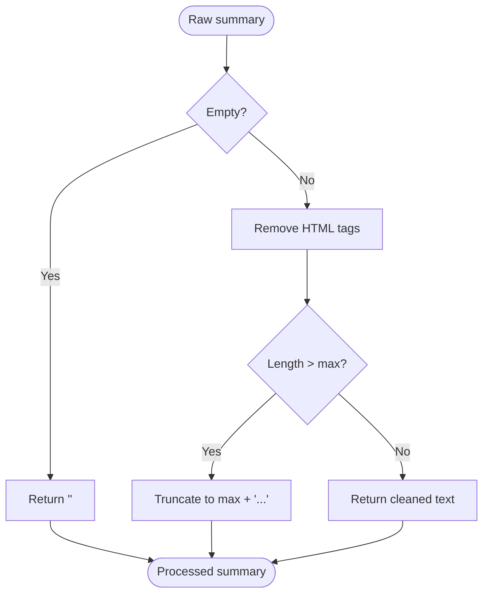
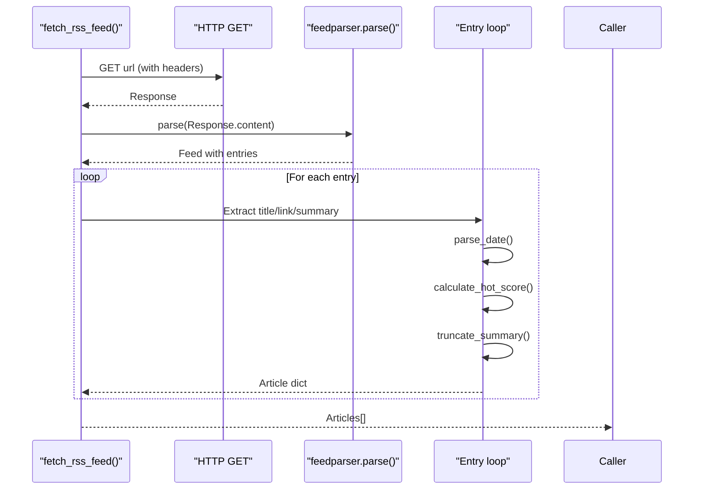
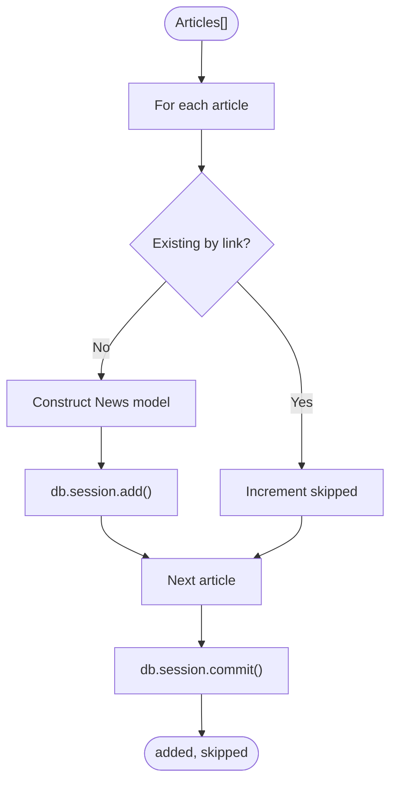
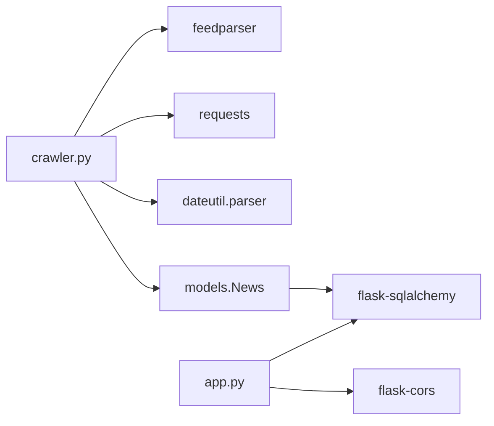

# Content Processing Pipeline

<cite>
**Referenced Files in This Document**
- [crawler.py](file://backend/crawler.py)
- [models.py](file://backend/models.py)
- [app.py](file://backend/app.py)
- [requirements.txt](file://backend/requirements.txt)
- [README.md](file://README.md)
- [.github/workflows/crawler.yml](file://.github/workflows/crawler.yml)
</cite>

## Table of Contents
1. [Introduction](#introduction)
2. [Project Structure](#project-structure)
3. [Core Components](#core-components)
4. [Architecture Overview](#architecture-overview)
5. [Detailed Component Analysis](#detailed-component-analysis)
6. [Dependency Analysis](#dependency-analysis)
7. [Performance Considerations](#performance-considerations)
8. [Troubleshooting Guide](#troubleshooting-guide)
9. [Conclusion](#conclusion)

## Introduction
This document explains the content processing pipeline used by the crawler to fetch, parse, normalize, and persist news articles from RSS feeds. It covers the end-to-end workflow from RSS feed fetching to article storage, including feed parsing, date extraction and normalization, summary processing and truncation, hot score calculation, content cleaning, duplicate prevention, database insertion logic, and error handling strategies. It also provides examples of processed content and troubleshooting guidance for common parsing issues.

## Project Structure
The crawler is part of the backend module and integrates with a Flask API and SQLite database. The key files involved in the content processing pipeline are:
- crawler.py: Implements RSS fetching, parsing, normalization, scoring, truncation, deduplication, and persistence.
- models.py: Defines the News database model and serialization helpers.
- app.py: Provides the Flask API and initializes the database.
- requirements.txt: Declares runtime dependencies including feedparser, requests, and python-dateutil.
- .github/workflows/crawler.yml: Automates daily crawling via GitHub Actions.

**Diagram sources**
- [crawler.py:1-217](file://backend/crawler.py#L1-L217)
- [models.py:1-39](file://backend/models.py#L1-L39)
- [app.py:1-87](file://backend/app.py#L1-L87)

**Section sources**
- [README.md:1-67](file://README.md#L1-L67)
- [requirements.txt:1-8](file://backend/requirements.txt#L1-L8)

## Core Components
- RSS Sources configuration: Predefined RSS feeds grouped by category with weights for scoring.
- Date parsing: Robust extraction from multiple RSS date fields with fallbacks and error handling.
- Hot score calculation: Time-decayed score weighted by source importance.
- Summary truncation: HTML tag removal and length-based truncation with ellipsis.
- Article fetching and parsing: HTTP retrieval and feedparser-based parsing with bozo warnings.
- Duplicate prevention: Link-based uniqueness checks before insertion.
- Database insertion: Bulk transaction-safe inserts with commit and rollback protection.
- Cleanup: Periodic removal of old articles to manage database size.
- Automation: Daily GitHub Actions job to run the crawler and commit database updates.

**Section sources**
- [crawler.py:14-37](file://backend/crawler.py#L14-L37)
- [crawler.py:45-74](file://backend/crawler.py#L45-L74)
- [crawler.py:76-86](file://backend/crawler.py#L76-L86)
- [crawler.py:88-137](file://backend/crawler.py#L88-L137)
- [crawler.py:139-168](file://backend/crawler.py#L139-L168)
- [crawler.py:170-178](file://backend/crawler.py#L170-L178)
- [crawler.py:180-212](file://backend/crawler.py#L180-L212)
- [.github/workflows/crawler.yml:1-46](file://.github/workflows/crawler.yml#L1-L46)

## Architecture Overview
The pipeline follows a linear, stepwise processing flow:
1. Initialize crawler context and iterate categories and sources.
2. Fetch RSS content via HTTP and parse with feedparser.
3. Extract and normalize dates, compute hot scores, and truncate summaries.
4. Detect duplicates by link and insert new articles into the database.
5. Perform periodic cleanup of old articles.
6. Report totals and finish.

**Diagram sources**
- [.github/workflows/crawler.yml:28-31](file://.github/workflows/crawler.yml#L28-L31)
- [crawler.py:180-212](file://backend/crawler.py#L180-L212)
- [crawler.py:88-137](file://backend/crawler.py#L88-L137)
- [crawler.py:139-168](file://backend/crawler.py#L139-L168)
- [models.py:10-39](file://backend/models.py#L10-L39)

## Detailed Component Analysis

### RSS Sources and Categories
- RSS_SOURCES defines two categories: “Programmer Circle” and “AI Circle,” each containing multiple RSS URLs with associated source names and weights.
- These weights influence hot score calculations later in the pipeline.

**Section sources**
- [crawler.py:14-37](file://backend/crawler.py#L14-L37)

### Date Extraction and Normalization
- parse_date attempts multiple RSS date fields in order: published_parsed, updated_parsed, published, updated.
- Falls back to parsing textual date fields using dateutil.
- On failure, defaults to UTC now to ensure progress.

**Diagram sources**
- [crawler.py:45-59](file://backend/crawler.py#L45-L59)

**Section sources**
- [crawler.py:45-59](file://backend/crawler.py#L45-L59)

### Hot Score Calculation
- Hot score is computed using a time-decayed formula with a configurable source weight.
- Hours since published are derived from UTC now minus the normalized published date.
- The score is rounded to four decimal places; errors yield zero.

**Diagram sources**
- [crawler.py:62-74](file://backend/crawler.py#L62-L74)

**Section sources**
- [crawler.py:62-74](file://backend/crawler.py#L62-L74)

### Summary Processing and Truncation
- truncate_summary removes HTML tags using a regular expression and truncates to a maximum length with an ellipsis.
- If the summary is empty, returns an empty string.

**Diagram sources**
- [crawler.py:76-86](file://backend/crawler.py#L76-L86)

**Section sources**
- [crawler.py:76-86](file://backend/crawler.py#L76-L86)

### Feed Parsing and Entry Processing
- fetch_rss_feed retrieves content via HTTP with a user-agent header and a timeout.
- Parses the content with feedparser and logs bozo warnings when present.
- Iterates entries to extract title, link, and summary, skipping entries without a link.
- Applies date parsing, hot score computation, and summary truncation per entry.

**Diagram sources**
- [crawler.py:88-137](file://backend/crawler.py#L88-L137)

**Section sources**
- [crawler.py:88-137](file://backend/crawler.py#L88-L137)

### Duplicate Prevention and Database Insertion
- save_articles iterates through collected articles and checks for existing records by link.
- Skips duplicates; otherwise constructs a News model instance and adds it to the session.
- Commits the transaction once per batch and returns counts of added and skipped items.

**Diagram sources**
- [crawler.py:139-168](file://backend/crawler.py#L139-L168)
- [models.py:10-39](file://backend/models.py#L10-L39)

**Section sources**
- [crawler.py:139-168](file://backend/crawler.py#L139-L168)
- [models.py:10-39](file://backend/models.py#L10-L39)

### Cleanup of Old Articles
- cleanup_old_news deletes articles older than a specified threshold (default 30 days) and commits the change.

**Section sources**
- [crawler.py:170-178](file://backend/crawler.py#L170-L178)

### Main Crawler Execution
- run_crawler orchestrates category iteration, per-source fetching, saving, and cleanup, with a small delay between requests to be respectful to upstream servers.

**Section sources**
- [crawler.py:180-212](file://backend/crawler.py#L180-L212)

### Database Model
- News model includes fields for title, summary, link (unique), published, source, category, hot_score, and created_at.
- Provides a to_dict() method for JSON serialization and a readable __repr__.

**Section sources**
- [models.py:10-39](file://backend/models.py#L10-L39)

### API Integration
- The Flask app initializes the database and exposes endpoints to query news, categories, and health checks.
- Pagination and sorting (newest or hottest) are supported.

**Section sources**
- [app.py:21-74](file://backend/app.py#L21-L74)

## Dependency Analysis
Runtime dependencies include feedparser for parsing RSS, requests for HTTP retrieval, python-dateutil for flexible date parsing, and Flask ecosystem components for the API and ORM.

**Diagram sources**
- [requirements.txt:1-8](file://backend/requirements.txt#L1-L8)
- [crawler.py:5-10](file://backend/crawler.py#L5-L10)
- [app.py:4-11](file://backend/app.py#L4-L11)

**Section sources**
- [requirements.txt:1-8](file://backend/requirements.txt#L1-L8)

## Performance Considerations
- HTTP timeouts and delays: The crawler sets a 30-second timeout and sleeps briefly between requests to reduce load on external servers.
- Batched commits: All inserts are committed in a single transaction per batch to minimize overhead.
- Minimal processing per entry: Date parsing, truncation, and scoring are lightweight operations suitable for batch processing.
- Cleanup cadence: Old articles are removed periodically to keep the dataset manageable.

[No sources needed since this section provides general guidance]

## Troubleshooting Guide

Common issues and resolutions:
- Feed parsing warnings: Some feeds may be malformed. The crawler logs bozo warnings and continues processing. If a feed fails consistently, consider removing or replacing the source.
- Missing or invalid dates: The parser falls back through multiple fields and defaults to UTC now if parsing fails. Verify the feed’s date fields if unexpected ordering occurs.
- Empty summaries: Summaries may be absent or HTML-only. The truncation function handles empty inputs gracefully.
- Duplicate links: Existing links are skipped. If duplicates appear, verify the uniqueness constraint on the link field.
- Network failures: HTTP exceptions are caught and logged. Retrying later often resolves transient network issues.
- Database growth: Enable cleanup to remove old articles and keep the database size under control.

Operational tips:
- Monitor GitHub Actions logs for daily crawler runs and summaries.
- Validate feed URLs manually if parsing problems arise.
- Adjust sleep intervals or timeouts if rate-limited by upstream servers.

**Section sources**
- [crawler.py:101-102](file://backend/crawler.py#L101-L102)
- [crawler.py:131-134](file://backend/crawler.py#L131-L134)
- [crawler.py:170-178](file://backend/crawler.py#L170-L178)
- [.github/workflows/crawler.yml:41-46](file://.github/workflows/crawler.yml#L41-L46)

## Conclusion
The content processing pipeline is robust, modular, and designed for reliability. It fetches RSS feeds, normalizes dates, computes hot scores, cleans and truncates summaries, prevents duplicates, persists articles efficiently, and maintains a clean dataset through periodic cleanup. The GitHub Actions automation ensures daily updates, while the Flask API provides a simple interface to consume the aggregated content.