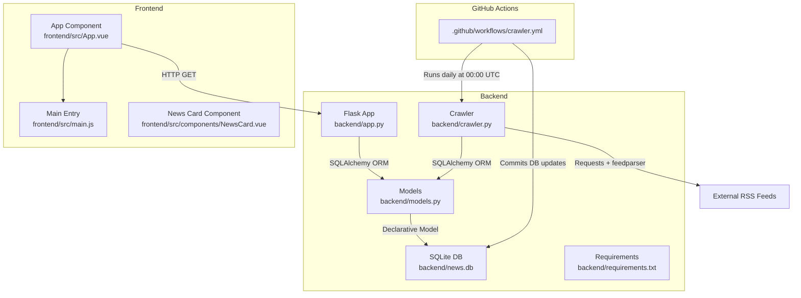
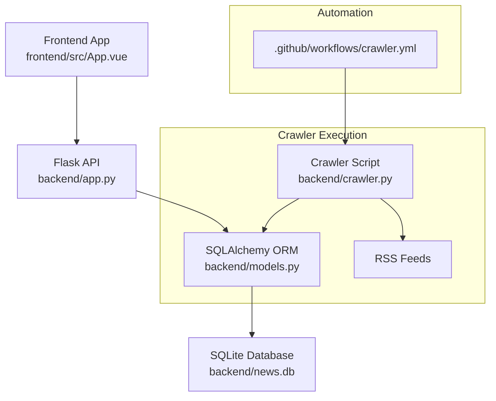
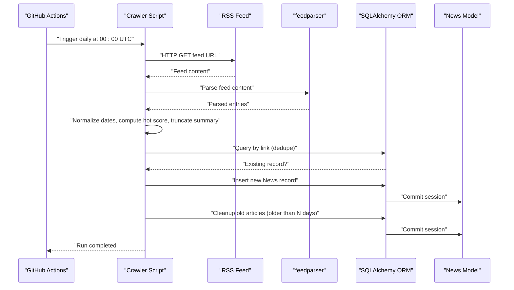
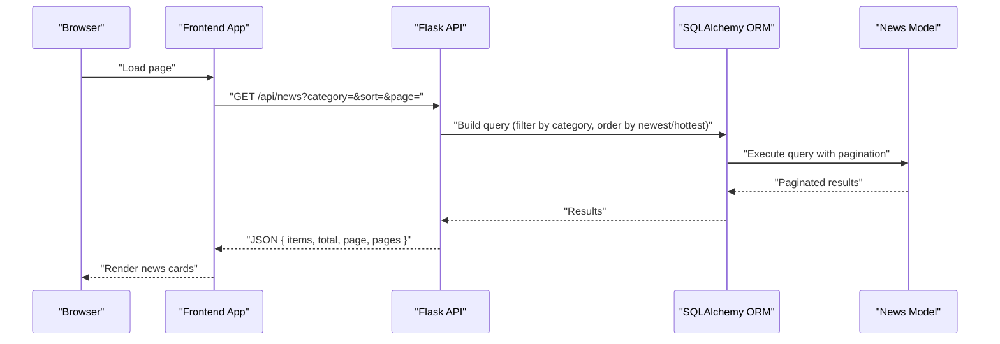
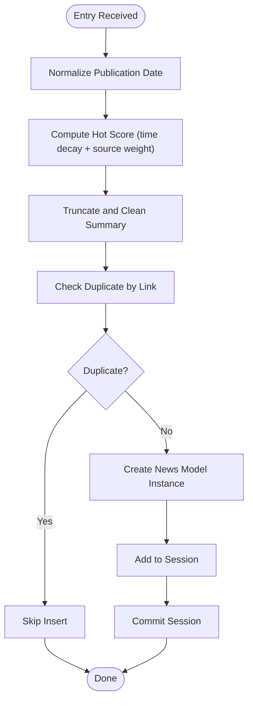
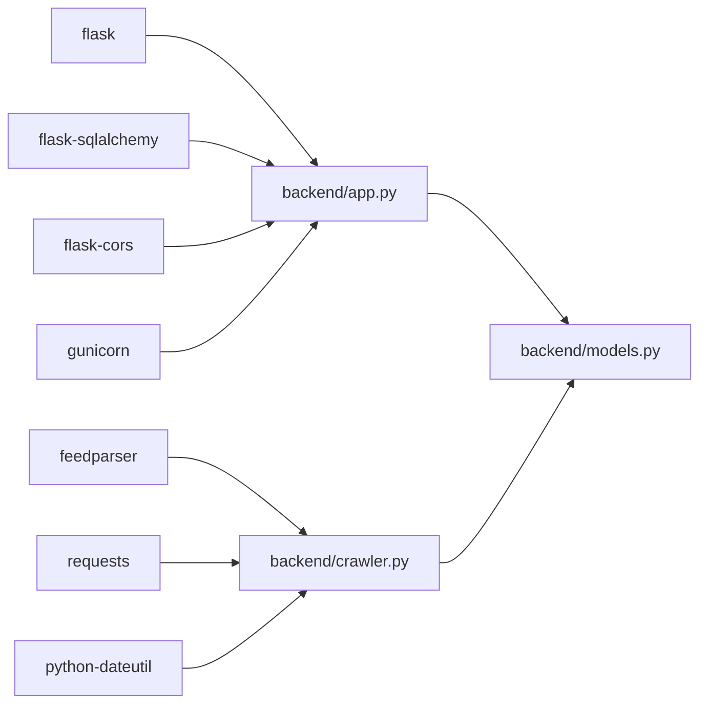

# Crawler Architecture

<cite>
**Referenced Files in This Document**
- [README.md](file://README.md)
- [backend/app.py](file://backend/app.py)
- [backend/crawler.py](file://backend/crawler.py)
- [backend/models.py](file://backend/models.py)
- [backend/requirements.txt](file://backend/requirements.txt)
- [.github/workflows/crawler.yml](file://.github/workflows/crawler.yml)
- [frontend/src/App.vue](file://frontend/src/App.vue)
- [frontend/src/main.js](file://frontend/src/main.js)
- [frontend/src/components/NewsCard.vue](file://frontend/src/components/NewsCard.vue)
</cite>

## Table of Contents
1. [Introduction](#introduction)
2. [Project Structure](#project-structure)
3. [Core Components](#core-components)
4. [Architecture Overview](#architecture-overview)
5. [Detailed Component Analysis](#detailed-component-analysis)
6. [Dependency Analysis](#dependency-analysis)
7. [Performance Considerations](#performance-considerations)
8. [Troubleshooting Guide](#troubleshooting-guide)
9. [Conclusion](#conclusion)
10. [Appendices](#appendices)

## Introduction
This document explains the RSS crawler architecture and design patterns for the news aggregator. It covers the end-to-end workflow from RSS feed discovery to database storage, the main execution flow, component responsibilities, and the data transformation pipeline. It also documents the architectural patterns used, system boundaries, external dependencies, and integration points with the Flask application. Diagrams illustrate data flow and component interactions to help both technical and non-technical readers understand how the system works.

## Project Structure
The project is organized into a backend (Flask API and crawler) and a frontend (Vue 3 SPA). The backend contains:
- A Flask application exposing REST endpoints for retrieving news items.
- An RSS crawler that fetches feeds, transforms entries, and persists them to a SQLite database.
- SQLAlchemy models representing the news entity.
- A GitHub Actions workflow that automates daily crawling.

The frontend is a Vue 3 application that consumes the backend API to render news cards with category filtering, sorting, pagination, and a live “last updated” indicator.

**Diagram sources**
- [backend/app.py:1-87](file://backend/app.py#L1-L87)
- [backend/crawler.py:1-217](file://backend/crawler.py#L1-L217)
- [backend/models.py:1-39](file://backend/models.py#L1-L39)
- [.github/workflows/crawler.yml:1-46](file://.github/workflows/crawler.yml#L1-L46)
- [frontend/src/App.vue:1-421](file://frontend/src/App.vue#L1-L421)
- [frontend/src/main.js:1-5](file://frontend/src/main.js#L1-L5)
- [frontend/src/components/NewsCard.vue:1-197](file://frontend/src/components/NewsCard.vue#L1-L197)

**Section sources**
- [README.md:1-67](file://README.md#L1-L67)
- [backend/app.py:1-87](file://backend/app.py#L1-L87)
- [backend/crawler.py:1-217](file://backend/crawler.py#L1-L217)
- [backend/models.py:1-39](file://backend/models.py#L1-L39)
- [backend/requirements.txt:1-8](file://backend/requirements.txt#L1-L8)
- [.github/workflows/crawler.yml:1-46](file://.github/workflows/crawler.yml#L1-L46)
- [frontend/src/App.vue:1-421](file://frontend/src/App.vue#L1-L421)
- [frontend/src/main.js:1-5](file://frontend/src/main.js#L1-L5)
- [frontend/src/components/NewsCard.vue:1-197](file://frontend/src/components/NewsCard.vue#L1-L197)

## Core Components
- Flask Application: Provides REST endpoints for retrieving paginated news, categories, and health checks. It initializes the SQLAlchemy engine and manages the database URI pointing to a local SQLite file.
- RSS Crawler: Discovers RSS feeds per category, parses entries, computes a hot score, truncates summaries, deduplicates by link, and saves to the database.
- SQLAlchemy Models: Defines the News entity with fields for title, summary, link, published timestamp, source, category, hot score, and creation timestamp.
- Frontend App: Fetches news from the backend API, supports category and sort toggles, pagination, and displays a “last updated” timestamp.

Key responsibilities:
- Backend API: Exposes endpoints, handles pagination and sorting, and serializes model instances to dictionaries.
- Crawler: Orchestrates feed fetching, entry transformation, duplicate detection, and cleanup of old records.
- Frontend: Renders news cards, formats timestamps and scores, and integrates with the backend API.

**Section sources**
- [backend/app.py:21-87](file://backend/app.py#L21-L87)
- [backend/crawler.py:14-217](file://backend/crawler.py#L14-L217)
- [backend/models.py:10-39](file://backend/models.py#L10-L39)
- [frontend/src/App.vue:103-188](file://frontend/src/App.vue#L103-L188)

## Architecture Overview
The system follows a simple layered architecture:
- Presentation Layer: Vue 3 frontend consuming the backend API.
- Business Logic Layer: Flask routes and crawler logic.
- Data Access Layer: SQLAlchemy ORM mapping to SQLite.
- External Integration: RSS feeds accessed via HTTP requests and parsed with feedparser.

**Diagram sources**
- [frontend/src/App.vue:103-188](file://frontend/src/App.vue#L103-L188)
- [backend/app.py:21-87](file://backend/app.py#L21-L87)
- [backend/models.py:10-39](file://backend/models.py#L10-L39)
- [backend/crawler.py:180-217](file://backend/crawler.py#L180-L217)
- [.github/workflows/crawler.yml:1-46](file://.github/workflows/crawler.yml#L1-L46)

## Detailed Component Analysis

### RSS Crawler Workflow
The crawler performs the following steps:
- Initialize RSS sources per category.
- Iterate through each source and fetch the RSS feed.
- Parse entries, compute hot score, truncate summaries, and normalize dates.
- Save unique articles to the database and skip duplicates.
- Clean up old articles after each run.

**Diagram sources**
- [.github/workflows/crawler.yml:1-46](file://.github/workflows/crawler.yml#L1-L46)
- [backend/crawler.py:88-178](file://backend/crawler.py#L88-L178)
- [backend/models.py:10-39](file://backend/models.py#L10-L39)

**Section sources**
- [backend/crawler.py:14-217](file://backend/crawler.py#L14-L217)

### Flask API Endpoints and Data Flow
The Flask application exposes endpoints for retrieving news, categories, and health checks. It uses SQLAlchemy to query and paginate results, then serializes them to dictionaries for JSON responses.

**Diagram sources**
- [frontend/src/App.vue:122-146](file://frontend/src/App.vue#L122-L146)
- [backend/app.py:21-55](file://backend/app.py#L21-L55)
- [backend/models.py:24-35](file://backend/models.py#L24-L35)

**Section sources**
- [backend/app.py:21-87](file://backend/app.py#L21-L87)
- [backend/models.py:10-39](file://backend/models.py#L10-L39)

### Data Transformation Pipeline
The crawler transforms raw RSS entries into normalized records stored in the database:
- Date normalization: Attempts multiple fields and falls back to UTC if parsing fails.
- Hot score calculation: Uses time decay and source weight to compute a trending score.
- Summary truncation: Removes HTML tags and caps length.
- Deduplication: Skips articles whose links already exist in the database.

**Diagram sources**
- [backend/crawler.py:45-178](file://backend/crawler.py#L45-L178)
- [backend/models.py:14-22](file://backend/models.py#L14-L22)

**Section sources**
- [backend/crawler.py:45-178](file://backend/crawler.py#L45-L178)
- [backend/models.py:14-22](file://backend/models.py#L14-L22)

### Architectural Patterns
- Factory-like RSS Parsing: The crawler uses feedparser to parse various RSS/Atom formats uniformly, acting as a factory for normalized entries.
- Singleton-like Database Connection: The Flask app initializes SQLAlchemy once and shares the engine across the application lifecycle. While not a strict singleton, the Flask-SQLAlchemy pattern ensures a single bound engine per process.
- Observer-like Progress Tracking: The crawler prints progress messages during feed processing and completion, functioning as a lightweight observer of the crawling lifecycle.

Note: The code does not implement explicit factory, singleton, or observer patterns beyond these practical usages.

**Section sources**
- [backend/crawler.py:99-136](file://backend/crawler.py#L99-L136)
- [backend/app.py:12-18](file://backend/app.py#L12-L18)
- [backend/crawler.py:180-212](file://backend/crawler.py#L180-L212)

## Dependency Analysis
External dependencies include:
- feedparser: Parses RSS/Atom feeds.
- requests: Performs HTTP requests to fetch feed content.
- python-dateutil: Parses diverse date formats.
- Flask, Flask-SQLAlchemy, Flask-CORS: Web framework and ORM support.
- gunicorn: WSGI server for production deployment.

Internal dependencies:
- The crawler imports the Flask app context and SQLAlchemy models to operate within the same process.
- The Flask app imports SQLAlchemy and the News model to serve data.

**Diagram sources**
- [backend/requirements.txt:1-8](file://backend/requirements.txt#L1-L8)
- [backend/crawler.py:5-11](file://backend/crawler.py#L5-L11)
- [backend/app.py:4-10](file://backend/app.py#L4-L10)
- [backend/models.py:4-7](file://backend/models.py#L4-L7)

**Section sources**
- [backend/requirements.txt:1-8](file://backend/requirements.txt#L1-L8)
- [backend/crawler.py:5-11](file://backend/crawler.py#L5-L11)
- [backend/app.py:4-10](file://backend/app.py#L4-L10)
- [backend/models.py:4-7](file://backend/models.py#L4-L7)

## Performance Considerations
- Rate limiting: The crawler sleeps between requests to be respectful to external servers.
- Deduplication: Prevents redundant writes and reduces database overhead.
- Cleanup: Periodic removal of old articles keeps the dataset manageable.
- Sorting and pagination: The API sorts by newest or hottest and paginates results to limit payload sizes.

Recommendations:
- Add retry logic with exponential backoff for transient network errors.
- Consider batching database inserts to reduce commit overhead.
- Monitor hot score computation cost; adjust formula if needed.

[No sources needed since this section provides general guidance]

## Troubleshooting Guide
Common issues and resolutions:
- Network failures: The crawler catches request exceptions and logs errors; verify network connectivity and rate limits.
- Feed parsing warnings: Bozo warnings indicate malformed feeds; the crawler continues processing valid entries.
- Duplicate entries: The crawler skips existing links; ensure unique links are used by sources.
- Database initialization: The Flask app creates tables on startup; confirm database path and permissions.
- Frontend API errors: The frontend shows an error state and retry button; verify API base URL and CORS configuration.

**Section sources**
- [backend/crawler.py:131-136](file://backend/crawler.py#L131-L136)
- [backend/crawler.py:101-102](file://backend/crawler.py#L101-L102)
- [backend/crawler.py:146-150](file://backend/crawler.py#L146-L150)
- [backend/app.py:77-81](file://backend/app.py#L77-L81)
- [frontend/src/App.vue:140-145](file://frontend/src/App.vue#L140-L145)

## Conclusion
The news aggregator employs a straightforward, maintainable architecture:
- A Flask API serves paginated, sorted news to the Vue frontend.
- A standalone crawler fetches RSS feeds, normalizes entries, computes a hot score, deduplicates, and persists to SQLite.
- GitHub Actions automates daily crawling and commits database updates.
- The system balances simplicity with practical features like deduplication, cleanup, and hot scoring.

[No sources needed since this section summarizes without analyzing specific files]

## Appendices

### API Endpoints
- GET /api/news: Paginated news list with category, sort, and page parameters.
- GET /api/news/:id: Single news item by ID.
- GET /api/categories: Available categories.
- GET /api/health: Health check endpoint.

**Section sources**
- [backend/app.py:21-87](file://backend/app.py#L21-L87)
- [README.md:55-62](file://README.md#L55-L62)

### Frontend Integration Notes
- The frontend sets the API base URL via an environment variable and fetches news on mount and when filters change.
- It renders news cards with category tags, source attribution, formatted timestamps, and optional hot scores.

**Section sources**
- [frontend/src/App.vue:119-188](file://frontend/src/App.vue#L119-L188)
- [frontend/src/components/NewsCard.vue:30-84](file://frontend/src/components/NewsCard.vue#L30-L84)