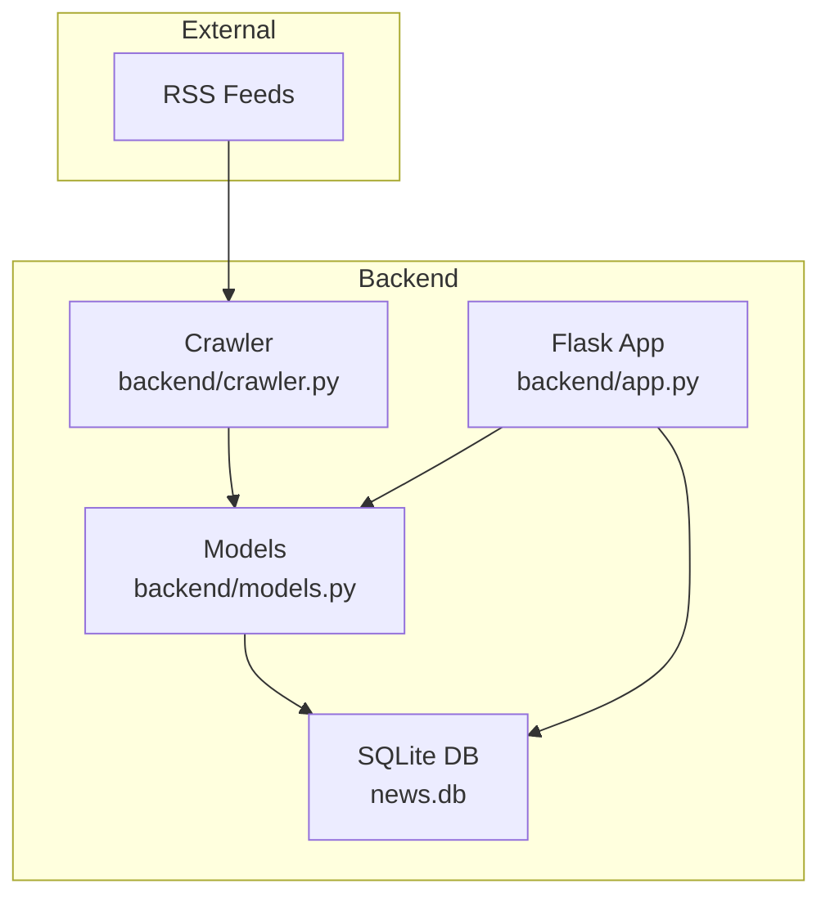
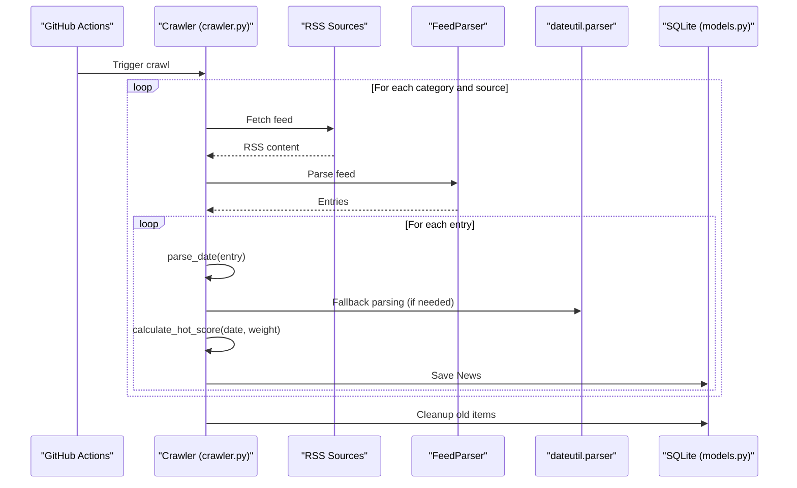
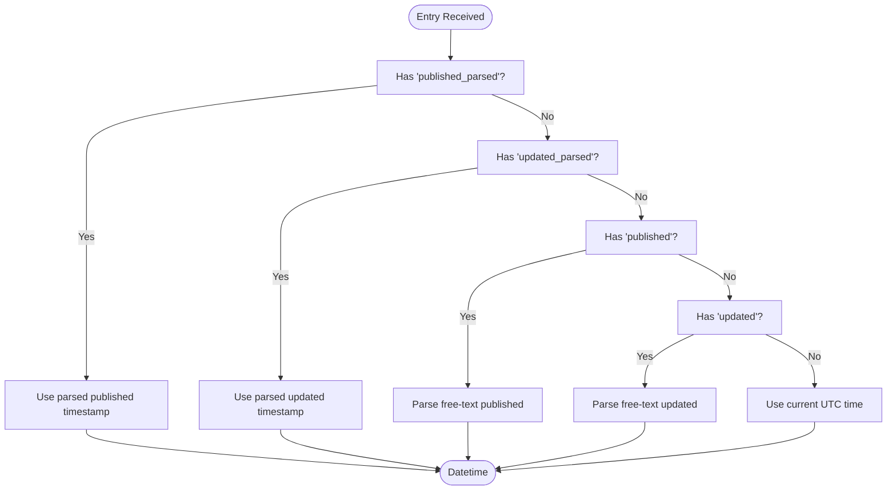
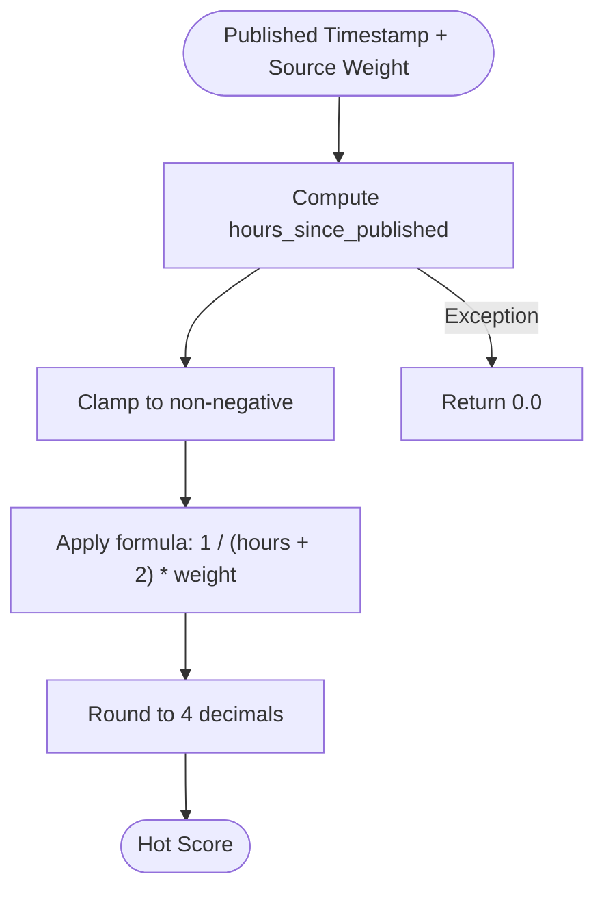
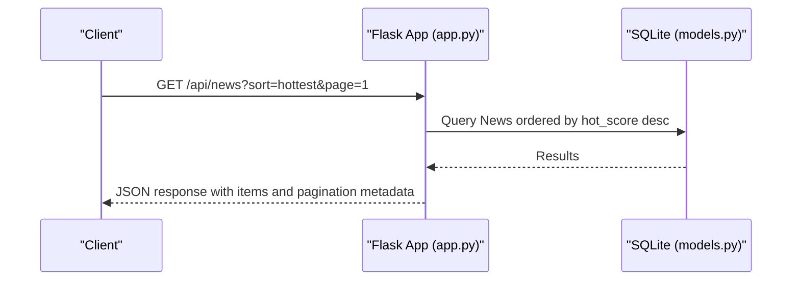
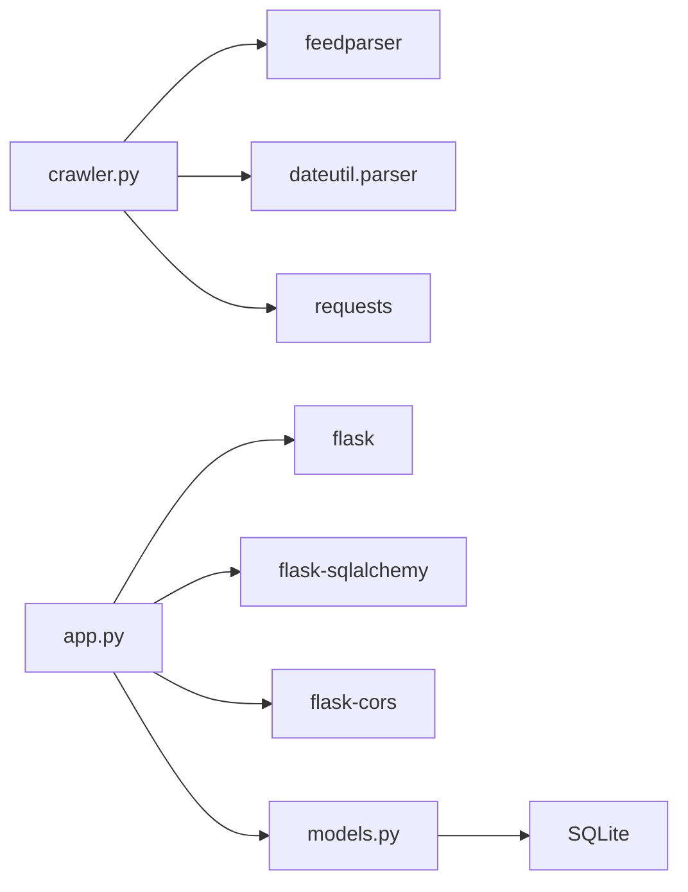

# Date Handling and Hot Score Calculation

<cite>
**Referenced Files in This Document**
- [README.md](file://README.md)
- [backend/app.py](file://backend/app.py)
- [backend/crawler.py](file://backend/crawler.py)
- [backend/models.py](file://backend/models.py)
- [backend/requirements.txt](file://backend/requirements.txt)
</cite>

## Table of Contents
1. [Introduction](#introduction)
2. [Project Structure](#project-structure)
3. [Core Components](#core-components)
4. [Architecture Overview](#architecture-overview)
5. [Detailed Component Analysis](#detailed-component-analysis)
6. [Dependency Analysis](#dependency-analysis)
7. [Performance Considerations](#performance-considerations)
8. [Troubleshooting Guide](#troubleshooting-guide)
9. [Conclusion](#conclusion)

## Introduction
This document explains the date handling and hot score calculation systems used by the news aggregator. It focuses on:
- Robust date parsing from multiple RSS date fields with fallback mechanisms
- The hot score formula using time decay and source weight
- Content freshness metrics and parameter tuning
- Practical examples of edge cases and performance considerations for large-scale processing

## Project Structure
The project is a small Flask application with a SQLite-backed news aggregator. The crawler fetches RSS feeds, parses dates, computes hot scores, and persists items. The API serves paginated lists sorted by either recency or hotness.

**Diagram sources**
- [backend/app.py:1-87](file://backend/app.py#L1-L87)
- [backend/crawler.py:1-217](file://backend/crawler.py#L1-L217)
- [backend/models.py:1-39](file://backend/models.py#L1-L39)

**Section sources**
- [README.md:1-67](file://README.md#L1-L67)
- [backend/app.py:1-87](file://backend/app.py#L1-L87)
- [backend/crawler.py:1-217](file://backend/crawler.py#L1-L217)
- [backend/models.py:1-39](file://backend/models.py#L1-L39)

## Core Components
- Date parsing: The crawler extracts publication timestamps from RSS entries using multiple strategies with fallbacks.
- Hot score calculation: A time-decay model weighted by source reputation.
- Sorting and serving: The API supports sorting by newest or hottest.

Key implementation locations:
- Date parsing: [parse_date:45-60](file://backend/crawler.py#L45-L60)
- Hot score calculation: [calculate_hot_score:62-74](file://backend/crawler.py#L62-L74)
- API sorting: [get_news:21-55](file://backend/app.py#L21-L55)
- Model definition: [News:10-39](file://backend/models.py#L10-L39)

**Section sources**
- [backend/crawler.py:45-74](file://backend/crawler.py#L45-L74)
- [backend/app.py:21-55](file://backend/app.py#L21-L55)
- [backend/models.py:10-39](file://backend/models.py#L10-L39)

## Architecture Overview
The crawler runs periodically (via GitHub Actions) to fetch RSS feeds, compute hot scores, and persist items. The API exposes endpoints to list and retrieve news, applying sorting by recency or hotness.

**Diagram sources**
- [backend/crawler.py:88-136](file://backend/crawler.py#L88-L136)
- [backend/crawler.py:45-74](file://backend/crawler.py#L45-L74)
- [backend/models.py:10-39](file://backend/models.py#L10-L39)

## Detailed Component Analysis

### Date Parsing: parse_date
The crawler attempts to extract a publication timestamp from RSS entries using multiple strategies, with a fallback chain:
- First choice: parsed RFC 2822/822 timestamp from the published field
- Second choice: parsed RFC 2822/822 timestamp from the updated field
- Third choice: free-text parsing of the published field
- Fourth choice: free-text parsing of the updated field
- Fallback: current UTC time if all fail

Robustness features:
- Graceful error handling around parsing failures
- Normalization to a timezone-naive datetime using the parsed tuple
- Free-text fallback using a robust date parser

Edge cases handled:
- Missing or empty date fields
- Malformed or non-standard date strings
- Mixed timezone representations (parsed to naive datetime)

Example scenarios:
- Published timestamp present and parsable: use it
- Updated timestamp present while published is missing: use updated
- Both fields missing: fall back to current UTC time
- Free-text strings with varying formats: parse via robust parser

**Diagram sources**
- [backend/crawler.py:45-60](file://backend/crawler.py#L45-L60)

**Section sources**
- [backend/crawler.py:45-60](file://backend/crawler.py#L45-L60)

### Hot Score Calculation: Time Decay and Source Weight
The hot score combines two factors:
- Time decay: inverse relationship with hours since publication
- Source weight: multiplier reflecting source reputation

Formula and behavior:
- Formula: hot_score = 1 / (hours_since_published + 2) × source_weight
- Hours since published: computed as (current UTC - published) in hours
- Floor at zero hours to avoid negative time
- Rounding to four decimal places
- Defaults to zero on exceptions

Freshness metric:
- Newer items receive higher scores
- Scores decrease rapidly at first and asymptotically approach zero as time passes
- The constant “+2” ensures a baseline score even for very fresh items

Source weighting impact:
- Higher weights amplify scores for newer items from reputable sources
- Lower weights reduce influence from less authoritative sources
- Weights are configured per RSS source during crawling

Parameter tuning guidance:
- Adjust the divisor constant (currently “+2”) to control initial score magnitude
- Scale weights to balance relative importance across sources
- Consider adding a floor for minimum score to prevent zero scores for recent items

Examples:
- A brand-new item from a high-weight source yields a relatively high score
- An item minutes old from a low-weight source still ranks above older items from high-weight sources
- Very old items from any source approach zero score

**Diagram sources**
- [backend/crawler.py:62-74](file://backend/crawler.py#L62-L74)

**Section sources**
- [backend/crawler.py:62-74](file://backend/crawler.py#L62-L74)

### API Sorting and Serving
The API endpoint supports sorting by newest or hottest:
- Newest: sorts by published timestamp descending
- Hottest: sorts by hot_score descending

Pagination is supported with fixed page size.

**Diagram sources**
- [backend/app.py:21-55](file://backend/app.py#L21-L55)
- [backend/models.py:10-39](file://backend/models.py#L10-L39)

**Section sources**
- [backend/app.py:21-55](file://backend/app.py#L21-L55)
- [backend/models.py:10-39](file://backend/models.py#L10-L39)

## Dependency Analysis
External libraries and their roles:
- feedparser: Parses RSS/Atom feeds into structured entries
- python-dateutil: Robust free-text date parsing for fallback
- requests: HTTP client for fetching feed content
- flask, flask-sqlalchemy, flask-cors: Web framework and ORM
- gunicorn: WSGI server for production deployment

**Diagram sources**
- [backend/requirements.txt:1-8](file://backend/requirements.txt#L1-L8)
- [backend/crawler.py:5-11](file://backend/crawler.py#L5-L11)
- [backend/app.py:4-11](file://backend/app.py#L4-L11)
- [backend/models.py:4-7](file://backend/models.py#L4-L7)

**Section sources**
- [backend/requirements.txt:1-8](file://backend/requirements.txt#L1-L8)
- [backend/crawler.py:5-11](file://backend/crawler.py#L5-L11)
- [backend/app.py:4-11](file://backend/app.py#L4-L11)
- [backend/models.py:4-7](file://backend/models.py#L4-L7)

## Performance Considerations
- Parsing cost: Using both parsed and free-text parsing adds resilience but may increase CPU usage slightly. The fallback path is only used when needed.
- Database writes: Duplicates are skipped to reduce write overhead. Consider indexing link for faster lookups.
- Sorting: Sorting by hot_score requires scanning and ordering all items. For large datasets, consider materialized views or precomputed rankings.
- Network I/O: Respectful delays between requests and handle timeouts to avoid blocking the crawler.
- Cleanup: Periodic cleanup removes stale items, preventing unbounded growth and maintaining query performance.

[No sources needed since this section provides general guidance]

## Troubleshooting Guide
Common issues and resolutions:
- Date parsing errors: The parser logs errors and falls back to current UTC. Verify feed date formats and network connectivity.
- Hot score anomalies: Ensure published timestamps are reasonable and source weights are set appropriately. Check for timezone mismatches (timestamps are stored as naive datetimes).
- Duplicate entries: The crawler skips existing links. Confirm uniqueness constraints and indexing.
- API slow responses: Large hot_score sorts can be expensive. Consider caching top N items or precomputing scores.

**Section sources**
- [backend/crawler.py:45-60](file://backend/crawler.py#L45-L60)
- [backend/crawler.py:62-74](file://backend/crawler.py#L62-L74)
- [backend/crawler.py:144-167](file://backend/crawler.py#L144-L167)
- [backend/app.py:21-55](file://backend/app.py#L21-L55)

## Conclusion
The system’s date handling is resilient across diverse RSS feeds, while the hot score model balances recency and source reputation. With careful parameter tuning and operational hygiene, it scales to moderate workloads. For larger deployments, consider indexing, caching, and precomputation strategies to optimize performance.