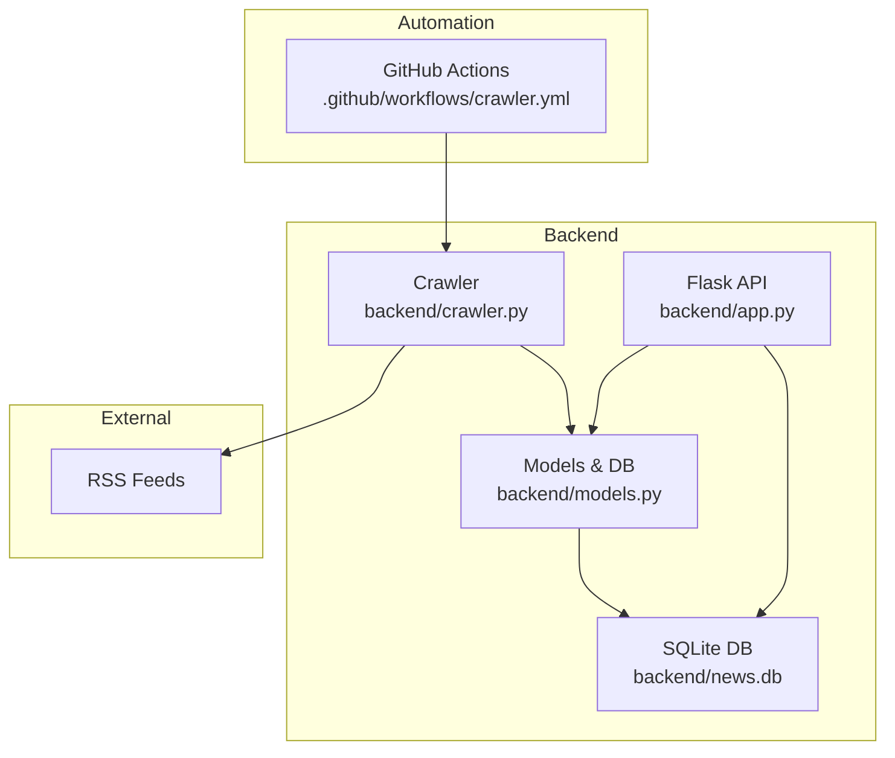
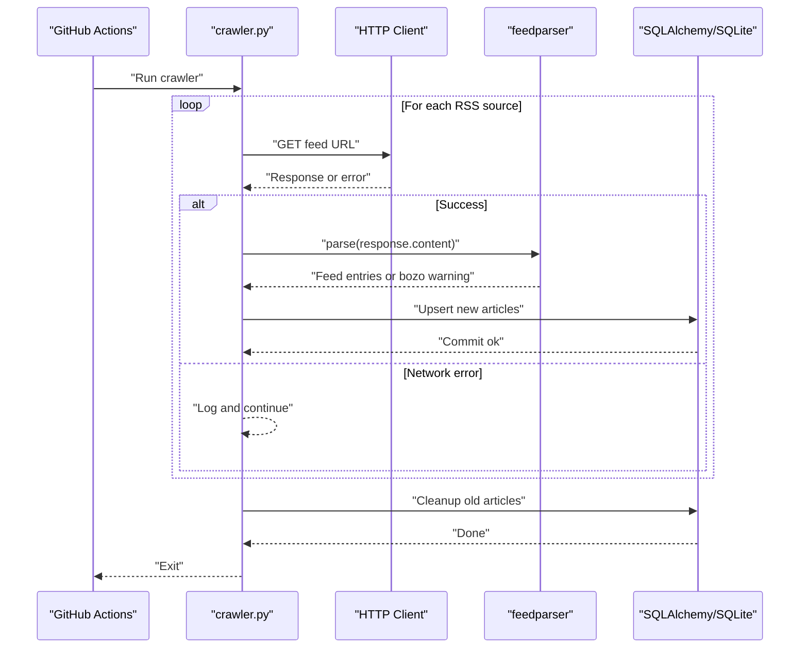
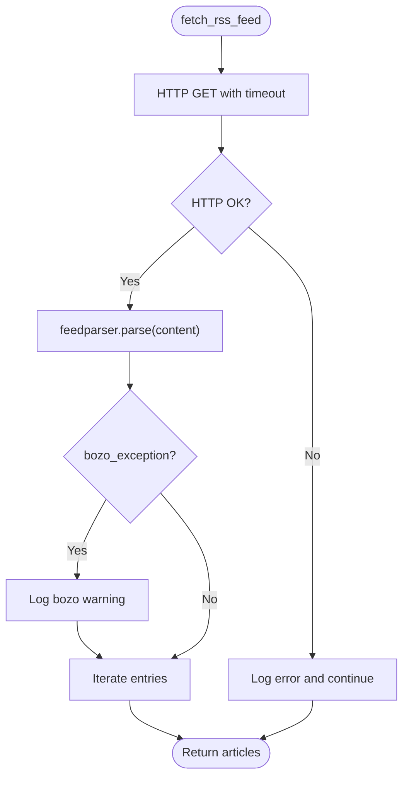
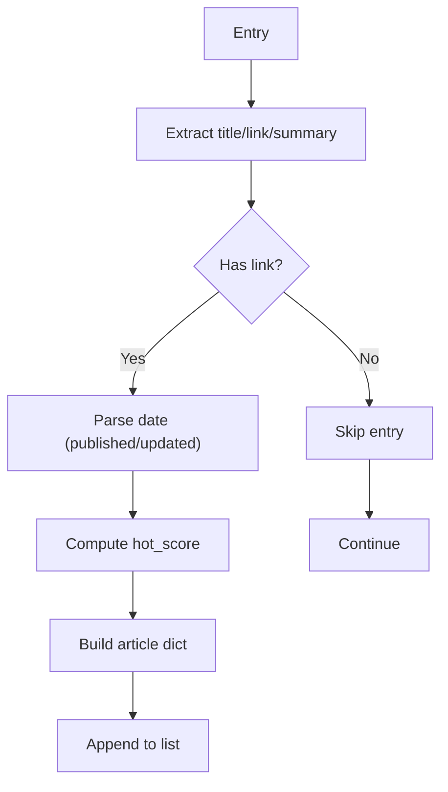
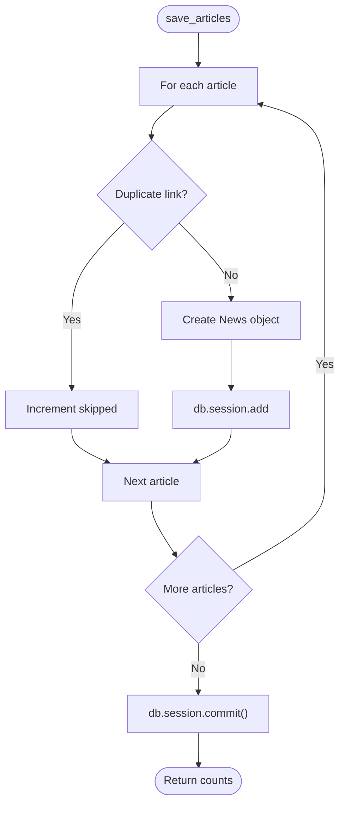
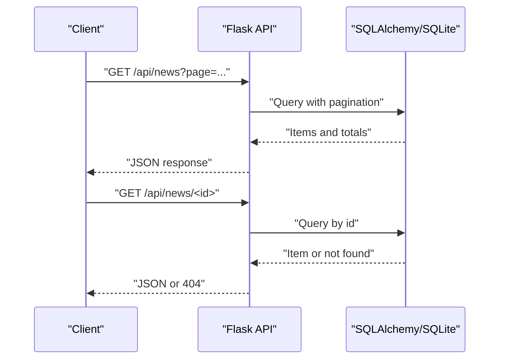
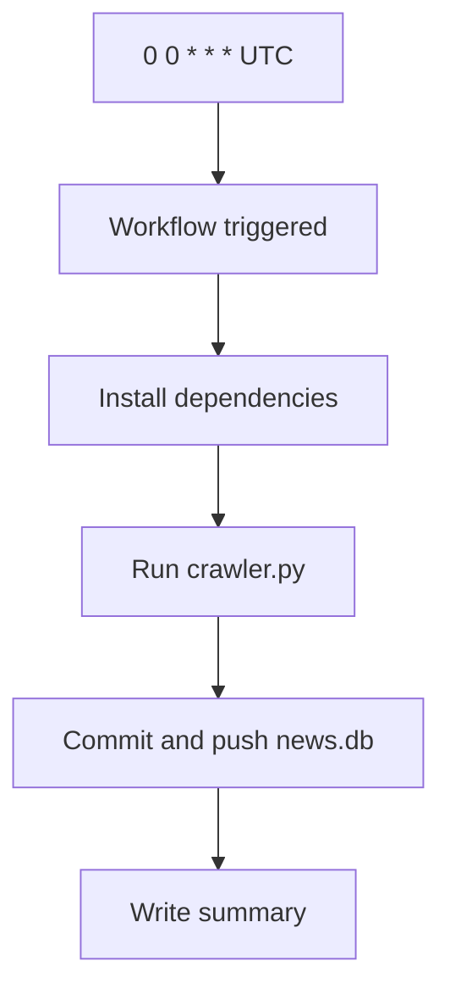
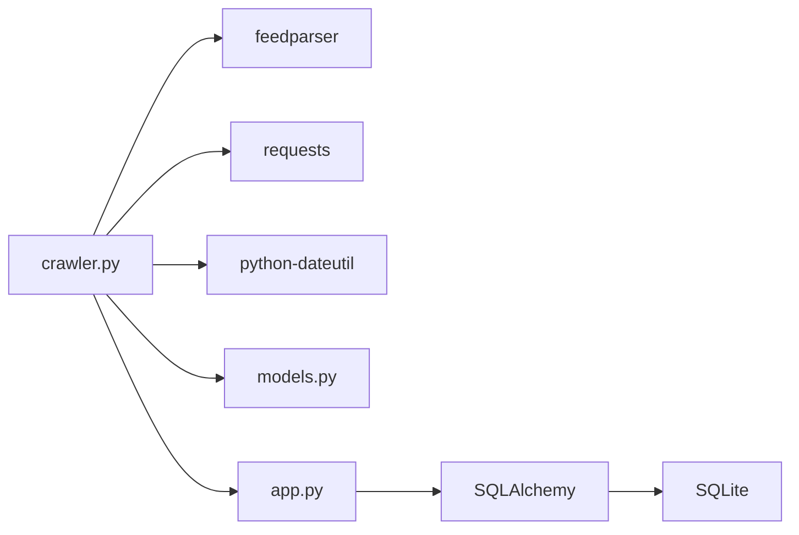

# Error Handling and Recovery

<cite>
**Referenced Files in This Document**
- [README.md](file://README.md)
- [.github/workflows/crawler.yml](file://.github/workflows/crawler.yml)
- [backend/app.py](file://backend/app.py)
- [backend/crawler.py](file://backend/crawler.py)
- [backend/models.py](file://backend/models.py)
- [backend/requirements.txt](file://backend/requirements.txt)
</cite>

## Table of Contents
1. [Introduction](#introduction)
2. [Project Structure](#project-structure)
3. [Core Components](#core-components)
4. [Architecture Overview](#architecture-overview)
5. [Detailed Component Analysis](#detailed-component-analysis)
6. [Dependency Analysis](#dependency-analysis)
7. [Performance Considerations](#performance-considerations)
8. [Troubleshooting Guide](#troubleshooting-guide)
9. [Conclusion](#conclusion)
10. [Appendices](#appendices)

## Introduction
This document explains the error handling and recovery mechanisms in the crawler system. It focuses on how the system handles network request failures, RSS parsing issues, database operations, and unexpected exceptions. It also documents retry strategies, graceful degradation, logging approaches, and provides troubleshooting, monitoring, and recovery procedures. The goal is to help operators maintain system reliability while keeping the crawler resilient to common failure modes such as network timeouts, malformed RSS feeds, database connection issues, and invalid content.

## Project Structure
The crawler system consists of:
- A Flask API server that serves news data and exposes health checks.
- An RSS crawler that fetches feeds, parses entries, computes hot scores, and persists items to a SQLite database.
- A GitHub Actions workflow that automates daily crawling and commits database updates.

**Diagram sources**
- [backend/app.py:1-87](file://backend/app.py#L1-L87)
- [backend/crawler.py:1-217](file://backend/crawler.py#L1-L217)
- [backend/models.py:1-39](file://backend/models.py#L1-L39)
- [.github/workflows/crawler.yml:1-46](file://.github/workflows/crawler.yml#L1-L46)

**Section sources**
- [README.md:1-67](file://README.md#L1-L67)
- [.github/workflows/crawler.yml:1-46](file://.github/workflows/crawler.yml#L1-L46)

## Core Components
- Network layer: Uses HTTP client to fetch RSS content and feedparser to parse.
- Parsing layer: Extracts metadata from feed entries and normalizes dates.
- Persistence layer: Saves new articles to the database, deduplicating by link.
- API layer: Exposes endpoints for clients and health checks.
- Automation layer: Schedules daily crawls and commits database changes.

Key error-handling characteristics:
- Network requests wrap exceptions and log failures per source.
- RSS parsing tolerates bozo conditions and logs warnings.
- Database operations commit per batch and skip individual failures.
- API routes handle missing resources gracefully and expose health status.

**Section sources**
- [backend/crawler.py:88-136](file://backend/crawler.py#L88-L136)
- [backend/crawler.py:139-167](file://backend/crawler.py#L139-L167)
- [backend/app.py:21-62](file://backend/app.py#L21-L62)
- [backend/app.py:71-74](file://backend/app.py#L71-L74)

## Architecture Overview
The crawler follows a straightforward pipeline:
- Scheduled trigger invokes the crawler script.
- For each configured RSS source, the crawler fetches content, parses entries, and persists new items.
- The API server reads from the database and serves clients.

**Diagram sources**
- [.github/workflows/crawler.yml:28-31](file://.github/workflows/crawler.yml#L28-L31)
- [backend/crawler.py:88-136](file://backend/crawler.py#L88-L136)
- [backend/crawler.py:139-167](file://backend/crawler.py#L139-L167)

## Detailed Component Analysis

### Network Request Layer
- Timeout and headers: Requests are performed with a timeout and a standard user-agent header to reduce blocking and improve compatibility.
- Exception handling: All request-level errors are caught and logged individually per source, allowing the crawler to continue processing remaining sources.
- Graceful degradation: On failure, the function returns an empty set for that source, preventing downstream crashes.

**Diagram sources**
- [backend/crawler.py:88-136](file://backend/crawler.py#L88-L136)

**Section sources**
- [backend/crawler.py:88-136](file://backend/crawler.py#L88-L136)

### RSS Parsing Layer
- Date normalization: Publication/update timestamps are extracted from multiple fields and parsed with robust fallbacks.
- Hot score calculation: Uses time decay and source weights; defaults to zero on error.
- Entry processing: Skips entries without required fields and continues on per-entry errors.

**Diagram sources**
- [backend/crawler.py:104-127](file://backend/crawler.py#L104-L127)
- [backend/crawler.py:45-74](file://backend/crawler.py#L45-L74)

**Section sources**
- [backend/crawler.py:45-74](file://backend/crawler.py#L45-L74)
- [backend/crawler.py:104-127](file://backend/crawler.py#L104-L127)

### Database Persistence Layer
- Deduplication: Prevents inserting articles with duplicate links.
- Batch commit: Commits after processing a batch of articles to minimize transaction overhead.
- Per-item error handling: Individual save failures are logged and skipped to keep the pipeline moving.

**Diagram sources**
- [backend/crawler.py:139-167](file://backend/crawler.py#L139-L167)
- [backend/models.py:10-39](file://backend/models.py#L10-L39)

**Section sources**
- [backend/crawler.py:139-167](file://backend/crawler.py#L139-L167)
- [backend/models.py:10-39](file://backend/models.py#L10-L39)

### API Layer
- Pagination and error handling: Pagination uses a non-strict mode to avoid raising on invalid pages.
- Resource not found: Retrieving a non-existent resource triggers a 404-like behavior.
- Health check: Provides a simple readiness probe endpoint.

**Diagram sources**
- [backend/app.py:21-62](file://backend/app.py#L21-L62)
- [backend/app.py:71-74](file://backend/app.py#L71-L74)

**Section sources**
- [backend/app.py:21-62](file://backend/app.py#L21-L62)
- [backend/app.py:71-74](file://backend/app.py#L71-L74)

### Automation and Recovery
- Scheduling: Daily runs at a fixed UTC time via GitHub Actions.
- Artifact persistence: Database changes are committed and pushed back to the repository.
- Manual trigger: Workflow supports manual invocation for on-demand runs.

**Diagram sources**
- [.github/workflows/crawler.yml:4-6](file://.github/workflows/crawler.yml#L4-L6)
- [.github/workflows/crawler.yml:28-39](file://.github/workflows/crawler.yml#L28-L39)

**Section sources**
- [.github/workflows/crawler.yml:1-46](file://.github/workflows/crawler.yml#L1-L46)

## Dependency Analysis
- External libraries:
  - feedparser: Parses RSS/Atom feeds and reports bozo conditions.
  - requests: Performs HTTP requests with timeouts and headers.
  - python-dateutil: Parses flexible date strings.
  - flask, flask-sqlalchemy, flask-cors: Web framework and ORM.
- Internal dependencies:
  - crawler imports models and app to operate within the Flask app context.
  - app initializes the database and exposes endpoints.

**Diagram sources**
- [backend/crawler.py:5-11](file://backend/crawler.py#L5-L11)
- [backend/requirements.txt:1-8](file://backend/requirements.txt#L1-L8)
- [backend/app.py:6](file://backend/app.py#L6)

**Section sources**
- [backend/requirements.txt:1-8](file://backend/requirements.txt#L1-L8)
- [backend/crawler.py:5-11](file://backend/crawler.py#L5-L11)
- [backend/app.py:6](file://backend/app.py#L6)

## Performance Considerations
- Concurrency: The crawler iterates sources sequentially and sleeps briefly between requests to be respectful to upstream servers. No explicit concurrency is used.
- Retry strategy: There is no built-in retry mechanism for transient failures. Failures are logged and the process continues.
- Deduplication cost: Deduplication occurs per article; consider indexing link for faster lookups if scale grows.
- Cleanup cadence: Old articles are cleaned up after each crawl run.

Recommendations:
- Introduce exponential backoff and retry for transient network errors.
- Add circuit breaker logic to temporarily skip failing sources.
- Consider batching database writes and enabling autocommit modes if supported.
- Monitor and alert on crawler runtime and article counts.

[No sources needed since this section provides general guidance]

## Troubleshooting Guide

Common error scenarios and handling:
- Network timeouts or connection errors
  - Symptom: Source-specific error messages printed during crawling.
  - Behavior: The crawler logs and continues with other sources.
  - Action: Verify network connectivity, adjust timeouts, and consider retries.
  - Section sources
    - [backend/crawler.py:131-134](file://backend/crawler.py#L131-L134)

- Malformed RSS feeds or bozo conditions
  - Symptom: Bozo warnings logged for specific sources.
  - Behavior: The crawler proceeds with entries it can parse.
  - Action: Inspect feed URLs and entry fields; consider feed-specific normalization.
  - Section sources
    - [backend/crawler.py:101-102](file://backend/crawler.py#L101-L102)

- Database connection or write errors
  - Symptom: Errors logged during save; crawler continues.
  - Behavior: Individual insert failures are skipped; commit still occurs.
  - Action: Check database permissions, disk space, and connection limits.
  - Section sources
    - [backend/crawler.py:163-164](file://backend/crawler.py#L163-L164)

- Invalid content or missing fields
  - Symptom: Entries skipped when required fields are absent.
  - Behavior: The crawler logs and continues.
  - Action: Review feed structure and normalize fields.
  - Section sources
    - [backend/crawler.py:110-111](file://backend/crawler.py#L110-L111)

- API-side issues
  - Symptom: 404 when requesting non-existent news ID; health check endpoint available.
  - Behavior: Graceful handling with JSON responses.
  - Action: Validate IDs and pagination parameters.
  - Section sources
    - [backend/app.py:58-62](file://backend/app.py#L58-L62)
    - [backend/app.py:71-74](file://backend/app.py#L71-L74)

Monitoring recommendations:
- Enable structured logging in production environments.
- Track crawler runtime, added/skipped counts, and error rates.
- Alert on consecutive failures or significant drops in article counts.
- Monitor database size growth and cleanup effectiveness.

Recovery procedures:
- Re-run the workflow manually if a scheduled run fails.
- Inspect logs for the last successful run and subsequent failures.
- Validate feed URLs and network reachability.
- Restart the API service if database corruption symptoms appear.

[No sources needed since this section provides general guidance]

## Conclusion
The crawler system implements pragmatic error handling: per-source network failure isolation, tolerant RSS parsing with bozo warnings, robust database persistence with deduplication, and graceful API responses. While there is no built-in retry or circuit breaker, the design ensures resilience by continuing when individual sources fail. Operators should consider adding retries, circuit breakers, and structured logging to further harden the system for production use.

[No sources needed since this section summarizes without analyzing specific files]

## Appendices

### Best Practices for Resilient Crawling
- Implement retries with exponential backoff for transient network errors.
- Add circuit breaker logic to temporarily skip failing sources.
- Normalize and validate feed fields early to reduce downstream errors.
- Use bulk inserts and transactions to improve throughput and durability.
- Centralize logging with structured formats and correlation IDs.
- Monitor health endpoints and alert on anomalies.

[No sources needed since this section provides general guidance]