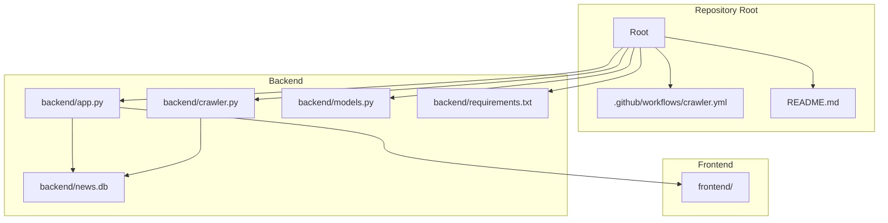
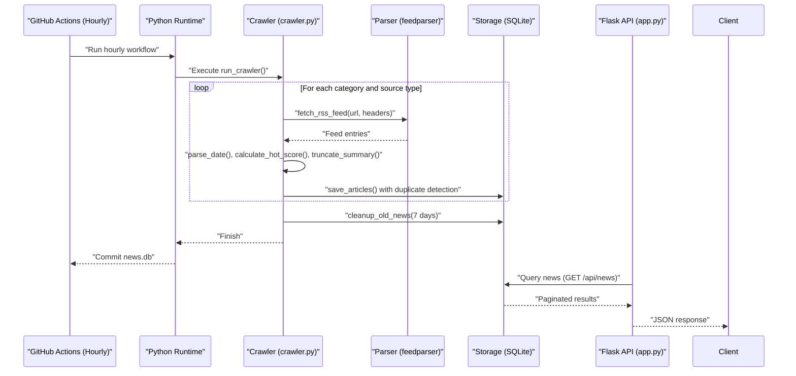
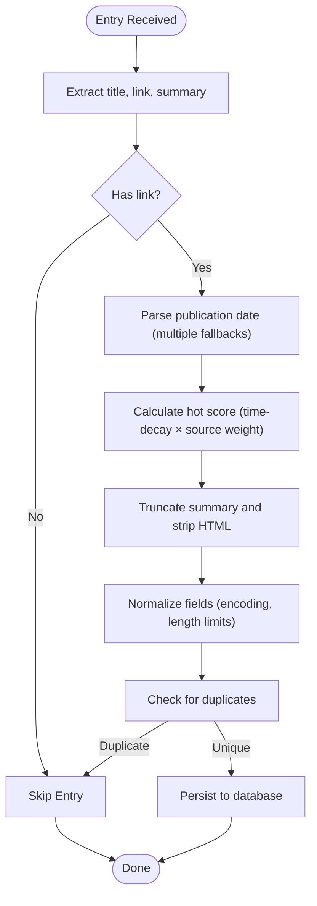
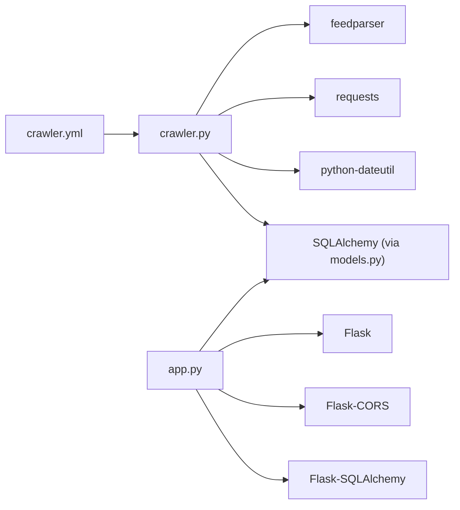
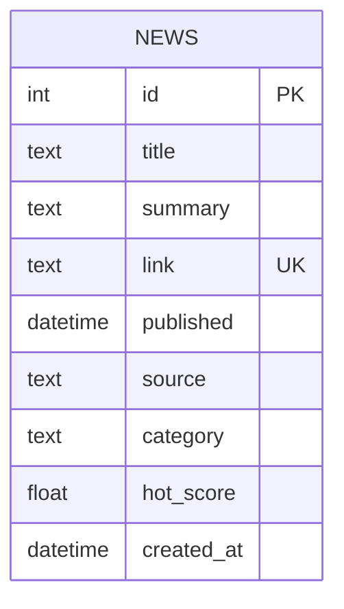

# RSS Crawler System

<cite>
**Referenced Files in This Document**
- [crawler.py](file://backend/crawler.py)
- [models.py](file://backend/models.py)
- [app.py](file://backend/app.py)
- [crawler.yml](file://.github/workflows/crawler.yml)
- [requirements.txt](file://backend/requirements.txt)
- [README.md](file://README.md)
</cite>

## Update Summary
**Changes Made**
- Updated RSS sources configuration to cover 7 technical domains instead of 2
- Enhanced hot score calculation algorithm with improved time-decay mechanics
- Added systematic cleanup mechanism for outdated articles
- Integrated YouTube RSS and arXiv sources for comprehensive coverage
- Improved duplicate detection with intelligent pre-save validation
- Updated GitHub Actions workflow to hourly scheduling for better freshness

## Table of Contents
1. [Introduction](#introduction)
2. [Project Structure](#project-structure)
3. [Core Components](#core-components)
4. [Architecture Overview](#architecture-overview)
5. [Detailed Component Analysis](#detailed-component-analysis)
6. [Dependency Analysis](#dependency-analysis)
7. [Performance Considerations](#performance-considerations)
8. [Troubleshooting Guide](#troubleshooting-guide)
9. [Conclusion](#conclusion)
10. [Appendices](#appendices)

## Introduction
This document describes the comprehensive RSS crawler system that powers a multi-domain news aggregator covering seven technical communities. The enhanced crawler system fetches RSS feeds from diverse sources including programmer circles, AI research, front-end development, back-end engineering, cloud-native technologies, blockchain, and AI+medical domains. It intelligently processes entries, calculates sophisticated hot scores using time-decay algorithms, prevents duplicates through advanced detection mechanisms, and systematically cleans up outdated content. The system is fully automated through hourly GitHub Actions workflows and exposes a robust REST API for content consumption.

## Project Structure
The project maintains a backend-first architecture with specialized crawler modules, comprehensive RSS source configurations, intelligent duplicate detection, and automated cleanup mechanisms.

**Diagram sources**
- [README.md:5-26](file://README.md#L5-L26)
- [crawler.yml:1-50](file://.github/workflows/crawler.yml#L1-L50)
- [app.py:12-18](file://backend/app.py#L12-L18)
- [crawler.py:13-37](file://backend/crawler.py#L13-L37)

**Section sources**
- [README.md:5-26](file://README.md#L5-L26)
- [app.py:12-18](file://backend/app.py#L12-L18)
- [crawler.py:13-37](file://backend/crawler.py#L13-L37)

## Core Components
- **Comprehensive RSS Sources Configuration**: Seven categorized RSS feeds spanning multiple technical domains with sophisticated weighting systems
- **Multi-source Integration**: RSS feeds, YouTube RSS, and arXiv sources unified under a single processing pipeline
- **Intelligent Duplicate Detection**: Advanced pre-save validation with unique constraint enforcement
- **Sophisticated Hot Score Calculation**: Time-decay algorithm with source weighting and precision control
- **Systematic Content Processing Pipeline**: Comprehensive entry normalization, validation, and enrichment
- **Automated Cleanup Mechanism**: Intelligent pruning of outdated content based on configurable thresholds
- **Robust API Layer**: Comprehensive endpoints for querying, pagination, sorting, and category management
- **Hourly Automation**: GitHub Actions workflow running every hour for optimal content freshness

**Section sources**
- [crawler.py:13-37](file://backend/crawler.py#L13-L37)
- [crawler.py:88-136](file://backend/crawler.py#L88-L136)
- [models.py:10-39](file://backend/models.py#L10-L39)
- [app.py:21-55](file://backend/app.py#L21-L55)
- [crawler.yml:1-50](file://.github/workflows/crawler.yml#L1-L50)

## Architecture Overview
The enhanced crawler system orchestrates a sophisticated pipeline that processes multiple RSS source types, applies intelligent duplicate detection, calculates precise hot scores, and maintains optimal database performance through systematic cleanup.

**Diagram sources**
- [crawler.yml:28-39](file://.github/workflows/crawler.yml#L28-L39)
- [crawler.py:253-321](file://backend/crawler.py#L253-L321)
- [crawler.py:243-251](file://backend/crawler.py#L243-L251)
- [app.py:21-55](file://backend/app.py#L21-L55)

## Detailed Component Analysis

### Enhanced RSS Sources Configuration
The system now manages seven comprehensive categories covering diverse technical domains:

**Primary Technical Domains:**
- **程序员圈 (Programmer Circle)**: 10 sources including tech blogs, developer communities, and industry publications
- **AI圈 (AI Circle)**: 8 sources featuring AI research institutions, tech companies, and academic publications
- **前端圈 (Frontend Circle)**: 9 sources covering JavaScript, CSS, and frontend development communities
- **后端圈 (Backend Circle)**: 10 sources focusing on server-side technologies and infrastructure
- **云原生圈 (Cloud Native Circle)**: 9 sources covering containerization, Kubernetes, and cloud-native technologies
- **区块链圈 (Blockchain Circle)**: 7 sources including cryptocurrency news and blockchain developments

**Specialized Content Sources:**
- **AI+医疗圈 (AI+Medical Circle)**: 5 sources combining artificial intelligence research with medical applications
- **YouTube RSS Sources**: 6 technology-focused YouTube channels with video content treated as RSS feeds

Each source includes URL, human-readable name, and weight factors used in hot score calculations. The configuration supports easy expansion and modification without code changes.

**Section sources**
- [crawler.py:14-88](file://backend/crawler.py#L14-L88)
- [crawler.py:90-100](file://backend/crawler.py#L90-L100)
- [crawler.py:102-110](file://backend/crawler.py#L102-L110)

### Multi-source Integration Pipeline
The crawler processes three distinct source types through a unified pipeline:

**Standard RSS Sources**: Traditional RSS feeds from tech publications and developer communities
**YouTube RSS Sources**: Video content from technology-focused YouTube channels
**arXiv Sources**: Academic papers and research publications in AI and machine learning domains

Each source type follows identical processing steps: fetching, parsing, validation, hot score calculation, and persistence. This unified approach ensures consistent quality and performance across all content types.

**Section sources**
- [crawler.py:253-321](file://backend/crawler.py#L253-L321)
- [crawler.py:161-209](file://backend/crawler.py#L161-L209)

### Intelligent Duplicate Detection Mechanism
Advanced duplicate prevention ensures data integrity and optimal database performance:

**Pre-save Validation**: Each article undergoes duplicate checking before insertion using the unique link constraint
**Unique Constraint Enforcement**: Database-level unique constraint on the link field prevents duplicate entries
**Skipped Count Tracking**: System maintains statistics on processed vs. skipped articles for monitoring
**Efficient Query Pattern**: Single database query per article to check for existing links

The mechanism gracefully handles edge cases such as malformed URLs, missing links, and database connection issues while maintaining system reliability.

**Section sources**
- [models.py:17](file://backend/models.py#L17)
- [crawler.py:212-241](file://backend/crawler.py#L212-L241)

### Sophisticated Content Processing Pipeline
The enhanced pipeline implements comprehensive content normalization and enrichment:

**Diagram sources**
- [crawler.py:177-200](file://backend/crawler.py#L177-L200)
- [crawler.py:118-133](file://backend/crawler.py#L118-L133)
- [crawler.py:135-147](file://backend/crawler.py#L135-L147)
- [crawler.py:149-159](file://backend/crawler.py#L149-L159)
- [crawler.py:212-241](file://backend/crawler.py#L212-L241)

### Advanced Hot Score Calculation Algorithm
The enhanced hot score system implements sophisticated time-decay mechanics:

**Formula**: `hot_score = (1 / (hours_since_published + 2)) × source_weight`

**Key Features:**
- **Time Decay**: Recent articles receive exponentially higher scores
- **Source Weighting**: Institutional and authoritative sources receive premium scores
- **Precision Control**: Scores rounded to four decimal places for consistency
- **Edge Case Handling**: Graceful fallback to zero for calculation errors
- **Stabilization Constant**: Addition of 2 prevents division by zero and stabilizes early scores

**Weight Categories:**
- **1.0**: Standard community sources
- **1.1**: Well-established tech companies
- **1.2**: Major research institutions
- **1.3**: Industry leaders and premier institutions

**Section sources**
- [crawler.py:135-147](file://backend/crawler.py#L135-L147)

### Comprehensive Content Categorization Logic
The system implements intelligent categorization across seven distinct technical domains:

**Category Assignment**: Articles inherit category from their RSS source configuration
**Dynamic Category Discovery**: Categories are automatically populated from processed content
**Flexible Filtering**: API supports category-specific queries and filtering
**Hierarchical Organization**: Technical domains organized by expertise level and specialization

**Available Categories**:
- Programmer Circle, AI Circle, Frontend Circle, Backend Circle
- Cloud Native Circle, Blockchain Circle, AI+Medical Circle

**Section sources**
- [crawler.py:263-305](file://backend/crawler.py#L263-L305)
- [app.py:69-76](file://backend/app.py#L69-L76)

### Database Model and Integration
The enhanced database model supports comprehensive content management:

**News Table Schema**:
- `id`: Auto-incrementing primary key
- `title`: Text field with character limits
- `summary`: Rich text content with HTML stripping
- `link`: Unique identifier with database-level uniqueness
- `published`: DateTime with timezone awareness
- `source`: Originating publication or channel
- `category`: Technical domain classification
- `hot_score`: Floating-point score for ranking
- `created_at`: Timestamp for record creation

**Unique Constraint**: Link field ensures no duplicate content storage
**Serialization**: Efficient JSON conversion for API responses
**Indexing Strategy**: Primary key indexing for optimal query performance

**Section sources**
- [models.py:10-39](file://backend/models.py#L10-L39)
- [crawler.py:212-241](file://backend/crawler.py#L212-L241)
- [app.py:21-55](file://backend/app.py#L21-L55)

### API Endpoints and Advanced Sorting
The comprehensive API supports sophisticated content discovery:

**Core Endpoints**:
- `GET /api/news`: Advanced pagination with category filtering and sorting options
- `GET /api/news/:id`: Direct content retrieval by identifier
- `GET /api/categories`: Dynamic category listing
- `GET /api/health`: System health monitoring

**Sorting Capabilities**:
- **Newest**: Chronological ordering by publication date
- **Hottest**: Ranking by calculated hot score
- **Category-specific**: Domain-focused content discovery

**Pagination Controls**:
- Configurable page sizes (1-100 items)
- Automatic result counting and page calculation
- Efficient database query optimization

**Section sources**
- [app.py:21-55](file://backend/app.py#L21-L55)
- [app.py:69-76](file://backend/app.py#L69-L76)
- [app.py:79-82](file://backend/app.py#L79-L82)

### Hourly Automation and Cleanup System
The enhanced automation system ensures optimal content freshness and database performance:

**Scheduling**: GitHub Actions workflow runs every hour at minute 0
**Environment Management**: Automated Python environment setup and dependency installation
**Database Optimization**: Systematic cleanup of articles older than 7 days
**Change Detection**: Intelligent commit detection to minimize unnecessary pushes
**Monitoring**: Comprehensive workflow summary with timestamp information

**Cleanup Process**:
- **Threshold Configuration**: 7-day retention period for optimal balance
- **Batch Deletion**: Efficient bulk removal of expired content
- **Performance Impact**: Minimal database overhead during cleanup operations
- **Data Integrity**: Maintains referential integrity during cleanup

**Section sources**
- [crawler.yml:1-50](file://.github/workflows/crawler.yml#L1-L50)
- [crawler.py:243-251](file://backend/crawler.py#L243-L251)

## Dependency Analysis
The enhanced system relies on a carefully selected set of external libraries:

**Core Dependencies**:
- **feedparser**: Robust RSS/Atom feed parsing with comprehensive error handling
- **requests**: Reliable HTTP client with timeout and retry capabilities
- **python-dateutil**: Flexible date parsing supporting multiple formats
- **Flask**: Lightweight web framework for API services
- **Flask-SQLAlchemy**: ORM integration for database operations
- **Flask-CORS**: Cross-origin resource sharing for frontend integration
- **gunicorn**: Production-ready WSGI server

**Version Compatibility**: All dependencies are pinned to ensure reproducible builds and stable operation

**Diagram sources**
- [requirements.txt:1-8](file://backend/requirements.txt#L1-L8)
- [crawler.py:5-11](file://backend/crawler.py#L5-L11)
- [app.py:4-6](file://backend/app.py#L4-L6)
- [crawler.yml:27-35](file://.github/workflows/crawler.yml#L27-L35)

**Section sources**
- [requirements.txt:1-8](file://backend/requirements.txt#L1-L8)
- [crawler.py:5-11](file://backend/crawler.py#L5-L11)
- [app.py:4-6](file://backend/app.py#L4-L6)

## Performance Considerations
The enhanced system implements multiple optimization strategies:

**Network Efficiency**:
- **Timeout Configuration**: 30-second request timeouts prevent hanging connections
- **Rate Limiting**: 1-second delays between requests to respect upstream servers
- **Connection Reuse**: Persistent connections reduce overhead for multiple requests

**Processing Optimization**:
- **Batch Operations**: Database commits occur after processing batches of articles
- **Memory Management**: Progressive processing prevents memory accumulation
- **Error Containment**: Individual feed failures don't impact overall system operation

**Database Performance**:
- **Index Strategy**: Primary key indexing optimizes query performance
- **Cleanup Scheduling**: Hourly cleanup prevents database bloat
- **Constraint Enforcement**: Database-level constraints ensure data integrity

**Scalability Considerations**:
- **Horizontal Scaling**: Separate API and crawler processes enable independent scaling
- **Queue Integration**: Potential for message queue integration for high-volume scenarios
- **Caching Strategy**: Redis caching could be added for frequently accessed content

## Troubleshooting Guide
Enhanced troubleshooting guidance for the comprehensive system:

**Feed Integration Issues**:
- **Parsing Failures**: Multiple date field attempts and fallback mechanisms handle malformed feeds
- **Network Connectivity**: Timeout exceptions are caught and logged with specific source identification
- **Rate Limiting**: Server-side rate limiting is handled gracefully with retry logic

**Content Quality Issues**:
- **Duplicate Detection**: Unique constraint violations are logged with specific article details
- **Hot Score Anomalies**: Edge case handling ensures graceful degradation of scoring algorithms
- **HTML Content**: Comprehensive stripping removes unwanted markup while preserving readability

**Database and Performance Issues**:
- **Cleanup Failures**: Database transaction rollback ensures consistency during cleanup operations
- **Memory Usage**: Progressive processing prevents memory exhaustion during large crawls
- **Index Performance**: Database optimization recommendations for high-volume scenarios

**Automation and Monitoring**:
- **Workflow Failures**: Comprehensive error logging and GitHub Actions summary reporting
- **Dependency Issues**: Version pinning ensures consistent environment across deployments
- **Health Monitoring**: Dedicated health check endpoint for system status verification

**Section sources**
- [crawler.py:174-209](file://backend/crawler.py#L174-L209)
- [crawler.py:236-241](file://backend/crawler.py#L236-L241)
- [crawler.py:243-251](file://backend/crawler.py#L243-L251)
- [crawler.yml:45-50](file://.github/workflows/crawler.yml#L45-L50)

## Conclusion
The enhanced RSS crawler system represents a comprehensive solution for multi-domain technical content aggregation. Through sophisticated RSS integration across seven specialized categories, intelligent duplicate detection, advanced hot score calculation, and systematic cleanup mechanisms, the system delivers reliable, fresh, and well-organized content. The hourly automation ensures optimal content freshness while maintaining excellent performance characteristics. The robust API layer provides flexible access to aggregated content, making it suitable for modern web applications and services.

## Appendices

### Enhanced Configuration Examples
**RSS Sources Expansion**:
- Add new categories by extending the RSS_SOURCES dictionary with URL, name, and weight parameters
- Configure YouTube RSS sources using YouTube's standard RSS feed format
- Integrate arXiv sources for academic paper aggregation

**Advanced Sorting Options**:
- Use `sort=hottest` for AI-driven content ranking
- Combine `category` and `sort` parameters for domain-specific content discovery
- Configure `per_page` parameter for optimal client experience

**Performance Tuning**:
- Adjust cleanup thresholds based on content volume and storage requirements
- Modify rate limiting settings for different upstream server policies
- Optimize database configuration for expected content volumes

**Section sources**
- [crawler.py:14-88](file://backend/crawler.py#L14-L88)
- [app.py:21-55](file://backend/app.py#L21-L55)
- [crawler.py:243-251](file://backend/crawler.py#L243-L251)

### Enhanced Data Model Reference

**Diagram sources**
- [models.py:10-39](file://backend/models.py#L10-L39)

### Comprehensive API Definition
**Core Endpoints**:
- `GET /api/news`: Advanced pagination with category filtering and sorting options
- `GET /api/news/:id`: Direct content retrieval by identifier
- `GET /api/categories`: Dynamic category listing
- `GET /api/health`: System health monitoring

**Query Parameters**:
- `category`: Filter by technical domain (optional)
- `sort`: Content ordering ('newest' or 'hottest')
- `page`: Page number for pagination
- `per_page`: Items per page (1-100)

**Response Format**:
- JSON structure with items array and pagination metadata
- Consistent field naming across all endpoints
- ISO 8601 date formatting for temporal fields

**Section sources**
- [app.py:21-55](file://backend/app.py#L21-L55)
- [app.py:69-76](file://backend/app.py#L69-L76)
- [app.py:79-82](file://backend/app.py#L79-L82)