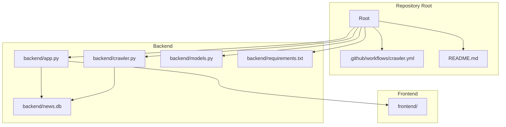
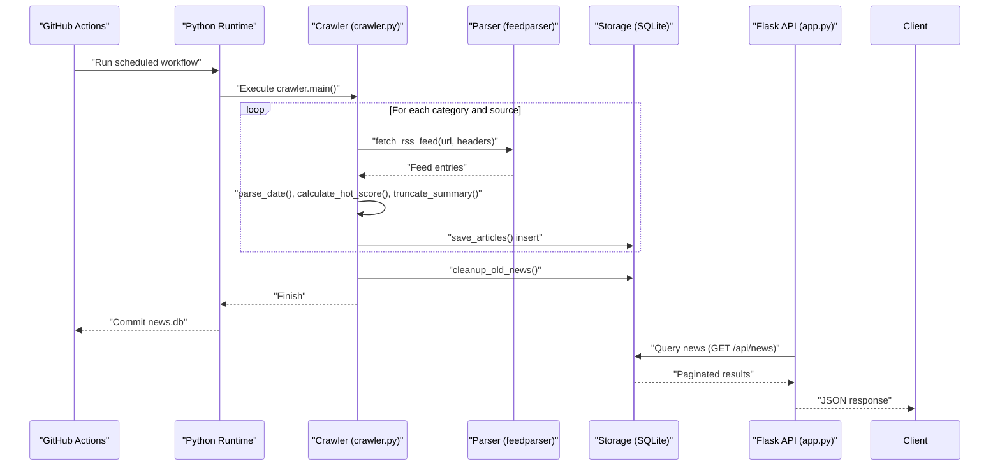
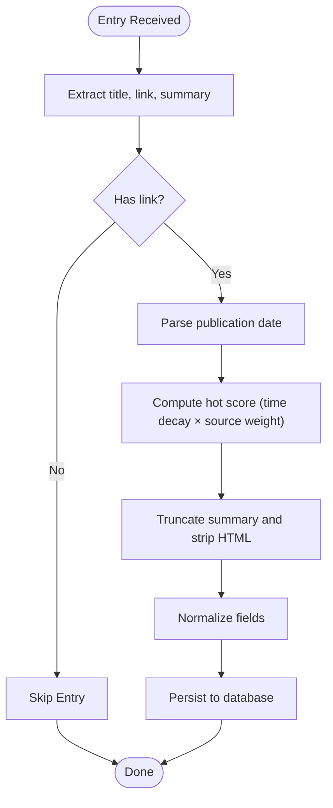
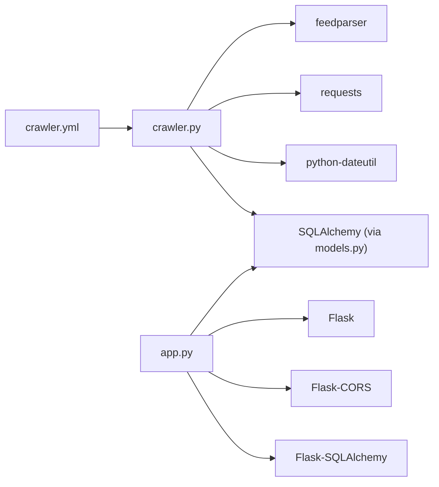
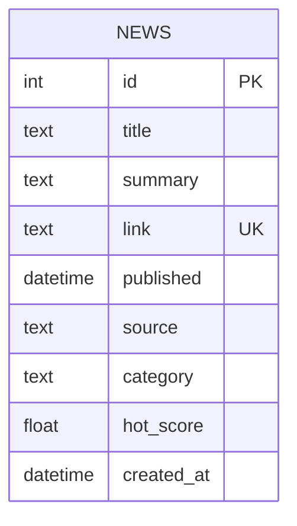

# RSS Crawler System

<cite>
**Referenced Files in This Document**
- [crawler.py](file://backend/crawler.py)
- [models.py](file://backend/models.py)
- [app.py](file://backend/app.py)
- [crawler.yml](file://.github/workflows/crawler.yml)
- [requirements.txt](file://backend/requirements.txt)
- [README.md](file://README.md)
</cite>

## Table of Contents
1. [Introduction](#introduction)
2. [Project Structure](#project-structure)
3. [Core Components](#core-components)
4. [Architecture Overview](#architecture-overview)
5. [Detailed Component Analysis](#detailed-component-analysis)
6. [Dependency Analysis](#dependency-analysis)
7. [Performance Considerations](#performance-considerations)
8. [Troubleshooting Guide](#troubleshooting-guide)
9. [Conclusion](#conclusion)
10. [Appendices](#appendices)

## Introduction
This document describes the RSS crawler system that powers a news aggregator focused on two domains: Programmer Circle and AI Circle. The crawler fetches RSS feeds from predefined sources, parses entries, computes a hot score, and persists the data to a local SQLite database. A GitHub Actions workflow automates daily crawling and updates the repository with the latest news database snapshot. The backend Flask API exposes endpoints to query and paginate news items, sort by recency or popularity, and retrieve categories.

## Project Structure
The project follows a simple backend-first architecture with a dedicated crawler module, a lightweight Flask API, and a GitHub Actions workflow for automation.

**Diagram sources**
- [README.md:5-26](file://README.md#L5-L26)
- [crawler.yml:1-46](file://.github/workflows/crawler.yml#L1-L46)
- [app.py:12-18](file://backend/app.py#L12-L18)
- [crawler.py:13-37](file://backend/crawler.py#L13-L37)

**Section sources**
- [README.md:5-26](file://README.md#L5-L26)
- [app.py:12-18](file://backend/app.py#L12-L18)
- [crawler.py:13-37](file://backend/crawler.py#L13-L37)

## Core Components
- RSS Sources Configuration: Defines categorized RSS feeds with weights for scoring.
- RSS Fetcher and Parser: Downloads and parses feeds, extracts metadata, and computes hot scores.
- Duplicate Prevention: Skips entries with existing links.
- Database Model: Stores news items with fields for title, summary, link, publication date, source, category, and hot score.
- API Layer: Exposes endpoints to list, paginate, and sort news, and to retrieve categories.
- Automation: GitHub Actions job schedules daily crawling and commits database updates.

**Section sources**
- [crawler.py:13-37](file://backend/crawler.py#L13-L37)
- [crawler.py:88-136](file://backend/crawler.py#L88-L136)
- [models.py:10-39](file://backend/models.py#L10-L39)
- [app.py:21-55](file://backend/app.py#L21-L55)
- [crawler.yml:1-46](file://.github/workflows/crawler.yml#L1-L46)

## Architecture Overview
The crawler orchestrates a pipeline that fetches RSS feeds, transforms entries into normalized records, and persists them to the database. The Flask API reads from the same database to serve client requests.

**Diagram sources**
- [crawler.yml:28-39](file://.github/workflows/crawler.yml#L28-L39)
- [crawler.py:88-136](file://backend/crawler.py#L88-L136)
- [crawler.py:139-167](file://backend/crawler.py#L139-L167)
- [crawler.py:170-177](file://backend/crawler.py#L170-L177)
- [app.py:21-55](file://backend/app.py#L21-L55)

## Detailed Component Analysis

### RSS Sources Configuration
- Organization: Feeds are grouped by category (e.g., Programmer Circle, AI Circle).
- Fields: Each source defines URL, human-readable name, and a numeric weight used in scoring.
- Purpose: Provides a centralized, editable catalog of RSS endpoints and their relative importance.

Key behaviors:
- Category-driven iteration ensures systematic coverage.
- Weight influences hot score computation.

**Section sources**
- [crawler.py:13-37](file://backend/crawler.py#L13-L37)

### RSS Fetcher and Parser
Responsibilities:
- HTTP retrieval with a realistic User-Agent header.
- Feed parsing via feedparser.
- Entry normalization: title, link, summary, published date.
- Hot score calculation using time decay and source weight.
- Summary truncation and HTML tag removal.

Error handling:
- Graceful handling of network errors, parsing warnings, and malformed entries.
- Skips entries without essential fields (e.g., missing link).

Rate limiting:
- Small delay between requests to be respectful to upstream servers.

**Section sources**
- [crawler.py:88-136](file://backend/crawler.py#L88-L136)
- [crawler.py:45-59](file://backend/crawler.py#L45-L59)
- [crawler.py:62-73](file://backend/crawler.py#L62-L73)
- [crawler.py:76-85](file://backend/crawler.py#L76-L85)

### Duplicate Prevention Mechanism
- Uniqueness constraint: Links are unique in the database.
- Pre-save check: Query by link to detect duplicates.
- Behavior: Skips insertion for known links; continues processing others.

Benefits:
- Prevents redundant storage and maintains dataset integrity.

**Section sources**
- [models.py:17](file://backend/models.py#L17)
- [crawler.py:139-167](file://backend/crawler.py#L139-L167)

### Content Processing Pipeline

**Diagram sources**
- [crawler.py:104-124](file://backend/crawler.py#L104-L124)
- [crawler.py:45-59](file://backend/crawler.py#L45-L59)
- [crawler.py:62-73](file://backend/crawler.py#L62-L73)
- [crawler.py:76-85](file://backend/crawler.py#L76-L85)

### Hot Score Calculation Algorithm
- Inputs: Published date and source weight.
- Formula: hot_score = (1 / (hours_since_published + 2)) × source_weight.
- Rationale: Recent items receive higher scores; source weight amplifies importance; small constant prevents division by zero and stabilizes early scores.

Edge cases:
- Handles parsing failures by falling back to current time.
- Rounds to four decimal places for consistency.

**Section sources**
- [crawler.py:62-73](file://backend/crawler.py#L62-L73)

### Source Weighting System
- Purpose: Adjust the influence of a source on hot ranking.
- Application: Multiplied into the hot score formula.
- Categories: Two built-in categories with distinct sets of weighted sources.

Operational note:
- Weights are part of the configuration and can be tuned without code changes.

**Section sources**
- [crawler.py:13-37](file://backend/crawler.py#L13-L37)
- [crawler.py:62-73](file://backend/crawler.py#L62-L73)

### Content Categorization Logic
- Category field is set during feed processing based on the RSS source’s grouping.
- API supports filtering by category and sorting by recency or hotness.

**Section sources**
- [crawler.py:189-201](file://backend/crawler.py#L189-L201)
- [app.py:30-45](file://backend/app.py#L30-L45)

### Database Model and Integration
- Table: news with fields for id, title, summary, link, published, source, category, hot_score, created_at.
- Unique constraint on link ensures deduplication.
- Serialization: to_dict() for JSON responses.

Integration points:
- Crawler inserts new records.
- API queries and paginates records.

**Section sources**
- [models.py:10-39](file://backend/models.py#L10-L39)
- [crawler.py:139-167](file://backend/crawler.py#L139-L167)
- [app.py:21-55](file://backend/app.py#L21-L55)

### API Endpoints and Sorting
- GET /api/news: Paginated list with optional category and sort parameters.
- Sort modes: newest (by published desc) and hottest (by hot_score desc).
- GET /api/news/:id: Single item retrieval.
- GET /api/categories: Available categories.
- GET /api/health: Health check.

**Section sources**
- [app.py:21-55](file://backend/app.py#L21-L55)
- [app.py:65-68](file://backend/app.py#L65-L68)
- [app.py:71-74](file://backend/app.py#L71-L74)

### Automation and Cleanup
- GitHub Actions: Daily schedule at midnight UTC with manual trigger support.
- Steps: checkout, Python setup, dependency installation, crawler execution, committing and pushing the SQLite database snapshot.
- Cleanup: Removes articles older than a configured threshold (30 days) after crawling.

**Section sources**
- [crawler.yml:1-46](file://.github/workflows/crawler.yml#L1-L46)
- [crawler.py:170-177](file://backend/crawler.py#L170-L177)

## Dependency Analysis
External libraries and their roles:
- feedparser: Parses RSS/Atom feeds.
- requests: HTTP client for fetching feed content.
- python-dateutil: Robust date parsing fallback.
- Flask, Flask-SQLAlchemy, Flask-CORS: Web framework and ORM integration.
- gunicorn: WSGI server for production deployment.

**Diagram sources**
- [requirements.txt:1-8](file://backend/requirements.txt#L1-L8)
- [crawler.py:5-11](file://backend/crawler.py#L5-L11)
- [app.py:4-6](file://backend/app.py#L4-L6)
- [crawler.yml:23-31](file://.github/workflows/crawler.yml#L23-L31)

**Section sources**
- [requirements.txt:1-8](file://backend/requirements.txt#L1-L8)
- [crawler.py:5-11](file://backend/crawler.py#L5-L11)
- [app.py:4-6](file://backend/app.py#L4-L6)

## Performance Considerations
- Network timeouts: Requests are bounded to prevent hanging on slow feeds.
- Rate limiting: Short delays between requests reduce load on external servers.
- Parsing robustness: Multiple date field attempts and bozo warning logging improve resilience.
- Database writes: Batch-like behavior via session commit after processing a batch of articles.
- Cleanup cadence: Periodic pruning reduces database size and improves query performance.
- Sorting cost: Hot score sorting requires scanning the table; consider indexing hot_score if scaling.

[No sources needed since this section provides general guidance]

## Troubleshooting Guide
Common issues and resolutions:
- Feed parsing warnings: Some feeds may have malformed dates or encodings; the parser logs warnings and continues. Review the feed URL and adjust parsing logic if necessary.
- Missing links: Entries without links are skipped; verify feed structure and entry fields.
- Network errors: Timeouts or connection failures are caught; retry later or check network connectivity.
- Duplicate entries: Existing links are skipped; confirm uniqueness constraints and avoid reprocessing the same feed.
- Database growth: Old articles are cleaned up periodically; adjust retention policy if needed.
- Automation failures: Verify GitHub Actions permissions, Python version, and dependency installation steps.

**Section sources**
- [crawler.py:101-102](file://backend/crawler.py#L101-L102)
- [crawler.py:110-111](file://backend/crawler.py#L110-L111)
- [crawler.py:131-134](file://backend/crawler.py#L131-L134)
- [crawler.py:147-150](file://backend/crawler.py#L147-L150)
- [crawler.py:170-177](file://backend/crawler.py#L170-L177)
- [crawler.yml:23-39](file://.github/workflows/crawler.yml#L23-L39)

## Conclusion
The RSS crawler system is a compact, reliable pipeline that aggregates news from curated sources, enriches entries with hot scores, and persists them to a SQLite database. The GitHub Actions automation ensures daily updates, while the Flask API provides a simple interface for clients. The design balances simplicity, maintainability, and scalability for a small-scale news aggregator.

[No sources needed since this section summarizes without analyzing specific files]

## Appendices

### Configuration Examples
- RSS Sources: Add or modify entries under categories with URL, name, and weight.
- Sorting: Use the sort query parameter to choose newest or hottest.
- Pagination: Use the page query parameter to navigate results.

**Section sources**
- [crawler.py:13-37](file://backend/crawler.py#L13-L37)
- [app.py:21-55](file://backend/app.py#L21-L55)

### Data Model Reference

**Diagram sources**
- [models.py:10-39](file://backend/models.py#L10-L39)

### API Definition
- GET /api/news: Query parameters include category, sort, and page.
- GET /api/news/:id: Retrieve a single news item.
- GET /api/categories: List available categories.
- GET /api/health: Health check.

**Section sources**
- [app.py:21-55](file://backend/app.py#L21-L55)
- [app.py:58-62](file://backend/app.py#L58-L62)
- [app.py:65-68](file://backend/app.py#L65-L68)
- [app.py:71-74](file://backend/app.py#L71-L74)