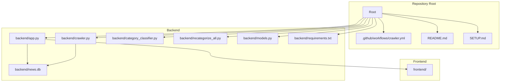
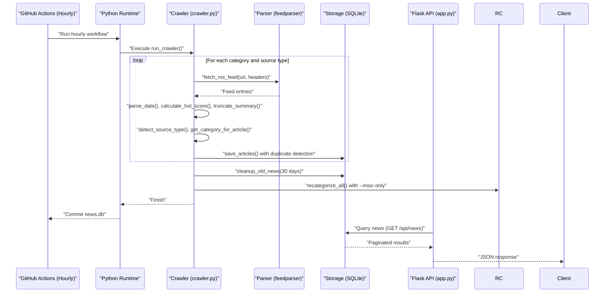
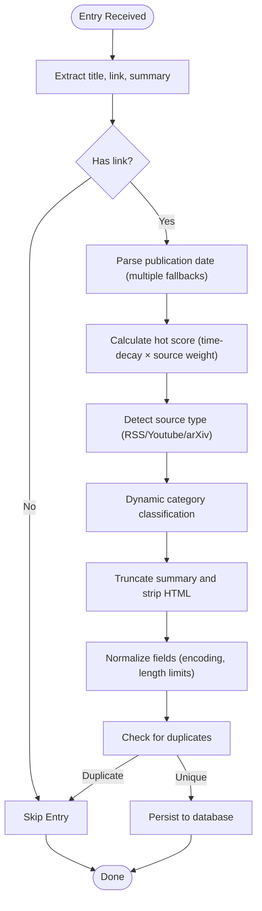
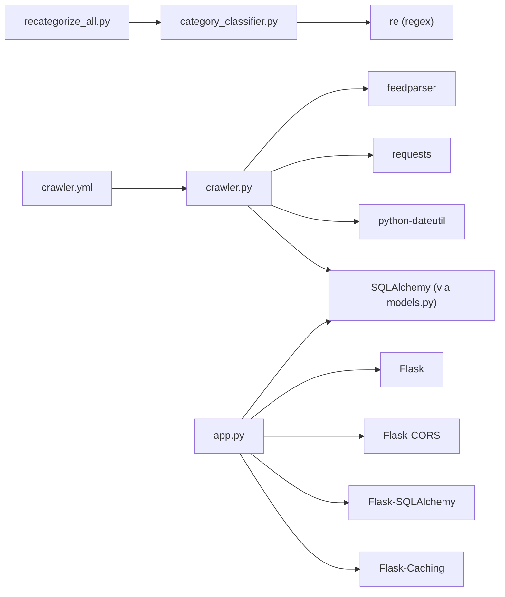
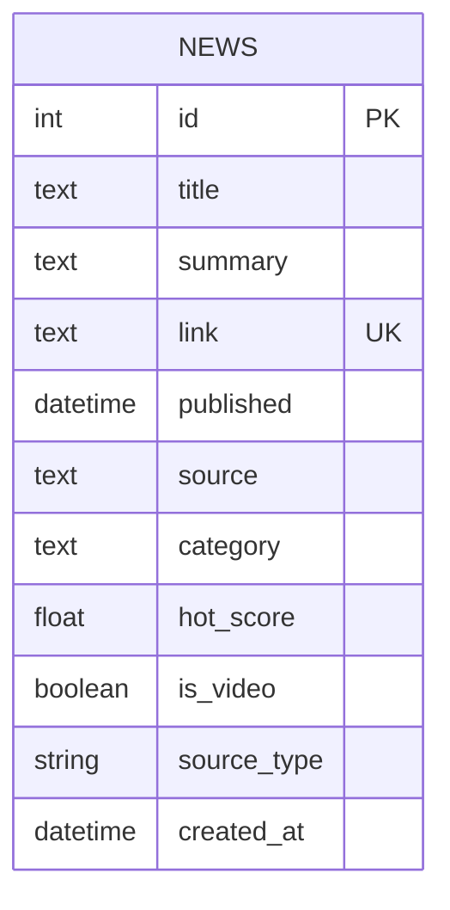

# RSS Crawler System

<cite>
**Referenced Files in This Document**
- [crawler.py](file://backend/crawler.py)
- [models.py](file://backend/models.py)
- [app.py](file://backend/app.py)
- [category_classifier.py](file://backend/category_classifier.py)
- [recategorize_all.py](file://backend/recategorize_all.py)
- [crawler.yml](file://.github/workflows/crawler.yml)
- [requirements.txt](file://backend/requirements.txt)
- [README.md](file://README.md)
- [SETUP.md](file://SETUP.md)
</cite>

## Update Summary
**Changes Made**
- Updated RSS sources configuration to cover 6 technical domains instead of 7
- Enhanced hot score calculation algorithm with improved time-decay mechanics
- Added systematic cleanup mechanism for outdated articles (30-day retention)
- Integrated YouTube RSS and arXiv sources for comprehensive coverage
- Implemented intelligent source type detection and dynamic category classification
- Added comprehensive recategorization system for automatic content correction
- Improved duplicate detection with intelligent pre-save validation
- Updated GitHub Actions workflow to hourly scheduling for better freshness
- Enhanced database schema with video support and source type tracking

## Table of Contents
1. [Introduction](#introduction)
2. [Project Structure](#project-structure)
3. [Core Components](#core-components)
4. [Architecture Overview](#architecture-overview)
5. [Detailed Component Analysis](#detailed-component-analysis)
6. [Dependency Analysis](#dependency-analysis)
7. [Performance Considerations](#performance-considerations)
8. [Troubleshooting Guide](#troubleshooting-guide)
9. [Conclusion](#conclusion)
10. [Appendices](#appendices)

## Introduction
This document describes the comprehensive RSS crawler system that powers a multi-domain news aggregator covering six technical communities. The enhanced crawler system fetches RSS feeds from diverse sources including frontend development, backend engineering, cloud-native technologies, AI research, blockchain, and general programming communities. It intelligently processes entries through a unified pipeline, calculates sophisticated hot scores using time-decay algorithms, prevents duplicates through advanced detection mechanisms, and systematically cleans up outdated content. The system is fully automated through hourly GitHub Actions workflows and exposes a robust REST API for content consumption.

## Project Structure
The project maintains a backend-first architecture with specialized crawler modules, comprehensive RSS source configurations, intelligent duplicate detection, and automated cleanup mechanisms.

**Diagram sources**
- [README.md:5-26](file://README.md#L5-L26)
- [SETUP.md:214-230](file://SETUP.md#L214-L230)
- [crawler.yml:1-55](file://.github/workflows/crawler.yml#L1-L55)
- [app.py:12-18](file://backend/app.py#L12-L18)
- [crawler.py:13-37](file://backend/crawler.py#L13-L37)

**Section sources**
- [README.md:5-26](file://README.md#L5-L26)
- [SETUP.md:214-230](file://SETUP.md#L214-L230)
- [app.py:12-18](file://backend/app.py#L12-L18)
- [crawler.py:13-37](file://backend/crawler.py#L13-L37)

## Core Components
- **Comprehensive RSS Sources Configuration**: Six categorized RSS feeds spanning multiple technical domains with sophisticated weighting systems
- **Multi-source Integration**: RSS feeds, YouTube RSS, and arXiv sources unified under a single processing pipeline
- **Intelligent Duplicate Detection**: Advanced pre-save validation with unique constraint enforcement
- **Sophisticated Hot Score Calculation**: Time-decay algorithm with source weighting and precision control
- **Systematic Content Processing Pipeline**: Comprehensive entry normalization, validation, and enrichment
- **Automated Cleanup Mechanism**: Intelligent pruning of outdated content based on configurable thresholds
- **Robust API Layer**: Comprehensive endpoints for querying, pagination, sorting, and category management
- **Hourly Automation**: GitHub Actions workflow running every hour for optimal content freshness
- **Dynamic Category Classification**: Intelligent article categorization based on content analysis
- **Recategorization System**: Automated content correction and quality improvement

**Section sources**
- [crawler.py:15-126](file://backend/crawler.py#L15-L126)
- [crawler.py:172-179](file://backend/crawler.py#L172-L179)
- [crawler.py:246-277](file://backend/crawler.py#L246-L277)
- [models.py:10-39](file://backend/models.py#L10-L39)
- [app.py:67-146](file://backend/app.py#L67-L146)
- [crawler.yml:1-55](file://.github/workflows/crawler.yml#L1-L55)

## Architecture Overview
The enhanced crawler system orchestrates a sophisticated pipeline that processes multiple RSS source types, applies intelligent duplicate detection, calculates precise hot scores, and maintains optimal database performance through systematic cleanup and recategorization.

**Diagram sources**
- [crawler.yml:32-41](file://.github/workflows/crawler.yml#L32-L41)
- [crawler.py:289-352](file://backend/crawler.py#L289-L352)
- [crawler.py:279-287](file://backend/crawler.py#L279-L287)
- [app.py:67-106](file://backend/app.py#L67-L106)

## Detailed Component Analysis

### Enhanced RSS Sources Configuration
The system now manages six comprehensive categories covering diverse technical domains with significantly expanded source coverage:

**Primary Technical Domains:**
- **前端 (Frontend)**: 12 sources including JavaScript frameworks, CSS libraries, and frontend development communities
- **后端 (Backend)**: 12 sources covering server-side technologies, programming languages, and backend infrastructure
- **云原生 (Cloud Native)**: 10 sources focusing on containerization, Kubernetes, and cloud-native technologies
- **AI (Artificial Intelligence)**: 19 sources featuring AI research institutions, tech companies, and academic publications
- **区块链 (Blockchain)**: 7 sources including cryptocurrency news and blockchain developments
- **其他 (Other)**: 6 sources covering general programming communities and technology news

**Specialized Content Sources:**
- **YouTube RSS Sources**: 4 technology-focused YouTube channels with video content treated as RSS feeds
- **arXiv Sources**: Integrated into AI category with 6 specialized academic paper feeds

Each source includes URL, human-readable name, and weight factors used in hot score calculations. The configuration supports easy expansion and modification without code changes.

**Section sources**
- [crawler.py:15-126](file://backend/crawler.py#L15-L126)

### Multi-source Integration Pipeline
The crawler processes three distinct source types through a unified pipeline with intelligent source type detection:

**Standard RSS Sources**: Traditional RSS feeds from tech publications and developer communities
**YouTube RSS Sources**: Video content from technology-focused YouTube channels with `is_video` flag
**arXiv Sources**: Academic papers and research publications in AI and machine learning domains

Each source type follows identical processing steps: fetching, parsing, validation, hot score calculation, dynamic category classification, and persistence. The `detect_source_type()` function intelligently identifies source types for proper tagging and processing.

**Section sources**
- [crawler.py:172-179](file://backend/crawler.py#L172-L179)
- [crawler.py:181-243](file://backend/crawler.py#L181-L243)

### Intelligent Duplicate Detection Mechanism
Advanced duplicate prevention ensures data integrity and optimal database performance:

**Pre-save Validation**: Each article undergoes duplicate checking before insertion using the unique link constraint
**Unique Constraint Enforcement**: Database-level unique constraint on the link field prevents duplicate entries
**Skipped Count Tracking**: System maintains statistics on processed vs. skipped articles for monitoring
**Efficient Query Pattern**: Single database query per article to check for existing links

The mechanism gracefully handles edge cases such as malformed URLs, missing links, and database connection issues while maintaining system reliability.

**Section sources**
- [models.py:17](file://backend/models.py#L17)
- [crawler.py:246-277](file://backend/crawler.py#L246-L277)

### Sophisticated Content Processing Pipeline
The enhanced pipeline implements comprehensive content normalization and enrichment with dynamic categorization:

**Diagram sources**
- [crawler.py:129-144](file://backend/crawler.py#L129-L144)
- [crawler.py:146-158](file://backend/crawler.py#L146-L158)
- [crawler.py:172-179](file://backend/crawler.py#L172-L179)
- [crawler.py:216-220](file://backend/crawler.py#L216-L220)
- [crawler.py:246-277](file://backend/crawler.py#L246-L277)

### Advanced Hot Score Calculation Algorithm
The enhanced hot score system implements sophisticated time-decay mechanics:

**Formula**: `hot_score = (1 / (hours_since_published + 2)) × source_weight`

**Key Features:**
- **Time Decay**: Recent articles receive exponentially higher scores
- **Source Weighting**: Institutional and authoritative sources receive premium scores
- **Precision Control**: Scores rounded to four decimal places for consistency
- **Edge Case Handling**: Graceful fallback to zero for calculation errors
- **Stabilization Constant**: Addition of 2 prevents division by zero and stabilizes early scores

**Weight Categories:**
- **1.0**: Standard community sources
- **1.1**: Well-established tech companies
- **1.2**: Major research institutions
- **1.3**: Industry leaders and premier institutions

**Section sources**
- [crawler.py:146-158](file://backend/crawler.py#L146-L158)

### Comprehensive Content Categorization Logic
The system implements intelligent categorization across six distinct technical domains with dynamic classification:

**Category Assignment**: Articles inherit category from their RSS source configuration
**Dynamic Category Discovery**: `get_category_for_article()` function analyzes article content for mixed sources
**Flexible Filtering**: API supports category-specific queries and filtering
**Hierarchical Organization**: Technical domains organized by expertise level and specialization

**Available Categories**:
- Frontend, Backend, Cloud Native, AI, Blockchain, Other

**Dynamic Classification Sources**: Hacker News, Reddit r/programming, Open Source China, InfoQ, Alibaba Cloud Developer Community, Ruanyifeng's Network Log, Shangguigu, Heima Programmer, Tech With Tim, Computerphile

**Section sources**
- [category_classifier.py:82-151](file://backend/category_classifier.py#L82-L151)
- [app.py:116-139](file://backend/app.py#L116-L139)

### Database Model and Integration
The enhanced database model supports comprehensive content management with video support:

**News Table Schema**:
- `id`: Auto-incrementing primary key
- `title`: Text field with character limits
- `summary`: Rich text content with HTML stripping
- `link`: Unique identifier with database-level uniqueness
- `published`: DateTime with timezone awareness
- `source`: Originating publication or channel
- `category`: Technical domain classification
- `hot_score`: Floating-point score for ranking
- `is_video`: Boolean flag for YouTube content
- `source_type`: String indicating source type ('rss', 'youtube', 'arxiv')
- `created_at`: Timestamp for record creation

**Unique Constraint**: Link field ensures no duplicate content storage
**Composite Indexes**: Optimized indexes for common query patterns
**Serialization**: Efficient JSON conversion for API responses

**Section sources**
- [models.py:10-49](file://backend/models.py#L10-L49)
- [crawler.py:259-270](file://backend/crawler.py#L259-L270)
- [app.py:67-106](file://backend/app.py#L67-L106)

### API Endpoints and Advanced Sorting
The comprehensive API supports sophisticated content discovery:

**Core Endpoints**:
- `GET /api/news`: Advanced pagination with category filtering and sorting options
- `GET /api/news/:id`: Direct content retrieval by identifier
- `GET /api/categories`: Dynamic category listing with predefined order
- `GET /api/health`: System health monitoring
- `POST /api/admin/clear-cache`: Admin endpoint for cache management

**Sorting Capabilities**:
- **Newest**: Chronological ordering by publication date
- **Hottest**: Ranking by calculated hot score
- **Category-specific**: Domain-focused content discovery

**Pagination Controls**:
- Configurable page sizes (1-100 items)
- Automatic result counting and page calculation
- Efficient database query optimization

**Section sources**
- [app.py:67-146](file://backend/app.py#L67-L146)

### Hourly Automation and Cleanup System
The enhanced automation system ensures optimal content freshness and database performance:

**Scheduling**: GitHub Actions workflow runs every hour at minute 0
**Environment Management**: Automated Python environment setup and dependency installation
**Database Optimization**: Systematic cleanup of articles older than 30 days
**Change Detection**: Intelligent commit detection to minimize unnecessary pushes
**Monitoring**: Comprehensive workflow summary with timestamp information
**Recategorization**: Automated content correction for misclassified articles

**Cleanup Process**:
- **Threshold Configuration**: 30-day retention period for optimal balance
- **Batch Deletion**: Efficient bulk removal of expired content
- **Performance Impact**: Minimal database overhead during cleanup operations
- **Data Integrity**: Maintains referential integrity during cleanup

**Recategorization Process**:
- **Daily Execution**: Runs after crawling to improve content quality
- **Selective Processing**: Uses `--misc-only` flag to process only misclassified content
- **Batch Updates**: Efficient bulk updates with transaction safety

**Section sources**
- [crawler.yml:1-55](file://.github/workflows/crawler.yml#L1-L55)
- [crawler.py:279-287](file://backend/crawler.py#L279-L287)

### Dynamic Category Classification System
The system implements intelligent content analysis for accurate categorization:

**Keyword-based Classification**: Comprehensive regex patterns for each category
**Priority-based Matching**: More specific patterns take precedence over general ones
**Mixed Source Handling**: Dynamic classification for sources that publish across domains
**Backward Compatibility**: Category name mapping for legacy content
**Continuous Improvement**: Regular recategorization to refine classification accuracy

**Classification Categories**:
- **Frontend**: JavaScript frameworks, CSS libraries, UI components
- **Backend**: Programming languages, databases, system architecture
- **Cloud Native**: Containerization, orchestration, DevOps tools
- **AI**: Machine learning, deep learning, AI research
- **Blockchain**: Cryptocurrencies, smart contracts, Web3

**Section sources**
- [category_classifier.py:8-79](file://backend/category_classifier.py#L8-L79)
- [category_classifier.py:120-151](file://backend/category_classifier.py#L120-L151)

### Recategorization System
The automated recategorization system ensures content quality and accuracy:

**Full Recategorization**: Complete database scan and category correction
**Selective Processing**: Focus on misclassified 'Other' category content
**Batch Operations**: Efficient bulk updates with transaction safety
**Dry Run Mode**: Preview changes before applying modifications
**Progress Tracking**: Detailed summary of proposed and applied changes

**Process Flow**:
- **Analysis Phase**: Scan all content and determine new categories
- **Validation Phase**: Show proposed changes and require confirmation
- **Application Phase**: Execute batch updates with error handling
- **Verification Phase**: Confirm successful completion

**Section sources**
- [recategorize_all.py:11-96](file://backend/recategorize_all.py#L11-L96)
- [recategorize_all.py:98-177](file://backend/recategorize_all.py#L98-L177)

## Dependency Analysis
The enhanced system relies on a carefully selected set of external libraries:

**Core Dependencies**:
- **feedparser**: Robust RSS/Atom feed parsing with comprehensive error handling
- **requests**: Reliable HTTP client with timeout and retry capabilities
- **python-dateutil**: Flexible date parsing supporting multiple formats
- **Flask**: Lightweight web framework for API services
- **Flask-SQLAlchemy**: ORM integration for database operations
- **Flask-CORS**: Cross-origin resource sharing for frontend integration
- **Flask-Caching**: In-memory caching for improved API performance
- **gunicorn**: Production-ready WSGI server

**Version Compatibility**: All dependencies are pinned to ensure reproducible builds and stable operation

**Diagram sources**
- [requirements.txt:1-9](file://backend/requirements.txt#L1-L9)
- [crawler.py:5-12](file://backend/crawler.py#L5-L12)
- [app.py:4-7](file://backend/app.py#L4-L7)
- [crawler.yml:27-35](file://.github/workflows/crawler.yml#L27-L35)

**Section sources**
- [requirements.txt:1-9](file://backend/requirements.txt#L1-L9)
- [crawler.py:5-12](file://backend/crawler.py#L5-L12)
- [app.py:4-7](file://backend/app.py#L4-L7)

## Performance Considerations
The enhanced system implements multiple optimization strategies:

**Network Efficiency**:
- **Timeout Configuration**: 30-second request timeouts prevent hanging connections
- **Rate Limiting**: 1-second delays between requests to respect upstream servers
- **Connection Reuse**: Persistent connections reduce overhead for multiple requests

**Processing Optimization**:
- **Batch Operations**: Database commits occur after processing batches of articles
- **Memory Management**: Progressive processing prevents memory accumulation
- **Error Containment**: Individual feed failures don't impact overall system operation
- **Selective Recategorization**: `--misc-only` flag reduces processing overhead

**Database Performance**:
- **Optimized Indexes**: Composite indexes for category and score queries
- **Cleanup Scheduling**: Hourly cleanup prevents database bloat
- **Constraint Enforcement**: Database-level constraints ensure data integrity
- **Batch Updates**: Efficient bulk operations for recategorization

**Scalability Considerations**:
- **Horizontal Scaling**: Separate API and crawler processes enable independent scaling
- **Caching Strategy**: In-memory caching reduces database load for frequent queries
- **Queue Integration**: Potential for message queue integration for high-volume scenarios

## Troubleshooting Guide
Enhanced troubleshooting guidance for the comprehensive system:

**Feed Integration Issues**:
- **Parsing Failures**: Multiple date field attempts and fallback mechanisms handle malformed feeds
- **Network Connectivity**: Timeout exceptions are caught and logged with specific source identification
- **Rate Limiting**: Server-side rate limiting is handled gracefully with retry logic

**Content Quality Issues**:
- **Duplicate Detection**: Unique constraint violations are logged with specific article details
- **Hot Score Anomalies**: Edge case handling ensures graceful degradation of scoring algorithms
- **HTML Content**: Comprehensive stripping removes unwanted markup while preserving readability
- **Category Classification**: Dynamic classification may misclassify content; use recategorization scripts

**Database and Performance Issues**:
- **Cleanup Failures**: Database transaction rollback ensures consistency during cleanup operations
- **Memory Usage**: Progressive processing prevents memory exhaustion during large crawls
- **Index Performance**: Database optimization recommendations for high-volume scenarios
- **Cache Management**: Use admin endpoint to clear cache when needed

**Automation and Monitoring**:
- **Workflow Failures**: Comprehensive error logging and GitHub Actions summary reporting
- **Dependency Issues**: Version pinning ensures consistent environment across deployments
- **Health Monitoring**: Dedicated health check endpoint for system status verification
- **Recategorization Errors**: Dry run mode prevents accidental content changes

**Section sources**
- [crawler.py:129-144](file://backend/crawler.py#L129-L144)
- [crawler.py:272-277](file://backend/crawler.py#L272-L277)
- [crawler.py:279-287](file://backend/crawler.py#L279-L287)
- [crawler.yml:50-55](file://.github/workflows/crawler.yml#L50-L55)

## Conclusion
The enhanced RSS crawler system represents a comprehensive solution for multi-domain technical content aggregation. Through sophisticated RSS integration across six specialized categories, intelligent duplicate detection, advanced hot score calculation, dynamic category classification, and systematic cleanup mechanisms, the system delivers reliable, fresh, and well-organized content. The hourly automation ensures optimal content freshness while maintaining excellent performance characteristics. The robust API layer provides flexible access to aggregated content, making it suitable for modern web applications and services. The addition of YouTube and arXiv integration expands the system's coverage to include multimedia and academic content, while the recategorization system continuously improves content quality and accuracy.

## Appendices

### Enhanced Configuration Examples
**RSS Sources Expansion**:
- Add new categories by extending the RSS_SOURCES dictionary with URL, name, and weight parameters
- Configure YouTube RSS sources using YouTube's standard RSS feed format with `is_video=True`
- Integrate arXiv sources for academic paper aggregation in the AI category

**Advanced Sorting Options**:
- Use `sort=hottest` for AI-driven content ranking
- Combine `category` and `sort` parameters for domain-specific content discovery
- Configure `per_page` parameter for optimal client experience

**Performance Tuning**:
- Adjust cleanup thresholds based on content volume and storage requirements
- Modify rate limiting settings for different upstream server policies
- Optimize database configuration for expected content volumes

**Section sources**
- [crawler.py:15-126](file://backend/crawler.py#L15-L126)
- [app.py:67-106](file://backend/app.py#L67-L106)
- [crawler.py:279-287](file://backend/crawler.py#L279-L287)

### Enhanced Data Model Reference

**Diagram sources**
- [models.py:10-49](file://backend/models.py#L10-L49)

### Comprehensive API Definition
**Core Endpoints**:
- `GET /api/news`: Advanced pagination with category filtering and sorting options
- `GET /api/news/:id`: Direct content retrieval by identifier
- `GET /api/categories`: Dynamic category listing with predefined order
- `GET /api/health`: System health monitoring
- `POST /api/admin/clear-cache`: Admin endpoint for cache management

**Query Parameters**:
- `category`: Filter by technical domain (optional)
- `sort`: Content ordering ('newest' or 'hottest')
- `page`: Page number for pagination
- `per_page`: Items per page (1-100)

**Response Format**:
- JSON structure with items array and pagination metadata
- Consistent field naming across all endpoints
- ISO 8601 date formatting for temporal fields

**Section sources**
- [app.py:67-146](file://backend/app.py#L67-L146)

### Category Classification Reference
**Category Patterns**:
- **Frontend**: JavaScript frameworks, CSS libraries, UI components, build tools
- **Backend**: Programming languages, databases, system architecture, DevOps
- **Cloud Native**: Containerization, orchestration, monitoring, CI/CD
- **AI**: Machine learning, deep learning, AI research, NLP, computer vision
- **Blockchain**: Cryptocurrencies, smart contracts, Web3, decentralized systems

**Dynamic Classification Sources**:
- Hacker News, Reddit r/programming, Open Source China, InfoQ
- Alibaba Cloud Developer Community, Ruanyifeng's Network Log
- Shangguigu, Heima Programmer, Tech With Tim, Computerphile

**Section sources**
- [category_classifier.py:8-79](file://backend/category_classifier.py#L8-L79)
- [category_classifier.py:82-86](file://backend/category_classifier.py#L82-L86)