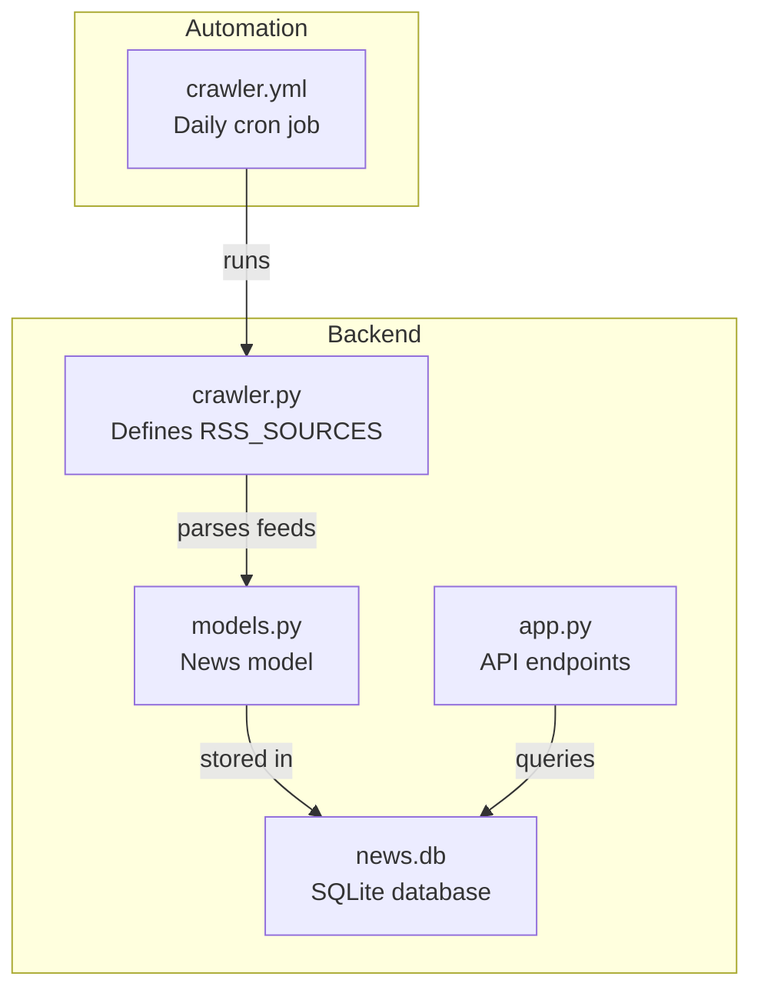
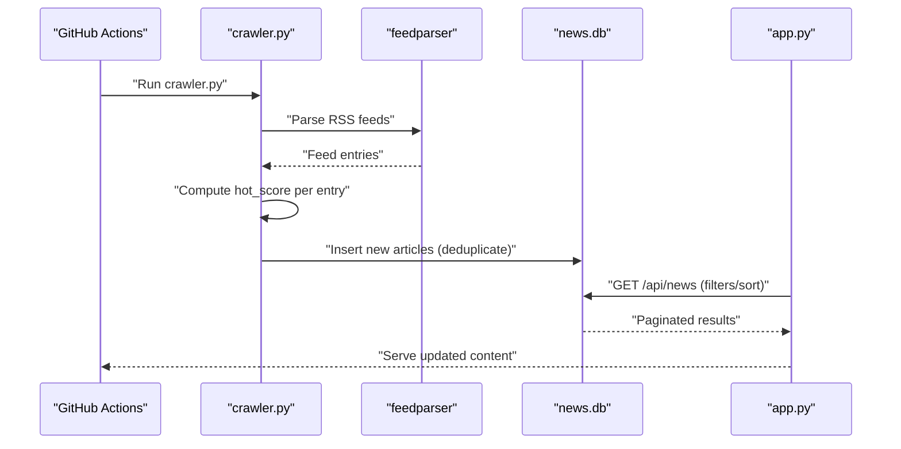
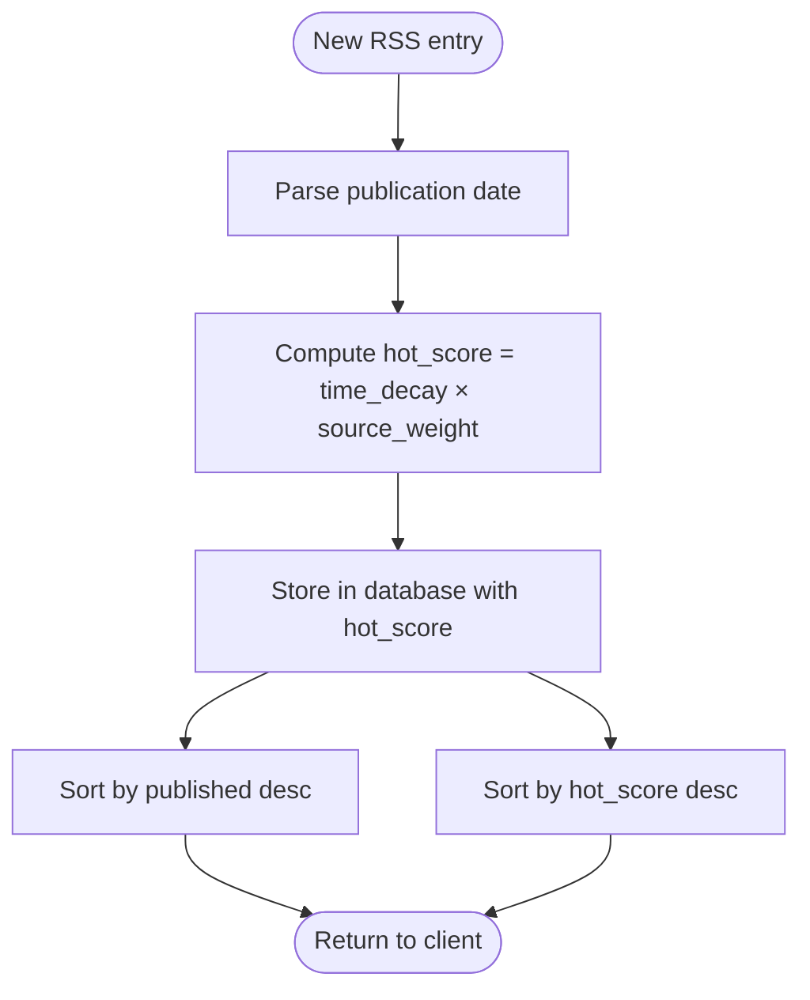
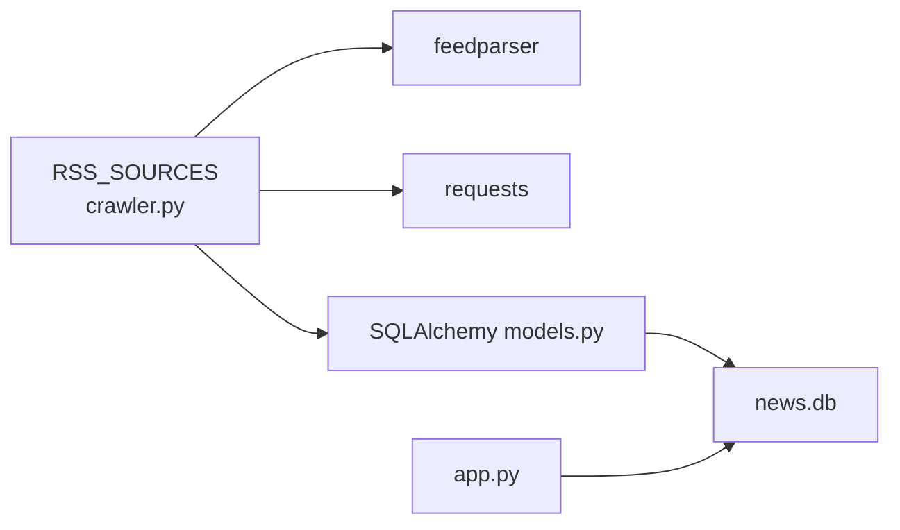

# RSS Sources Configuration

<cite>
**Referenced Files in This Document**
- [README.md](file://README.md)
- [backend/app.py](file://backend/app.py)
- [backend/crawler.py](file://backend/crawler.py)
- [backend/models.py](file://backend/models.py)
- [.github/workflows/crawler.yml](file://.github/workflows/crawler.yml)
- [backend/requirements.txt](file://backend/requirements.txt)
</cite>

## Table of Contents
1. [Introduction](#introduction)
2. [Project Structure](#project-structure)
3. [Core Components](#core-components)
4. [Architecture Overview](#architecture-overview)
5. [Detailed Component Analysis](#detailed-component-analysis)
6. [Dependency Analysis](#dependency-analysis)
7. [Performance Considerations](#performance-considerations)
8. [Troubleshooting Guide](#troubleshooting-guide)
9. [Conclusion](#conclusion)
10. [Appendices](#appendices)

## Introduction
This document explains the RSS sources configuration system used by the news aggregator. It focuses on how RSS feeds are defined and organized, how source weights influence content prioritization, and how to add or modify sources safely. It also covers best practices for selecting reliable feeds and troubleshooting common configuration issues.

## Project Structure
The RSS configuration is centralized in the crawler module and consumed by the API and database layers. The crawler defines RSS_SOURCES as a dictionary keyed by category, with each category containing a list of source entries. The API exposes endpoints to query news and categories, while the database persists normalized news items.

**Diagram sources**
- [backend/crawler.py:13-37](file://backend/crawler.py#L13-L37)
- [backend/models.py:10-39](file://backend/models.py#L10-L39)
- [backend/app.py:21-74](file://backend/app.py#L21-L74)
- [.github/workflows/crawler.yml:1-46](file://.github/workflows/crawler.yml#L1-L46)

**Section sources**
- [README.md:1-67](file://README.md#L1-L67)
- [backend/crawler.py:13-37](file://backend/crawler.py#L13-L37)
- [backend/app.py:21-74](file://backend/app.py#L21-L74)
- [.github/workflows/crawler.yml:1-46](file://.github/workflows/crawler.yml#L1-L46)

## Core Components
- RSS_SOURCES: A dictionary that organizes sources by category. Categories include “Programmer Circle” and “AI Circle”. Each category maps to a list of source dictionaries.
- Source entry format: Each source entry is a dictionary with keys for URL, name, and weight.
- Weighting system: Source weights are used to adjust the hotness of articles when calculating hot scores. Higher weights increase the relative prominence of articles from that source.
- Hot score calculation: The crawler computes a time-decayed hot score per article, incorporating the source weight.
- API consumption: The API sorts news by published time by default and supports a “hottest” sort mode that uses the stored hot_score.

Key implementation references:
- RSS_SOURCES definition and categories: [backend/crawler.py:13-37](file://backend/crawler.py#L13-L37)
- Hot score computation: [backend/crawler.py:62-74](file://backend/crawler.py#L62-L74)
- API sorting modes: [backend/app.py:21-55](file://backend/app.py#L21-L55)
- News model fields (including hot_score): [backend/models.py:10-39](file://backend/models.py#L10-L39)

**Section sources**
- [backend/crawler.py:13-37](file://backend/crawler.py#L13-L37)
- [backend/crawler.py:62-74](file://backend/crawler.py#L62-L74)
- [backend/app.py:21-55](file://backend/app.py#L21-L55)
- [backend/models.py:10-39](file://backend/models.py#L10-L39)

## Architecture Overview
The RSS configuration system integrates with the crawler, database, and API layers. The crawler reads RSS_SOURCES, fetches feeds, calculates hot scores, and persists items. The API serves paginated news and supports category filtering and sorting modes.

**Diagram sources**
- [.github/workflows/crawler.yml:1-46](file://.github/workflows/crawler.yml#L1-L46)
- [backend/crawler.py:88-136](file://backend/crawler.py#L88-L136)
- [backend/crawler.py:139-167](file://backend/crawler.py#L139-L167)
- [backend/app.py:21-55](file://backend/app.py#L21-L55)

## Detailed Component Analysis

### RSS_SOURCES Dictionary Structure
- Top-level keys: Category names (e.g., “Programmer Circle”, “AI Circle”).
- Category values: Lists of source dictionaries.
- Source dictionary fields:
  - url: RSS feed URL.
  - name: Human-readable source name.
  - weight: Numeric weight used for hot score adjustment.

Example references:
- Category “Programmer Circle” sources: [backend/crawler.py:15-26](file://backend/crawler.py#L15-L26)
- Category “AI Circle” sources: [backend/crawler.py:27-36](file://backend/crawler.py#L27-L36)

**Section sources**
- [backend/crawler.py:13-37](file://backend/crawler.py#L13-L37)

### Source Definition Format
Each source entry is a dictionary with three required keys:
- url: The RSS feed URL.
- name: The display name of the source.
- weight: A numeric weight influencing hot score.

References:
- Source entry structure: [backend/crawler.py:14-37](file://backend/crawler.py#L14-L37)

**Section sources**
- [backend/crawler.py:14-37](file://backend/crawler.py#L14-L37)

### Source Weighting System
- Purpose: Adjust the relative prominence of articles from different sources.
- Mechanism: The hot score is computed using a time-decayed formula multiplied by the source weight.
- Impact on prioritization:
  - Higher weight increases hot score for recent articles from that source.
  - Sorting by “hottest” uses the stored hot_score; sorting by “newest” ignores weights and sorts by published time.

References:
- Hot score formula and computation: [backend/crawler.py:62-74](file://backend/crawler.py#L62-L74)
- API sorting modes: [backend/app.py:21-55](file://backend/app.py#L21-L55)

**Section sources**
- [backend/crawler.py:62-74](file://backend/crawler.py#L62-L74)
- [backend/app.py:21-55](file://backend/app.py#L21-L55)

### Content Prioritization Flow

**Diagram sources**
- [backend/crawler.py:45-74](file://backend/crawler.py#L45-L74)
- [backend/models.py:10-39](file://backend/models.py#L10-L39)
- [backend/app.py:21-55](file://backend/app.py#L21-L55)

### Adding New RSS Sources
Steps to add a new source:
1. Choose or create a category key in RSS_SOURCES (e.g., “Programmer Circle”, “AI Circle”).
2. Append a new source dictionary with url, name, and weight.
3. Run the crawler to fetch and persist articles.
4. Verify via the API endpoints.

References:
- RSS_SOURCES structure: [backend/crawler.py:13-37](file://backend/crawler.py#L13-L37)
- Crawler invocation: [backend/crawler.py:180-211](file://backend/crawler.py#L180-L211)
- API endpoints: [backend/app.py:21-74](file://backend/app.py#L21-L74)

**Section sources**
- [backend/crawler.py:13-37](file://backend/crawler.py#L13-L37)
- [backend/crawler.py:180-211](file://backend/crawler.py#L180-L211)
- [backend/app.py:21-74](file://backend/app.py#L21-L74)

### Configuring Source Weights
- Select a weight that reflects the source’s importance or quality.
- Higher weights increase hot score for recent articles, making them appear higher in “hottest” views.
- Test by running the crawler and checking the API with sort=hottest.

References:
- Weight usage in hot score: [backend/crawler.py:62-74](file://backend/crawler.py#L62-L74)
- API sort modes: [backend/app.py:21-55](file://backend/app.py#L21-L55)

**Section sources**
- [backend/crawler.py:62-74](file://backend/crawler.py#L62-L74)
- [backend/app.py:21-55](file://backend/app.py#L21-L55)

### Managing Source Categories
- Add a new category by introducing a new top-level key in RSS_SOURCES.
- Ensure category names match the API’s category list.
- Verify category filtering works via the API.

References:
- Categories exposed by API: [backend/app.py:65-68](file://backend/app.py#L65-L68)
- RSS_SOURCES categories: [backend/crawler.py:13-37](file://backend/crawler.py#L13-L37)

**Section sources**
- [backend/app.py:65-68](file://backend/app.py#L65-L68)
- [backend/crawler.py:13-37](file://backend/crawler.py#L13-L37)

## Dependency Analysis
The RSS configuration system depends on external libraries and the database layer. The crawler uses feedparser and requests to fetch and parse feeds, and SQLAlchemy to persist data.

**Diagram sources**
- [backend/crawler.py:5-11](file://backend/crawler.py#L5-L11)
- [backend/models.py:4-7](file://backend/models.py#L4-L7)
- [backend/app.py:4-6](file://backend/app.py#L4-L6)

**Section sources**
- [backend/requirements.txt:1-8](file://backend/requirements.txt#L1-L8)
- [backend/crawler.py:5-11](file://backend/crawler.py#L5-L11)
- [backend/models.py:4-7](file://backend/models.py#L4-L7)
- [backend/app.py:4-6](file://backend/app.py#L4-L6)

## Performance Considerations
- Rate limiting: The crawler sleeps briefly between requests to be respectful to upstream servers.
- Deduplication: Existing articles by link are skipped to avoid redundant writes.
- Cleanup: Old articles are periodically removed to keep the database size manageable.
- Sorting cost: Sorting by hot_score requires computing and storing scores; sorting by newest avoids recomputation.

References:
- Request delays: [backend/crawler.py:201](file://backend/crawler.py#L201)
- Deduplication logic: [backend/crawler.py:146-150](file://backend/crawler.py#L146-L150)
- Cleanup routine: [backend/crawler.py:170-177](file://backend/crawler.py#L170-L177)
- Sorting modes: [backend/app.py:21-55](file://backend/app.py#L21-L55)

**Section sources**
- [backend/crawler.py:201](file://backend/crawler.py#L201)
- [backend/crawler.py:146-150](file://backend/crawler.py#L146-L150)
- [backend/crawler.py:170-177](file://backend/crawler.py#L170-L177)
- [backend/app.py:21-55](file://backend/app.py#L21-L55)

## Troubleshooting Guide
Common issues and resolutions:
- Feed parsing warnings or errors:
  - Symptom: Warning messages about bozo exceptions during feed parsing.
  - Cause: Malformed or inconsistent RSS/XML.
  - Action: Temporarily remove or adjust the problematic source entry; verify the RSS URL is valid.
  - Reference: [backend/crawler.py:101-102](file://backend/crawler.py#L101-L102)
- Network timeouts or failures:
  - Symptom: Errors fetching a specific source.
  - Cause: Network issues or server-side problems.
  - Action: Increase timeout or retry later; temporarily comment out the source; check network connectivity.
  - Reference: [backend/crawler.py:131-134](file://backend/crawler.py#L131-L134)
- Duplicate articles:
  - Symptom: Skipped counts in crawler logs.
  - Cause: Existing articles by link.
  - Action: No action needed; deduplication is expected behavior.
  - Reference: [backend/crawler.py:146-150](file://backend/crawler.py#L146-L150)
- Incorrect or missing dates:
  - Symptom: Articles sorted unexpectedly or hot scores computed incorrectly.
  - Cause: Missing or unparsable date fields.
  - Action: Ensure the RSS feed includes valid publication/update dates; fallback parsing is used but may be imprecise.
  - Reference: [backend/crawler.py:45-59](file://backend/crawler.py#L45-L59)
- API returns empty or unexpected results:
  - Symptom: No news or wrong category.
  - Action: Verify category names and filters; confirm crawler ran and populated the database.
  - References: [backend/app.py:21-55](file://backend/app.py#L21-L55), [backend/app.py:65-68](file://backend/app.py#L65-L68)

**Section sources**
- [backend/crawler.py:101-102](file://backend/crawler.py#L101-L102)
- [backend/crawler.py:131-134](file://backend/crawler.py#L131-L134)
- [backend/crawler.py:146-150](file://backend/crawler.py#L146-L150)
- [backend/crawler.py:45-59](file://backend/crawler.py#L45-L59)
- [backend/app.py:21-55](file://backend/app.py#L21-L55)
- [backend/app.py:65-68](file://backend/app.py#L65-L68)

## Conclusion
The RSS sources configuration system centers on a simple, extensible dictionary structure that organizes sources by category and assigns weights to influence content prioritization. The crawler parses feeds, computes hot scores, and persists normalized articles, while the API exposes flexible querying and sorting. By following best practices for feed selection and applying the troubleshooting steps, you can maintain a reliable and performant news aggregation pipeline.

## Appendices

### Best Practices for Selecting Reliable RSS Feeds
- Prefer official or authoritative sources.
- Ensure the RSS feed includes accurate publication dates.
- Avoid feeds with frequent downtime or malformed content.
- Monitor feed health and adjust weights accordingly.

### Example Workflow: Adding a New Source
- Add a new source entry under the desired category in RSS_SOURCES.
- Run the crawler to ingest content.
- Confirm via the API with category and sort parameters.

References:
- RSS_SOURCES structure: [backend/crawler.py:13-37](file://backend/crawler.py#L13-L37)
- Crawler run: [backend/crawler.py:180-211](file://backend/crawler.py#L180-L211)
- API endpoints: [backend/app.py:21-74](file://backend/app.py#L21-L74)