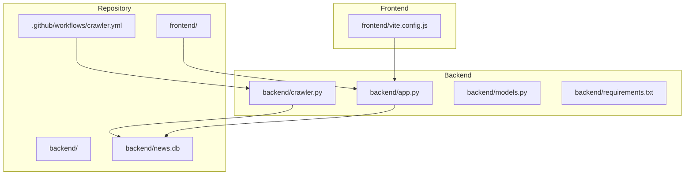
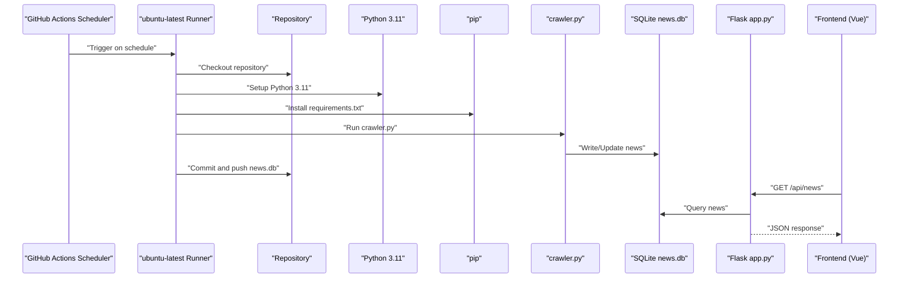
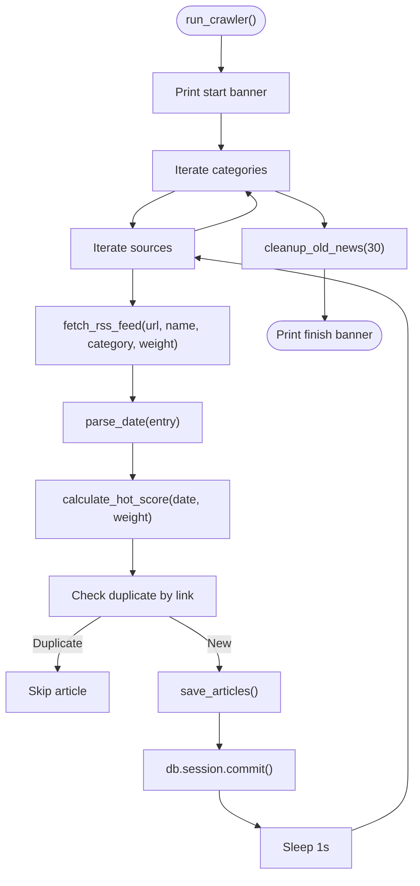
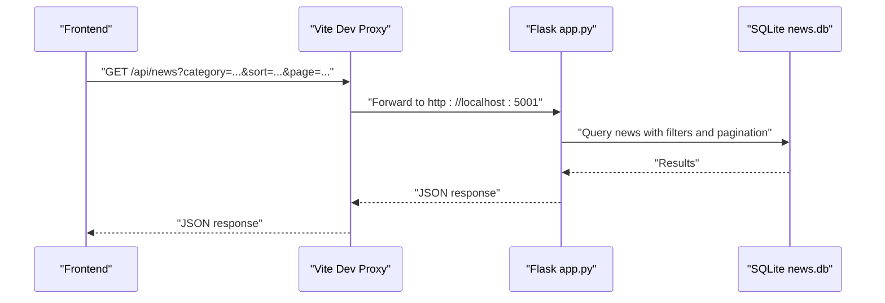
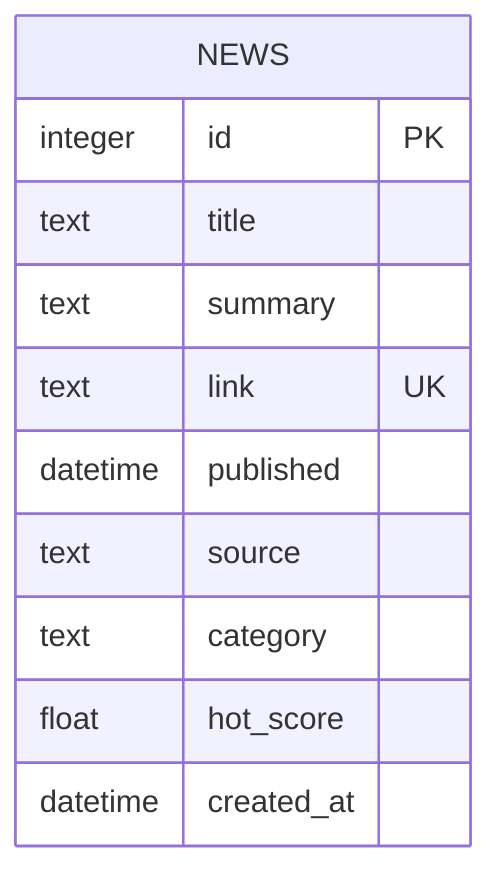
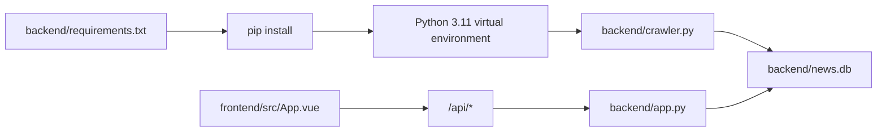

# Scheduling and Automation

<cite>
**Referenced Files in This Document**
- [.github/workflows/crawler.yml](file://.github/workflows/crawler.yml)
- [backend/crawler.py](file://backend/crawler.py)
- [backend/app.py](file://backend/app.py)
- [backend/models.py](file://backend/models.py)
- [backend/requirements.txt](file://backend/requirements.txt)
- [README.md](file://README.md)
- [frontend/vite.config.js](file://frontend/vite.config.js)
- [.gitignore](file://.gitignore)
</cite>

## Table of Contents
1. [Introduction](#introduction)
2. [Project Structure](#project-structure)
3. [Core Components](#core-components)
4. [Architecture Overview](#architecture-overview)
5. [Detailed Component Analysis](#detailed-component-analysis)
6. [Dependency Analysis](#dependency-analysis)
7. [Performance Considerations](#performance-considerations)
8. [Troubleshooting Guide](#troubleshooting-guide)
9. [Conclusion](#conclusion)
10. [Appendices](#appendices)

## Introduction
This document explains the crawler scheduling and automation system that powers the news aggregator. It covers how the GitHub Actions workflow triggers the crawler daily, how the crawler script integrates with the Flask backend, and how the system manages dependencies, execution environment, and persistence. It also provides guidance for manual execution during local development, troubleshooting for scheduling and execution issues, and best practices for production deployment and monitoring.

## Project Structure
The project is organized into a backend (Flask API and crawler), a frontend (Vue 3 SPA), and a GitHub Actions workflow that automates the crawler. The crawler writes updates to a SQLite database stored in the repository, which is served by the Flask API.

**Diagram sources**
- [.github/workflows/crawler.yml:1-46](file://.github/workflows/crawler.yml#L1-L46)
- [backend/crawler.py:1-217](file://backend/crawler.py#L1-L217)
- [backend/app.py:1-87](file://backend/app.py#L1-L87)
- [backend/models.py:1-39](file://backend/models.py#L1-L39)
- [backend/requirements.txt:1-8](file://backend/requirements.txt#L1-L8)
- [frontend/vite.config.js:1-17](file://frontend/vite.config.js#L1-L17)

**Section sources**
- [README.md:5-26](file://README.md#L5-L26)
- [.github/workflows/crawler.yml:1-46](file://.github/workflows/crawler.yml#L1-L46)
- [backend/crawler.py:1-217](file://backend/crawler.py#L1-L217)
- [backend/app.py:1-87](file://backend/app.py#L1-L87)
- [backend/models.py:1-39](file://backend/models.py#L1-L39)
- [backend/requirements.txt:1-8](file://backend/requirements.txt#L1-L8)
- [frontend/vite.config.js:1-17](file://frontend/vite.config.js#L1-L17)

## Core Components
- GitHub Actions workflow: Defines the daily schedule, sets up the Python environment, installs dependencies, runs the crawler, commits and pushes the updated database, and writes a step summary.
- Crawler script: Fetches RSS feeds, parses entries, computes hot scores, deduplicates, persists to the database, and cleans up old entries.
- Flask API: Exposes endpoints to serve news data and health checks; initializes the SQLite database.
- Database model: Defines the schema for news items and provides serialization helpers.
- Frontend: A Vue SPA that proxies API calls to the backend and renders news with pagination and sorting.

Key integration points:
- The workflow executes the crawler inside the backend directory and commits the SQLite database file back to the repository.
- The crawler runs within the Flask application context to reuse the database configuration and models.
- The frontend proxies API calls to the backend service.

**Section sources**
- [.github/workflows/crawler.yml:1-46](file://.github/workflows/crawler.yml#L1-L46)
- [backend/crawler.py:180-217](file://backend/crawler.py#L180-L217)
- [backend/app.py:77-87](file://backend/app.py#L77-L87)
- [backend/models.py:10-39](file://backend/models.py#L10-L39)
- [frontend/vite.config.js:7-15](file://frontend/vite.config.js#L7-L15)

## Architecture Overview
The automation pipeline runs on a schedule and updates the news database, which the API serves to the frontend.

**Diagram sources**
- [.github/workflows/crawler.yml:3-46](file://.github/workflows/crawler.yml#L3-L46)
- [backend/crawler.py:180-217](file://backend/crawler.py#L180-L217)
- [backend/app.py:21-56](file://backend/app.py#L21-L56)
- [backend/requirements.txt:1-8](file://backend/requirements.txt#L1-L8)

## Detailed Component Analysis

### GitHub Actions Workflow (.github/workflows/crawler.yml)
- Schedule: Daily at 00:00 UTC (8:00 AM Beijing Time).
- Manual trigger: workflow_dispatch allows manual execution from the Actions tab.
- Execution environment: ubuntu-latest runner.
- Steps:
  - Checkout repository.
  - Setup Python 3.11 with pip caching.
  - Install backend dependencies.
  - Run crawler script.
  - Commit and push the updated SQLite database file.
  - Write a step summary with timestamp.

Operational notes:
- The workflow runs inside the backend directory to match the crawler’s expectations.
- The database file is committed and pushed back to the repository, enabling the API to serve the latest data.

**Section sources**
- [.github/workflows/crawler.yml:3-46](file://.github/workflows/crawler.yml#L3-L46)

### Crawler Script (backend/crawler.py)
Responsibilities:
- RSS sources configuration with categories and weights.
- HTTP requests with a realistic user-agent header.
- Date parsing with fallbacks and timezone-awareness.
- Hot score calculation using time decay and source weight.
- Article truncation and duplicate detection.
- Persistence to SQLite via SQLAlchemy ORM.
- Cleanup of old articles (default 30 days).
- Logging via print statements to stdout/stderr.

Execution flow:
- Initializes logging and prints start/end markers.
- Iterates over categories and sources, fetching and processing entries.
- Saves new articles and skips duplicates.
- Cleans up old entries.
- Prints totals for diagnostics.

**Diagram sources**
- [backend/crawler.py:180-217](file://backend/crawler.py#L180-L217)
- [backend/crawler.py:88-137](file://backend/crawler.py#L88-L137)
- [backend/crawler.py:139-168](file://backend/crawler.py#L139-L168)
- [backend/crawler.py:170-178](file://backend/crawler.py#L170-L178)

**Section sources**
- [backend/crawler.py:13-37](file://backend/crawler.py#L13-L37)
- [backend/crawler.py:45-74](file://backend/crawler.py#L45-L74)
- [backend/crawler.py:88-137](file://backend/crawler.py#L88-L137)
- [backend/crawler.py:139-168](file://backend/crawler.py#L139-L168)
- [backend/crawler.py:170-178](file://backend/crawler.py#L170-L178)
- [backend/crawler.py:180-217](file://backend/crawler.py#L180-L217)

### Flask API (backend/app.py)
- Database URI configured to a SQLite file under the backend directory.
- Routes:
  - GET /api/news: paginated news with category and sort options.
  - GET /api/news/:id: single news item.
  - GET /api/categories: available categories.
  - GET /api/health: health check.
- Initialization: creates tables if missing.

**Diagram sources**
- [frontend/vite.config.js:7-15](file://frontend/vite.config.js#L7-L15)
- [backend/app.py:21-56](file://backend/app.py#L21-L56)
- [backend/app.py:77-87](file://backend/app.py#L77-L87)

**Section sources**
- [backend/app.py:12-18](file://backend/app.py#L12-L18)
- [backend/app.py:21-56](file://backend/app.py#L21-L56)
- [backend/app.py:77-87](file://backend/app.py#L77-L87)

### Database Model (backend/models.py)
- News entity with fields for title, summary, link, published date, source, category, hot score, and creation timestamp.
- Serialization helper for JSON responses.

**Diagram sources**
- [backend/models.py:10-39](file://backend/models.py#L10-L39)

**Section sources**
- [backend/models.py:10-39](file://backend/models.py#L10-L39)

### Frontend (Vue SPA)
- Development server proxy configured to forward API calls to the backend.
- Environment variable support for API base URL in production builds.

**Section sources**
- [frontend/vite.config.js:7-15](file://frontend/vite.config.js#L7-L15)
- [frontend/src/App.vue:119-146](file://frontend/src/App.vue#L119-L146)

## Dependency Analysis
- Runtime dependencies are declared in the backend requirements file.
- The workflow installs dependencies inside the backend directory to match the crawler’s working directory.
- The crawler relies on the Flask application context to initialize the database connection and models.

**Diagram sources**
- [backend/requirements.txt:1-8](file://backend/requirements.txt#L1-L8)
- [.github/workflows/crawler.yml:23-26](file://.github/workflows/crawler.yml#L23-L26)
- [backend/crawler.py:9-11](file://backend/crawler.py#L9-L11)
- [backend/app.py:12-18](file://backend/app.py#L12-L18)

**Section sources**
- [backend/requirements.txt:1-8](file://backend/requirements.txt#L1-L8)
- [.github/workflows/crawler.yml:23-26](file://.github/workflows/crawler.yml#L23-L26)
- [backend/crawler.py:9-11](file://backend/crawler.py#L9-L11)
- [backend/app.py:12-18](file://backend/app.py#L12-L18)

## Performance Considerations
- Rate limiting: The crawler sleeps between requests to be respectful to upstream RSS servers.
- Duplicate prevention: Articles are deduplicated by link before insertion.
- Cleanup policy: Old articles are pruned periodically to keep the dataset manageable.
- Sorting and pagination: The API supports sorting by newest or hottest and pagination to reduce payload sizes.

[No sources needed since this section provides general guidance]

## Troubleshooting Guide

### Scheduling Issues
- Cron timing: The workflow runs daily at 00:00 UTC. Confirm the repository timezone and verify the schedule definition.
- Manual trigger: Use the workflow_dispatch action to run the workflow immediately for testing.
- Workflow logs: Inspect the Actions tab for step-by-step logs and summaries.

**Section sources**
- [.github/workflows/crawler.yml:5-7](file://.github/workflows/crawler.yml#L5-L7)
- [.github/workflows/crawler.yml:41-46](file://.github/workflows/crawler.yml#L41-L46)

### Execution Failures
- Network errors: The crawler catches and logs exceptions during HTTP requests and feed parsing. Review logs for failed sources.
- Feed parsing warnings: The crawler logs bozo warnings when feed parsing issues occur.
- Database write errors: Errors during saving or committing are logged; verify database permissions and disk space.

**Section sources**
- [backend/crawler.py:131-136](file://backend/crawler.py#L131-L136)
- [backend/crawler.py:101-102](file://backend/crawler.py#L101-L102)
- [backend/crawler.py:163-167](file://backend/crawler.py#L163-L167)

### Environment and Dependency Problems
- Python version: The workflow uses Python 3.11; ensure local environments match.
- Dependencies: Install backend requirements before running locally.
- Database path: The API expects the SQLite file in the backend directory; verify the path and permissions.

**Section sources**
- [.github/workflows/crawler.yml:17-21](file://.github/workflows/crawler.yml#L17-L21)
- [backend/requirements.txt:1-8](file://backend/requirements.txt#L1-L8)
- [backend/app.py:12-18](file://backend/app.py#L12-L18)

### Manual Execution for Local Development
- Backend:
  - Create and activate a virtual environment.
  - Install dependencies.
  - Start the Flask API server.
  - Run the crawler script to populate the database.
- Frontend:
  - Install dependencies.
  - Start the development server; it proxies API calls to the backend.

**Section sources**
- [README.md:28-47](file://README.md#L28-L47)
- [backend/app.py:84-87](file://backend/app.py#L84-L87)

### Logging Configuration
- The crawler prints informational and error messages to stdout/stderr.
- The workflow writes a step summary with a timestamp after successful execution.

**Section sources**
- [backend/crawler.py:89-136](file://backend/crawler.py#L89-L136)
- [backend/crawler.py:207-211](file://backend/crawler.py#L207-L211)
- [.github/workflows/crawler.yml:41-46](file://.github/workflows/crawler.yml#L41-L46)

## Conclusion
The system automates daily news aggregation through a GitHub Actions workflow that runs the crawler, persists updates to a SQLite database, and exposes the data via a Flask API consumed by a Vue frontend. The design emphasizes simplicity, reliability, and ease of local development and testing. Following the best practices and troubleshooting guidance herein will help maintain a robust, observable pipeline.

[No sources needed since this section summarizes without analyzing specific files]

## Appendices

### Cron Job Configuration and Trigger Conditions
- Schedule: Daily at 00:00 UTC.
- Manual trigger: workflow_dispatch.

**Section sources**
- [.github/workflows/crawler.yml:5-7](file://.github/workflows/crawler.yml#L5-L7)

### Deployment and Execution Environment
- Backend runtime: Python 3.11 with pip caching.
- Dependencies: Installed from backend requirements.
- Database: SQLite file stored in the repository and committed by the workflow.
- API: Flask server listens on port 5001; frontend proxies API calls to localhost:5001.

**Section sources**
- [.github/workflows/crawler.yml:17-21](file://.github/workflows/crawler.yml#L17-L21)
- [backend/requirements.txt:1-8](file://backend/requirements.txt#L1-L8)
- [backend/app.py:12-18](file://backend/app.py#L12-L18)
- [frontend/vite.config.js:7-15](file://frontend/vite.config.js#L7-L15)

### Best Practices for Production Deployment and Monitoring
- Monitor the Actions workflow logs and summaries for successful runs.
- Consider adding alerts or notifications for failed runs.
- Keep dependencies pinned and periodically review versions.
- Back up the database file if needed for disaster recovery.
- Validate RSS sources regularly and handle rate limits gracefully.

[No sources needed since this section provides general guidance]